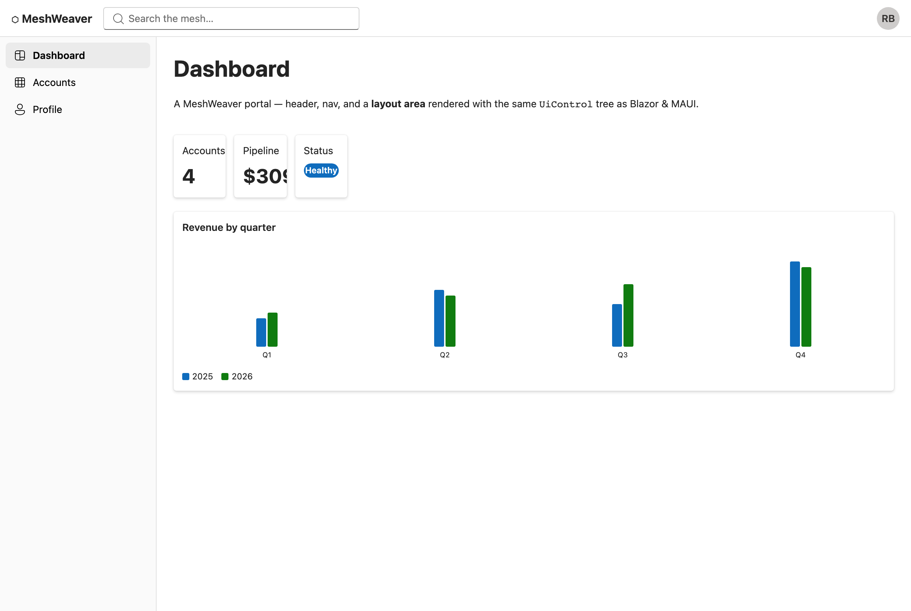

# MeshWeaver Portal (example)

A web portal built from `@meshweaver/react` — an app shell (header + nav) around a switchable mesh
**layout area**. The web analog of the Blazor portal / MAUI app: the chrome is plain Fluent UI, the
content is the renderer walking the same `UiControl` tree Blazor and MAUI render.



The nav switches the rendered root area (Dashboard / Accounts / Profile); each is a layout-area tree in
`src/sample.ts`. Swap `StaticAreaSource` for `GrpcAreaSource` (from `@meshweaver/react`) to drive it from
a live mesh over the gRPC transport.

## Run

```bash
npm install
npm run dev        # → http://localhost:5173
```

In this monorepo, `vite.config.ts` aliases `@meshweaver/react` to `../react/src` (no build/link step). A
standalone app installs the published package instead (`npm install @meshweaver/react`).

## Shape

```tsx
<FluentProvider>            {/* shell theme */}
  <header/> <nav/>          {/* chrome — plain Fluent */}
  <main>
    <RegistryProvider pack={fluentPack}>
      <ScopeProvider source={source} area={selected}>
        <RenderArea areaKey={selected} />   {/* the mesh layout area */}
      </ScopeProvider>
    </RegistryProvider>
  </main>
</FluentProvider>
```

The same shell, swapping `fluentPack` for an RN pack and the DOM chrome for `<View>`, is a native portal —
see `../react-native`.
