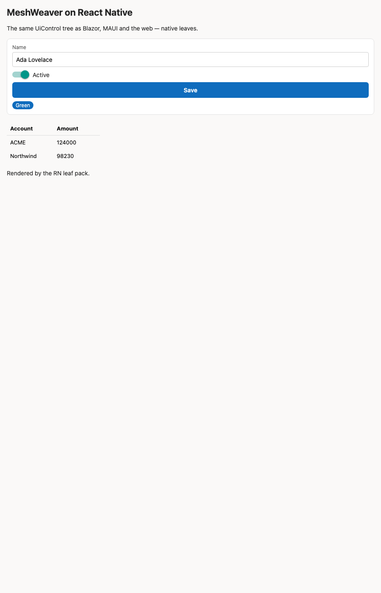

# MeshWeaver on React Native (Expo) — the MAUI peer

A native leaf pack (`src/rnPack.tsx`) over the Fluent-free renderer core (`@meshweaver/react/core`).
Same `UiControl` tree the Blazor portal and MAUI render — `<View>`/`<Text>`/`<TextInput>` leaves instead
of Fluent DOM. This is the direct analog of MAUI's native `MauiViewPack`: the core (dispatch, binding,
skins, area stream) is shared; only the leaf components change.

```tsx
// App.tsx
<RegistryProvider pack={rnPack}>
  <ScopeProvider source={source} area="main">
    <RenderArea areaKey="main" />
  </ScopeProvider>
</RegistryProvider>
```

## Run

```bash
# scaffold deps, link the renderer, run on the iOS simulator
npm install
npm install @meshweaver/react        # or a workspace / file:../react link for the core
npm run ios                          # expo start --ios  (press i)
```

`metro.config.js` wires the monorepo: it watches `../react`, aliases `@meshweaver/react/core` to its source,
pins a single `react` (defeats `../react/node_modules/react` → dual-React hook errors), maps the TS ESM
`.js` import specifiers to their `.tsx`/`.ts` sources, and stubs the live gRPC-web client for the offline
demo. `npm run typecheck` checks the pack against the core via a tsconfig path.

## Run it as web + the Playwright test layer

The RN app runs in a browser via **react-native-web** — the leaf pack's `View`/`Text`/`TextInput`/… map to
DOM. That makes it drivable by Playwright headlessly (no simulator), so the sample renders and is asserted
end-to-end:

```bash
npm run web            # expo start --web — open the app in a browser
npm run web:export     # static build → dist/
npm run e2e            # Playwright: export + serve dist/ + drive headless Chromium
```

`playwright.config.ts`'s `webServer` runs the export + a zero-dep static server (`e2e/serve.mjs`); the
tests (`e2e/app.spec.ts`) assert the rendered sample — header/intro text, the `TextField` bound to
`/data/name` ("Ada Lovelace"), the `CheckBox`→Switch checked, the `DataGrid` rows, Button + Badge, and no
`Unsupported` fallback. This is the browser-level counterpart to the (react-native-mocked) vitest render
tests. An on-device render still needs `npm run ios`.



## Tests

`npm test` (vitest) renders the sample area through the leaf pack + the shared renderer core **headlessly**
— react-native is swapped for a lightweight host-component mock (`test/react-native.mock.tsx`), so
`react-test-renderer` produces a tree we assert on with no native runtime. It proves the pack maps a
`UiControl` tree to the right native components **and resolves `/data` bindings** — e.g. the `TextField`
becomes a `<TextInput>` carrying `"Ada Lovelace"`, the `CheckBox` a `<Switch value={true}>`, the `DataGrid`
its bound rows — the runtime proof that `npm run typecheck` alone can't give. (An on-device render still
needs `npm run ios`; this is the deterministic, CI-runnable level.)

## Leaf pack coverage

Stacks/grids/cards/nav/toolbar (skins → `View`), `Label`/`Markdown`/`Html`/`Badge` (`Text`), `Button`
(`Pressable`), `TextField`/`TextArea` (`TextInput`), `CheckBox`/`Switch` (`Switch`), `DataGrid`/`Catalog`
(scrollable rows), `Progress`/`Spinner` (`ActivityIndicator`). Unknown `$type`s render a labeled fallback.
Grow it exactly like the Fluent pack — same `LeafPack` shape.

## Live transport

React Native **cannot use `@grpc/grpc-js`** (Node `http2`), and **gRPC-web cannot do bidirectional
streaming** — so the mesh transport exposes a **gRPC-web split**: a server-streaming `Connect` (mesh→client)
plus a unary `Deliver` (client→mesh). **The server side is shipped** — `MeshGrpcService.Connect`/`Deliver` +
`Grpc.AspNetCore.Web` (call `app.UseMeshWeaverGrpcWeb()`); `Connect`'s ack returns a `connection_id` the
client passes to each `Deliver`.

**The client side is shipped too** — [`@meshweaver/client-web`](../grpc-web) implements `GrpcAreaSource`'s
`MeshConnectionLike` over Connect-ES (`@connectrpc/connect-web`): `Connect` feeds the receive stream (demux
by `streamId`), `Deliver` sends each delivery. Wire it in with [`src/live.ts`](src/live.ts) — fill in the
`LIVE` config in `App.tsx` and the app renders a real portal layout area instead of the bundled sample:

```ts
// App.tsx
const LIVE: LiveOptions = { url: "https://atioz.meshweaver.cloud", token: "mw_…", address: "@app/Home", area: "main" };
```

`createLiveSource` connects over gRPC-web and feeds a `GrpcAreaSource`; left `null`, `StaticAreaSource` drives
the app offline from a literal area tree. The same client unblocks live data in a **browser** web app too
(`@meshweaver/client` is Node-only). One runtime caveat on RN: gRPC-web server-streaming needs a streaming
`fetch` — install a streaming-fetch polyfill before `connect()` (see the client's README).

The live layout-area protocol is **verified end-to-end** (RFC 6902 patches, JSON-quoted `EntityStore` keys,
the `Control`-suffix `$type` convention): see **[../react/docs/live-protocol.md](../react/docs/live-protocol.md)**.

## The app shell (a real client)

`App.tsx` is more than a render harness — it's an Outlook-for-macOS-style shell: a global search + breadcrumb,
a **left menu streamed from the mesh's menu providers** (`$Menu:Node` / `$Menu:Mesh` / `$Menu:AI`, never
hardcoded), an "On this page" TOC, **navigation** (menu / links / search / breadcrumb, each re-subscribing the
live source), **client screens** (Voice/speech, Connect-to-remote-mesh, Profile), and **dark mode**. It's the
JS peer of the MAUI `PortalShellPage`, and it's served **same-origin (zero CORS)** by `Memex.LocalMesh`.
Full write-up: **[docs/shell.md](docs/shell.md)**.
