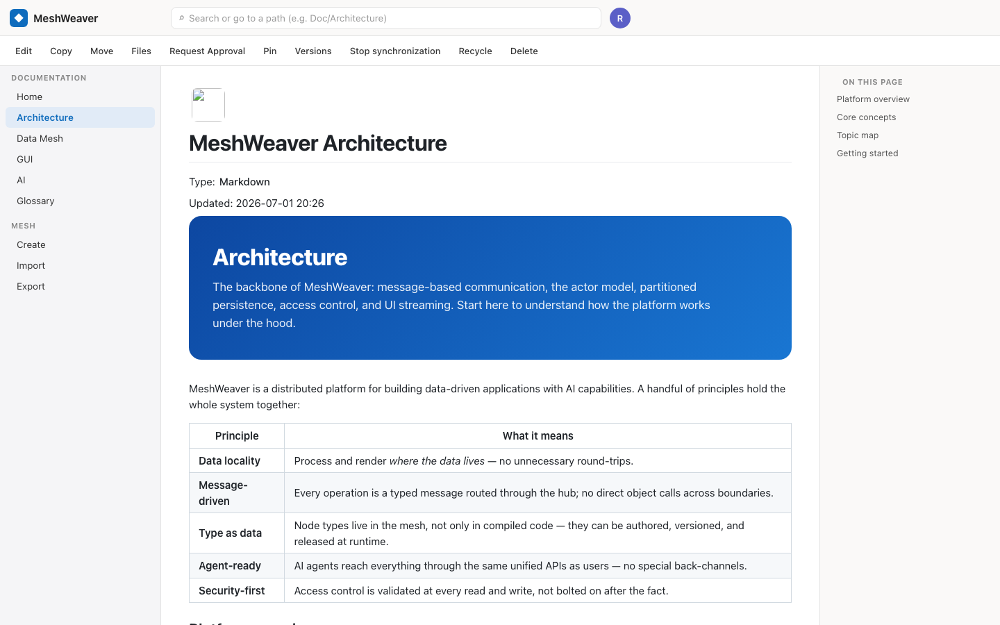
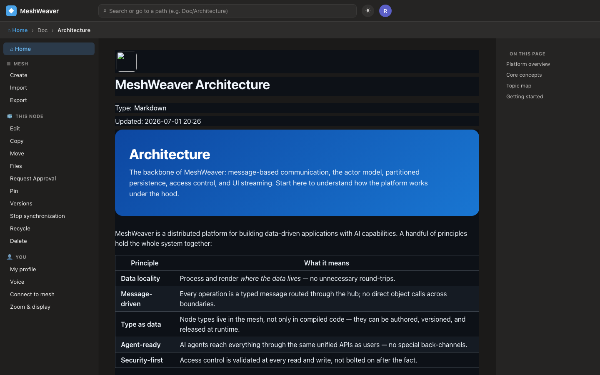

# The app shell — a MeshWeaver client on React Native (web)

`App.tsx` is a real client, not just a renderer harness: an Outlook-for-macOS-style shell around the live
layout area, built entirely from react-native-web primitives so it runs in the browser (and, leaf-for-leaf,
on native). It is the JS-world peer of the MAUI `PortalShellPage`.




```
┌──────────────────────────────────────────────────────────┐
│ top bar:   ◆ MeshWeaver   [ search … ]        ☾   ◍       │
├──────────────────────────────────────────────────────────┤
│ breadcrumb:  ⌂ Home  ›  Doc  ›  Architecture              │
├───────────┬─────────────────────────────────┬────────────┤
│ left      │  main content                   │ right      │
│ menus     │  (.markdown-body doc            │ sidebar    │
│ (from     │   OR a client screen)           │ (on this   │
│ providers)│                                 │  page)     │
└───────────┴─────────────────────────────────┴────────────┘
```

## Menus come from providers — never hardcoded

The left menu is streamed from the mesh's **menu providers**, exactly as the Blazor portal and MAUI shell
render them. A layout-area subscription delivers `$Menu:{context}` areas alongside the content
(`NodeMenuItemsExtensions` on the server builds them: `DefaultNodeMenuProvider`, `DefaultMeshMenuProvider`).
The shell reads them straight out of the same `{areas,data}` tree:

| Left section | Source | Items |
|---|---|---|
| **This node** | `$Menu:Node` | Edit · Copy · Move · Files · Pin · Versions · Recycle · Delete … |
| **Mesh** | `$Menu:Mesh` | Create · Import · Export |
| **AI** | `$Menu:AI` (when present) | Threads · Models · … |
| **You** | in-app client providers | My profile · Voice · Connect to mesh · Zoom & display |

Each `NodeMenuItemDefinition` carries `{ label, area, href, icon, order }`. A mesh item navigates to its
`area` on the current node; a `client:*`-style item opens an in-app screen (see below). This is the same
split MAUI's `PortalShellPage` renders (`hub.GetMenu(path, area, context)` + `IClientMenuProvider[]`).

`src/Shell.tsx` → `LeftMenu` / `menuItems(tree, "$Menu:…")`.

## Navigation

Four ways, all routing through one `NavTarget = { address, area }` that re-subscribes the live source:

1. **Left menu / breadcrumb** — click a section item or a breadcrumb crumb.
2. **In-content links** — clicks inside the injected doc HTML are intercepted (`ContentPane.onClickCapture`),
   the `href` is parsed to a mesh path (`parseHref` in `src/nav.tsx`, absolute + relative + `../`), and the
   source re-subscribes — the DOM twin of MAUI's `IMauiNavigator.NavigateTo`.
3. **Search box** — type a path (`Doc/GUI`) + Enter.
4. **Home** — the ⌂ button; startup lands here. On an anonymous local mesh there is no personal user page,
   so Home is the documentation landing; connected to a portal with a signed-in identity this is where the
   user's own node/area goes (MAUI lands on `device-user`/`Activity`).

## Client screens (`src/screens.tsx`)

The **You** menu opens in-app screens that render in the content pane instead of a mesh area:

- **Voice** — dictation via the browser Speech Recognition API, with a de-CH / de-DE / en-US / fr-CH
  language choice. This is the web twin of the MAUI `Voice/` stack (on-device Whisper, incl. a Swiss-German
  fine-tune); the transcript is meant to feed the composer / a thread submission.
- **Connect to mesh** — the instance manager: **Local** is the mesh that served this app (same origin,
  anonymous); add a remote portal by **URL + API token** and switch to it. Persisted in `localStorage`
  (`src/connection.ts` — the browser twin of MAUI's `InstanceStore`). Selecting an instance reconnects the
  live source to it and returns Home.
- **My profile** / **Zoom & display** — identity + display prefs.

## Dark mode

`src/theme.tsx` holds a light/dark **Palette** and a `ThemeProvider` (persisted in `localStorage`, defaults
from `prefers-color-scheme`). The ☾/☀ button in the top bar toggles it. The chrome consumes the palette via
`useStyles(makeStyles)` (react-native-web can't read CSS variables from `StyleSheet`, so the palette is a
plain object); the **content** switches by writing `<html data-theme>` — the vendored GitHub markdown CSS
ships a light default plus a dark sheet scoped under `[data-theme="dark"] .markdown-body`, so the doc body
themes for free, identical to the Blazor portal.

## Content styling

The content pane injects real HTML (`Html` control's `data`, and `CollaborativeMarkdown`'s `value` run
through `marked`) inside a `.markdown-body` container, styled by Blazor's exact `github-markdown-light.css`
/ `-dark.css` (vendored verbatim into `src/githubMarkdownCss.ts` / `…DarkCss.ts`). That's why the doc looks
pixel-identical to the portal. Two react-native-web layout quirks are handled in `Shell.tsx`: a `ScrollView`
ignores `width` and flex-grows (so the fixed side panes wrap it in a non-growing `View`), and a `ScrollView`
won't flex-grow horizontally in a row (so the content column is a growing `View` with the `ScrollView`
inside).

## Packaging — served same-origin, zero CORS

`Memex.LocalMesh` (a headless monolith mesh + SQLite + gRPC) serves this web build from the **same origin**
as its gRPC endpoint, so the browser makes no cross-origin request and there is **no CORS**:

```bash
# 1. build the web app
cd clients/react-native && npx expo export --platform web --output-dir dist
# 2. bake it into the mesh host's wwwroot (gitignored build artifact)
cp -R dist/. ../../memex/Memex.LocalMesh/wwwroot/
# 3. run the mesh (serves app + gRPC on :5250)
cd ../.. && dotnet run --project memex/Memex.LocalMesh -c Debug
# → open http://localhost:5250
```

`App.tsx` connects live to `window.location.origin` (empty token ⇒ anonymous, enough for the public `Doc`
partition). See `../../memex/Memex.LocalMesh/Program.cs` for the static-file + SPA-fallback wiring.

## Files

| Concern | File |
|---|---|
| Shell chrome + menus + navigation | `src/Shell.tsx` |
| Client screens (Voice / Connect / Profile / Settings) | `src/screens.tsx` |
| Mesh instances (local + remote) | `src/connection.ts` |
| Navigation targets + href parsing | `src/nav.tsx` |
| Theme palette + provider | `src/theme.tsx` |
| Injected content CSS (light + dark) | `src/webStyles.ts`, `src/githubMarkdown*Css.ts` |
| Leaf pack (View/Text/…) | `src/rnPack.tsx` |
| Live source | `src/live.ts` |
| The live protocol itself | [`../../react/docs/live-protocol.md`](../../react/docs/live-protocol.md) |
