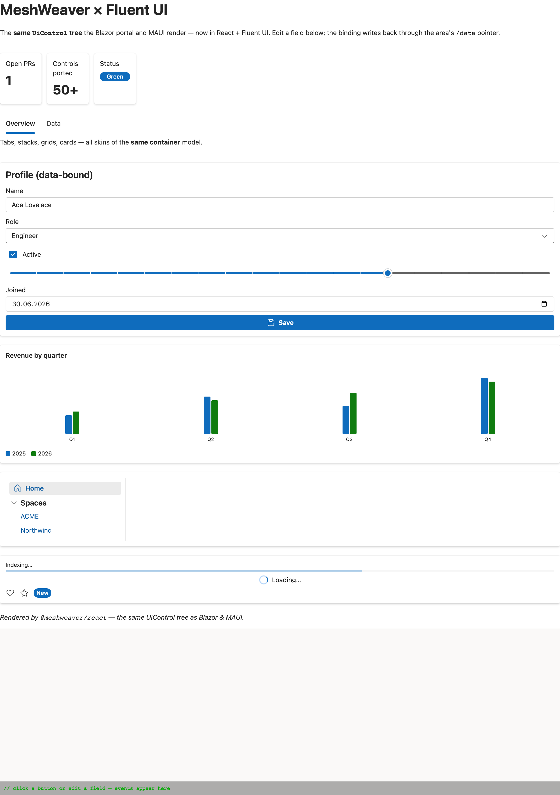

# @meshweaver/react

A React + **Fluent UI** renderer for MeshWeaver layout areas — the web / Electron / React-Native-capable
counterpart of the MAUI `MauiViewPack`. It walks the **same `UiControl` JSON tree** the Blazor portal and
MAUI render, mapping each control to a Fluent UI React v9 component (the Blazor portal renders with Fluent
UI Blazor, so the mapping is near 1:1).



*The demo area above — page title, metric cards, tabs, a data-bound editable form, a chart, a nav menu,
and feedback controls — is a single `{areas,data}` UiControl tree, the same one the Blazor portal and MAUI
render.*

## Install

```bash
npm install @meshweaver/react      # or: bun add @meshweaver/react · pnpm add · yarn add
```

A standard ESM package — npm, pnpm, yarn, **and Bun** install it identically (Bun consumes npm packages;
there is no separate "bun package"). `@meshweaver/react` is the web entry (Fluent pack pre-wired);
`@meshweaver/react/core` is the Fluent-free core for React Native / custom leaf packs.

## Why this shape

```
        layout-area stream  ({areas, data} UiControl tree + RFC-7396 patches)
                    │
          ┌─────────┴─────────┐
          │  renderer core    │   dispatch on $type, pop skins, resolve bindings, post events
          │ (transport-free)  │   ← written ONCE
          └─────────┬─────────┘
       DOM leaf pack        RN leaf pack
   web / Electron        iOS / Android
```

The renderer depends only on an **`AreaSource`** (the `{areas,data}` tree + an event sink), so it's
transport-agnostic. Feed it the in-memory demo source, or a gRPC-backed live source built on
`@meshweaver/client`. The control→component mapping is one Fluent leaf pack; React Native swaps the leaf
pack, the dispatch/binding/skin core is unchanged — exactly how MAUI has a native pack and Blazor a web pack.

## Run the demo (see it)

```bash
npm install
npm run dev        # Vite dev server → a rich sample area rendered with Fluent UI
```

The demo renders ~50 controls (stacks, grids, cards, tabs, a data grid, a chart, data-bound form inputs,
nav, feedback) from a single `{areas,data}` tree. Edit a field — the binding writes back through its
`/data` pointer (optimistically applied, exactly as a live stream would echo the merge-patch). Click events
print at the bottom.

`npm test` runs the renderer-core suite (vitest): JSON pointer, RFC-7396 merge-patch, binding resolution,
and a jsdom render harness covering dispatch / skin popping / bindings / optimistic updates (11 tests).

## Coverage

`controlRegistry` maps the full vocabulary: layout (`Stack`/`LayoutGrid`/`Tabs`/`Toolbar`/`Splitter` via
skins), display (`Label`/`Markdown`/`Html`/`Badge`/`Icon`/`CodeSample`/`Exception`), data
(`DataGrid` + `PropertyColumn`/`TemplateColumn`, `Catalog`, `Chart`), inputs
(`TextField`/`TextArea`/`NumberField`/`CheckBox`/`Switch`/`Slider`/`Date`/`DateTime`/`Select`/`Combobox`/`Listbox`/`RadioGroup`/`Button`/`MenuItem`/`SearchBox`),
navigation (`NavMenu`/`NavGroup`/`NavLink`), feedback (`Progress`/`Spinner`), editors
(`CodeEditor`/`MarkdownEditor`/`DiffEditor` — textarea-based; swap in Monaco for full parity), and the
mesh controls. Unknown `$type`s render a clearly-labeled fallback; extend or override by spreading into
`controlRegistry`.

## Wiring to a live mesh

`GrpcAreaSource` does this — subscribe to a layout area over the gRPC-web transport, fold the change stream
into `{areas,data}`, and route `emit` back (clicks + edits):

```ts
import { connect } from "@meshweaver/client-web";        // browser / RN gRPC-web split
import { GrpcAreaSource } from "@meshweaver/react/core";

const conn = await connect(url, { token });              // "" token ⇒ anonymous (public Doc partition)
const source = new GrpcAreaSource(conn, "Doc/Architecture", { area: "Overview" });
await source.start();                                    // begins folding the area stream into {areas,data}
// <ScopeProvider source={source} area="Overview"> … <RenderArea areaKey="Overview" />
```

**The layout-area protocol is verified end-to-end** (against `Memex.LocalMesh`) — `SubscribeRequest` with a
`$type`-tagged `LayoutAreaReference`, `DataChangedEvent` frames whose `ChangeType` selects Full (replace) vs
**RFC 6902 JSON-Patch** (apply), an `EntityStore` with **JSON-quoted collection keys** the source normalizes,
and control `$type`s that carry a `Control` suffix the dispatcher strips. The full write-up — including the
one server-side edge (the monolith proxy hub must forward synchronously) — is in
**[docs/live-protocol.md](docs/live-protocol.md)**. The same renderer then drives web, Electron, and React
Native unchanged.

## Targets

- **Web / Vite** — the demo as-is (`npm run dev`).
- **Next.js** — the *easiest* target: same package + same Fluent pack, just `"use client"` + Fluent's SSR
  wiring (~10 lines). No new leaf pack. Guide: [docs/nextjs.md](docs/nextjs.md).
- **Electron (desktop)** — `electron/main.cjs` opens the same renderer in a native window:
  `npm i -D electron && npm run dev` (in one terminal) then `npm run electron`. Point it at any served
  renderer with `MESH_URL`. The web/Electron targets share the renderer core **and** the Fluent DOM leaf
  pack unchanged — only the host differs.
- **React Native / Expo (iOS, the MAUI peer)** — import the Fluent-free `@meshweaver/react/core` and supply
  an RN `<View>`/`<Text>` leaf pack instead of the Fluent DOM pack. Same `UiControl` tree, a native leaf
  pack — the direct analog of MAUI's `MauiViewPack`. **Recipe + starter pack: [docs/react-native.md](docs/react-native.md).**
