## Introduction

Agentic AI represents a paradigm shift in artificial intelligence, moving beyond passive response systems to proactive, goal-oriented agents capable of autonomous decision-making and action.

## What is Agentic AI?

Agentic AI refers to AI systems that can:

- **Set and pursue goals autonomously** - Rather than simply responding to prompts, these systems can formulate objectives and work towards them
- **Make decisions independently** - They can evaluate options and choose actions without constant human intervention
- **Adapt to changing environments** - Agentic systems can modify their strategies based on feedback and new information
- **Take meaningful actions** - They can interact with their environment through tool use, API calls, and other interfaces

## Common Misbeliefs

- **"Agents don't require human input"**
  - Agents work best with humans in the loop
  - Require guidance, oversight, and intervention
  - Humans provide direction and validate outputs

- **"We can prove that agents' work is correct"**
  - Agents cannot actually think or reason like humans
  - Generate outputs based on patterns, not understanding
  - Humans must judge correctness and quality

- **"Agents will replace human workers"**
  - Agents are augmentation tools, not replacements
  - Lack contextual understanding and emotional intelligence
  - Excel at repetitive tasks, humans handle creative problem-solving

- **"More autonomous means better"**
  - Optimal autonomy depends on task and stakes
  - High-stakes decisions need human oversight
  - Goal is balance, not maximum autonomy

- **"Agents learn and improve on their own"**
  - Require intentional design and training data
  - Need human curation to improve meaningfully
  - Don't develop genuine understanding without guidance

## Who is the Human, Who is the Agent?

  

Finding the right work distribution between humans and agents is critical. When misaligned, we risk reversing roles—with humans doing the repetitive work while agents handle creative tasks.

**Ideal Division of Labor:**
- Humans should do the intelligent work
- Agents handle the repetitive tasks
- Humans provide judgment and strategic direction
- Agents execute, format, and process

**Common Anti-Pattern:**

*Problem: Human does mechanical work, Agent does creative work*

**Better Pattern:**

```mermaid
%%{init: {'theme':'neutral', 'themeVariables': {'fontSize':'14px'}}}%%
graph LR
    A["👤 Human provides strategy"] --> B["🤖 Agent drafts + formats + publishes"]
    B --> C["👤 Human reviews quality"]
    C -->|"iterate"| A

    style A fill:#fbbf24,stroke:#f59e0b,stroke-width:3px
    style C fill:#fbbf24,stroke:#f59e0b,stroke-width:3px
    style B fill:#60a5fa,stroke:#3b82f6,stroke-width:3px
```

*Solution: Agent handles all repetitive tasks, Human focuses on strategy and quality judgment*

## Applications

Agentic AI is already transforming various domains:

- **Software Development** - AI agents that can write, test, and debug code autonomously
- **Customer Service** - Intelligent agents that handle complex customer inquiries end-to-end
- **Research and Analysis** - Systems that can gather information, synthesize insights, and generate reports
- **Process Automation** - Agents that can orchestrate complex workflows across multiple systems

## Challenges and Considerations

While agentic AI offers tremendous potential, it also presents important challenges:

- **Safety and Control** - Ensuring agents operate within acceptable boundaries
- **Reliability** - Building systems that make consistent, trustworthy decisions
- **Transparency** - Understanding and explaining agent reasoning and actions
- **Ethics** - Addressing questions of responsibility and accountability

## The Future

As agentic AI continues to evolve, we can expect to see increasingly sophisticated systems that can handle more complex tasks, collaborate more effectively with humans, and operate across broader domains. The key will be developing these capabilities responsibly while maintaining human oversight and control.

## Conclusion

Agentic AI represents a significant step forward in artificial intelligence, enabling systems that can act more independently and intelligently to solve real-world problems. As we continue to develop and deploy these technologies, the focus must remain on creating safe, reliable, and beneficial AI agents that augment human capabilities rather than replace them.
