## Introduction

Agentic AI represents a paradigm shift in artificial intelligence, moving beyond passive response systems to proactive, goal-oriented agents capable of autonomous decision-making and action.

## What is Agentic AI?

Agentic AI refers to AI systems that can:

- **Set and pursue goals autonomously** - Rather than simply responding to prompts, these systems can formulate objectives and work towards them
- **Make decisions independently** - They can evaluate options and choose actions without constant human intervention
- **Adapt to changing environments** - Agentic systems can modify their strategies based on feedback and new information
- **Take meaningful actions** - They can interact with their environment through tool use, API calls, and other interfaces

## Common Misbeliefs

- **"Agents don't require human input"**
  - Agents work best with humans in the loop
  - Require guidance, oversight, and intervention
  - Humans provide direction and validate outputs

- **"We can prove that agents' work is correct"**
  - Agents cannot actually think or reason like humans
  - Generate outputs based on patterns, not understanding
  - Humans must judge correctness and quality

- **"Agents will replace human workers"**
  - Agents are augmentation tools, not replacements
  - Lack contextual understanding and emotional intelligence
  - Excel at repetitive tasks, humans handle creative problem-solving

- **"More autonomous means better"**
  - Optimal autonomy depends on task and stakes
  - High-stakes decisions need human oversight
  - Goal is balance, not maximum autonomy

- **"Agents learn and improve on their own"**
  - Require intentional design and training data
  - Need human curation to improve meaningfully
  - Don't develop genuine understanding without guidance

## Who is the Human, Who is the Agent?

  

Finding the right work distribution between humans and agents is critical. When misaligned, we risk reversing roles—with humans doing the repetitive work while agents handle creative tasks.

**Ideal Division of Labor:**
- Humans should do the intelligent work
- Agents handle the repetitive tasks
- Humans provide judgment and strategic direction
- Agents execute, format, and process

**Common Anti-Pattern:**

*Problem: Human does mechanical work, Agent does creative work*

**Better Pattern:**

```mermaid
%%{init: {'theme':'neutral', 'themeVariables': {'fontSize':'15px'}}}%%
graph LR
    A["👤Human<br/>provides strategy"] --> B["🤖Agent<br/>drafts & formats"]
    B --> C["👤Human<br/>reviews quality"]
    C -->|"iterate"| A

    style A fill:#fbbf24,stroke:#f59e0b,stroke-width:3px
    style C fill:#fbbf24,stroke:#f59e0b,stroke-width:3px
    style B fill:#60a5fa,stroke:#3b82f6,stroke-width:3px

    linkStyle 0,1,2 stroke-width:2px
```

*Solution: Agent handles all repetitive tasks, Human focuses on strategy and quality judgment*

## Agentic AI in Applications

### Data Ingestion

Understanding file content used to be extremely difficult for automated systems. The fundamental challenge is that humans and agents have opposite strengths:

- **Human-readable formats are machine-hostile** - Documents designed for human comprehension (PDFs, spreadsheets with merged or additional cells, narrative reports) are notoriously difficult for machines to parse
- **Agents struggle with "easy" operations** - While agents excel at understanding context and meaning, they can stumble on simple tasks like reliably adding up numbers or maintaining exact precision
- **Hybrid approach required** - We need to combine new AI capabilities (content discovery, semantic understanding) with traditional methods (structured imports when we know data location)

**The Key to Effective Data Ingestion:**

Success requires many small, focused pieces of text that work together to map data accurately:

- **Data model descriptions** - Clear documentation of your data structures
- **Dimension value descriptions** - For categorical data (Line of Business, Product Category, etc.), provide descriptions for each possible value
- **System prompt instructions** - Explicit guidance on how to map and transform data

**Agent Specialization:**

For complex ingestion tasks, create dedicated agents for each partial aspect rather than one monolithic system. Each specialized agent becomes an expert in its domain.

### Reporting

Traditional reporting faces fundamental limitations that AI can address:

**The Dashboard Paradox:**

- Dashboards represent a well-intentioned but often futile attempt to compress business complexity onto a single screen
- In practice, they rarely deliver the promised "single pane of glass" experience
- Menu organization becomes unwieldy as report counts grow

**The Information Bottleneck:**

- C-suite executives traditionally couldn't retrieve information themselves
- Required intermediary layers to create PowerPoint presentations
- Created delays and potential for miscommunication

**LLM-Enabled Reporting:**

- Chat interfaces allow natural language queries: "Show me Q3 revenue by region"
- Executives can explore data directly without technical barriers
- Important: Agents retrieve and present reports, but **don't execute business logic**
- The agent is an interface layer, not a decision-making system

### New Forms of User Interaction

Current business applications reflect historical constraints, not ideal design:

**Legacy of Limitation:**

- Traditional UIs were designed by humans, for humans, within tight constraints
- Menu hierarchies and information architecture were necessary compromises
- Limited navigation options led to uninspiring but functional designs
- We built what was possible, not what was ideal

**The Chat Revolution:**

- Conversational interfaces provide more natural ways to interact with business systems
- Users can express intent directly rather than navigating complex menu trees
- Information can be dynamically assembled based on context rather than pre-defined views

**The Hybrid Future:**

The future isn't pure chat or pure traditional UI—it's an intelligent blend:

- **Chat for discovery and exploration** - Natural language for open-ended queries
- **Traditional UI for precision and repeatability** - Forms and controls for exact input
- **Context-aware presentation** - Systems that choose the right interface for the task
- **Collaborative design** - Applications that adapt to how users actually work

This evolution represents not just new technology, but a fundamental rethinking of how humans and systems collaborate in business contexts.

## The Future

As agentic AI continues to evolve, we can expect to see increasingly sophisticated systems that can handle more complex tasks, collaborate more effectively with humans, and operate across broader domains. The key will be developing these capabilities responsibly while maintaining human oversight and control.

## Conclusion

Agentic AI represents a significant step forward in artificial intelligence, enabling systems that can act more independently and intelligently to solve real-world problems. As we continue to develop and deploy these technologies, the focus must remain on creating safe, reliable, and beneficial AI agents that augment human capabilities rather than replace them.
