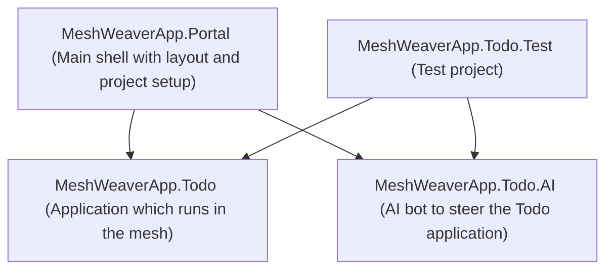
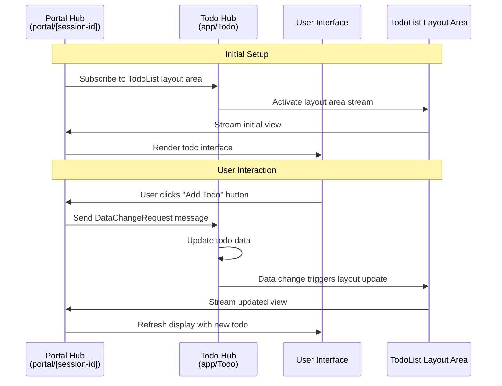
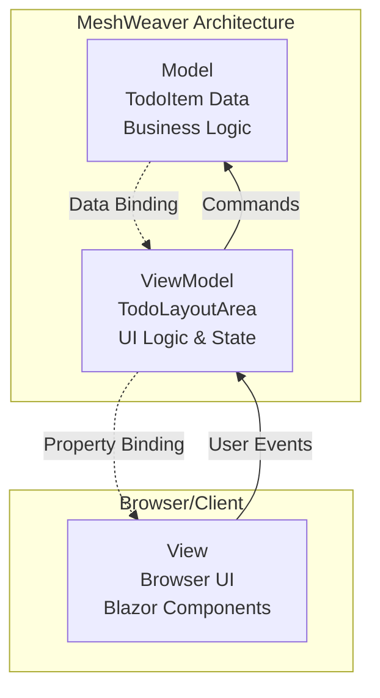

The starting point for creating a new MeshWeaver solution is to install the project templates. This is done by running the following command in the terminal:
```bash
dotnet new install MeshWeaver.ProjectTemplates
```

After the project templates are installed, you can create a new solution by running:
```bash
dotnet new meshweaver-solution -n MeshWeaverApp
```

This command creates a new solution named `MeshWeaverApp` with the following structure:


## Setting up the AI Key

To enable AI functionality in the Todo application, you need to obtain a GitHub API key with Models permission and configure it using .NET user secrets.

### Getting a GitHub API Key with Models Permission

1. Navigate to [GitHub Settings > Developer settings > Personal access tokens > Fine-grained tokens](https://github.com/settings/personal-access-tokens/fine-grained)
2. Click "Generate new token"
3. Fill in the token details:
   - **Token name**: Choose a descriptive name (e.g., "MeshWeaver AI Development")
   - **Expiration**: Select an appropriate expiration date
   - **Resource owner**: Select your account or organization
4. Under **Repository access**, choose the repositories you want to grant access to
5. In the **Account permissions** section, find and enable:
   - **Models**: Read access (this permission allows access to GitHub's AI models)
6. Click "Generate token" and copy the generated token immediately (you won't be able to see it again)

### Configuring User Secrets

Once you have your GitHub API key, you need to add it to your project's user secrets with the key `AzureInference:ApiKey`.

#### Using the .NET CLI (Recommended)

Navigate to your main project directory (e.g., `MeshWeaverApp.Portal`) and run:

```bash
dotnet user-secrets set "AzureInference:ApiKey" "your-github-api-key-here"
```

#### Using Visual Studio Code

1. Open the Command Palette (`Ctrl+Shift+P` or `Cmd+Shift+P`)
2. Type "User Secrets" and select ".NET: Manage User Secrets"
3. If prompted, select the project you want to configure (typically the main Portal project)
4. This will open the `secrets.json` file in VS Code
5. Add your API key in the following format:

```json
{
  "AzureInference:ApiKey": "your-github-api-key-here"
}
```

6. Save the file (`Ctrl+S` or `Cmd+S`)

The user secrets file is stored locally on your machine and is not committed to source control, ensuring your API key remains secure.

## Exploring the Application

Once you have set up your API key and launched the application, you'll find a fully interactive Todo management system with rich functionality. The main Todo interface displays your todo items organized by status (Pending, In Progress, Completed, Cancelled) with intuitive visual indicators using emojis for each status.

### Interactive Todo Management

Each todo item in the list provides comprehensive interaction capabilities through a hierarchical action menu system. When you click on any todo item, you'll see primary and secondary action buttons that adapt based on the current status:

- **Create New Todos**: Click the "➕ Add New Todo" button to open a dialog where you can specify the title, description, category, and due date for new tasks
- **Status Management**: Use context-aware action buttons to progress todos through their lifecycle:
  - **Pending items**: Start work (▶️ Start), mark as complete (✅ Complete), or cancel (❌ Cancel)
  - **In Progress items**: Mark as done (✅ Done), pause work (⏸️ Pause), or cancel (❌ Cancel)
  - **Completed items**: Reopen for additional work (🔄 Reopen)
  - **Cancelled items**: Restore to pending status (🔄 Restore)
- **Edit Functionality**: Every todo item includes an "✏️ Edit" option that opens a dialog allowing you to modify all properties including title, description, category, due date, and status
- **Delete Options**: Remove individual items with the "🗑️ Delete" action, or use bulk operations to delete entire status groups

### Chat Interface

The Todo application includes an intelligent AI chat interface that allows you to create and manage todo items using natural language. This AI agent understands context and can help you quickly add tasks, modify existing ones, and update their properties through conversational commands.

#### Creating Todos with Natural Language

To create a new todo item, simply type your task in natural language. For example:

```
I'll have to bring my car to the shop tomorrow
```

The AI agent will automatically parse this request and create a todo item with:
- **Title**: "Bring car to the shop"
- **Due Date**: Tomorrow's date
- **Status**: Pending
- **Category**: General (or auto-detected based on context)

#### Modifying Todos Through Chat

Once you have todos in your list, you can easily modify them using follow-up commands:

**Adjusting Due Dates:**
```
Change the car appointment to next Friday
Move the car shop visit to next week
```

**Updating Descriptions:**
```
Add a note to the car appointment: "Need to fix the brake noise"
Update the car todo with reminder to bring registration documents
```

**Changing Status:**
```
Mark the car appointment as in progress
Set the car shop visit to completed
```

The AI agent maintains context about your recent todos and can understand references like "the car appointment" or "that task I just created." This makes it easy to quickly manage your todo list without needing to navigate through multiple UI dialogs.

## Architecture of the Business Application

Understanding the architectural principles behind MeshWeaver applications is crucial for building scalable and resilient systems. The Todo application exemplifies these principles through its distributed design and cloud-native approach.

### Core Architectural Principles

MeshWeaver applications are built with three fundamental principles in mind:

1. **Cloud-First Design**: Every component is designed to run efficiently in cloud environments, leveraging horizontal scaling and cloud services
2. **Distributed Systems**: The application architecture embraces distribution as a core concept, with components communicating through well-defined message protocols
3. **Asynchronous Interaction Patterns**: User interactions, especially those involving AI chat agents, are designed to handle long-running operations that may take hours or even days to complete

This distributed nature means that when you interact with the chat interface, your request might trigger a chain of operations across multiple services, with responses arriving asynchronously as the system processes your request.

### Message Hub Architecture

The heart of MeshWeaver's distributed architecture lies in its message hub system. Each hub represents a logical location in the cloud that becomes active when interactions begin.

#### Hub Addressing and Partitioning

- **Main Addresses**: Primary hubs handle core business logic. In our Todo application, we use `app/Todo` as the main address for the Todo hub
- **Sub-Hubs**: Smaller, specialized hubs handle specific tasks like maintaining data streams and layout synchronization
- **Partitioning Strategy**: Hub addresses serve a dual purpose - they define logical boundaries and control data partitioning

For example, while our basic Todo app uses a single partition with address `app/Todo` containing all todo items, production applications might use more granular addresses like:
- `todo/Roland` - Personal todos for user Roland
- `todo/MyProject` - Project-specific todos
- `todo/TeamAlpha` - Team-based todo management

This addressing scheme naturally creates sub-partitions, improving scalability and isolation.

#### Hosted Components

Message hubs don't just store data - they host active components:

- **Data Management**: Persistent storage and real-time data synchronization
- **Layout Areas**: UI component generators that create reactive user interfaces
- **Business Logic**: Domain-specific operations and workflow management

In the Todo application, the main hub hosts the `TodoList` layout area, which generates the summary view and interactive todo management interface.

#### Portal Architecture

The second key address pattern is `portal/[id]`, which creates individual hub instances for each browser connection and user session. This design ensures:

- **Session Isolation**: Each user gets their own portal instance
- **Personalized Experience**: User-specific state and preferences are maintained
- **Scalable Connections**: Portal instances can be distributed across multiple servers

### Interaction Flow

The following diagram illustrates how the distributed components interact when a user performs an action:



#### Step-by-Step Breakdown

1. **Subscription Phase**: The portal hub subscribes to the `TodoList` layout area hosted in the Todo hub, establishing a reactive stream of UI updates
2. **User Action**: When a user clicks a button (like "Add Todo"), the portal captures this interaction
3. **Message Dispatch**: The portal sends a `DataChangeRequest` message to the Todo hub at address `app/Todo`
4. **Data Processing**: The Todo hub processes the request, updating the underlying todo data
5. **Layout Reaction**: Data changes automatically trigger the layout area to regenerate the view
6. **Stream Update**: The updated view is streamed back to all subscribed portals
7. **UI Refresh**: The portal receives the update and refreshes the user interface

This reactive architecture ensures that all connected users see changes in real-time, while maintaining loose coupling between the presentation layer (portal) and business logic (Todo hub). The system gracefully handles network issues, temporary disconnections, and high loads through its distributed, message-driven design.

### Message-based Communication

At the core of MeshWeaver's architecture lies a fundamental principle: **every interaction is a message**. This applies not only to business operations but also to user interface interactions, creating a unified communication model throughout the entire system.

When you click on a todo item, edit a field, or press a button, these actions don't directly manipulate the user interface or data. Instead, they generate specific message events:

- **UI Interactions**: A button click generates a `ClickedEvent` message
- **Data Changes**: Form submissions create `DataChangeRequest` messages  
- **Navigation**: Route changes produce `NavigationEvent` messages
- **Chat Interactions**: User messages become `ChatMessageEvent` instances

This message-centric approach stems from **reactive design principles**, which are fundamental to modern cloud-based architectures. By treating all interactions as discrete, immutable messages, the system gains several critical advantages:

1. **Auditability**: Every action in the system is traceable through its message history
2. **Replay Capability**: System states can be reconstructed by replaying message sequences
3. **Loose Coupling**: Components communicate through well-defined message contracts rather than direct dependencies
4. **Scalability**: Messages can be queued, batched, and processed asynchronously across distributed nodes
5. **Resilience**: Failed operations can be retried, and temporary network issues don't lose user interactions

This pattern is increasingly common in cloud-based architectures where systems must handle high loads, network partitions, and service failures gracefully. Popular cloud platforms and microservice architectures rely heavily on message-driven communication for the same reasons - it provides the foundation for building truly distributed, resilient applications.

#### Efficient Message Design

One of the key strengths of MeshWeaver's message system is that **only a few message types are sufficient** to handle the entire application's communication needs. Rather than creating dozens of type-specific messages, the framework uses generic, powerful message patterns:

- **`DataChangeRequest`**: Handles all data modifications regardless of entity type. Whether you're updating a todo item, user profile, or any other data structure, the same message type processes the change
- **`DataChangedEvent`**: Propagates any data changes from any types across the system. This single event type notifies all subscribers about data updates without requiring type-dependent events
- **`ClickedEvent`**: Handles all UI interaction events uniformly

This approach eliminates the need for type-dependent events and reduces system complexity while maintaining full functionality. The generic nature of these messages also makes the system more maintainable and easier to extend.

In the Todo application, when you observe the real-time updates across multiple browser sessions, you're seeing this message-based architecture in action. Each user interaction generates messages that flow through the system, updating all connected clients consistently and reliably.

### View Models

MeshWeaver follows the **Model-View-ViewModel (MVVM)** pattern, a well-established architectural pattern that provides excellent separation of concerns and testability. For a detailed explanation of MVVM, see the [MVVM Wikipedia article](https://en.wikipedia.org/wiki/Model%E2%80%93view%E2%80%93viewmodel).

The following diagram illustrates how MVVM works in the context of our Todo application:



In MeshWeaver applications, we typically focus on writing **ViewModels** (like our `TodoLayoutArea` class), which contain the presentation logic and state management. This approach provides several key benefits:

1. **View Independence**: ViewModels are not tied to specific UI technologies, allowing the same logic to work with Blazor, WPF, or any other presentation framework
2. **Testability**: Business and presentation logic can be thoroughly tested without requiring actual UI components
3. **Reusability**: ViewModels can be shared across different views or platforms
4. **Maintainability**: Clear separation between data, presentation logic, and UI rendering

The `TodoLayoutArea` class serves as our ViewModel, containing methods like `TodoList()`, `TodosByCategory()`, and `TodoSummary()` that generate UI controls based on the underlying todo data. This design allows us to test the entire presentation logic without needing to render actual HTML or interact with browsers.

## Testing

The Todo application includes a comprehensive test suite that demonstrates different levels of testing in a MeshWeaver application. You can find these tests in the sample test project, which showcases how to test distributed applications effectively.

### Test Structure

We've organized the tests into three main classes, each serving a specific testing purpose:

#### 1. TodoTestBase - Test Infrastructure Setup

The `TodoTestBase` class provides the foundational infrastructure for all Todo-related tests. It configures the complete setup and mimics a mesh environment within the test project, including:

- **Hub Configuration**: Sets up message hubs with the same configuration as the production application
- **Data Context**: Initializes the test environment with sample todo data
- **Application Registration**: Registers the Todo application components and layout areas
- **Client Setup**: Provides test clients that can interact with the mesh as if they were real browser sessions

#### 2. TodoDataChangeComprehensiveTest - Data Operations Testing

The `TodoDataChangeComprehensiveTest` class focuses exclusively on testing data operations without any UI concerns:

- **Data Change Verification**: Tests that `DataChangeRequest` messages properly update todo items
- **Event Propagation**: Verifies that `DataChangedEvent` messages are correctly dispatched
- **Business Logic**: Validates todo status transitions and data integrity
- **Persistence**: Ensures changes are properly stored and retrievable

This level of testing is crucial for validating the core business functionality independent of presentation concerns.

#### 3. TodoLayoutAreaInteractionTest - ViewModel Testing

The `TodoLayoutAreaInteractionTest` class tests the interaction layer through the ViewModel:

- **Layout Rendering**: Verifies that layout areas generate correct UI controls
- **User Interaction Simulation**: Tests button clicks and form submissions through message events
- **UI State Management**: Validates that the ViewModel correctly responds to data changes
- **Integration Testing**: Ensures the complete flow from user action to data update works correctly

### MVVM Testing Advantages

Due to our choice of the MVVM pattern, we can test at the ViewModel level without needing to start actual browser automation tools like Playwright or Puppeteer. This approach provides several advantages:

- **Speed**: Tests run much faster without browser overhead
- **Reliability**: No flaky browser interactions or timing issues
- **Coverage**: Can test complex UI logic and edge cases more easily
- **Debugging**: Easier to debug test failures without browser complexity
- **CI/CD**: Tests run consistently in any environment without browser dependencies

The test suite demonstrates how MeshWeaver's architecture enables comprehensive testing at multiple levels, from pure data operations to complex user interaction scenarios, all while maintaining fast execution and high reliability.

## Integration with AI Agent

One of the most powerful aspects of MeshWeaver's architecture is how naturally it supports AI agent integration. We believe that **agents should always remote control the application** rather than being embedded within it. This approach maintains clean separation of concerns and allows agents to interact with applications just like human users do, but through programmatic interfaces.

### Remote Control Through Messages

Due to the message-based nature of the mesh, we can quite easily hook up an AI agent to the message layer to remote control the entire application. The agent doesn't need special privileges or direct database access - it simply sends the same `DataChangeRequest` and other messages that user interactions generate. This design provides several key advantages:

- **Consistency**: Agents and users follow the same interaction patterns
- **Security**: Agents are subject to the same access controls and validation rules
- **Auditability**: All agent actions are logged through the standard message flow
- **Testability**: Agent behavior can be tested using the same infrastructure as user interactions

### Semantic Kernel Integration

MeshWeaver integrates with [Microsoft Semantic Kernel](https://learn.microsoft.com/en-us/semantic-kernel/), a powerful framework for building AI applications. Semantic Kernel provides the foundation for creating agents that can reason about tasks and execute actions through **kernel functions** - these are .NET methods that the AI can discover and call based on their descriptions and parameters.

The integration works through a call-back mechanism where the chat interface can invoke system functions directly. When a user types a natural language request, the AI agent:

1. Analyzes the request using language models
2. Determines which kernel functions to call
3. Executes the functions with appropriate parameters
4. Returns results to the user through the chat interface

### DataPlugin - Universal Data Access

The `DataPlugin` class serves as a standard plugin for CRUD (Create, Read, Update, Delete) operations on any data type within the mesh. This plugin provides the AI agent with comprehensive access to the entire todo data ecosystem through a simple, consistent interface:

```csharp
[KernelFunction]
public async Task<string> GetData(string type, string? entityId = null)

[KernelFunction] 
public async Task<string> UpdateData(string json, string type)

[KernelFunction]
public async Task<string> GetDataTypes()

[KernelFunction]
public async Task<string> GetSchema(string type)
```

With these four core functions, the AI agent can:

- **Discover available data types** using `GetDataTypes()`
- **Retrieve data collections or specific entities** with `GetData()`
- **Get JSON schemas** for proper data formatting via `GetSchema()`
- **Update existing data** through `UpdateData()`

The beauty of this design is that the `DataPlugin` is completely generic - it works with todo items, user profiles, categories, or any other data type without requiring type-specific code. The agent simply needs to know the type name and can then perform full CRUD operations.

### TodoAgent - Domain-Specific Intelligence

While the `DataPlugin` provides the basic data access capabilities, the `TodoAgent` class adds domain-specific intelligence and context to create a more natural user experience:

#### Contextual Awareness

The `TodoAgent` provides essential context that helps the AI understand the current environment:

```csharp
public string Instructions =>
    $@"Today's date is {DateTime.UtcNow.ToLongDateString()}.
       
       To create a new todo item:
       1. Try to find title description and category and due date as best as you can from the user's input.
       2. Use the DataPlugin to get available categories and try to match a good category.
       3. Use the CreateTodo function to create a new 'TodoItem' with the provided details and matched category.";
```

This contextual information allows the agent to make intelligent decisions about due dates (e.g., "tomorrow" becomes a specific date) and category assignments.

#### Specialized Functions

The `TodoAgent` also provides domain-specific functions that simplify common operations:

```csharp
[KernelFunction]
[Description("Creates a new todo item with the specified title, description, due date, and category.")]
public string CreateTodo(string title, string description, DateTime dueDate, string category)
```

This `CreateTodo` function encapsulates the business logic for creating well-formed todo items, including proper JSON formatting and message dispatch to the Todo hub.

#### Intelligent Category Matching

The agent demonstrates sophisticated behavior by first retrieving available categories through the `DataPlugin`, then matching user input to existing categories. This prevents data inconsistencies and provides a better user experience:

1. User says: "Add a task to buy groceries for tomorrow"
2. Agent calls `DataPlugin.GetData("TodoCategory")` to see available categories
3. Agent matches "buy groceries" to existing "Personal" or "Shopping" category
4. Agent calls `CreateTodo()` with the matched category

This integration showcases how AI agents can provide natural language interfaces to complex business applications while maintaining data integrity and following established business rules. The message-based architecture makes this integration seamless and scalable, allowing multiple agents to work with the same application without conflicts.

