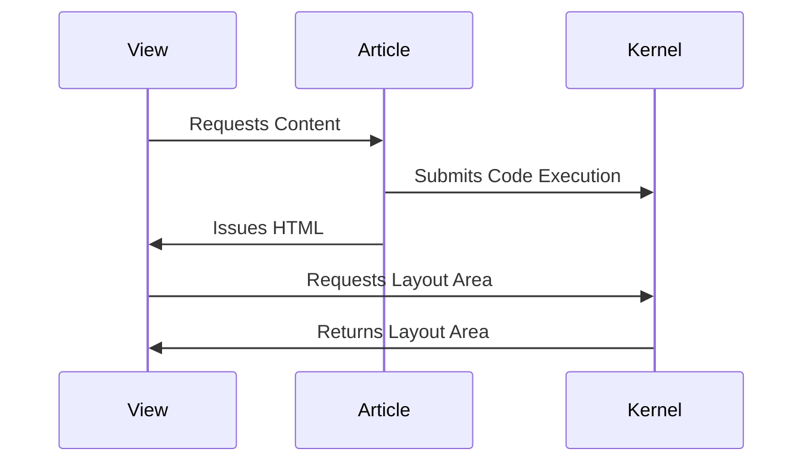

In the previous blog posts, we have shown how to connect to Mesh Weaver 
using polyglot notebooks. This approach works quite well but has still 
a number of draw-backs:

- The user interface is not properly integrated.
- It is possible to integrate interactive views, but they must be rendered in iframes, which makes the difficult to size.
- The notebook API is nice to develop but not necessarily nice to present content.

We had a meeting with the dotnet interactive team, which produces polyglot notebooks, and we discussed opportunities to include
the notebook user interface into our application. However, the polyglot notebooks are
a VS Code plugin and not intended to run standalone. However, during
this call, they showed us another approach: [R Markdown](https://rmarkdown.rstudio.com/). This is a
normal Markdown dialect which allows to specify executable code. This is very close to the [Literate Programming](https://en.wikipedia.org/wiki/Literate_programming) approach 
promoted by [Donald Knuth](https://en.wikipedia.org/wiki/Donald_Knuth).

We decided to build on this and develop our own dialect of interactive markdown. The basic idea is very simple: 
Additional flags can be specified in the heading of the fenced code blocks, analogous to command line arguments.
Should the output be rendered, we specify

```csharp
--render <area>
```
Whereby area is the name of the area which is exposed in this article.
Let's look at a practical example:

```csharp --render HelloWorld --show-header
"Hello World " + DateTime.Now.ToString()
```

In this example, we render the output to an area called HelloWorld. the additional --show-header 
shows the full code block, including the header. We do this only here to explain how to use headers.

Alternatively, you can only use --show-code, which will show the code without the header:


```csharp --render HelloWorld2 --show-code
"Hello World " + DateTime.Now.ToString()
```

Behind the scenes, Mesh Weaver allocates a kernel and executes the statements. The results 
are stored as layout areas in the kernel and displayed by the markdown component:



This diagram was produced using [Mermaid](https://mermaid.js.org/). Refer to their
documentation for a full set of supported syntax. Mermaid diagrams can be embedded in 
interactive markdowns by declaring them as fenced code block:

````

````