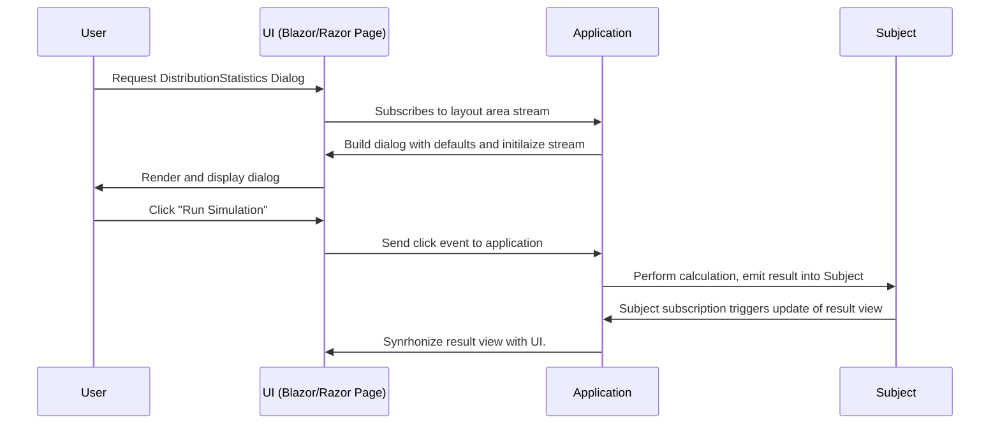

---
Title: "Reactive Dialogs: Handle Complex Logic"
Abstract: >
    In typical business applications, we often encounter dialogs which contain
    complex business logic. We need to react on user interaction, switch parts depending
    on certain settings, compute results and display them. Reactive design is a low-
    complexity way of achieving this. It is robust, simpler to think about and easier to write.
Thumbnail: "images/Reactive Dialogs.jpeg"
Published: "2025-02-20"
Authors:
  - "Roland Bürgi"
Tags:
  - "Documentation"
  - "Conceptual"
  - "Reactive"
  - "Dialogs"
---
Reactive programming was made popular in the early 2010s, on the one hand by the publication
of the [Reactive Manifesto](https://reactivemanifesto.org/) and by the publication of 
various reactive libraries such as
[Reactive Extensions](http://reactivex.io/) and the, probably still most popular UI framework in 2025, 
[React](https://react.dev/) . 

The basic idea is to model applications as a stream of events. These events can be user interactions,
network messages, timer events, etc. The application reacts to these events by executing certain
actions. The actions can be to update the user interface, to compute new values, to send messages
to other systems, etc.

In the context of dialogs, we can model the dialog as a stream of events. The events can be
button clicks, text changes, timer events, etc. The dialog reacts to these events by executing
certain actions. 

In this article, we will learn how to model a dialog providing statistics on distributions.

```csharp --render Dialog
using static MeshWeaver.Layout.Controls;
using MeshWeaver.Mesh;
LayoutArea(new ApplicationAddress("Documentation"), "DistributionStatistics")
```

Let us analyze this dialog. At the core, there is a domain model.
These are surely the input distributions:

```csharp
/// <summary>
/// Distribution base class
/// </summary>
public abstract record Distribution;

/// <summary>
/// Pareto distribution <see ref="https://en.wikipedia.org/wiki/Pareto_distribution"/>
/// </summary>
public record Pareto(double Alpha = 2, double X0 = 1) : Distribution;

/// <summary>
/// LogNormal distribution <see ref="https://en.wikipedia.org/wiki/Log-normal_distribution"/>
/// </summary>
public record LogNormal(double Mu = 1, double Sigma = 1) : Distribution;
```

As you notice, we also document very closely to the data model. In this case, the most useful kind of
documentation is probably to link to the corresponding Wiki Articles, where
the meaning of the parameters can be found. We will show in other articles and videos how
to expose these comments directly on the user interface.

Also the defaults we will show in the dialog can be directly specified into this domain model. This is very useful
as otherwise core business logic, e.g. which classes exist and which properties they have, is
smeared in different places. This leads to a high maintainability overhead.

Typically, we would model the domain in a dedicated data model. We will further elaborate on this in the context
of the pricing tool. For the sake of learning reactive principles, however, we will just
inline all these models to have a compact overview of all components involved.

The next part we model is the top of the dialog, where we can choose the number of simulations as well as the distribution type:

```csharp
/// <summary>
/// Basic input section for the simulation
/// </summary>
public record BasicInput
{
    /// <summary>
    /// Number of samples used in the simulation
    /// </summary>
    public int Samples { get; init; } = 1000;

    /// <summary>
    /// The choice of the distribution type
    /// </summary>
    [Dimension<string>(Options = nameof(DistributionTypes))]
    public string DistributionType { get; init; } = "Pareto";

}
```

Again, we add dialog defaults and comments directly to this class. In constrast to the distributions, this class
does not have the role of domain model: it would typically not be saved on a database and is irrelevant for any 
business use, but rather it serves for the purpose of this dialog. This gives it the character of a [View Model](https://en.wikipedia.org/wiki/Model%E2%80%93view%E2%80%93viewmodel).
We will keep this view model very close to the other business logic required for this dialog.

Normally, we would also model a domain for storing results. However, in this example we simply output a 
markdown table and do not model it.

So how do we set up the layout area?

```csharp
/// <summary>
/// A distribution statistics dialog to simulate distributions and show statistics.
/// </summary>
/// <returns></returns>
public static object DistributionStatistics(LayoutAreaHost host, RenderingContext context)
{
    host.UpdateData(nameof(DistributionTypes), DistributionTypes);

    host.RegisterForDisposal(host.GetDataStream<BasicInput>(nameof(BasicInput))
        .Select(x => x.DistributionType)
        .DistinctUntilChanged()
        .Subscribe(t => host.UpdateData(nameof(Distribution), Distributions[t])));

    var subject = new Subject<(double[] Samples, TimeSpan Time)>();

    return Controls.Stack
        .WithView(host.Edit(new BasicInput(), nameof(BasicInput)), nameof(BasicInput))
        .WithView(host.GetDataStream<Distribution>(nameof(Distribution)).Select(x => x.GetType())
            .DistinctUntilChanged()
            .Select(t => host.Edit(t, nameof(Distribution))))
        .WithView(Controls.Button("Run Simulation")
            .WithClickAction(
                async _ =>
                {
                    var input = await host.Stream.GetDataAsync<BasicInput>(nameof(BasicInput));
                    var distribution = await host.Stream.GetDataAsync<Distribution>(nameof(Distribution));
                    subject.OnNext(Simulate(input, distribution));
                }))
        .WithView(subject.Select(x => x.Statistics()).StartWith(Controls.Markdown("### Click to run simulation")));
}

```

Let's analyze it section by section. The layout area host is as an island where the layout area lives.
It will be synchronized to the view and back. We will need to put everything which the user interface
needs to know into the host. In the first line, we set the distribution types, which are then
displayed in the combobox. 

In the following section, we prepare the distributions for showing in the distribution selection
dialog. This depends on the choice in the selection. So we subscribe to the distribution type setting
and set the corresponding data type which was chosen.

In the next section, we set up a `Subject`. This is a reactive concept which corresponds to a 
[Publish Subscribe Pattern](https://en.wikipedia.org/wiki/Publish%E2%80%93subscribe_pattern).
This subject will store simulation results, and as they can be big, we do not want to synchronize them
with the user interface. The subject will always just stay on the server side, and we will only
synchronize the markdown table we output.

Lastly, we return the entire dialog: First the basic input section, then the distribution section, then the button, then the results.
Please note how elegantly it all falls. There is no imperative specification needed: Imperative thinking is very difficult
for this type of dialog, error prone, and it typically requires much more code to implement. In our reactive design, all we do is:

- We know what we need to do our job
- We get the information we need from the layout area or the subject
- We do our job
- We update the layout area.

Let us analyze this diagrammatically:


