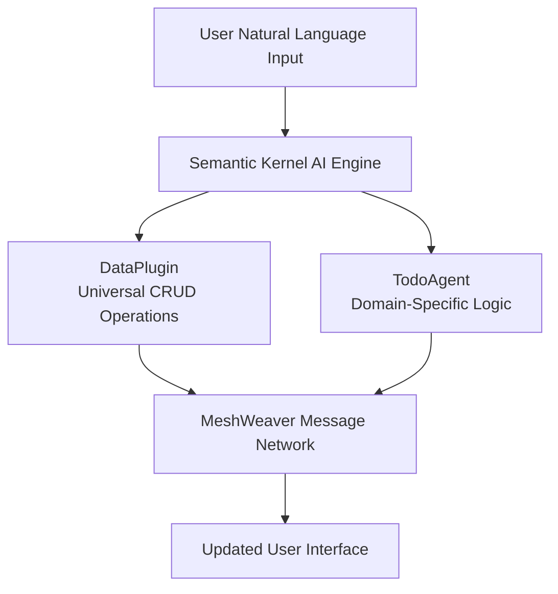

One of the most powerful aspects of MeshWeaver's architecture is how naturally it supports AI agent integration. We believe that **agents should always remote control the application** rather than being embedded within it. This approach maintains clean separation of concerns and allows agents to interact with applications just like human users do, but through programmatic interfaces.

## Remote Control Philosophy

The core principle behind MeshWeaver's AI integration is that agents should operate as external controllers rather than embedded components. This design philosophy stems from several important considerations:

1. **Separation of Concerns**: Business logic remains independent of AI-specific code
2. **Flexibility**: Agents can be updated, replaced, or enhanced without modifying core application code
3. **Consistency**: Agents follow the same interaction patterns as human users
4. **Security**: Agents are subject to the same access controls and validation rules as any other client

### Remote Control Through Messages

Due to the message-based nature of the mesh, we can quite easily hook up an AI agent to the message layer to remote control the entire application. The agent doesn't need special privileges or direct database access - it simply sends the same `DataChangeRequest` and other messages that user interactions generate. This design provides several key advantages:

- **Consistency**: Agents and users follow the same interaction patterns
- **Security**: Agents are subject to the same access controls and validation rules
- **Auditability**: All agent actions are logged through the standard message flow
- **Testability**: Agent behavior can be tested using the same infrastructure as user interactions

## Semantic Kernel Integration

MeshWeaver integrates with [Microsoft Semantic Kernel](https://learn.microsoft.com/en-us/semantic-kernel/), a powerful framework for building AI applications. Semantic Kernel provides the foundation for creating agents that can reason about tasks and execute actions through **kernel functions** - these are .NET methods that the AI can discover and call based on their descriptions and parameters.

### How Semantic Kernel Works in MeshWeaver

The integration works through a call-back mechanism where the chat interface can invoke system functions directly. When a user types a natural language request, the AI agent:

1. **Analyzes the request** using language models to understand intent and extract entities
2. **Determines which kernel functions to call** based on function descriptions and current context
3. **Executes the functions** with appropriate parameters extracted from the user's request
4. **Returns results** to the user through the chat interface, often with confirmation of actions taken

This process allows for sophisticated natural language interactions that can perform complex operations across the entire application ecosystem.

### Kernel Function Architecture

Kernel functions in MeshWeaver are organized into plugins that provide specific capabilities:



## DataPlugin - Universal Data Access

The `DataPlugin` class serves as a standard plugin for CRUD (Create, Read, Update, Delete) operations on any data type within the mesh. This plugin provides the AI agent with comprehensive access to the entire todo data ecosystem through a simple, consistent interface:

```csharp
[KernelFunction]
[Description("Retrieves data of a specific type, optionally filtered by entity ID")]
public async Task<string> GetData(string type, string? entityId = null)

[KernelFunction]
[Description("Updates or creates data based on provided JSON and type information")]
public async Task<string> UpdateData(string json, string type)

[KernelFunction]
[Description("Gets a list of all available data types in the system")]
public async Task<string> GetDataTypes()

[KernelFunction]
[Description("Retrieves the JSON schema for a specific data type")]
public async Task<string> GetSchema(string type)
```

### Universal CRUD Capabilities

With these four core functions, the AI agent can:

- **Discover available data types** using `GetDataTypes()` to understand what entities exist in the system
- **Retrieve data collections or specific entities** with `GetData()` for reading current state
- **Get JSON schemas** for proper data formatting via `GetSchema()` to ensure valid data structures
- **Update existing data or create new entities** through `UpdateData()` for all modifications

The beauty of this design is that the `DataPlugin` is completely generic - it works with todo items, user profiles, categories, or any other data type without requiring type-specific code. The agent simply needs to know the type name and can then perform full CRUD operations.

### Example DataPlugin Usage

Here's how the AI agent might use the DataPlugin to handle a user request:

**User Request**: "Show me all my personal todos"

**Agent Process**:
1. `GetDataTypes()` → Discovers "TodoItem" and "TodoCategory" types
2. `GetData("TodoItem")` → Retrieves all todo items
3. `GetData("TodoCategory")` → Gets category information to filter by "Personal"
4. Filters and formats the results for the user

## TodoAgent - Domain-Specific Intelligence

While the `DataPlugin` provides the basic data access capabilities, the `TodoAgent` class adds domain-specific intelligence and context to create a more natural user experience:

### Contextual Awareness

The `TodoAgent` provides essential context that helps the AI understand the current environment:

```csharp
public string Instructions =>
    $@"Today's date is {DateTime.UtcNow.ToLongDateString()}.
       
       To create a new todo item:
       1. Try to find title, description, category and due date as best as you can from the user's input.
       2. Use the DataPlugin to get available categories and try to match a good category.
       3. Use the CreateTodo function to create a new 'TodoItem' with the provided details and matched category.
       
       Always be helpful and provide clear confirmations of actions taken.";
```

This contextual information allows the agent to make intelligent decisions about:
- **Date Resolution**: Converting relative dates like "tomorrow" or "next Friday" into specific dates
- **Category Matching**: Intelligently mapping user descriptions to existing categories
- **Default Values**: Providing sensible defaults when information is missing

### Specialized Functions

The `TodoAgent` could also provide domain-specific functions that simplify common operations:

```csharp
[KernelFunction]
[Description("Creates a new todo item with the specified title, description, due date, and category.")]
public string CreateTodo(string title, string description, DateTime dueDate, string category)
{
    // Business logic for creating well-formed todo items
    var todoItem = new TodoItem
    {
        Id = Guid.NewGuid(),
        Title = title,
        Description = description,
        DueDate = dueDate,
        Category = category,
        Status = TodoStatus.Pending,
        CreatedDate = DateTime.UtcNow
    };
    
    // Convert to JSON and send through DataPlugin
    var json = JsonSerializer.Serialize(todoItem);
    return UpdateData(json, "TodoItem");
}
```

This `CreateTodo` function encapsulates the business logic for creating well-formed todo items, including:
- **ID Generation**: Automatically creating unique identifiers
- **Status Management**: Setting appropriate default status
- **Timestamp Handling**: Recording creation times
- **JSON Formatting**: Ensuring proper data structure for the mesh

However, in general it is not needed, as the data plugin provides sufficient functionality to lead through the CRUD process. We have thus
removed this function from the project template.

## Natural Language Processing Examples

The AI agent integration enables sophisticated natural language interactions. Here are some examples of how users can interact with the Todo application:

### Creating Todos

**Simple Creation**:
```
User: "I need to buy groceries tomorrow"
Agent: "✅ Created todo: 'Buy groceries' due tomorrow (July 2, 2025) in Personal category"
```

**Complex Creation**:
```
User: "Schedule a team meeting next Friday at 2 PM to discuss the quarterly review with marketing and sales teams"
Agent: "✅ Created todo: 'Team meeting - quarterly review' due Friday, July 11, 2025 in Work category. Added note about including marketing and sales teams."
```

### Modifying Existing Todos

**Status Updates**:
```
User: "Mark the grocery shopping as done"
Agent: "✅ Updated 'Buy groceries' status to Completed"
```

**Due Date Changes**:
```
User: "Move the team meeting to next Monday"
Agent: "✅ Rescheduled 'Team meeting - quarterly review' to Monday, July 14, 2025"
```

### Intelligent Category Matching

The agent demonstrates sophisticated behavior by first retrieving available categories through the `DataPlugin`, then matching user input to existing categories. This prevents data inconsistencies and provides a better user experience:

1. **User Input**: "Add a task to buy groceries for tomorrow"
2. **Category Discovery**: Agent calls `DataPlugin.GetData("TodoCategory")` to see available categories
3. **Intelligent Matching**: Agent matches "buy groceries" to existing "Personal" or "Shopping" category
4. **Todo Creation**: Agent calls `CreateTodo()` with the matched category and parsed due date

## Architecture Benefits

The AI agent integration showcases several architectural benefits of MeshWeaver's design:

### Scalability

- **Independent Scaling**: AI agents can be scaled separately from the core application
- **Multiple Agents**: Different agents can specialize in different domains while sharing the same data access patterns
- **Load Distribution**: Agent processing can be distributed across multiple servers

### Maintainability

- **Clean Separation**: Agent logic is completely separate from business logic
- **Easy Updates**: Agents can be updated without touching core application code
- **Debugging**: Agent actions are logged through the standard message flow for easy troubleshooting

### Security

- **Standard Access Controls**: Agents use the same authentication and authorization as human users
- **Audit Trail**: All agent actions are logged and traceable
- **Sandboxing**: Agents operate through well-defined interfaces, preventing direct system access

## Future Possibilities

The message-based architecture and kernel function approach open up numerous possibilities for future AI integrations:

### Multi-Agent Scenarios

- **Specialized Agents**: Different agents for different business domains (HR, Finance, Sales)
- **Agent Collaboration**: Agents working together on complex multi-step tasks
- **Human-Agent Teams**: Seamless collaboration between human users and AI agents

### Advanced Workflows

- **Long-Running Tasks**: Agents handling processes that take hours or days to complete
- **Scheduled Operations**: Agents performing regular maintenance and data processing
- **Event-Driven Actions**: Agents responding to system events and external triggers

### Enhanced Intelligence

- **Learning from Usage**: Agents improving their performance based on user feedback
- **Context Awareness**: Agents understanding user preferences and work patterns
- **Predictive Capabilities**: Agents suggesting actions before users request them

## Conclusion

MeshWeaver's AI agent integration demonstrates how thoughtful architectural design can enable powerful AI capabilities without compromising system integrity or maintainability. By treating agents as remote controllers that operate through the same message-based interfaces as human users, MeshWeaver creates a flexible, scalable, and secure foundation for AI-powered applications.

The combination of Semantic Kernel integration, universal data access through the DataPlugin, and domain-specific intelligence through specialized agents like TodoAgent creates a natural and powerful way for users to interact with complex business applications using everyday language.

This approach positions MeshWeaver applications to take full advantage of advancing AI capabilities while maintaining clean architecture, security, and the ability to scale and evolve with changing requirements.
