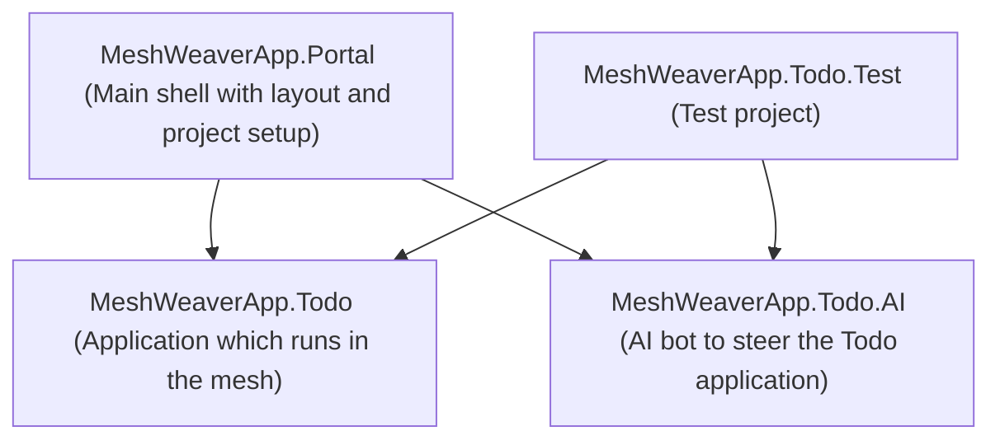

## Prerequisites
MeshWeaver is a dotnet system. This means that, as a prerequisite, we need to download and install the [dotnet sdk](https://dotnet.microsoft.com/en-us/download). Please download the latest version, it is free.

Furthermore, you will need to use some code editor. Please note that it is not necessary that you know how to program. We recommend a modern code editor with agent mode, which can program for you. In this video we work with [vs code](https://code.visualstudio.com/download), which is free. There are a variety of other code editors such as cursor, windsurf, claude code, and others. The progress in terms of code editing is enormous, and every month there are new and better features.

## Installing the Project Template
The starting point for creating a new MeshWeaver solution is to install the project templates. This is done by running the following command in the terminal:
```bash
dotnet new install MeshWeaver.ProjectTemplates
```

After the project templates are installed, you can create a new solution by running:
```bash
dotnet new meshweaver-solution -n MeshWeaverApp
```

This command creates a new solution named `MeshWeaverApp` with the following structure:


## Setting up the AI Key

To enable AI functionality in the Todo application, you need to obtain a GitHub API key with Models permission and configure it using .NET user secrets.

### Getting a GitHub API Key with Models Permission

1. Navigate to [GitHub Settings > Developer settings > Personal access tokens > Fine-grained tokens](https://github.com/settings/personal-access-tokens/fine-grained)
2. Click "Generate new token"
3. Fill in the token details:
   - **Token name**: Choose a descriptive name (e.g., "MeshWeaver AI Development")
   - **Expiration**: Select an appropriate expiration date
   - **Resource owner**: Select your account or organization
4. Under **Repository access**, choose the repositories you want to grant access to
5. In the **Account permissions** section, find and enable:
   - **Models**: Read access (this permission allows access to GitHub's AI models)
6. Click "Generate token" and copy the generated token immediately (you won't be able to see it again)

### Configuring User Secrets

Once you have your GitHub API key, you need to add it to your project's user secrets with the key `AzureInference:ApiKey`.

#### Using the .NET CLI (Recommended)

Navigate to your main project directory (e.g., `MeshWeaverApp.Portal`) and run:

```bash
dotnet user-secrets set "AzureInference:ApiKey" "your-github-api-key-here"
```

#### Using Visual Studio Code

1. Open the Command Palette (`Ctrl+Shift+P` or `Cmd+Shift+P`)
2. Type "User Secrets" and select ".NET: Manage User Secrets"
3. If prompted, select the project you want to configure (typically the main Portal project)
4. This will open the `secrets.json` file in VS Code
5. Add your API key in the following format:

```json
{
  "AzureInference:ApiKey": "your-github-api-key-here"
}
```

6. Save the file (`Ctrl+S` or `Cmd+S`)

The user secrets file is stored locally on your machine and is not committed to source control, ensuring your API key remains secure.

## Exploring the Application

Once you have set up your API key and launched the application, you'll find a fully interactive Todo management system with rich functionality. The main Todo interface displays your todo items organized by status (Pending, In Progress, Completed, Cancelled) with intuitive visual indicators using emojis for each status.

### Interactive Todo Management

Each todo item in the list provides comprehensive interaction capabilities through a hierarchical action menu system. When you click on any todo item, you'll see primary and secondary action buttons that adapt based on the current status:

- **Create New Todos**: Click the "➕ Add New Todo" button to open a dialog where you can specify the title, description, category, and due date for new tasks
- **Status Management**: Use context-aware action buttons to progress todos through their lifecycle:
  - **Pending items**: Start work (▶️ Start), mark as complete (✅ Complete), or cancel (❌ Cancel)
  - **In Progress items**: Mark as done (✅ Done), pause work (⏸️ Pause), or cancel (❌ Cancel)
  - **Completed items**: Reopen for additional work (🔄 Reopen)
  - **Cancelled items**: Restore to pending status (🔄 Restore)
- **Edit Functionality**: Every todo item includes an "✏️ Edit" option that opens a dialog allowing you to modify all properties including title, description, category, due date, and status
- **Delete Options**: Remove individual items with the "🗑️ Delete" action, or use bulk operations to delete entire status groups

### Chat Interface

The Todo application includes an intelligent AI chat interface that allows you to create and manage todo items using natural language. This AI agent understands context and can help you quickly add tasks, modify existing ones, and update their properties through conversational commands.

#### Creating Todos with Natural Language

To create a new todo item, simply type your task in natural language. For example:

```
I'll have to bring my car to the shop tomorrow
```

The AI agent will automatically parse this request and create a todo item with:
- **Title**: "Bring car to the shop"
- **Due Date**: Tomorrow's date
- **Status**: Pending
- **Category**: General (or auto-detected based on context)

#### Modifying Todos Through Chat

Once you have todos in your list, you can easily modify them using follow-up commands:

**Adjusting Due Dates:**
```
Change the car appointment to next Friday
Move the car shop visit to next week
```

**Updating Descriptions:**
```
Add a note to the car appointment: "Need to fix the brake noise"
Update the car todo with reminder to bring registration documents
```

**Changing Status:**
```
Mark the car appointment as in progress
Set the car shop visit to completed
```

The AI agent maintains context about your recent todos and can understand references like "the car appointment" or "that task I just created." This makes it easy to quickly manage your todo list without needing to navigate through multiple UI dialogs.

## Understanding the Architecture

The Todo application demonstrates MeshWeaver's powerful distributed architecture, which enables scalable, resilient applications through message-based communication and reactive design patterns. To dive deep into the architectural principles behind MeshWeaver applications, including message hubs, MVVM patterns, and testing strategies, see our comprehensive guide: [Understanding MeshWeaver Architecture](Understanding%20MeshWeaver%20Architecture.md).

Key architectural highlights include:
- **Message-based communication** for all interactions
- **Distributed hub system** for scalable data management
- **MVVM pattern** for clean separation of concerns
- **Reactive streams** for real-time updates across all connected clients

## AI Agent Integration

One of MeshWeaver's most powerful features is its seamless integration with AI agents. The Todo application showcases how AI agents can remote control applications through the same message-based interfaces that human users employ. For a detailed exploration of how AI agents integrate with MeshWeaver, including Semantic Kernel integration, universal data access patterns, and natural language processing capabilities, see: [AI Agent Integration in MeshWeaver](AI%20Agent%20Integration%20in%20MeshWeaver.md).

The AI integration demonstrates:
- **Remote control patterns** where agents operate external to the application
- **Semantic Kernel integration** for natural language understanding
- **Universal data access** through generic CRUD plugins
- **Domain-specific intelligence** for enhanced user experiences

## Getting Started

With your understanding of the Todo application's functionality, architecture, and AI capabilities, you're ready to start building your own MeshWeaver applications. The project template provides an excellent starting point with:

- **Complete application structure** with portal, business logic, AI agent, and test projects
- **Working examples** of all major MeshWeaver patterns and features
- **Comprehensive test suite** demonstrating testing strategies at multiple levels
- **AI integration** showcasing natural language interfaces

Explore the generated code, run the tests, and experiment with the chat interface to gain hands-on experience with MeshWeaver's capabilities. The architecture is designed to be both powerful and approachable, enabling you to build sophisticated distributed applications with confidence.
       
To create a new todo item:
1. Try to find title description and category and due date as best as you can from the user's input.
2. Use the DataPlugin to get available categories and try to match a good category.
3. Use the CreateTodo function to create a new 'TodoItem' with the provided details and matched category.";

This contextual information allows the agent to make intelligent decisions about due dates (e.g., "tomorrow" becomes a specific date) and category assignments.

#### Specialized Functions

The `TodoAgent` can also provide domain-specific functions that simplify common operations:

```csharp
[KernelFunction]
[Description("Creates a new todo item with the specified title, description, due date, and category.")]
public string CreateTodo(string title, string description, DateTime dueDate, string category)
```

This `CreateTodo` function encapsulates the business logic for creating well-formed todo items, including proper JSON formatting and message dispatch to the Todo hub.

However, as you will notice in the template, this is not even needed. We recommend to just use the DataPlugin, from where
the agent can retrieve a json schema and use the update function to interact with the item. No special code is needed in most cases.

#### Intelligent Category Matching

The agent demonstrates sophisticated behavior by first retrieving available categories through the `DataPlugin`, then matching user input to existing categories. This prevents data inconsistencies and provides a better user experience:

1. User says: "Add a task to buy groceries for tomorrow"
2. Agent calls `DataPlugin.GetData("TodoCategory")` to see available categories
3. Agent matches "buy groceries" to existing "Personal" or "Shopping" category
4. In order to create a new todo item, the Agent 
   a. calls `GetSchema("TodoItem")` to understand to which data structure to map it to
   b. calls `GetData("TodoCategory")` in order to retrieve a list of categories and matches the most appropriate one.
   c. calls `UpdateData("TodoItem")` with the new todo item, including the matched category and due date. 

We have not put too many properties as required, so it will leave them blank if not specified. It is important to let
the user work iteratively with the agent, so that the description, the due date, etc can be naturally completed and follow the thought process of the
user.

This integration showcases how AI agents can provide natural language 
interfaces to complex business applications while maintaining data integrity 
and following established business rules. The message-based architecture makes 
this integration seamless and scalable, allowing multiple agents to work with the 
same application without conflicts.

