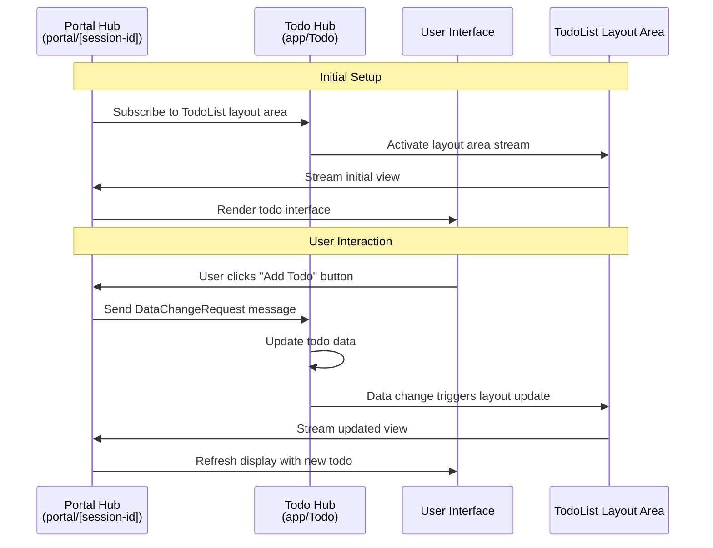
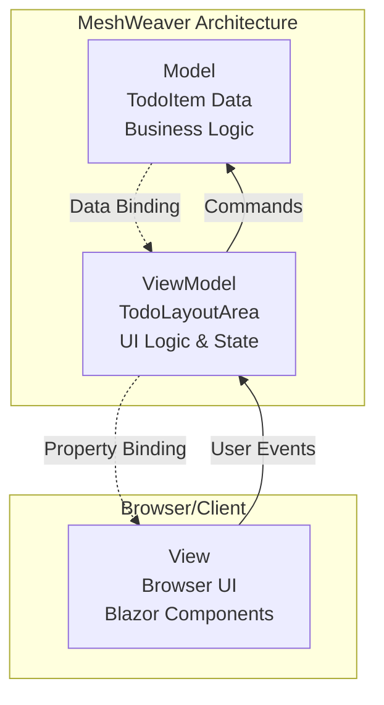

Understanding the architectural principles behind MeshWeaver applications is crucial for building scalable and resilient systems. The Todo application exemplifies these principles through its distributed design and cloud-native approach.

## Core Architectural Principles

MeshWeaver applications are built with three fundamental principles in mind:

1. **Cloud-First Design**: Every component is designed to run efficiently in cloud environments, leveraging horizontal scaling and cloud services
2. **Distributed Systems**: The application architecture embraces distribution as a core concept, with components communicating through well-defined message protocols
3. **Asynchronous Interaction Patterns**: User interactions, especially those involving AI chat agents, are designed to handle long-running operations that may take hours or even days to complete

This distributed nature means that when you interact with the chat interface, your request might trigger a chain of operations across multiple services, with responses arriving asynchronously as the system processes your request.

### Architecture Patterns

MeshWeaver applications can be organized using various architectural patterns depending on your specific requirements:

- **[Clean Architecture](https://medium.com/multinetinventiv/clean-architecture-part-one-what-is-clean-architecture-3d9f16e831bf)**: MeshWeaver's message-driven design naturally supports clean architecture principles by enforcing clear boundaries between business logic and infrastructure concerns through well-defined message contracts
- **[Modular Monolith](https://medium.com/design-microservices-architecture-with-patterns/microservices-killer-modular-monolithic-architecture-ac83814f6862)**: Applications can start as modular monoliths where different modules (like Todo, Users, Projects) are deployed together but maintain logical separation through message hubs and distinct addresses
- **[Vertical Slice Architecture](https://en.wikipedia.org/wiki/Hexagonal_architecture_(software))**: Each feature or business capability can be implemented as a complete vertical slice, from UI layout areas down to data persistence, organized around message hub addresses

The Todo application demonstrates a modular approach where the Todo functionality is encapsulated in its own module with clear message-based interfaces, making it easy to extract into a separate service or integrate with other modules as your application grows.

## Message Hub Architecture

The heart of MeshWeaver's distributed architecture lies in its message hub system. Each hub represents a logical location in the cloud that becomes active when interactions begin.

### Hub Addressing and Partitioning

- **Main Addresses**: Primary hubs handle core business logic. In our Todo application, we use `app/Todo` as the main address for the Todo hub
- **Sub-Hubs**: Smaller, specialized hubs handle specific tasks like maintaining data streams and layout synchronization
- **Partitioning Strategy**: Hub addresses serve a dual purpose - they define logical boundaries and control data partitioning

For example, while our basic Todo app uses a single partition with address `app/Todo` containing all todo items, production applications might use more granular addresses like:
- `todo/Roland` - Personal todos for user Roland
- `todo/MyProject` - Project-specific todos
- `todo/TeamAlpha` - Team-based todo management

This addressing scheme naturally creates sub-partitions, improving scalability and isolation.

### Hosted Components

Message hubs don't just store data - they host active components:

- **Data Management**: Persistent storage and real-time data synchronization
- **Layout Areas**: UI component generators that create reactive user interfaces
- **Business Logic**: Domain-specific operations and workflow management

In the Todo application, the main hub hosts the `TodoList` layout area, which generates the summary view and interactive todo management interface.

### Portal Architecture

The second key address pattern is `portal/[id]`, which creates individual hub instances for each browser connection and user session. This design ensures:

- **Session Isolation**: Each user gets their own portal instance
- **Personalized Experience**: User-specific state and preferences are maintained
- **Scalable Connections**: Portal instances can be distributed across multiple servers

## Interaction Flow

The following diagram illustrates how the distributed components interact when a user performs an action:

### Step-by-Step Breakdown

1. **Subscription Phase**: The portal hub subscribes to the `TodoList` layout area hosted in the Todo hub, establishing a reactive stream of UI updates
2. **User Action**: When a user clicks a button (like "Add Todo"), the portal captures this interaction
3. **Message Dispatch**: The portal sends a `DataChangeRequest` message to the Todo hub at address `app/Todo`
4. **Data Processing**: The Todo hub processes the request, updating the underlying todo data
5. **Layout Reaction**: Data changes automatically trigger the layout area to regenerate the view
6. **Stream Update**: The updated view is streamed back to all subscribed portals
7. **UI Refresh**: The portal receives the update and refreshes the user interface

This reactive architecture ensures that all connected users see changes in real-time, while maintaining loose coupling between the presentation layer (portal) and business logic (Todo hub). The system gracefully handles network issues, temporary disconnections, and high loads through its distributed, message-driven design.

## Message-based Communication

At the core of MeshWeaver's architecture lies a fundamental principle: **every interaction is a message**. This applies not only to business operations but also to user interface interactions, creating a unified communication model throughout the entire system.

When you click on a todo item, edit a field, or press a button, these actions don't directly manipulate the user interface or data. Instead, they generate specific message events:

- **UI Interactions**: A button click generates a `ClickedEvent` message
- **Data Change Requests**: Form submissions create `DataChangeRequest` messages. E.g. when clicking "Start", the status of the todo item is changed and propagated.  
- **Data Changes**: Whenever a hub changes its data, it sends `DataChangedEvent` messages to all subscribers.
- **Layout Areas**: Layout areas subscribe to the data changes. View Models treated as data elements and are propagated using `DataChangedEvent` messages.

This message-centric approach stems from **reactive design principles**, which are fundamental to modern cloud-based architectures. By treating all interactions as discrete, immutable messages, the system gains several critical advantages:

1. **Auditability**: Every action in the system is traceable through its message history
2. **Replay Capability**: System states can be reconstructed by replaying message sequences
3. **Loose Coupling**: Components communicate through well-defined message contracts rather than direct dependencies
4. **Scalability**: Messages can be queued, batched, and processed asynchronously across distributed nodes
5. **Resilience**: Failed operations can be retried, and temporary network issues don't lose user interactions

This pattern is increasingly common in cloud-based architectures where systems must handle high loads, network partitions, and service failures gracefully. Popular cloud platforms and microservice architectures rely heavily on message-driven communication for the same reasons - it provides the foundation for building truly distributed, resilient applications.

### Efficient Message Design

One of the key strengths of MeshWeaver's message system is that **only a few message types are sufficient** to handle the entire application's communication needs. Rather than creating dozens of type-specific messages, the framework uses generic, powerful message patterns:

- **`DataChangeRequest`**: Handles all data modifications regardless of entity type. Whether you're updating a todo item, user profile, or any other data structure, the same message type processes the change
- **`DataChangedEvent`**: Propagates any data changes from any types across the system. This single event type notifies all subscribers about data updates without requiring type-dependent events
- **`ClickedEvent`**: Handles all UI interaction events uniformly

This approach eliminates the need for type-dependent events and reduces system complexity while maintaining full functionality. The generic nature of these messages also makes the system more maintainable and easier to extend.

In the Todo application, when you observe the real-time updates across multiple browser sessions, you're seeing this message-based architecture in action. Each user interaction generates messages that flow through the system, updating all connected clients consistently and reliably.

## View Models

MeshWeaver follows the **Model-View-ViewModel (MVVM)** pattern, a well-established architectural pattern that provides excellent separation of concerns and testability. For a detailed explanation of MVVM, see the [MVVM Wikipedia article](https://en.wikipedia.org/wiki/Model%E2%80%93view%E2%80%93viewmodel).

The following diagram illustrates how MVVM works in the context of our Todo application:

In MeshWeaver applications, we typically focus on writing **ViewModels** (like our `TodoLayoutArea` class), which contain the presentation logic and state management. This approach provides several key benefits:

1. **View Independence**: ViewModels are not tied to specific UI technologies, allowing the same logic to work with Blazor, WPF, or any other presentation framework
2. **Testability**: Business and presentation logic can be thoroughly tested without requiring actual UI components
3. **Reusability**: ViewModels can be shared across different views or platforms
4. **Maintainability**: Clear separation between data, presentation logic, and UI rendering

The `TodoLayoutArea` class serves as our ViewModel, containing methods like `TodoList()`, `TodosByCategory()`, and `TodoSummary()` that generate UI controls based on the underlying todo data. This design allows us to test the entire presentation logic without needing to render actual HTML or interact with browsers.

## Testing Distributed Applications

The Todo application includes a comprehensive test suite that demonstrates different levels of testing in a MeshWeaver application. You can find these tests in the sample test project, which showcases how to test distributed applications effectively.

### Test Structure

We've organized the tests into three main classes, each serving a specific testing purpose:

#### 1. TodoTestBase - Test Infrastructure Setup

The `TodoTestBase` class provides the foundational infrastructure for all Todo-related tests. It configures the complete setup and mimics a mesh environment within the test project, including:

- **Hub Configuration**: Sets up message hubs with the same configuration as the production application
- **Data Context**: Initializes the test environment with sample todo data
- **Application Registration**: Registers the Todo application components and layout areas
- **Client Setup**: Provides test clients that can interact with the mesh as if they were real browser sessions

#### 2. TodoDataChangeComprehensiveTest - Data Operations Testing

The `TodoDataChangeComprehensiveTest` class focuses exclusively on testing data operations without any UI concerns:

- **Data Change Verification**: Tests that `DataChangeRequest` messages properly update todo items
- **Event Propagation**: Verifies that `DataChangedEvent` messages are correctly dispatched
- **Business Logic**: Validates todo status transitions and data integrity
- **Persistence**: Ensures changes are properly stored and retrievable

This level of testing is crucial for validating the core business functionality independent of presentation concerns.

#### 3. TodoLayoutAreaInteractionTest - ViewModel Testing

The `TodoLayoutAreaInteractionTest` class tests the interaction layer through the ViewModel:

- **Layout Rendering**: Verifies that layout areas generate correct UI controls
- **User Interaction Simulation**: Tests button clicks and form submissions through message events
- **UI State Management**: Validates that the ViewModel correctly responds to data changes
- **Integration Testing**: Ensures the complete flow from user action to data update works correctly

### MVVM Testing Advantages

Due to our choice of the MVVM pattern, we can test at the ViewModel level without needing to start actual browser automation tools like Playwright or Puppeteer. This approach provides several advantages:

- **Speed**: Tests run much faster without browser overhead
- **Reliability**: No flaky browser interactions or timing issues
- **Coverage**: Can test complex UI logic and edge cases more easily
- **Debugging**: Easier to debug test failures without browser complexity
- **CI/CD**: Tests run consistently in any environment without browser dependencies

The test suite demonstrates how MeshWeaver's architecture enables comprehensive testing at multiple levels, from pure data operations to complex user interaction scenarios, all while maintaining fast execution and high reliability.

## Conclusion

MeshWeaver's architecture provides a robust foundation for building modern, distributed applications. The combination of message-driven communication, reactive design patterns, and the MVVM architecture creates applications that are:

- **Scalable**: Components can be distributed across multiple servers and scale independently
- **Resilient**: Message-based communication handles network issues and service failures gracefully
- **Testable**: Clear separation of concerns enables comprehensive testing without UI dependencies
- **Maintainable**: Generic message patterns and loose coupling reduce complexity
- **Real-time**: Reactive streams ensure all users see updates immediately

This architectural approach positions MeshWeaver applications to handle the demands of modern cloud-native environments while providing excellent developer experience and application performance.
