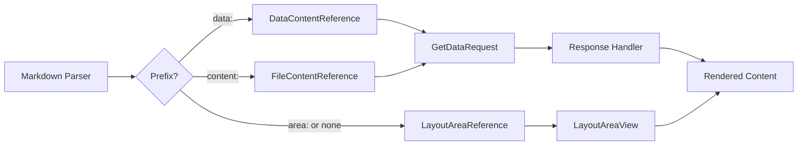

MeshWeaver provides a unified notation for referencing any form of content. Whether you need to embed data,
include file content, or display layout areas, the syntax follows a consistent pattern.

## Syntax

The basic syntax is:
```
@prefix:addressType/addressId/resource/path
```

Examples:
```markdown
@app/Northwind/Dashboard
@data:app/Northwind/Products
@content:app/Docs/readme.md
```

For paths containing spaces or special characters, use quotes:
```markdown
@"content:app/Docs/My Report 2025.pdf"
@"app/Northwind/Sales Report"
```

The legacy syntax with parentheses is also supported for backward compatibility:
```markdown
@("app/Northwind/Dashboard")
```

## Prefixes

The prefix determines how the content is fetched and rendered:
- `data:` - Fetches data entities and displays them as JSON
- `content:` - Fetches file content and renders based on mime type
- `area:` - Displays a layout area (this is the default if no prefix is specified)

## Layout Area References

Layout areas are the most common reference type. They display interactive components from any address:

```markdown
@area:app/Northwind/AnnualReportSummary
@area:app/Northwind/TopClients/Year=2025
```

Format: `area:addressType/addressId/areaName[/areaId]`

For backward compatibility, you can omit the `area:` prefix:

```markdown
@app/Northwind/AnnualReportSummary
```

This is equivalent to `@area:app/Northwind/AnnualReportSummary`.

### Example: Embedding a Layout Area

Here we embed the Northwind annual report summary:

@app/Northwind/AnnualReportSummary?Year=2025

## Data References

Data references allow you to embed data directly in your markdown. The data is fetched and displayed
as a formatted JSON code block:

```markdown
@data:app/Northwind/Category
@data:app/Northwind/Category/1
```

Format: `data:addressType/addressId[/collection[/entityId]]`

- Without collection: Returns default data entity
- With collection: Returns the entire collection
- With collection and entityId: Returns a single entity

### Example: Embedding an Order

To display a specific order from the Northwind application:

```markdown
@data:app/Northwind/Order/10248
```

Here is an actual order embedded:

@data:app/Northwind/Order/10248

### Use Cases for Data References

- **Documentation**: Show live data examples in your documentation
- **Debugging**: Quickly inspect data state in markdown reports
- **Data Export**: Generate JSON snapshots of your data

## Content References

Content references allow you to embed file content directly in your markdown. The content is
rendered based on its mime type:

```markdown
@content:app/Northwind/Documents/report.pdf
```

Format: `content:addressType/addressId/collection[/path/to/file]` 

### Supported Content Types

Content is rendered appropriately based on mime type:

| Content Type | Rendering |
|-------------|-----------|
| Images (png, jpg, svg) | Displayed inline |
| Text files (txt, md, json) | Rendered as formatted content |
| PDF documents | Displayed with viewer or download link |
| Other files | Download link provided |

### Example: Embedding an Image

To display an image:

```markdown
@content:app/Documentation/Documentation/images/meshbros.png
```

Here is an actual image embedded:

@content:app/Documentation/Documentation/images/meshbros.png

### Example: Including Another Markdown Document

You can include the content of another markdown file directly:

```markdown
@content:app/Documentation/Documentation/embedded.md
```

Here is the actual content of `embedded.md` included inline:

@content:app/Documentation/Documentation/embedded.md

## Combining References

You can mix different reference types in a single document to create rich, interactive reports:

```markdown
# Sales Report

## Overview Dashboard
@app/Northwind/SalesDashboard?Year=2025

## Raw Data Export
@data:app/Northwind/Orders

## Attached Documents
@content:app/Northwind/Reports/Q4-Summary.pdf
```

## Path Parameters

All reference types support path parameters using query string syntax:

```markdown
@app/Northwind/SalesReport?Year=2025&Region=Europe
@data:app/Northwind/Order?limit=10
```

## Technical Details

Behind the scenes, all unified references are processed through the `GetDataRequest`/`GetDataResponse`
message pattern. The path is parsed by the `ContentReference.Parse()` method which determines the
appropriate handler based on the prefix.



## Summary

The unified content reference system provides a consistent, intuitive way to embed any type of
content in your markdown documents. Whether you're building interactive reports, documentation,
or data-driven applications, you can reference data, files, and layout areas using the same
familiar syntax.

| Prefix | Purpose | Example |
|--------|---------|---------|
| `area:` (or none) | Layout areas | `@app/Northwind/Dashboard` |
| `data:` | Data entities as JSON | `@data:app/Northwind/Products` |
| `content:` | File content by mime type | `@content:app/Docs/readme.md` |
