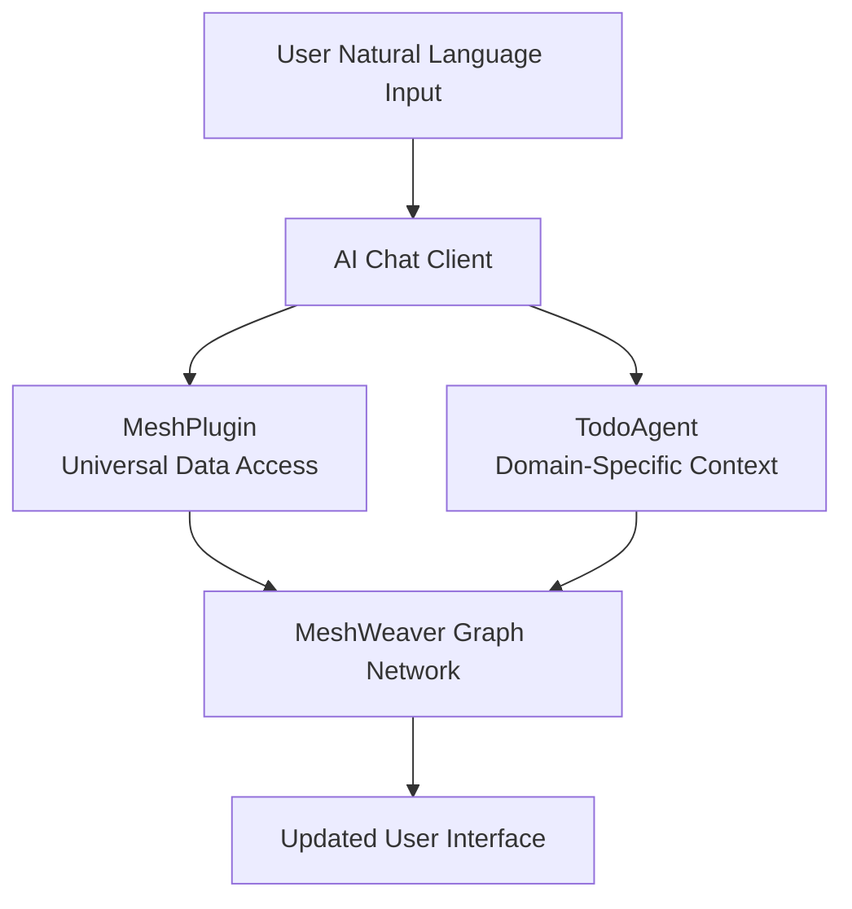

One of the most powerful aspects of MeshWeaver's architecture is how naturally it supports AI agent integration. Agents should always **remote control the application** rather than being embedded within it. This approach maintains clean separation of concerns and allows agents to interact with applications just like human users do, but through programmatic interfaces.

# Remote Control Philosophy

AI agents **remote control** MeshWeaver applications rather than being embedded within them. This ensures clean separation of concerns and allows agents to interact through the same message-based interfaces as human users.

For the design philosophy and benefits of this approach, see [Agentic AI Architecture](MeshWeaver/Documentation/Architecture/AgenticAI).

# AI Tool Integration

MeshWeaver uses [Microsoft.Extensions.AI](https://learn.microsoft.com/en-us/dotnet/ai/ai-extensions) to integrate AI capabilities. This lightweight framework provides abstractions for chat clients and tool calling, allowing agents to discover and invoke functions based on their descriptions.



When a user types a natural language request, the AI agent analyzes intent, determines which tools to call, executes them with appropriate parameters, and returns results through the chat interface.

# MeshPlugin - Universal Data Access

The `MeshPlugin` provides AI agents with tools to interact with the mesh. For the complete API reference, see [MeshPlugin Tools](MeshWeaver/Documentation/AI/Tools/MeshPlugin).

| Tool | Purpose |
|------|---------|
| **Get** | Retrieve nodes by path (`@path` or `@path/*` for children) |
| **Search** | Query nodes using GitHub-style syntax |
| **NavigateTo** | Display a node's visual representation |
| **Update** | Create or modify nodes |

The MeshPlugin is completely generic - it works with Todo items, projects, categories, or any other MeshNode type without requiring type-specific code.

## Example MeshPlugin Usage

Here's how the AI agent might use the MeshPlugin to handle a user request in the Software CustomerOnboarding project:

**User Request**: "Show me all compliance-related tasks"

**Agent Process**:
1. `Search("nodeType:ACME/Project/Todo category:Compliance")` → Finds compliance-related tasks
2. `NavigateTo("@ACME/CustomerOnboarding/TodosByCategory")` → Displays results using the category view

# Domain-Specific Agents

While the `MeshPlugin` provides basic data access capabilities, domain-specific agents add intelligence and context. In MeshWeaver, agents are defined as markdown MeshNodes with a `nodeType: Agent` frontmatter.

## TodoAgent Definition

The Software sample includes a TodoAgent defined in `ACME/Project/TodoAgent.md`:

```markdown
---
nodeType: Agent
name: Todo Agent
description: Handles all questions and actions related to project tasks
icon: TaskListSquare
isDefault: true
---

The agent is the Todo Agent, specialized in managing tasks for Software projects:
- List and search tasks (using the Get and Search tools)
- Assign tasks to team members and set priorities
- Create and update tasks (using the Update tool)

# Team Members
Software employees: Oliver (Compliance), Paul (Risk Management), Quinn (Customer Support)
Platform team: Alice, Bob, Carol, David, Emma, Roland, Samuel

# Task Categories
Research, Marketing, Design, Sales, Engineering, PR, Support, Legal, Strategy,
Partnerships, Compliance, Risk, Operations
```

## Contextual Awareness

The agent provides essential context that helps the AI understand the current environment:

- **Team Members**: Knows who can be assigned tasks (Oliver, Paul, Quinn for Software; Alice, Bob, etc. for platform)
- **Categories**: Understands available categories for proper task classification
- **Project Context**: Operates within the current project namespace (CustomerOnboarding or ProductLaunch)
- **Date Resolution**: Converts relative dates like "tomorrow" or "next Friday" into specific dates
- **Priority Levels**: Maps user input to standard priorities (Low, Medium, High, Critical)

# Natural Language Processing Examples

The AI agent integration enables sophisticated natural language interactions. Here are examples from both Software projects:

## CustomerOnboarding Project

**Creating Compliance Tasks**:
```
User: "Create a compliance review task for Oliver, it's high priority"
Agent: "Created 'Compliance review' assigned to Oliver with High priority in Legal category"
```

**Querying Task Status**:
```
User: "What tasks are overdue in the onboarding project?"
Agent: [Displays TodaysFocus view showing overdue tasks]
```

**Reassigning Work**:
```
User: "Move the KYC review from Oliver to Paul"
Agent: "Updated 'Review KYC documentation' - reassigned from Oliver to Paul"
```

## ProductLaunch Project

**Marketing Tasks**:
```
User: "Show me all Marketing tasks"
Agent: [Displays TodosByCategory view filtered to Marketing]
```

**Campaign Management**:
```
User: "What's the status of the email campaign?"
Agent: "The 'Email Campaign' task is currently Active, assigned to Emma, due in 3 days"
```

**Creating Engineering Tasks**:
```
User: "Create a new Engineering task for the demo environment setup"
Agent: "Created 'Demo environment setup' in Engineering category with Medium priority"
```

## Intelligent Category Matching

The agent demonstrates sophisticated behavior by first retrieving available categories through the `MeshPlugin`, then matching user input to existing categories. This prevents data inconsistencies and provides a better user experience:

1. **User Input**: "Add a legal review task for the contract"
2. **Category Discovery**: Agent calls `Get("@ACME/Project/Todo/schema:")` to see available categories
3. **Intelligent Matching**: Agent matches "legal review" to the "Legal" category
4. **Todo Creation**: Agent calls `Update()` with properly structured Todo JSON

# Architecture Benefits

The AI agent integration showcases several architectural benefits of MeshWeaver's design:

## Scalability

- **Independent Scaling**: AI agents can be scaled separately from the core application
- **Multiple Agents**: Different agents can specialize in different domains (TodoAgent, ProjectAgent, etc.)
- **Load Distribution**: Agent processing can be distributed across multiple servers

## Maintainability

- **Clean Separation**: Agent logic is completely separate from business logic
- **Markdown Definition**: Agents are defined in simple markdown files, easy to update
- **Easy Updates**: Agents can be updated without touching core application code

## Security

- **Standard Access Controls**: Agents use the same authentication and authorization as human users
- **Audit Trail**: All agent actions are logged and traceable
- **Sandboxing**: Agents operate through well-defined interfaces, preventing direct system access

# Multi-Agent Collaboration

MeshWeaver supports multi-agent scenarios where specialized agents work together. For multi-agent collaboration patterns and agent roles, see [Agentic AI Architecture](MeshWeaver/Documentation/Architecture/AgenticAI).

## Software Human-Agent Teams

In the Software sample, AI agents work alongside human team members:

| Team Member | Role | AI Agent Support |
|-------------|------|------------------|
| **Oliver** | Compliance | TodoAgent assists with legal and compliance task management |
| **Paul** | Risk Management | TodoAgent helps track risk assessment tasks |
| **Quinn** | Customer Support | TodoAgent manages support tickets and follow-ups |

# Layout Area Integration

Agents can display results using appropriate layout areas rather than raw data. For details on layout areas, see [Graphical User Interface](MeshWeaver/Documentation/GUI).

```
CRITICAL: When users ask to view, show, list, or display tasks:
- First check available layout areas using GetLayoutAreas
- If an appropriate layout area exists:
  1. Call DisplayLayoutArea with the appropriate area name
  2. Provide a brief confirmation message
  3. DO NOT also output the raw data as text
```

Available views in Software projects:
- **TodaysFocus**: Urgent and in-progress tasks
- **AllTasks**: Tasks grouped by status
- **TodosByCategory**: Tasks grouped by category
- **MyTasks**: Current user's assigned tasks
- **Backlog**: Unassigned tasks by priority

# Conclusion

MeshWeaver's AI agent integration demonstrates how thoughtful architectural design can enable powerful AI capabilities without compromising system integrity or maintainability. By treating agents as remote controllers that operate through the same message-based interfaces as human users, MeshWeaver creates a flexible, scalable, and secure foundation for AI-powered applications.

The combination of Microsoft.Extensions.AI integration, universal data access through the MeshPlugin, and domain-specific intelligence through markdown-defined agents creates a natural and powerful way for users to interact with complex business applications using everyday language.

This approach positions MeshWeaver applications to take full advantage of advancing AI capabilities while maintaining clean architecture, security, and the ability to scale and evolve with changing requirements.
