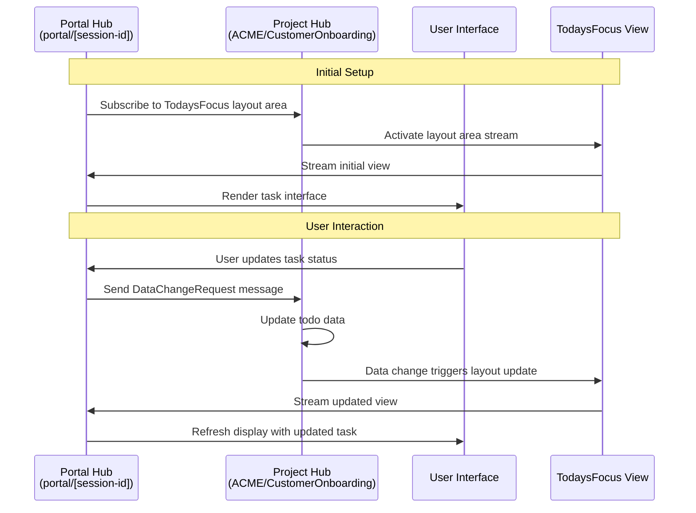

Understanding the architectural principles behind MeshWeaver applications is crucial for building scalable and resilient systems. The Software sample organization exemplifies these principles through its distributed design and cloud-native approach.

# Core Architectural Principles

MeshWeaver applications are built with three fundamental principles in mind:

1. **Cloud-First Design**: Every component is designed to run efficiently in cloud environments, leveraging horizontal scaling and cloud services
2. **Distributed Systems**: The application architecture embraces distribution as a core concept, with components communicating through well-defined message protocols
3. **Asynchronous Interaction Patterns**: User interactions, especially those involving AI chat agents, are designed to handle long-running operations that may take hours or even days to complete

This distributed nature means that when you interact with the chat interface, your request might trigger a chain of operations across multiple services, with responses arriving asynchronously as the system processes your request.

## Architecture Patterns

MeshWeaver applications can be organized using various architectural patterns depending on your specific requirements:

- **[Clean Architecture](https://medium.com/multinetinventiv/clean-architecture-part-one-what-is-clean-architecture-3d9f16e831bf)**: MeshWeaver's message-driven design naturally supports clean architecture principles by enforcing clear boundaries between business logic and infrastructure concerns through well-defined message contracts
- **[Modular Monolith](https://medium.com/design-microservices-architecture-with-patterns/microservices-killer-modular-monolithic-architecture-ac83814f6862)**: Applications can start as modular monoliths where different modules are deployed together but maintain logical separation through message hubs and distinct namespace paths
- **[Vertical Slice Architecture](https://en.wikipedia.org/wiki/Hexagonal_architecture_(software))**: Each feature or business capability can be implemented as a complete vertical slice, from UI layout areas down to data persistence, organized around namespace paths

The Software sample demonstrates a modular approach where the Todo functionality is encapsulated in a reusable NodeType (`ACME/Project/Todo`) with clear message-based interfaces, making it easy to share across multiple projects within the organization.

# The MeshNode and Namespace Hierarchy

MeshWeaver organizes data using MeshNodes in a hierarchical namespace. For the complete architecture details, see [Mesh Graph Architecture](MeshWeaver/Documentation/Architecture/MeshGraph).

## Software Namespace Hierarchy

```
ACME/                                    # Organization
├── Project/                             # Shared NodeType definitions
│   ├── Todo.json                        # Todo NodeType definition
│   ├── Todo/                            # Todo-related code and assets
│   │   └── Code/                        # Todo.cs, TodoViews.cs, Status.cs
│   ├── Code/                            # ProjectViews.cs
│   └── TodoAgent.md                     # AI agent definition
├── CustomerOnboarding/                  # Project 1
│   └── Todo/                            # Tasks for this project
│       ├── ReviewKYC.json               # ACME/CustomerOnboarding/Todo/ReviewKYC
│       ├── CalculateRiskScore.json
│       └── SanctionsScreening.json
└── ProductLaunch/                       # Project 2
    └── Todo/                            # Tasks for this project
        ├── PricingStrategy.json         # ACME/ProductLaunch/Todo/PricingStrategy
        ├── EmailCampaign.json
        └── DemoEnvironment.json
```

## Path Examples

| Node | Full Path |
|------|-----------|
| ReviewKYC task | `ACME/CustomerOnboarding/Todo/ReviewKYC` |
| Email campaign task | `ACME/ProductLaunch/Todo/EmailCampaign` |
| Todo NodeType | `ACME/Project/Todo` |
| CustomerOnboarding project | `ACME/CustomerOnboarding` |

This addressing scheme naturally creates namespaces that improve scalability and isolation.

# Message Hub Architecture

The heart of MeshWeaver's distributed architecture lies in its message hub system. Each hub represents a logical location in the cloud that becomes active when interactions begin.

## Hub Addressing and Partitioning

- **Namespace Paths**: Primary hubs handle core business logic. In Software, projects like `ACME/CustomerOnboarding` and `ACME/ProductLaunch` each get their own hub context
- **Sub-Hubs**: Smaller, specialized hubs handle specific tasks like maintaining data streams and layout synchronization
- **Partitioning Strategy**: Namespace paths serve a dual purpose - they define logical boundaries and control data partitioning

For example, the Software organization uses:
- `ACME/CustomerOnboarding` - Insurance client onboarding workflows
- `ACME/ProductLaunch` - Product marketing campaign management

## NodeType Configuration

NodeTypes define the behavior for instances. See [Mesh Graph](MeshWeaver/Documentation/Architecture/MeshGraph) for NodeType configuration patterns.

The Todo NodeType (`ACME/Project/Todo`) is configured with:

```json
{
  "id": "Todo",
  "namespace": "ACME/Project",
  "name": "Task",
  "nodeType": "NodeType",
  "content": {
    "$type": "NodeTypeDefinition",
    "configuration": "config => config
        .WithContentType<Todo>()
        .AddData(data => data.AddHubSource(...))
        .AddDefaultLayoutAreas()
        .AddLayout(layout => layout.WithView(\"Thumbnail\", TodoViews.Thumbnail))"
  }
}
```

This configuration:
- Sets `Todo` as the content type (strongly typed)
- Configures data sources for Status, Category, and Priority dimensions
- Registers views including the Thumbnail view for catalog listings

## Portal Architecture

The second key address pattern is `portal/[id]`, which creates individual hub instances for each browser connection and user session. This design ensures:

- **Session Isolation**: Each user gets their own portal instance
- **Personalized Experience**: User-specific state and preferences are maintained
- **Scalable Connections**: Portal instances can be distributed across multiple servers

# Interaction Flow

The following diagram illustrates how distributed components interact when a user performs an action:



## Step-by-Step Breakdown

1. **Subscription Phase**: The portal hub subscribes to layout areas hosted in the project hub, establishing a reactive stream of UI updates
2. **User Action**: When a user clicks a button (like "Complete Task"), the portal captures this interaction
3. **Message Dispatch**: The portal sends a `DataChangeRequest` message to the project hub
4. **Data Processing**: The hub processes the request, updating the underlying todo data
5. **Layout Reaction**: Data changes automatically trigger the layout area to regenerate the view
6. **Stream Update**: The updated view is streamed back to all subscribed portals
7. **UI Refresh**: The portal receives the update and refreshes the user interface

This reactive architecture ensures that all connected users see changes in real-time, while maintaining loose coupling between the presentation layer (portal) and business logic (project hub).

# Message-based Communication

At the core of MeshWeaver's architecture lies a fundamental principle: **every interaction is a message**. For details on message-based communication patterns, see [Message-Based Communication](MeshWeaver/Documentation/Architecture/MessageBasedCommunication).

In the Software sample, messages flow through the system as follows:

- **UI Interactions**: Clicking "Start" on a task generates a `ClickedEvent` message
- **Data Changes**: The hub processes the event and creates a `DataChangeRequest` to update the task status
- **Layout Updates**: The `DataChangedEvent` triggers the TodaysFocus view to refresh automatically

# Views and Layout Areas

MeshWeaver follows the **Model-View-ViewModel (MVVM)** pattern. Views are registered through NodeType configuration and executed reactively.

## View Registration

Views are defined in code files (e.g., `TodoViews.cs`, `ProjectViews.cs`) and registered via the NodeType configuration:

```csharp
public static LayoutDefinition AddProjectViews(this LayoutDefinition layout) =>
    layout
        .WithView("AllTasks", AllTasks)
        .WithView("TodosByCategory", TodosByCategory)
        .WithView("TodaysFocus", TodaysFocus)
        .WithView("Backlog", Backlog)
        .WithView("MyTasks", MyTasks);
```

## Software Project Views

The Software sample includes these catalog views (defined in `ProjectViews.cs`):

| View | Description | Grouping |
|------|-------------|----------|
| **TodaysFocus** | Overdue, due today, in progress | By urgency |
| **AllTasks** | Complete task list | By status |
| **TodosByCategory** | Tasks organized by type | By category |
| **Backlog** | Unassigned tasks | By priority |
| **MyTasks** | Current user's tasks | By urgency |

## Reactive View Updates

Views return `IObservable<UiControl?>`, enabling reactive updates:

```csharp
public static IObservable<UiControl?> TodaysFocus(LayoutAreaHost host, RenderingContext _)
{
    var nodes = meshQuery.ObserveQuery<MeshNode>(
        $"path:{hubPath}/Todo nodeType:ACME/Project/Todo state:Active scope:subtree");

    return nodes.CombineLatest(statuses, priorities, (dict, sts, pris) =>
    {
        // Build groups: Overdue, Due Today, In Progress
        return (UiControl?)new CatalogControl().WithGroups(groups);
    });
}
```

When data changes, the observable emits new values, and the view automatically updates.

# Conclusion

MeshWeaver's architecture provides a robust foundation for building modern, distributed applications. The combination of message-driven communication, reactive design patterns, and the namespace hierarchy creates applications that are:

- **Scalable**: Components can be distributed across multiple servers and scale independently
- **Resilient**: Message-based communication handles network issues and service failures gracefully
- **Testable**: Clear separation of concerns enables comprehensive testing without UI dependencies
- **Maintainable**: Generic message patterns and loose coupling reduce complexity
- **Real-time**: Reactive streams ensure all users see updates immediately

The Software sample demonstrates these principles in practice with its organization → project → task hierarchy, showing how MeshWeaver applications can handle complex business scenarios while maintaining clean architecture and excellent performance.
