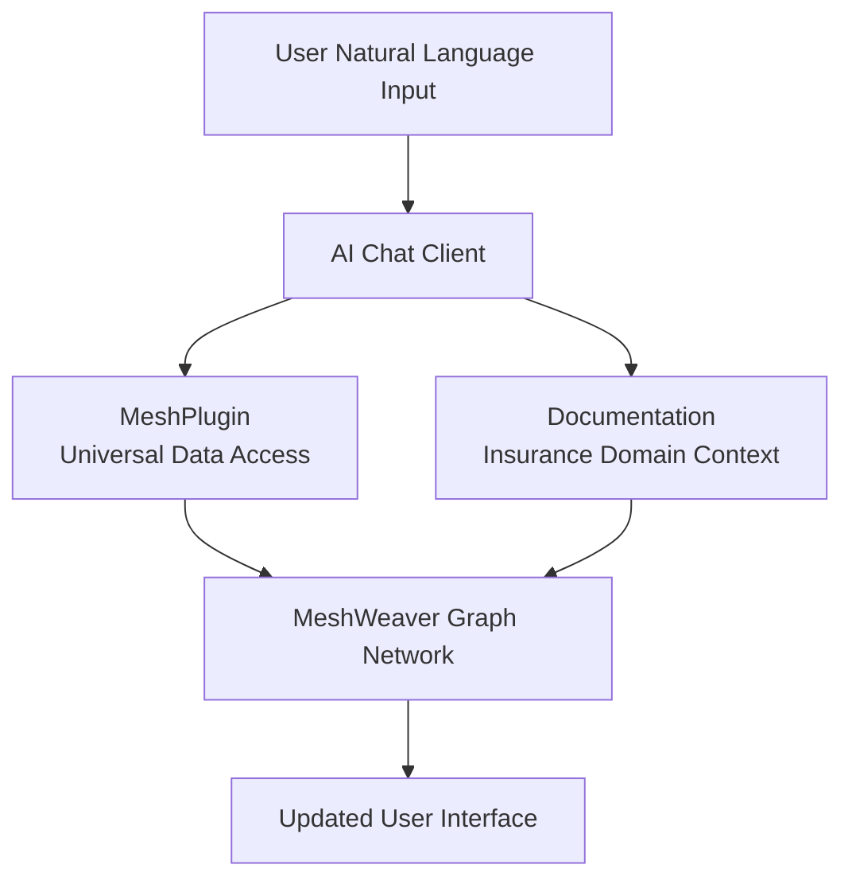

One of the most powerful aspects of MeshWeaver's architecture is how naturally it supports AI agent integration. The Cornerstone sample demonstrates this through natural language access to insurance pricing data using the MeshPlugin and domain documentation.

# Remote Control Philosophy

AI agents **remote control** MeshWeaver applications rather than being embedded within them. This ensures clean separation of concerns and allows agents to interact through the same message-based interfaces as human users.

For the design philosophy and benefits of this approach, see [Agentic AI Architecture](Doc/Architecture/AgenticAI).

# AI Tool Integration

MeshWeaver uses [Microsoft.Extensions.AI](https://learn.microsoft.com/en-us/dotnet/ai/ai-extensions) to integrate AI capabilities. This framework provides abstractions for chat clients and tool calling.



When a user types a natural language request, the AI agent analyzes intent, determines which tools to call, executes them with appropriate parameters, and returns results through the chat interface.

# MeshPlugin - Universal Data Access

The `MeshPlugin` provides AI agents with tools to interact with the mesh. For the complete API reference, see [MeshPlugin Tools](Doc/AI/Tools/MeshPlugin).

| Tool | Purpose |
|------|---------|
| **Get** | Retrieve nodes by path (`@path` or `@path/*` for children) |
| **Search** | Query nodes using GitHub-style syntax |
| **NavigateTo** | Display a node's visual representation |
| **Update** | Create or modify nodes |

The MeshPlugin is completely generic - it works with Pricings, PropertyRisks, Insureds, or any other MeshNode type.

## Example MeshPlugin Usage

Here's how the AI agent might use the MeshPlugin to handle a user request:

**User Request**: "Show me all bound pricings"

**Agent Process**:
1. `Search("nodeType:Cornerstone/Pricing status:Bound")` → Finds bound pricings
2. `NavigateTo("@Cornerstone/Microsoft/PricingCatalog")` → Displays results in catalog view

# Insurance Domain Context

AI agents working with Cornerstone have access to essential context that helps understand the insurance domain:

- **Business Structure**: Knows the relationships between insured, primary insurer, broker, and reinsurer
- **Reference Data**: Understands lines of business, countries, currencies, and statuses
- **Views**: Knows which views are available (Overview, Property Risks, Risk Map, etc.)
- **Data Model**: Understands PropertyRisk, ReinsuranceAcceptance, and ReinsuranceSection entities

# Natural Language Processing Examples

The AI agent integration enables sophisticated natural language interactions for insurance tasks.

## Viewing Pricings

**Display Pricing Overview**:
```
User: "Show me the Microsoft 2026 pricing"
Agent: [Displays Overview view for Cornerstone/Microsoft/2026]
```

**View Property Risks**:
```
User: "What property risks are in the Microsoft pricing?"
Agent: [Displays Property Risks DataGrid showing locations and TSI values]
```

**Geographic Visualization**:
```
User: "Show me the risk map for Microsoft"
Agent: [Displays Risk Map with geocoded property markers on Google Maps]
```

## Querying Data

**Find Pricings by Status**:
```
User: "Show me all draft pricings"
Agent: [Searches for pricings with status:Draft and displays results]
```

**Find by Line of Business**:
```
User: "What property pricings do we have?"
Agent: [Searches for pricings with lineOfBusiness:PROP]
```

**Find by Insured**:
```
User: "Show me all pricings for Global Manufacturing"
Agent: [Navigates to Cornerstone/GlobalManufacturing/PricingCatalog]
```

## Creating Pricings

**New Pricing**:
```
User: "Create a new pricing for Microsoft, 2027 underwriting year"
Agent: "Created draft pricing 'Microsoft 2027' with:
        - Inception: 2027-01-01
        - Expiration: 2027-12-31
        - Line of Business: Property
        - Status: Draft"
```

**With Specific Details**:
```
User: "Create a marine pricing for European Logistics, starting April 2026"
Agent: "Created draft pricing with:
        - Insured: European Logistics Ltd
        - Line of Business: Marine
        - Inception: 2026-04-01
        - Currency: GBP"
```

## Understanding Insurance Terms

**Reference Data Queries**:
```
User: "What lines of business are available?"
Agent: "Available lines of business:
        - PROP: Property
        - CAS: Casualty
        - MARINE: Marine
        - AVIATION: Aviation
        - ENERGY: Energy"
```

**Status Workflow**:
```
User: "What pricing statuses can I use?"
Agent: "Pricing statuses (in order):
        1. Draft - Initial pricing draft
        2. Quoted - Quote issued to client
        3. Bound - Policy bound, coverage in effect
        4. Declined - Rejected by client or underwriter
        5. Expired - Quote or policy has expired"
```

## Reinsurance Structure

**View Structure Diagram**:
```
User: "Show me the reinsurance structure for Microsoft 2026"
Agent: [Displays Structure view with reinsurance layers and sections]
```

**Layer Details**:
```
User: "What are the coverage layers?"
Agent: "Reinsurance layers:
        - Layer 1: $10M xs $5M (Fire, NatCat, BI)
        - Layer 2: $25M xs $15M (Fire, NatCat)
        - Layer 3: $50M xs $40M (Fire)"
```

## File Management

**View Submissions**:
```
User: "Show me the submission files for Microsoft 2026"
Agent: [Displays Submission file browser]
```

**Import Data**:
```
User: "Import property risks from the uploaded Excel file"
Agent: [Processes Excel file and imports PropertyRisk entities]
```

# Excel Import Workflow

MeshWeaver supports importing property risk data from Excel files. This section details the complete workflow for analyzing Excel files and creating import configurations.

## Import Capabilities

- Analyze uploaded Excel files to understand their structure (columns, headers, data types)
- Intelligently match Excel columns to PropertyRisk properties
- Generate ExcelImportConfiguration mappings dynamically
- Preview and confirm mappings before importing
- Execute imports and provide feedback on results

## Available Import Tools

| Tool | Purpose |
|------|---------|
| **GetContent** | Read Excel file contents as markdown table with column letters |
| **ListFiles** | List files in the Submissions folder |
| **Import** | Execute import with a configuration |
| **GetSchema** | Get the PropertyRisk schema for reference |

## Import Workflow Steps

### Step 1: Identify the File

If the user doesn't specify a file:
- Call `ListFiles` on the Submissions collection to show available files
- Ask which file to import

### Step 2: Analyze the Excel Structure

Call `GetContent` with the file path and `numberOfRows: 20` to see:
- All worksheet names
- Column letters (A, B, C, ...) and their content
- Header row location
- Sample data rows

### Step 3: Identify Headers and Data Start Row

Examine the returned markdown table to determine:
- Which row contains column headers (often row 1, but may be row 2-6 in broker files)
- Which row the actual data starts
- Any total rows at the bottom to exclude

Common patterns:
- Simple files: Headers in row 1, data starts row 2
- Broker files: Title/metadata in rows 1-5, headers in row 6, data starts row 7
- Files with freeze panes often have headers at the freeze row

### Step 4: Match Columns to PropertyRisk Properties

Map the Excel columns to these PropertyRisk properties:

| PropertyRisk Field | Common Excel Header Patterns |
|--------------------|------------------------------|
| `Id` | ID, Asset ID, Location ID, Plant, Plant ID, Reference |
| `LocationName` | Name, Location, Site, Site Name, Location Name |
| `Address` | Address, Street, Street Address |
| `City` | City, Town |
| `State` | State, Province, Region |
| `Country` | Country, Country Code, Nation, Ctry |
| `ZipCode` | ZIP, Zip Code, Postal Code, Post Code |
| `TsiBuilding` | Building, Building Value, TSI Building, Building TSI, Property Value |
| `TsiContent` | Content, Contents, TSI Content, Content Value, Equipment, Machinery |
| `TsiBi` | BI, Business Interruption, TSI BI, Loss of Income |
| `Latitude` | Lat, Latitude |
| `Longitude` | Lng, Long, Longitude |
| `BuildYear` | Year Built, Build Year, Construction Year |
| `OccupancyType` | Occupancy, Occupancy Type, Use, Building Use |
| `ConstructionType` | Construction, Construction Type, Building Type |

For numeric value columns (TsiBuilding, TsiContent, TsiBi):
- If values are split across multiple columns, use `MappingKind.Sum`
- If a total needs to be allocated proportionally, use an `Allocation` with weight columns

### Step 5: Present Mapping to User

Present the proposed mapping clearly and wait for user confirmation:

```
I analyzed the Excel file. Here's my suggested mapping:

**File**: NewRisks.xlsx
**Worksheet**: Sheet1
**Headers in row**: 6
**Data starts at row**: 7

**Column Mappings**:
- Column A "Plant ID" -> PropertyRisk.Id
- Column B "Site Name" -> PropertyRisk.LocationName
- Column C "Street" -> PropertyRisk.Address
- Column D "Country" -> PropertyRisk.Country
- Column E "Building USD" -> PropertyRisk.TsiBuilding
- Column F "Contents USD" -> PropertyRisk.TsiContent
- Column G "BI USD" -> PropertyRisk.TsiBi

**Excluded**: Columns H-J (appear to be calculated totals)
**Total row markers**: "Total", "Grand Total"

Should I proceed with this mapping?
```

### Step 6: Generate Configuration

Create the ExcelImportConfiguration JSON:

```json
{
  "$type": "MeshWeaver.Import.Configuration.ExcelImportConfiguration",
  "name": "NewRisks.xlsx",
  "typeName": "PropertyRisk",
  "worksheetName": "Sheet1",
  "dataStartRow": 7,
  "totalRowMarkers": ["Total", "Grand Total"],
  "ignoreRowExpressions": ["Id == null"],
  "mappings": [
    { "targetProperty": "Id", "kind": "Direct", "sourceColumns": ["A"] },
    { "targetProperty": "LocationName", "kind": "Direct", "sourceColumns": ["B"] },
    { "targetProperty": "Address", "kind": "Direct", "sourceColumns": ["C"] },
    { "targetProperty": "Country", "kind": "Direct", "sourceColumns": ["D"] },
    { "targetProperty": "TsiBuilding", "kind": "Direct", "sourceColumns": ["E"] },
    { "targetProperty": "TsiContent", "kind": "Direct", "sourceColumns": ["F"] },
    { "targetProperty": "TsiBi", "kind": "Direct", "sourceColumns": ["G"] },
    { "targetProperty": "PricingId", "kind": "Constant", "constantValue": "2026" }
  ]
}
```

### Step 7: Execute Import

Call `Import` with the configuration:

```
Import(
  path: "Submissions@Microsoft-2026:NewRisks.xlsx",
  address: "Cornerstone/Microsoft/2026",
  configuration: "<JSON from Step 6>"
)
```

### Step 8: Report Results

After import completes:
- Report the number of records imported
- Mention any warnings or errors from the import log
- Suggest viewing the Property Risks view to verify the data

## Mapping Kind Reference

| Kind | Usage | Example |
|------|-------|---------|
| `Direct` | Single column to property | Column B -> LocationName |
| `Sum` | Sum multiple columns | Columns E+F+G -> TsiContent |
| `Difference` | Subtract columns | Column F - Column E -> some value |
| `Constant` | Fixed value for all rows | "2026" -> PricingId |

## Allocation Reference

For distributing a total value proportionally across rows:

```json
{
  "allocations": [
    {
      "targetProperty": "TsiBi",
      "totalCell": "Q50",
      "weightColumns": ["Q"]
    }
  ]
}
```

This takes the value in cell Q50 and distributes it across all rows based on each row's weight in column Q.

## Import Error Handling

- If GetContent fails, the file may not exist or be corrupted
- If column headers are unclear, ask the user to clarify
- If import fails, report the error and suggest checking the mapping
- Always offer to adjust the mapping if the user identifies issues

# View Integration

Agents display results using appropriate views rather than raw data:

```
CRITICAL: When users ask to view, show, list, or display pricings:
- First check available views using GetLayoutAreas
- If an appropriate view exists:
  1. Call DisplayLayoutArea with the appropriate area name
  2. Provide a brief confirmation message
  3. DO NOT also output the raw data as text
```

Available views in Cornerstone:

| View | Use Case |
|------|----------|
| **Overview** | Pricing details and summary |
| **Property Risks** | Property location data |
| **Risk Map** | Geographic visualization |
| **Structure** | Reinsurance layers and sections |
| **Submission** | File browser |
| **Import Configs** | Import settings |
| **PricingCatalog** | Insured's pricings by status |

# Architecture Benefits

## Scalability

- **Independent Scaling**: AI agents scale separately from the core application
- **Multiple Agents**: Different agents can specialize in different domains
- **Load Distribution**: Agent processing distributes across multiple servers

## Maintainability

- **Clean Separation**: Agent logic is separate from business logic
- **Markdown Definition**: Agents are defined in simple markdown files
- **Easy Updates**: Agent context can be updated without code changes

## Security

- **Standard Access Controls**: Agents use the same authentication as human users
- **Audit Trail**: All agent actions are logged and traceable
- **Sandboxing**: Agents operate through well-defined interfaces

# Domain-Specific Intelligence

AI agents working with Cornerstone documentation have domain-specific capabilities:

| Capability | Description |
|------------|-------------|
| **TSI Understanding** | Knows Building, Content, and BI TSI values |
| **Coverage Limits** | Understands attachment points and layer limits |
| **Industry Terms** | Recognizes EPI, rates, commissions |
| **Geographic Context** | Handles property geocoding and mapping |
| **Workflow Status** | Manages Draft → Quoted → Bound progression |

# Conclusion

MeshWeaver's AI agent integration in Cornerstone demonstrates how thoughtful architectural design enables powerful AI capabilities for insurance applications. The documentation-driven approach provides:

- Natural language access to complex insurance data
- Domain-aware responses using insurance terminology
- Visual representations through views
- File management and Excel import workflows
- Real-time updates as data changes

This approach positions insurance applications to take full advantage of advancing AI capabilities while maintaining clean architecture, security, and scalability.
