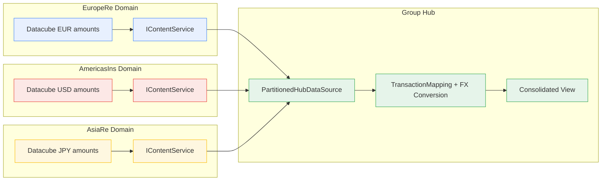
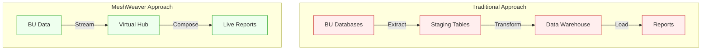
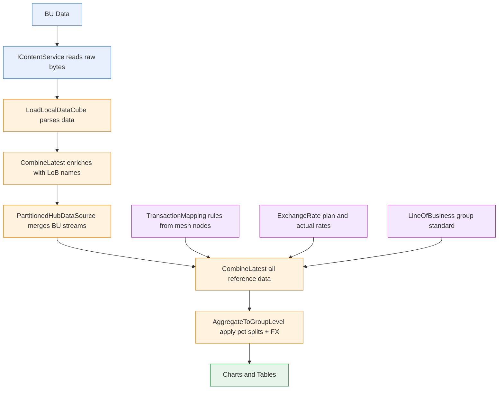

In most insurance groups, consolidation means copying data from subsidiaries into a central warehouse — nightly ETL jobs, staging tables, transformation scripts, and stale snapshots. MeshWeaver takes a different approach: **data stays where it is**. The group view is assembled virtually through reactive stream composition.

---

## Data Mesh Architecture

Each business unit owns its data. The group hub doesn't store copies — it reads from each BU's data domain through virtual streams and applies mapping rules on the fly.



---

## Traditional ETL vs Virtual Streams

The traditional approach copies data through a multi-stage pipeline — extract, transform, load — before anyone can see a consolidated report. MeshWeaver composes reactive streams instead. No intermediate tables, no batch schedules.



| | Traditional ETL | MeshWeaver |
|---|---|---|
| **Data freshness** | Hours to days (batch) | Instant (reactive streams) |
| **Data copies** | 2-3 intermediate tables | Zero copies |
| **Storage cost** | Grows with each BU | BU-local only |
| **Pipeline maintenance** | Transform scripts, scheduling, monitoring | Declarative stream composition |
| **Adding a new BU** | New ETL job, new staging table, testing | Add partition address, done |

---

## The Reactive Pipeline

Here's what actually happens when the group dashboard loads. No manual orchestration — the reactive pipeline (`CombineLatest`) ensures that any change to local data, mapping rules, or exchange rates automatically propagates to the consolidated view.



---

## Key Design Decisions

**Domain ownership** — each BU manages its own data. EuropeRe's actuary updates their data directly; the group never touches it.

**Stream composition over data copying** — `PartitionedHubDataSource` reads from BU hubs as live `IObservable` streams. When EuropeRe's data changes, the group view updates automatically — no rebuild, no re-import.

**Declarative partitioning** — adding AsiaRe to the group is a single line of configuration:

```
.InitializingPartitions(
    (Address)"FutuRe/EuropeRe/Analysis",
    (Address)"FutuRe/AmericasIns/Analysis",
    (Address)"FutuRe/AsiaRe/Analysis"    // ← new BU
)
```

**No intermediate state** — there are no staging tables, no materialized views, no cache invalidation problems. The only persistent storage is the BU's own data and the mapping rule definitions.

---

## Why This Matters

- **Data mesh** principles (domain ownership, data as a product, self-serve platform, federated governance) are a natural fit for insurance groups where each BU has deep domain expertise
- Traditional ETL approaches create **stale copies** that diverge from the source, require reconciliation, and multiply storage costs
- MeshWeaver's virtual approach means changes to local data **appear instantly** in group views — no waiting for nightly batches
- The same architecture scales from 3 BUs to 30 — each new partition is one address, not a new pipeline
- Auditability is preserved: every group-level number can be traced back through the stream pipeline to a specific data set, mapping rule, and exchange rate

---

## Explore Further

- [Group Profitability Dashboard](@FutuRe/Analysis/AnnualReport) — the consolidated view in action
- [EuropeRe Analysis](@FutuRe/EuropeRe/Analysis) — a local BU hub with its own data
- [AmericasIns Analysis](@FutuRe/AmericasIns/Analysis) — another local data domain
- [Back to FutuRe overview](@FutuRe)
