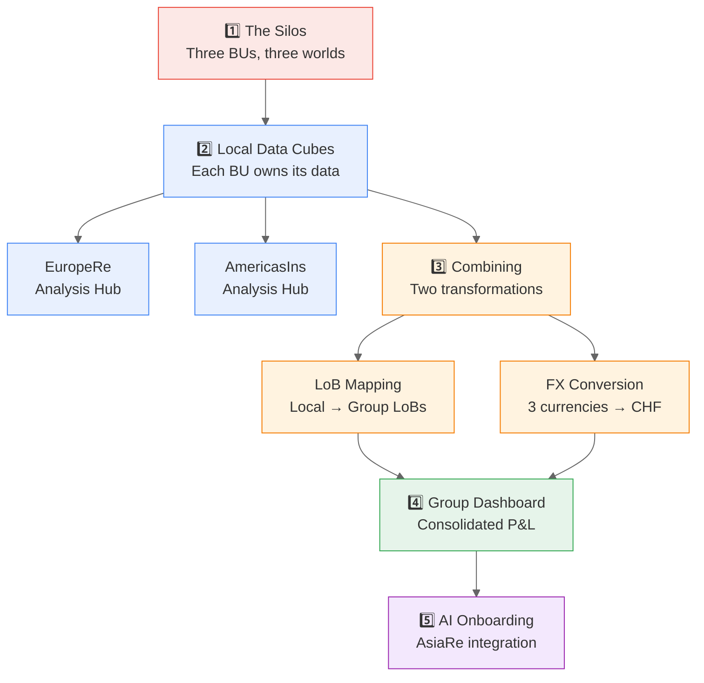

What we'll cover in the next ~30 minutes — following the journey from three siloed business units to a unified, governed data mesh.

---

## 1. The Silos

- **Show:** [FutuRe Home](@FutuRe) — three disparate BUs with different systems, databases, spreadsheets
- **Key Takeaway:** This is every insurance group's reality — fragmented data, no single source of truth

---

## 2. Local Data Cubes

- **Stops:** [EuropeRe Analysis](@FutuRe/EuropeRe/Analysis/AnnualReport) → [EuropeRe LoBs](@FutuRe/EuropeRe/LineOfBusiness/Search)
- **Show:** Navigate a BU, explore its local P&L structure, 8 Lines of Business, charts & KPIs
- **Key Takeaway:** Each BU owns its data as a local data product — domain ownership in practice

---

## 3. Combining: LoB Mapping + FX Conversion

- **Stops:** [LoB Mapping](@FutuRe/LobMapping) → [EuropeRe Mapping Rules](@FutuRe/EuropeRe/TransactionMapping/MappingRules) → [FX Conversion](@FutuRe/FxConversion)
- **Show:** How local product lines map to 10 group categories with percentage splits. How three currencies convert to CHF with Plan vs. Actuals modes
- **Key Takeaway:** Virtual aggregation — no copies, instant recalculation. Both transformations are governed data products with SLOs

---

## 4. Group Dashboard

- **Stops:** [Group Report](@FutuRe/Analysis/AnnualReport)
- **Show:** Consolidated P&L across all BUs. Switch currency modes. Drill into Lines of Business. Compare Estimate vs. Actual
- **Key Takeaway:** One view, assembled live from three independent data domains — change a number in EuropeRe, see it instantly in the group

---

## 5. AI Onboarding

- **Show:** AI agent reads an email thread between actuaries, extracts LoB mapping percentages, generates governance document, and integrates AsiaRe into the group
- **Key Takeaway:** Onboarding a new BU drops from months to minutes with AI-assisted data extraction. The result is governed, versioned, and auditable — not a spreadsheet attachment

---

## Governance Stops (if time permits)

- [Group Lines of Business](@FutuRe/LineOfBusiness/Search) — SLOs, change request process, approval authority
- [Exchange Rate Hub](@FutuRe/ExchangeRate) — Publication schedule, rate sources, freeze policy
- [Why Data Mesh?](@FutuRe/WhyDataMesh) — The principles behind this architecture
