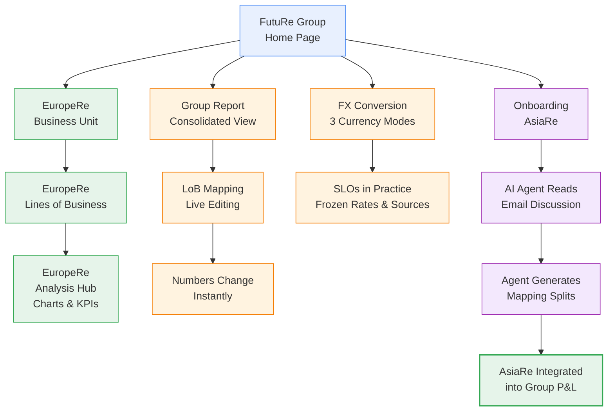

# Demo Roadmap

What we'll cover in the next ~30 minutes.

---

| Arm | Stops | What We Show | Key Takeaway |
|-----|-------|-------------|-------------|
| **Explore** | [FutuRe Home](@FutuRe) → [EuropeRe](@FutuRe/EuropeRe) → [LoBs](@FutuRe/EuropeRe/LineOfBusiness/Search) → [Analysis Hub](@FutuRe/EuropeRe/Analysis/AnnualReport) | Navigate a BU, its local product lines, and profitability charts | Each BU owns its data and analytics — domain ownership in practice |
| **Consolidation** | [Group Report](@FutuRe/Analysis/AnnualReport) → [LoB Mapping](@FutuRe/LobMapping) | View consolidated P&L, then edit a mapping rule live — watch numbers update | Virtual aggregation — no copies, instant recalculation |
| **FX & SLOs** | [FX Conversion](@FutuRe/FxConversion) | Switch between Plan CHF, Actuals CHF, and Original Currency modes | Exchange rates are frozen monthly with clear ownership — SLOs guarantee data quality |
| **AI Onboarding** | AsiaRe → AI Agent → Mapping Splits | AI agent reads an email thread between actuaries, extracts LoB mapping percentages, and integrates AsiaRe into the group | Onboarding a new BU drops from months to minutes with AI-assisted data extraction |
