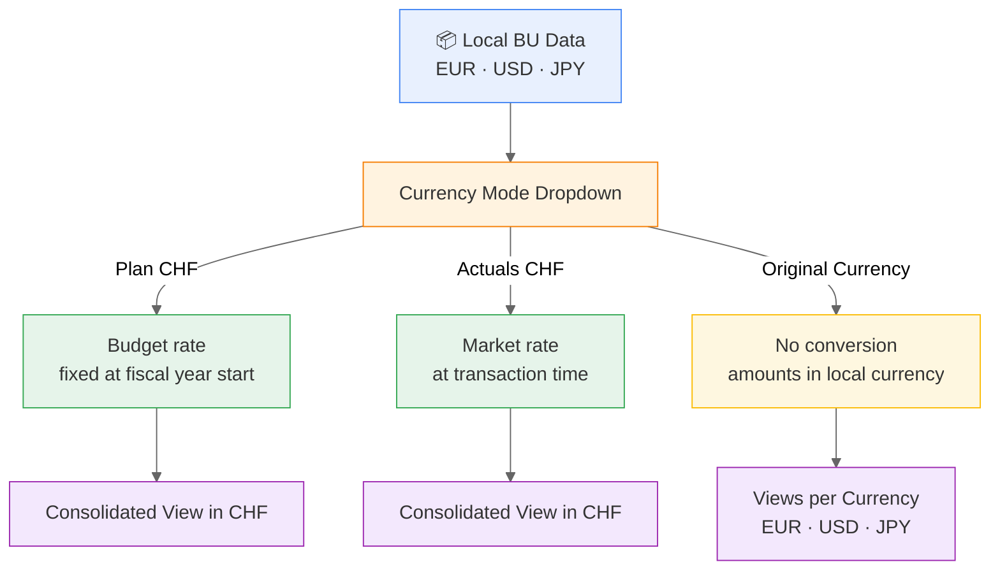
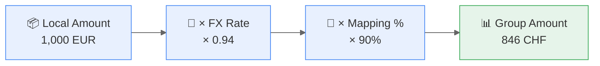
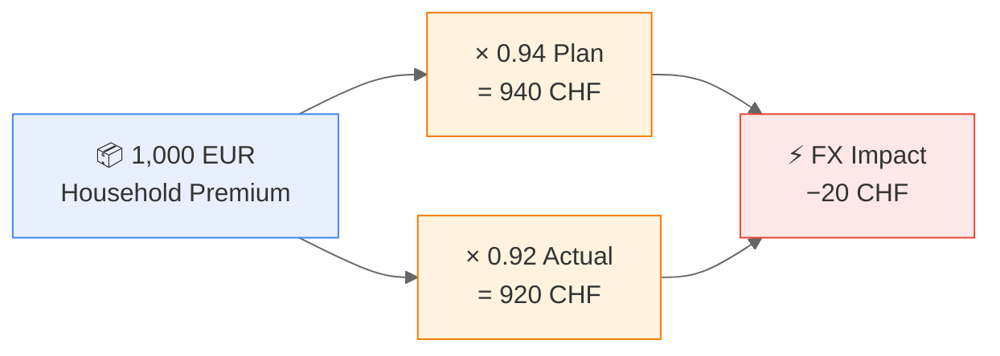

# The Problem: Three Currencies, One Report

FutuRe's three business units operate in three different currencies:

| Business Unit | Currency | Region |
|---------------|----------|--------|
| [EuropeRe](@FutuRe/EuropeRe) | EUR | EMEA |
| [AmericasIns](@FutuRe/AmericasIns) | USD | Americas |
| [AsiaRe](@FutuRe/AsiaRe) | JPY | APAC |

The group reports in **CHF**. Converting local amounts to a common reporting currency must be transparent, auditable, and switchable between budget rates and market rates — without recalculating anything manually.

---

# Three Viewing Modes

Non-technical users pick a mode from a single toolbar dropdown. No spreadsheet exports, no manual recalculation — MeshWeaver applies the conversion at query time.

Switching modes instantly recalculates all charts, tables, and KPIs across the dashboard. The difference between Plan CHF and Actuals CHF reveals the **FX impact** on reported numbers — without changing the underlying data.

---

# The FX Hub: Exchange Rates as a Data Product

Exchange rates are not buried in a config file. They are a **dedicated data product** with its own hub, clear ownership, and governance.

[Browse the Exchange Rate Hub →](https://localhost:7122/FutuRe/ExchangeRate)

## The Rates

Four currency pairs, two rates each. The plan rate is fixed at the start of the fiscal year; the actual rate reflects market conditions.

| From | To | Plan Rate | Actual Rate | Variance |
|------|----|----------:|------------:|---------:|
| EUR | CHF | 0.94 | 0.92 | -0.02 |
| USD | CHF | 0.89 | 0.87 | -0.02 |
| JPY | CHF | 0.006 | 0.0055 | -0.0005 |
| CHF | CHF | 1.00 | 1.00 | 0.00 |

---

# Service-Level Objectives

The [Exchange Rate hub](@FutuRe/ExchangeRate) is governed with clear SLOs:

| SLO | Commitment |
|-----|------------|
| **Publication deadline** | 1 business day after month-end |
| **Rate source** | ECB reference rates (EUR), Bloomberg (USD, JPY) |
| **Owner** | Group Treasury, Zurich |
| **Freeze policy** | Rates frozen on last business day of month — no retrospective changes |
| **Change requests** | Via Group Treasury portal, minimum 5 business days notice |
| **Audit trail** | Every rate carries effective date, source, and sign-off |
| **Fallback policy** | Missing or late rates **block** downstream consolidation — no silent fallback to stale values |

These SLOs turn currency conversion from a manual spreadsheet ritual into a governed, observable data product.

---

# The Conversion Pipeline

Every local amount flows through a transparent calculation: take the local value, multiply by the FX rate, then apply the LoB mapping percentage. The result lands in the group P&L in CHF.

**Example:** EuropeRe records 1,000 EUR in Household. At the plan rate (0.94), that's 940 CHF. The Household → Property mapping is 90%, so **846 CHF flows to the group's Property line**. The remaining 10% (94 CHF) goes to Casualty.

---

# Plan vs. Actuals: Revealing FX Impact

Switching between Plan and Actuals mode reveals how currency movements affect reported results — without changing the underlying data.

If the EUR weakens from 0.94 to 0.92, the same 1,000 EUR premium is worth 920 CHF instead of 940 CHF. That 20 CHF difference is pure FX impact — fully traceable to the exchange rate source and freeze date.

---

# Why This Matters

- **IFRS 17 / IAS 21** require transparent currency translation — auditors need to trace any CHF amount back to its source currency and rate
- The entire FX configuration is **four records** — one per currency pair with plan and actual rates
- Conversion is applied **at query time** — no pre-materialized currency tables, no nightly recalculation
- The same pattern scales to any number of currencies — adding a fifth BU in BRL only requires one new exchange rate record
- Rate governance ensures **no silent staleness** — missing rates block consolidation rather than producing wrong numbers

---

# Explore Further

- [Group Profitability Dashboard](@FutuRe/Analysis/AnnualReport) — try the currency mode dropdown
- [Exchange Rate Hub](@FutuRe/ExchangeRate) — the four rate records with SLOs
- [LoB Mapping](@FutuRe/LobMapping) — the other half of the consolidation story
- [Back to FutuRe overview](@FutuRe)
