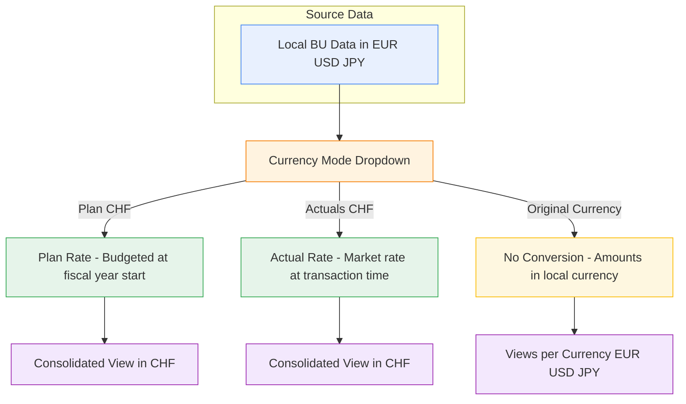
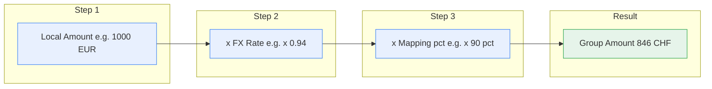
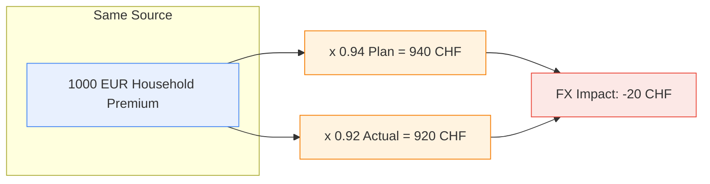

FutuRe's three business units operate in three different currencies — EUR, USD, and JPY. The group reports in CHF. Converting local amounts to a common reporting currency is essential for consolidated analysis, but the conversion needs to be transparent, auditable, and switchable between budget rates and market rates.

---

## Three Viewing Modes

Non-technical users pick a mode from a single dropdown. No spreadsheet exports, no manual recalculation — MeshWeaver applies the conversion at query time.

---

## The Exchange Rates

Four currency pairs, two rates each. The plan rate is fixed at the start of the fiscal year; the actual rate reflects market conditions. The difference between Plan CHF and Actuals CHF reveals the FX impact on reported numbers.

| From | To  | Plan Rate | Actual Rate | Variance |
|------|-----|----------:|------------:|---------:|
| EUR  | CHF |      0.94 |        0.92 |    -0.02 |
| USD  | CHF |      0.89 |        0.87 |    -0.02 |
| JPY  | CHF |     0.006 |      0.0055 |  -0.0005 |
| CHF  | CHF |      1.00 |        1.00 |     0.00 |

---

## The Conversion Pipeline

Every local amount flows through a transparent three-step calculation: take the local value, multiply by the FX rate, then apply the LoB mapping percentage. The result lands in the group P&L in CHF.

**Example**: EuropeRe records 1,000 EUR in its Household LoB. At the plan rate (0.94), that's 940 CHF. The Household → Property mapping is 90%, so 846 CHF flows to the group's Property line. The remaining 10% (94 CHF) goes to Casualty.

---

## Plan vs Actuals: Revealing FX Impact

Switching between Plan and Actuals mode reveals how currency movements affect reported results — without changing the underlying data. If the EUR weakens from 0.94 to 0.92, the same 1,000 EUR premium is worth 920 CHF instead of 940 CHF. That 20 CHF difference is pure FX impact.

---

## Rate Governance & SLOs

Exchange rates follow a strict governance process. Each rate is **frozen on the last business day of the month** — the responsible treasury team publishes it, and no retrospective changes are allowed once the period closes.

Every rate record carries:

- **Effective date** — the month-end snapshot date
- **Source** — where the rate was obtained (e.g. ECB, Bloomberg, internal treasury)
- **Owner** — the team or person accountable for the rate (e.g. Group Treasury)

This metadata makes every conversion fully auditable: for any CHF amount in the consolidated P&L, you can trace the exact rate, when it was fixed, where it came from, and who signed off on it.

**Service-Level Objectives (SLOs)** enforce timeliness and quality:

- Rates must be published within **1 business day** after month-end
- Each rate must reference a verifiable external source
- Missing or late rates block downstream consolidation — the system will not silently fall back to stale values

These SLOs turn currency conversion from a manual spreadsheet ritual into a governed, observable data product.

---

## Why This Matters

- **IFRS 17 / IAS 21** require transparent currency translation in insurance reporting — auditors need to trace any CHF amount back to its source currency and rate
- The entire FX configuration is **four JSON records** — one per currency pair with plan and actual rates
- Conversion is applied **at query time** — no pre-materialized currency tables, no nightly recalculation jobs
- The toolbar dropdown is reactive: switching modes instantly recalculates all charts, tables, and KPIs across the dashboard
- The same pattern scales to any number of currencies — adding a fifth BU in BRL only requires one new exchange rate record

---

## Explore Further

- [Group Profitability Dashboard](@FutuRe/Analysis/AnnualReport) — try the currency mode dropdown
- [Exchange Rate definitions](@FutuRe/ExchangeRate) — the four rate records
- [Back to FutuRe overview](@FutuRe)
