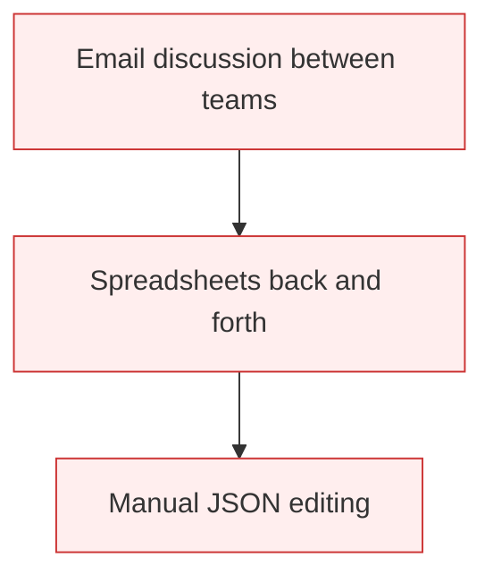
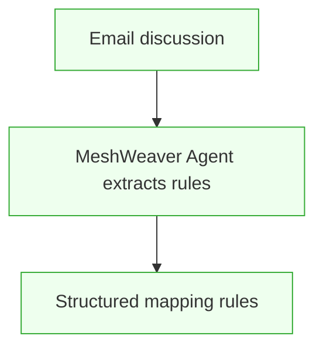
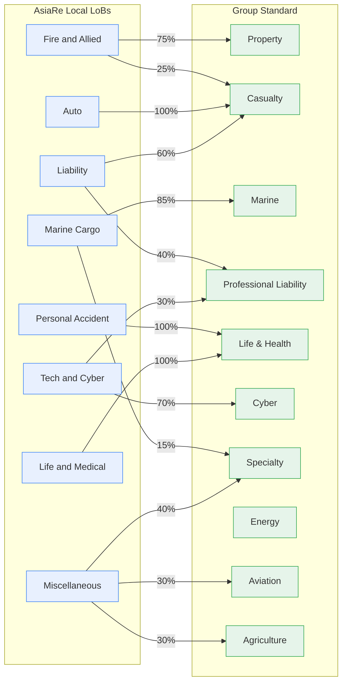
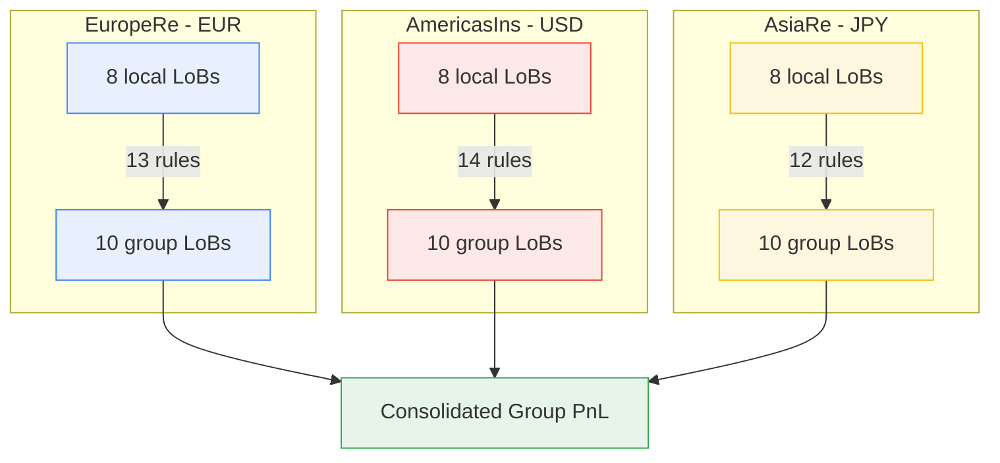

When an insurance group acquires a new subsidiary, one of the hardest tasks isn't signing the deal — it's integrating data. The new unit writes business under its own product classification, but the group needs a single consolidated view.

At FutuRe, **EuropeRe** and **AmericasIns** already map their local Lines of Business to 10 group-level categories. Now **AsiaRe** needs the same treatment. Here's how MeshWeaver makes that possible.

---

## The Challenge

Every business unit has its own product taxonomy. EuropeRe calls it "Household", AmericasIns calls it "Homeowners" — both map to the group's "Property" line, but at different percentages. Traditionally, building these mappings means months of spreadsheet work between actuaries, product owners, and IT teams.

**Old Approach**

**With MeshWeaver**

---

## How the Mapping Works

Each local Line of Business splits into one or more group categories by percentage. The percentages always sum to 100% per local LoB — ensuring no premium is lost or double-counted.

---

## Three BUs, One Pattern

EuropeRe and AmericasIns already follow this exact pattern. AsiaRe is the third — different local names, same structural approach.

---

## Why This Matters

- **Data standardization** is consistently ranked as a top challenge in reinsurance onboarding — mapping local products to a group taxonomy is where months of effort go
- MeshWeaver agents can read an unstructured email thread and propose structured percentage splits, reducing manual effort from weeks to hours
- The resulting rules are **auditable** — every split percentage is versioned and reviewable directly in the platform
- Mappings are applied **virtually at query time** — no data is physically copied from the BU to the group level
- Adding a fourth BU tomorrow follows the same pattern: define local LoBs, create mapping rules, and the group view updates automatically

---

## Explore Further

- [EuropeRe Mapping Rules](@FutuRe/EuropeRe/TransactionMapping/MappingRules) — 13 rules across 8 LoBs
- [AmericasIns Mapping Rules](@FutuRe/AmericasIns/TransactionMapping/MappingRules) — 14 rules across 8 LoBs
- [AsiaRe Mapping Rules](@FutuRe/AsiaRe/TransactionMapping/MappingRules) — the newest addition
- [Group Lines of Business](@FutuRe/LineOfBusiness/Search) — the 10 standard categories
