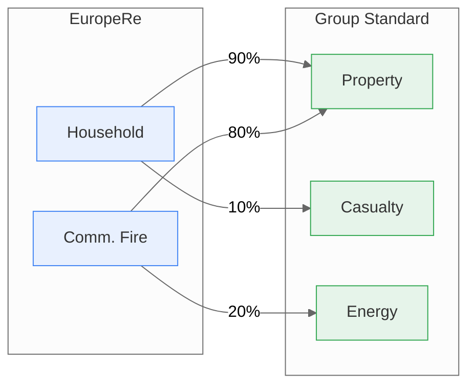
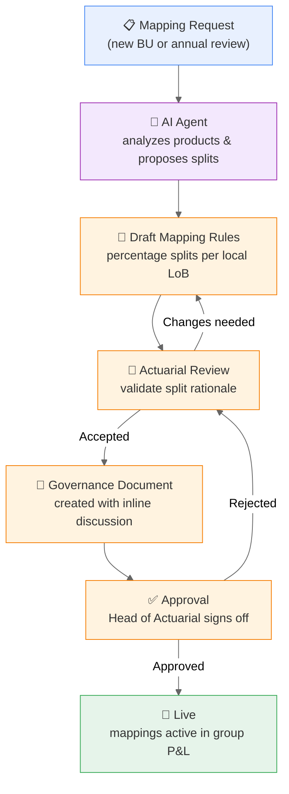

# The Problem: Every BU Speaks a Different Language

Each business unit classifies its products differently. EuropeRe writes "Household" policies. AmericasIns writes "Homeowners." AsiaRe calls it "Fire and Allied." They all cover similar risks — but the group needs **one consolidated taxonomy** to report on.

---

## Local Lines of Business

Each BU has 8 local product lines, reflecting its market and regulatory environment:

### EuropeRe — 8 LoBs (EUR)

| Local LoB | Risk Focus |
|-----------|------------|
| [Household](@FutuRe/EuropeRe/LineOfBusiness/HOUSEHOLD) | Residential property & contents |
| [Motor](@FutuRe/EuropeRe/LineOfBusiness/MOTOR) | Auto liability & comprehensive |
| [Commercial Fire](@FutuRe/EuropeRe/LineOfBusiness/COMM_FIRE) | Commercial property & fire |
| [Liability](@FutuRe/EuropeRe/LineOfBusiness/LIABILITY) | General & professional liability |
| [Transport](@FutuRe/EuropeRe/LineOfBusiness/TRANSPORT) | Marine cargo & hull |
| [Technology Risk](@FutuRe/EuropeRe/LineOfBusiness/TECH_RISK) | Cyber & technology E&O |
| [Life & Health](@FutuRe/EuropeRe/LineOfBusiness/LIFE_HEALTH_EU) | Life, health & accident |
| [Specialty & Aviation](@FutuRe/EuropeRe/LineOfBusiness/SPECIALTY_AVTN) | Aviation, space & specialty |

### AmericasIns — 8 LoBs (USD)

| Local LoB | Risk Focus |
|-----------|------------|
| [Homeowners](@FutuRe/AmericasIns/LineOfBusiness/HOMEOWNERS) | Residential property & liability |
| [Workers Comp](@FutuRe/AmericasIns/LineOfBusiness/WORKERS_COMP) | Workplace injury coverage |
| [Commercial Lines](@FutuRe/AmericasIns/LineOfBusiness/COMMERCIAL) | Multi-line commercial packages |
| [Energy & Mining](@FutuRe/AmericasIns/LineOfBusiness/ENERGY_MINING) | Energy sector risks |
| [Life & Annuity](@FutuRe/AmericasIns/LineOfBusiness/LIFE_ANN) | Life insurance & annuities |
| [Cyber & Technology](@FutuRe/AmericasIns/LineOfBusiness/CYBER_TECH) | Cyber liability & tech E&O |
| [Specialty & Aviation](@FutuRe/AmericasIns/LineOfBusiness/SPECIALTY_AVTN_US) | Aviation & specialty |
| [Agriculture](@FutuRe/AmericasIns/LineOfBusiness/AGRICULTURE) | Crop & livestock coverage |

---

## The Group Standard: 10 Lines of Business

The group defines [10 standard categories](@FutuRe/LineOfBusiness/Search) that every BU maps to:

| # | Group LoB | Covers |
|---|-----------|--------|
| 1 | [Property](@FutuRe/LineOfBusiness/PROP) | Buildings, contents, catastrophe |
| 2 | [Casualty](@FutuRe/LineOfBusiness/CAS) | General liability, auto, workers comp |
| 3 | [Marine](@FutuRe/LineOfBusiness/MARINE) | Cargo, hull, marine liability |
| 4 | [Energy](@FutuRe/LineOfBusiness/ENRG) | Oil & gas, mining, renewables |
| 5 | [Life & Health](@FutuRe/LineOfBusiness/LH) | Life, health, accident |
| 6 | [Cyber](@FutuRe/LineOfBusiness/CYBER) | Data breach, ransomware, tech E&O |
| 7 | [Professional Liability](@FutuRe/LineOfBusiness/PROF) | D&O, E&O, professional indemnity |
| 8 | [Specialty](@FutuRe/LineOfBusiness/SPEC) | Space, political risk, fine art |
| 9 | [Aviation](@FutuRe/LineOfBusiness/AVTN) | Airlines, general aviation, airports |
| 10 | [Agriculture](@FutuRe/LineOfBusiness/AGRI) | Crop, livestock, forestry |

---

## The Mapping: Percentage Splits

Each local LoB splits into one or more group categories. Percentages always sum to 100% per local LoB — ensuring no premium is lost or double-counted.

Full mapping tables with governance discussion:

- [EuropeRe Mapping Rules](@FutuRe/EuropeRe/TransactionMapping/MappingRules) — 13 rules across 8 LoBs
- [AmericasIns Mapping Rules](@FutuRe/AmericasIns/TransactionMapping/MappingRules) — 14 rules across 8 LoBs
- [AsiaRe Mapping Rules](@FutuRe/AsiaRe/TransactionMapping/MappingRules) — 12 rules across 8 LoBs

---

## The Mapping Process

Creating and updating LoB mappings follows a governed workflow. For new BUs, AI agents accelerate the initial proposal; for existing BUs, the annual review cycle ensures mappings stay current.

---

## Service-Level Objectives

The [Group Lines of Business hub](@FutuRe/LineOfBusiness/Search) is a governed data product with clear SLOs:

| SLO | Commitment |
|-----|------------|
| **Change request deadline** | 60 days before fiscal year start |
| **Review cycle** | Annual, led by Group Actuarial |
| **Approval authority** | Head of Group Actuarial |
| **Contact** | group-actuarial@future-group.com |
| **Update frequency** | Once per fiscal year (effective Jan 1) |
| **Percentage integrity** | All local LoB splits must sum to 100% |
| **Mapping documentation** | Each BU must maintain a governance doc with actuarial rationale |

---

## Why This Matters

- **Data standardization** is consistently ranked as a top challenge in reinsurance onboarding — mapping local products to a group taxonomy is where months of effort go
- MeshWeaver agents reduce initial mapping creation from **weeks to hours** by reading unstructured discussions and proposing structured splits
- Mappings are applied **virtually at query time** — no data is physically copied
- Every split percentage is **versioned, auditable, and governed** with inline comments
- Adding a fourth BU follows the same pattern: define local LoBs, create mapping rules, get approval — the group view updates automatically

---

## Explore Further

- [Group Lines of Business](@FutuRe/LineOfBusiness/Search) — the 10 standard categories
- [Group Profitability Dashboard](@FutuRe/Analysis/AnnualReport) — see mappings in action
- [Back to FutuRe overview](@FutuRe)
