## Data Mesh Fundamentals

Each team owns and publishes its own data as a product — no central bottleneck, no waiting for the platform team.

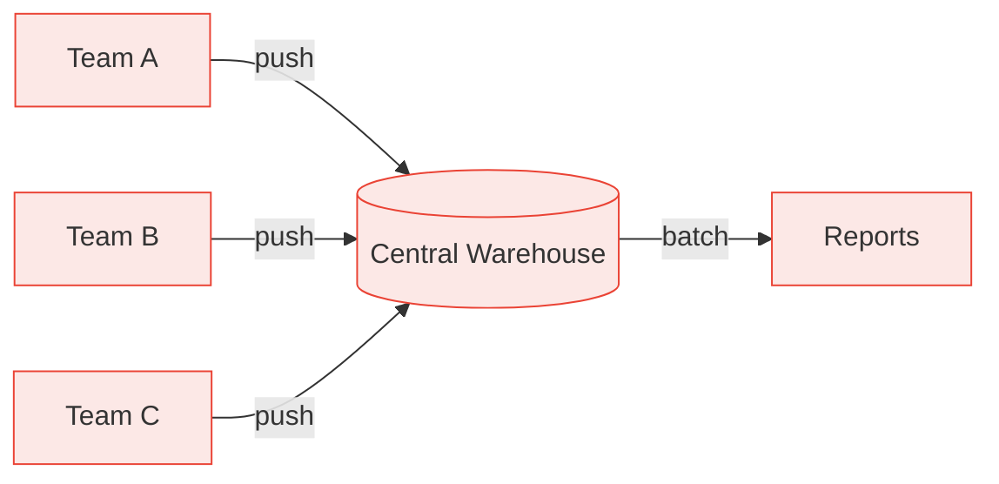

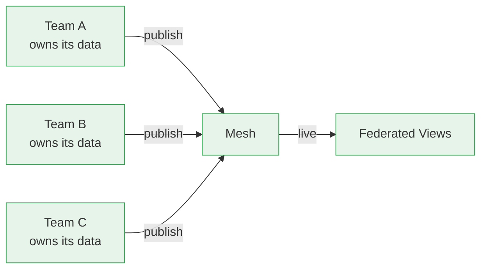

---

## From MBOs to SLOs

Each data product defines, monitors, and is accountable for its own quality guarantees — decentralised accountability replaces top-down cascade.

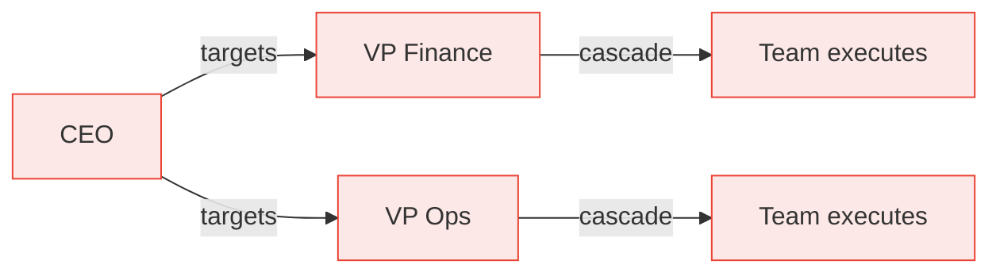

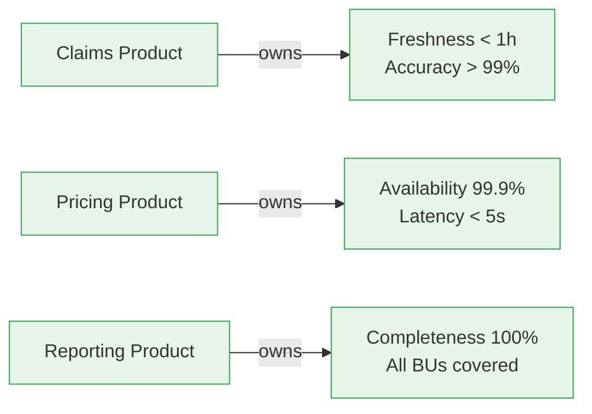

---

## Data is Addressed, Not Copied

Data stays where it lives. Consumers reference it by address — `@FutuRe/EuropeRe/Analysis` — zero copies, zero staleness, zero reconciliation.

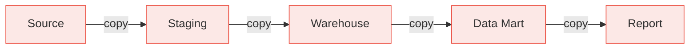

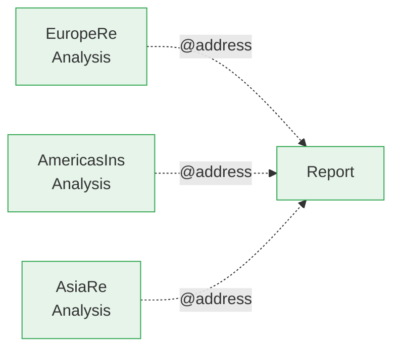

---

## Virtual Transformations

Transformations are virtual — computed on the fly as reactive streams. Source changes propagate instantly. Only materialise when absolutely necessary.

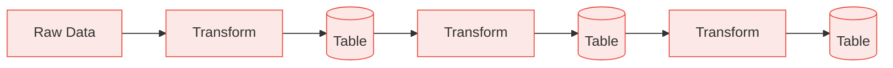

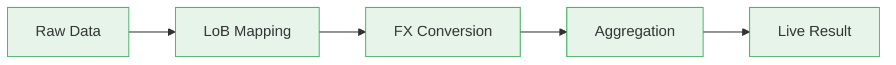

---

## Governance & Auditability

Every change passes through checkpoints. Hierarchical access control — who approved what, when — fully documented and auditable.

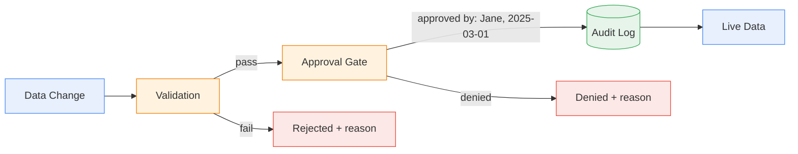

---

## Types as Data

Data types are themselves data — stored, versioned, and queryable in the mesh. Change a schema or add a view without redeploying.

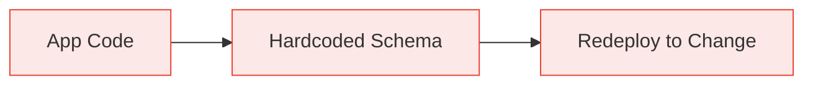

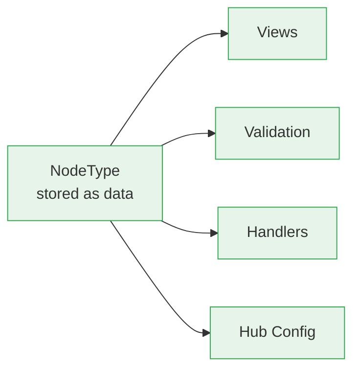

---

## AI Agents as First-Class Citizens

AI agents discover schemas, query data, and execute operations through the same mesh APIs. External tools connect via MCP.

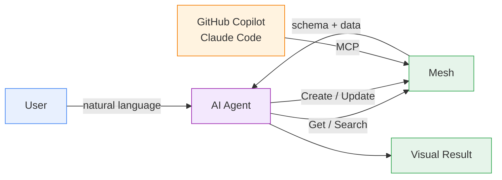

---

## Explore Further

- [FutuRe overview](@FutuRe) — see these principles in action
- [Data Distribution story](@FutuRe/DataDistribution) — how data stays where it belongs
- [FX Conversion story](@FutuRe/FxConversion) — SLOs applied to exchange rates
- [LoB Mapping story](@FutuRe/LobMapping) — governance in onboarding
- [Demo Roadmap](@FutuRe/DemoRoadmap) — what we'll cover today
