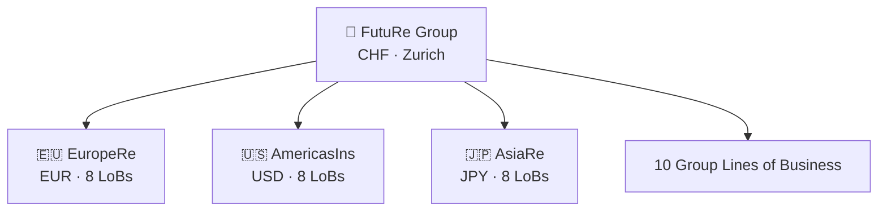

Welcome to **FutuRe Insurance & Reinsurance** — a fictional insurance group built to showcase what MeshWeaver can do. FutuRe has three business units spanning Europe, the Americas, and Asia, each writing business in their own local currencies and product classifications. The group consolidates everything into a unified view — without copying a single row of data.

## The FutuRe Group at a Glance

## What You'll See

### 1. Onboarding a New Business Unit

When FutuRe acquires AsiaRe, the new unit's local product lines need to map to the group standard. Traditionally a multi-month spreadsheet exercise — here, a MeshWeaver agent reads an email discussion and proposes structured mapping rules automatically.

[Explore the LoB Mapping story →](@FutuRe/LobMapping)

---

### 2. Multi-Currency Consolidation

Three currencies, two conversion modes, one dropdown. Non-technical users switch between Plan CHF, Actuals CHF, and Original Currency — MeshWeaver handles the math at query time with four exchange rate definitions.

[Explore the FX Conversion story →](@FutuRe/FxConversion)

---

### 3. Data Where It Belongs

Each business unit owns its data. The group view is assembled virtually — no ETL pipelines, no nightly batch jobs, no stale copies. Changes appear instantly.

[Explore the Data Distribution story →](@FutuRe/DataDistribution)

---

## Report

@("FutuRe/Analysis/AnnualReport")

## Governance

Each business unit maintains its own mapping rules document with an inline governance discussion — actuarial rationale for split percentages, validation requirements, and the annual review cycle — captured as comments from the team.

- [EuropeRe Mapping Rules](@FutuRe/EuropeRe/TransactionMapping/MappingRules) — 13 split rules across 8 local LoBs
- [AmericasIns Mapping Rules](@FutuRe/AmericasIns/TransactionMapping/MappingRules) — 14 split rules across 8 local LoBs
