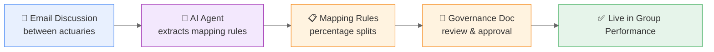

Welcome to **FutuRe Insurance & Reinsurance** — a fictional insurance group that demonstrates how MeshWeaver turns fragmented data into a governed, composable data mesh.

---

# Each Business Unit — A Separate World

FutuRe has three business units across three continents. Each one grew independently — different systems, different databases, different spreadsheets. Same departments, completely different technology.

<svg xmlns="http://www.w3.org/2000/svg" viewBox="0 0 860 320" style="width:100%;max-width:860px;display:block;margin:24px auto;border-radius:16px;padding:12px;">
  <rect x="5" y="5" width="270" height="295" rx="12" fill="#dce8f5"/>
  <rect x="18" y="15" width="244" height="34" rx="10" fill="#1565c0"/>
  <text x="140" y="37" text-anchor="middle" fill="#fff" font-family="sans-serif" font-size="13" font-weight="700">EuropeRe — Zurich</text>
  <text x="22" y="72" fill="#1565c0" font-family="sans-serif" font-size="10" font-weight="700">Underwriting</text>
  <rect x="22" y="78" width="108" height="24" rx="6" fill="#78909c"/>
  <text x="76" y="94" text-anchor="middle" fill="#fff" font-family="sans-serif" font-size="10" font-weight="600">Oracle DB</text>
  <rect x="140" y="78" width="108" height="24" rx="6" fill="#78909c"/>
  <text x="194" y="94" text-anchor="middle" fill="#fff" font-family="sans-serif" font-size="10" font-weight="600">Excel</text>
  <text x="22" y="122" fill="#c62828" font-family="sans-serif" font-size="10" font-weight="700">Risk</text>
  <rect x="22" y="128" width="108" height="24" rx="6" fill="#78909c"/>
  <text x="76" y="144" text-anchor="middle" fill="#fff" font-family="sans-serif" font-size="10" font-weight="600">SAS</text>
  <rect x="140" y="128" width="108" height="24" rx="6" fill="#78909c"/>
  <text x="194" y="144" text-anchor="middle" fill="#fff" font-family="sans-serif" font-size="10" font-weight="600">R Studio</text>
  <text x="22" y="172" fill="#2e7d32" font-family="sans-serif" font-size="10" font-weight="700">Finance</text>
  <rect x="22" y="178" width="108" height="24" rx="6" fill="#78909c"/>
  <text x="76" y="194" text-anchor="middle" fill="#fff" font-family="sans-serif" font-size="10" font-weight="600">SAP</text>
  <rect x="140" y="178" width="108" height="24" rx="6" fill="#78909c"/>
  <text x="194" y="194" text-anchor="middle" fill="#fff" font-family="sans-serif" font-size="10" font-weight="600">Power BI</text>
  <text x="22" y="222" fill="#7e57c2" font-family="sans-serif" font-size="10" font-weight="700">Reserving</text>
  <rect x="22" y="228" width="108" height="24" rx="6" fill="#78909c"/>
  <text x="76" y="244" text-anchor="middle" fill="#fff" font-family="sans-serif" font-size="10" font-weight="600">Access DB</text>
  <rect x="140" y="228" width="108" height="24" rx="6" fill="#78909c"/>
  <text x="194" y="244" text-anchor="middle" fill="#fff" font-family="sans-serif" font-size="10" font-weight="600">VBA Macros</text>
  <rect x="295" y="5" width="270" height="295" rx="12" fill="#fce4ec"/>
  <rect x="308" y="15" width="244" height="34" rx="10" fill="#c62828"/>
  <text x="430" y="37" text-anchor="middle" fill="#fff" font-family="sans-serif" font-size="13" font-weight="700">AmericasIns — New York</text>
  <text x="312" y="72" fill="#1565c0" font-family="sans-serif" font-size="10" font-weight="700">Underwriting</text>
  <rect x="312" y="78" width="108" height="24" rx="6" fill="#78909c"/>
  <text x="366" y="94" text-anchor="middle" fill="#fff" font-family="sans-serif" font-size="10" font-weight="600">Salesforce</text>
  <rect x="430" y="78" width="108" height="24" rx="6" fill="#78909c"/>
  <text x="484" y="94" text-anchor="middle" fill="#fff" font-family="sans-serif" font-size="10" font-weight="600">SharePoint</text>
  <text x="312" y="122" fill="#c62828" font-family="sans-serif" font-size="10" font-weight="700">Risk</text>
  <rect x="312" y="128" width="108" height="24" rx="6" fill="#78909c"/>
  <text x="366" y="144" text-anchor="middle" fill="#fff" font-family="sans-serif" font-size="10" font-weight="600">Data Lake</text>
  <rect x="430" y="128" width="108" height="24" rx="6" fill="#78909c"/>
  <text x="484" y="144" text-anchor="middle" fill="#fff" font-family="sans-serif" font-size="10" font-weight="600">Python</text>
  <text x="312" y="172" fill="#2e7d32" font-family="sans-serif" font-size="10" font-weight="700">Finance</text>
  <rect x="312" y="178" width="108" height="24" rx="6" fill="#78909c"/>
  <text x="366" y="194" text-anchor="middle" fill="#fff" font-family="sans-serif" font-size="10" font-weight="600">SQL Server</text>
  <rect x="430" y="178" width="108" height="24" rx="6" fill="#78909c"/>
  <text x="484" y="194" text-anchor="middle" fill="#fff" font-family="sans-serif" font-size="10" font-weight="600">Excel</text>
  <text x="312" y="222" fill="#7e57c2" font-family="sans-serif" font-size="10" font-weight="700">Reserving</text>
  <rect x="312" y="228" width="108" height="24" rx="6" fill="#78909c"/>
  <text x="366" y="244" text-anchor="middle" fill="#fff" font-family="sans-serif" font-size="10" font-weight="600">MongoDB</text>
  <rect x="430" y="228" width="108" height="24" rx="6" fill="#78909c"/>
  <text x="484" y="244" text-anchor="middle" fill="#fff" font-family="sans-serif" font-size="10" font-weight="600">REST APIs</text>
  <rect x="585" y="5" width="270" height="295" rx="12" fill="#f3e5f5"/>
  <rect x="598" y="15" width="244" height="34" rx="10" fill="#7e57c2"/>
  <text x="720" y="37" text-anchor="middle" fill="#fff" font-family="sans-serif" font-size="13" font-weight="700">AsiaRe — Tokyo</text>
  <text x="602" y="72" fill="#1565c0" font-family="sans-serif" font-size="10" font-weight="700">Underwriting</text>
  <rect x="602" y="78" width="108" height="24" rx="6" fill="#78909c"/>
  <text x="656" y="94" text-anchor="middle" fill="#fff" font-family="sans-serif" font-size="10" font-weight="600">PostgreSQL</text>
  <rect x="720" y="78" width="108" height="24" rx="6" fill="#78909c"/>
  <text x="774" y="94" text-anchor="middle" fill="#fff" font-family="sans-serif" font-size="10" font-weight="600">Excel</text>
  <text x="602" y="122" fill="#c62828" font-family="sans-serif" font-size="10" font-weight="700">Risk</text>
  <rect x="602" y="128" width="108" height="24" rx="6" fill="#78909c"/>
  <text x="656" y="144" text-anchor="middle" fill="#fff" font-family="sans-serif" font-size="10" font-weight="600">CSV Feeds</text>
  <rect x="720" y="128" width="108" height="24" rx="6" fill="#78909c"/>
  <text x="774" y="144" text-anchor="middle" fill="#fff" font-family="sans-serif" font-size="10" font-weight="600">Python</text>
  <text x="602" y="172" fill="#2e7d32" font-family="sans-serif" font-size="10" font-weight="700">Finance</text>
  <rect x="602" y="178" width="108" height="24" rx="6" fill="#78909c"/>
  <text x="656" y="194" text-anchor="middle" fill="#fff" font-family="sans-serif" font-size="10" font-weight="600">Local ERP</text>
  <rect x="720" y="178" width="108" height="24" rx="6" fill="#78909c"/>
  <text x="774" y="194" text-anchor="middle" fill="#fff" font-family="sans-serif" font-size="10" font-weight="600">Excel</text>
  <text x="602" y="222" fill="#7e57c2" font-family="sans-serif" font-size="10" font-weight="700">Reserving</text>
  <rect x="602" y="228" width="108" height="24" rx="6" fill="#78909c"/>
  <text x="656" y="244" text-anchor="middle" fill="#fff" font-family="sans-serif" font-size="10" font-weight="600">Spreadsheets</text>
  <rect x="720" y="228" width="108" height="24" rx="6" fill="#78909c"/>
  <text x="774" y="244" text-anchor="middle" fill="#fff" font-family="sans-serif" font-size="10" font-weight="600">FTP</text>
</svg>

Each BU writes business in its own currency (EUR, USD, JPY), classifies products with its own taxonomy, and reports on its own schedule. The group CFO wants one consolidated view. Today, that means weeks of reconciliation.

---

# Step 1: Local Data Cubes

Instead of ripping out existing systems, each BU creates a **local data product** — a structured data cube with its own Lines of Business, its own currency, and its own Performance.

<svg xmlns="http://www.w3.org/2000/svg" viewBox="0 0 860 240" style="width:100%;max-width:860px;display:block;margin:24px auto;border-radius:16px;padding:12px;">
  <defs><marker id="ad" markerWidth="7" markerHeight="5" refX="7" refY="2.5" orient="auto"><path d="M0,0 L7,2.5 L0,5" fill="currentColor" fill-opacity=".3"/></marker></defs>
  <rect x="62" y="5" width="76" height="26" rx="6" fill="#1e88e5"/>
  <text x="100" y="22" text-anchor="middle" fill="#fff" font-family="sans-serif" font-size="10" font-weight="600">Underwriting</text>
  <rect x="142" y="5" width="76" height="26" rx="6" fill="#e53935"/>
  <text x="180" y="22" text-anchor="middle" fill="#fff" font-family="sans-serif" font-size="10" font-weight="600">Risk</text>
  <rect x="62" y="35" width="76" height="26" rx="6" fill="#43a047"/>
  <text x="100" y="52" text-anchor="middle" fill="#fff" font-family="sans-serif" font-size="10" font-weight="600">Finance</text>
  <rect x="142" y="35" width="76" height="26" rx="6" fill="#8e24aa"/>
  <text x="180" y="52" text-anchor="middle" fill="#fff" font-family="sans-serif" font-size="10" font-weight="600">Reserving</text>
  <line x1="140" y1="65" x2="140" y2="95" stroke="currentColor" stroke-opacity=".3" stroke-width="1.5" marker-end="url(#ad)"/>
  <text x="158" y="84" fill="currentColor" fill-opacity=".5" font-family="sans-serif" font-size="9" font-style="italic">Cashflows</text>
  <polygon points="60,105 90,90 250,90 220,105" fill="#42a5f5"/>
  <rect x="60" y="105" width="160" height="100" fill="#1565c0"/>
  <polygon points="220,105 250,90 250,190 220,205" fill="#0d47a1"/>
  <text x="140" y="138" text-anchor="middle" fill="#fff" font-family="sans-serif" font-size="16" font-weight="700">EuropeRe</text>
  <text x="140" y="158" text-anchor="middle" fill="#fff" opacity=".85" font-family="sans-serif" font-size="10">Aggregated in local</text>
  <text x="140" y="172" text-anchor="middle" fill="#fff" opacity=".85" font-family="sans-serif" font-size="10">data language</text>
  <text x="140" y="196" text-anchor="middle" fill="#fff" opacity=".65" font-family="sans-serif" font-size="10">8 LoBs · EUR</text>
  <rect x="342" y="5" width="76" height="26" rx="6" fill="#1e88e5"/>
  <text x="380" y="22" text-anchor="middle" fill="#fff" font-family="sans-serif" font-size="10" font-weight="600">Underwriting</text>
  <rect x="422" y="5" width="76" height="26" rx="6" fill="#e53935"/>
  <text x="460" y="22" text-anchor="middle" fill="#fff" font-family="sans-serif" font-size="10" font-weight="600">Risk</text>
  <rect x="342" y="35" width="76" height="26" rx="6" fill="#43a047"/>
  <text x="380" y="52" text-anchor="middle" fill="#fff" font-family="sans-serif" font-size="10" font-weight="600">Finance</text>
  <rect x="422" y="35" width="76" height="26" rx="6" fill="#8e24aa"/>
  <text x="460" y="52" text-anchor="middle" fill="#fff" font-family="sans-serif" font-size="10" font-weight="600">Reserving</text>
  <line x1="420" y1="65" x2="420" y2="95" stroke="currentColor" stroke-opacity=".3" stroke-width="1.5" marker-end="url(#ad)"/>
  <text x="438" y="84" fill="currentColor" fill-opacity=".5" font-family="sans-serif" font-size="9" font-style="italic">Cashflows</text>
  <polygon points="340,105 370,90 530,90 500,105" fill="#ef5350"/>
  <rect x="340" y="105" width="160" height="100" fill="#c62828"/>
  <polygon points="500,105 530,90 530,190 500,205" fill="#8e0000"/>
  <text x="420" y="138" text-anchor="middle" fill="#fff" font-family="sans-serif" font-size="16" font-weight="700">AmericasIns</text>
  <text x="420" y="158" text-anchor="middle" fill="#fff" opacity=".85" font-family="sans-serif" font-size="10">Aggregated in local</text>
  <text x="420" y="172" text-anchor="middle" fill="#fff" opacity=".85" font-family="sans-serif" font-size="10">data language</text>
  <text x="420" y="196" text-anchor="middle" fill="#fff" opacity=".65" font-family="sans-serif" font-size="10">8 LoBs · USD</text>
  <rect x="622" y="5" width="76" height="26" rx="6" fill="#1e88e5"/>
  <text x="660" y="22" text-anchor="middle" fill="#fff" font-family="sans-serif" font-size="10" font-weight="600">Underwriting</text>
  <rect x="702" y="5" width="76" height="26" rx="6" fill="#e53935"/>
  <text x="740" y="22" text-anchor="middle" fill="#fff" font-family="sans-serif" font-size="10" font-weight="600">Risk</text>
  <rect x="622" y="35" width="76" height="26" rx="6" fill="#43a047"/>
  <text x="660" y="52" text-anchor="middle" fill="#fff" font-family="sans-serif" font-size="10" font-weight="600">Finance</text>
  <rect x="702" y="35" width="76" height="26" rx="6" fill="#8e24aa"/>
  <text x="740" y="52" text-anchor="middle" fill="#fff" font-family="sans-serif" font-size="10" font-weight="600">Reserving</text>
  <line x1="700" y1="65" x2="700" y2="95" stroke="currentColor" stroke-opacity=".3" stroke-width="1.5" marker-end="url(#ad)"/>
  <text x="718" y="84" fill="currentColor" fill-opacity=".5" font-family="sans-serif" font-size="9" font-style="italic">Cashflows</text>
  <polygon points="620,105 650,90 810,90 780,105" fill="#b388ff"/>
  <rect x="620" y="105" width="160" height="100" fill="#7e57c2"/>
  <polygon points="780,105 810,90 810,190 780,205" fill="#4a148c"/>
  <text x="700" y="138" text-anchor="middle" fill="#fff" font-family="sans-serif" font-size="16" font-weight="700">AsiaRe</text>
  <text x="700" y="158" text-anchor="middle" fill="#fff" opacity=".85" font-family="sans-serif" font-size="10">Aggregated in local</text>
  <text x="700" y="172" text-anchor="middle" fill="#fff" opacity=".85" font-family="sans-serif" font-size="10">data language</text>
  <text x="700" y="196" text-anchor="middle" fill="#fff" opacity=".65" font-family="sans-serif" font-size="10">8 LoBs · JPY</text>
</svg>

Each cube is a self-contained data product. The BU owns it, controls its quality, and publishes it on its own schedule. No central team required.

- [EuropeRe Analysis Hub](@FutuRe/EuropeRe/Analysis/AnnualReport) — 8 local LoBs, EUR
- [AmericasIns Analysis Hub](@FutuRe/AmericasIns/Analysis/AnnualReport) — 8 local LoBs, USD

---

# Step 2: Combining into a Group View

To consolidate, we need two transformations — and both are applied **virtually at query time**, with zero data copying.

<svg xmlns="http://www.w3.org/2000/svg" viewBox="0 0 860 210" style="width:100%;max-width:860px;display:block;margin:24px auto;border-radius:16px;padding:12px;">
  <defs><marker id="sa" markerWidth="7" markerHeight="5" refX="7" refY="2.5" orient="auto"><path d="M0,0 L7,2.5 L0,5" fill="#888"/></marker></defs>
  <a href="/FutuRe/EuropeRe">
    <polygon points="20,18 35,8 145,8 130,18" fill="#42a5f5" style="cursor:pointer"/>
    <rect x="20" y="18" width="110" height="45" fill="#1565c0" style="cursor:pointer"/>
    <polygon points="130,18 145,8 145,53 130,63" fill="#0d47a1" style="cursor:pointer"/>
    <text x="75" y="40" text-anchor="middle" fill="#fff" font-family="sans-serif" font-size="12" font-weight="700">EuropeRe</text>
    <text x="75" y="55" text-anchor="middle" fill="#fff" opacity=".65" font-family="sans-serif" font-size="9">8 LoBs · EUR</text>
  </a>
  <a href="/FutuRe/AmericasIns">
    <polygon points="20,78 35,68 145,68 130,78" fill="#ef5350" style="cursor:pointer"/>
    <rect x="20" y="78" width="110" height="45" fill="#c62828" style="cursor:pointer"/>
    <polygon points="130,78 145,68 145,113 130,123" fill="#8e0000" style="cursor:pointer"/>
    <text x="75" y="100" text-anchor="middle" fill="#fff" font-family="sans-serif" font-size="12" font-weight="700">AmericasIns</text>
    <text x="75" y="115" text-anchor="middle" fill="#fff" opacity=".65" font-family="sans-serif" font-size="9">8 LoBs · USD</text>
  </a>
  <a href="/FutuRe/AsiaRe">
    <polygon points="20,138 35,128 145,128 130,138" fill="#b388ff" style="cursor:pointer"/>
    <rect x="20" y="138" width="110" height="45" fill="#7e57c2" style="cursor:pointer"/>
    <polygon points="130,138 145,128 145,173 130,183" fill="#4a148c" style="cursor:pointer"/>
    <text x="75" y="160" text-anchor="middle" fill="#fff" font-family="sans-serif" font-size="12" font-weight="700">AsiaRe</text>
    <text x="75" y="175" text-anchor="middle" fill="#fff" opacity=".65" font-family="sans-serif" font-size="9">8 LoBs · JPY</text>
  </a>
  <line x1="150" y1="40" x2="290" y2="38" stroke="#888" stroke-width="1.5" marker-end="url(#sa)"/>
  <line x1="150" y1="100" x2="290" y2="51" stroke="#888" stroke-width="1.5" marker-end="url(#sa)"/>
  <line x1="150" y1="160" x2="290" y2="64" stroke="#888" stroke-width="1.5" marker-end="url(#sa)"/>
  <a href="/FutuRe/TransactionMapping">
    <rect x="290" y="22" width="160" height="58" rx="10" fill="#e65100" style="cursor:pointer"/>
    <text x="370" y="48" text-anchor="middle" fill="#fff" font-family="sans-serif" font-size="12" font-weight="600">LoB Mapping</text>
    <text x="370" y="66" text-anchor="middle" fill="#fff" opacity=".8" font-family="sans-serif" font-size="10">Local → 10 Group LoBs</text>
  </a>
  <line x1="370" y1="80" x2="370" y2="108" stroke="#888" stroke-width="1.5" marker-end="url(#sa)"/>
  <a href="/FutuRe/ExchangeRate">
    <rect x="290" y="108" width="160" height="58" rx="10" fill="#e65100" style="cursor:pointer"/>
    <text x="370" y="134" text-anchor="middle" fill="#fff" font-family="sans-serif" font-size="12" font-weight="600">FX Conversion</text>
    <text x="370" y="152" text-anchor="middle" fill="#fff" opacity=".8" font-family="sans-serif" font-size="10">EUR/USD/JPY → CHF</text>
  </a>
  <line x1="450" y1="137" x2="580" y2="95" stroke="#888" stroke-width="1.5" marker-end="url(#sa)"/>
  <a href="/FutuRe/Analysis/AnnualReport">
    <polygon points="580,50 610,32 770,32 740,50" fill="#43a047" style="cursor:pointer"/>
    <rect x="580" y="50" width="160" height="100" fill="#2e7d32" style="cursor:pointer"/>
    <polygon points="740,50 770,32 770,132 740,150" fill="#1b5e20" style="cursor:pointer"/>
    <text x="660" y="85" text-anchor="middle" fill="#fff" font-family="sans-serif" font-size="14" font-weight="700">Group Performance</text>
    <text x="660" y="105" text-anchor="middle" fill="#fff" opacity=".85" font-family="sans-serif" font-size="10">Cashflows aggregated</text>
    <text x="660" y="119" text-anchor="middle" fill="#fff" opacity=".85" font-family="sans-serif" font-size="10">in group data language</text>
    <text x="660" y="140" text-anchor="middle" fill="#fff" opacity=".65" font-family="sans-serif" font-size="10">10 LoBs · CHF</text>
  </a>
</svg>

### LoB Mapping — One Taxonomy, Many Sources

EuropeRe calls it "Household." AmericasIns calls it "Homeowners." Both map to the group's **Property** line — but at different percentages. Each BU maintains its own mapping rules with actuarial signoff.

- [Explore the LoB Mapping story →](@FutuRe/LobMapping)

### FX Conversion — Three Currencies, One Dropdown

Three currencies, two conversion modes (Plan rate vs. Actuals rate), plus the option to view original currency. A single toolbar dropdown switches the entire dashboard — no recalculation, no spreadsheet exports.

[Explore the FX Conversion story →](@FutuRe/FxConversion)

---

# Step 3: Onboarding AsiaRe

When FutuRe acquires AsiaRe, the new unit needs to map its local product lines to the group standard. Traditionally a multi-month spreadsheet exercise — here, a MeshWeaver agent reads an email discussion between actuaries, proposes structured mapping rules, and integrates AsiaRe into the group Performance.

Onboarding drops from months to minutes. The resulting rules are versioned, auditable, and governed — not buried in a spreadsheet.

[See the AsiaRe onboarding thread →](@FutuRe/AsiaRe/TransactionMapping/MappingRules/_Thread/t1)

---

# The Live Dashboard

The group profitability dashboard assembles data from all business units in real time. Switch currencies, drill into Lines of Business, compare Plan vs. Actuals — all from one view.

@("FutuRe/Analysis/AnnualReport")

---

# Data Where It Belongs

No ETL pipelines. No nightly batch jobs. No stale copies. Each BU owns its data. The group view is assembled virtually through reactive stream composition. When EuropeRe updates a number, the group dashboard updates instantly.

[How virtual data distribution works →](@FutuRe/DataDistribution)

---

# Governance

Every mapping rule, every exchange rate, every data product comes with clear ownership, SLOs, and audit trails.

- [Group Lines of Business](@FutuRe/LineOfBusiness/Search) — the 10 standard categories with SLOs
- [Exchange Rates](@FutuRe/ExchangeRate) — 4 currency pairs with governance
- [EuropeRe Mapping Rules](@FutuRe/EuropeRe/TransactionMapping/MappingRules) — 13 split rules across 8 local LoBs
- [AmericasIns Mapping Rules](@FutuRe/AmericasIns/TransactionMapping/MappingRules) — 14 split rules across 8 local LoBs
- [Why Data Mesh?](@FutuRe/WhyDataMesh) — The principles behind this architecture
