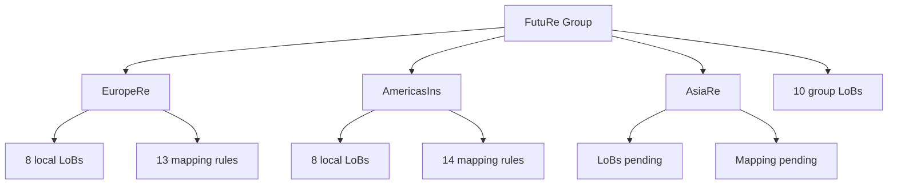
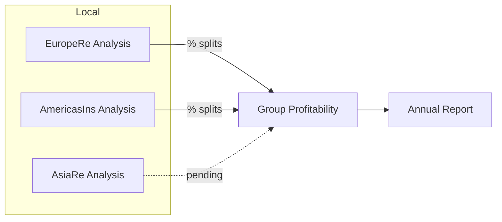

**FutuRe Insurance & Reinsurance** is a fictional group with three business units — **EuropeRe** (EUR), **AmericasIns** (USD), and **AsiaRe** (JPY). Each unit writes business under its own local Lines of Business. The group defines a standard LoB classification and uses **TransactionMapping** percentage splits to aggregate local data into group-level profitability.

## Organization

## Analysis

Each business unit has a **local analysis hub** that loads its own CSV data cube. The **group analysis hub** aggregates data from all local hubs via PartitionedHubDataSource, applying TransactionMapping percentage splits to map local LoBs to group LoBs. No data is physically copied — the group view is virtual.

**Example**: EuropeRe's *Household* line maps **90 %** to group *Property* and **10 %** to group *Casualty*. The original data never leaves the EuropeRe hub — the group profitability cube reads it through a virtual transformation layer.

## Report

@@("FutuRe/Analysis/AnnualReport")

## Governance

Each business unit maintains its own mapping rules document with an inline governance discussion — actuarial rationale for split percentages, validation requirements, and the annual review cycle — captured as comments from the team.

- [EuropeRe Mapping Rules](@FutuRe/EuropeRe/TransactionMapping/MappingRules) — 13 split rules across 8 local LoBs
- [AmericasIns Mapping Rules](@FutuRe/AmericasIns/TransactionMapping/MappingRules) — 14 split rules across 8 local LoBs
