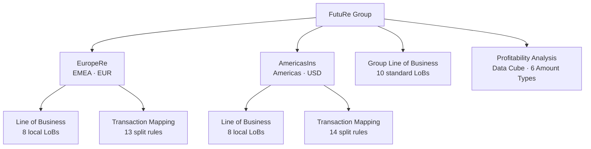
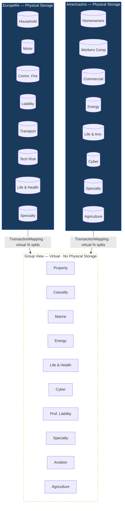

**FutuRe Insurance & Reinsurance** is a fictional group with two business units — **EuropeRe** (EUR) and **AmericasIns** (USD). Each unit writes business under its own local Lines of Business. The group defines a standard LoB classification and a **TransactionMapping** with percentage splits to aggregate local data into group-level profitability.

## Organization

## Virtual Transformation

Local transactions stay in their business unit databases. The group view is **virtual** — TransactionMapping applies percentage splits on the fly without copying data.

**Example**: EuropeRe's *Household* line maps **90%** to group *Property* and **10%** to group *Casualty*. The original data never leaves the EuropeRe database — the group profitability cube reads it through a virtual transformation layer.

## Reports

- [Annual Profitability Report](@FutuRe/Profitability/AnnualReport) — KPIs, charts, and LoB breakdown with embedded live views from the profitability data cube

## Governance

Each business unit maintains its own mapping rules document with an inline governance discussion — actuarial rationale for split percentages, validation requirements, and the annual review cycle — captured as comments from the team.

- [EuropeRe Mapping Rules](@FutuRe/EuropeRe/TransactionMapping/MappingRules) — 13 split rules across 8 local LoBs
- [AmericasIns Mapping Rules](@FutuRe/AmericasIns/TransactionMapping/MappingRules) — 14 split rules across 8 local LoBs
