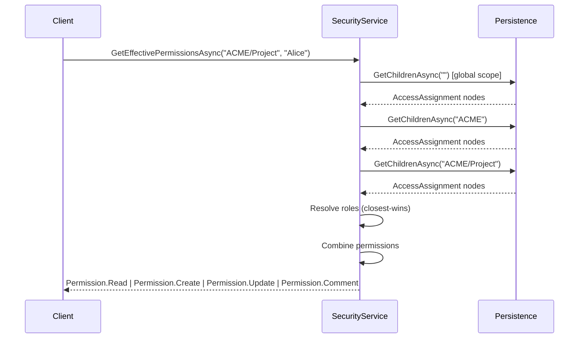
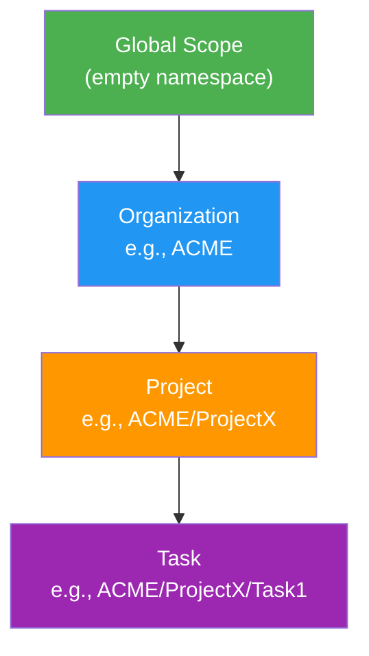

# Access Control Architecture

MeshWeaver provides row-level security through **AccessAssignment MeshNodes** stored directly in the mesh node hierarchy. Permissions are evaluated by walking the node tree from root to target path, applying closest-wins semantics.

## Core Concepts

### AccessAssignment MeshNodes

Access control is managed through AccessAssignment nodes — first-class MeshNodes with `nodeType: "AccessAssignment"`. Each assignment grants (or denies) a role to a subject at a specific scope.

```
Node path: {scope}/{SubjectId}_Access
Node type: AccessAssignment
Content: {
  "subjectId": "Alice",
  "displayName": "Alice Chen",
  "roles": [
    { "roleId": "Editor", "denied": false },
    { "roleId": "Viewer", "denied": false }
  ]
}
```

Each AccessAssignment node maps **one subject** (User or Group) to **multiple roles** at a given scope. This reduces the number of nodes and trigger invocations compared to one-node-per-role.

**Key properties:**

| Property | Description |
|----------|-------------|
| `SubjectId` | User or Group identifier |
| `DisplayName` | Optional display name for the subject |
| `Roles` | Array of `RoleAssignment` entries |
| `Roles[].RoleId` | Role to grant/deny (Admin, Editor, Viewer, Commenter, or custom) |
| `Roles[].Denied` | If true, denies the role instead of granting it |

### Built-in Roles

| Role | Permissions | Flag Value |
|------|------------|------------|
| Admin | Read, Create, Update, Delete, Comment | 31 (All) |
| Editor | Read, Create, Update, Comment | 23 |
| Viewer | Read | 1 |
| Commenter | Read, Comment | 17 |

### Permission Flags

```csharp
[Flags]
public enum Permission
{
    None    = 0,
    Read    = 1,
    Create  = 2,
    Update  = 4,
    Delete  = 8,
    Comment = 16,
    All     = Read | Create | Update | Delete | Comment
}
```

## Permission Evaluation

Permissions are evaluated by walking AccessAssignment nodes from the global scope through each ancestor down to the target path.

### Scope Hierarchy

For a target path `ACME/Project/Task1`, the evaluation order is:

```
"" (global) → "ACME" → "ACME/Project" → "ACME/Project/Task1"
```

At each scope level, the system collects AccessAssignment MeshNodes and applies **closest-wins** semantics: a deeper assignment for the same role overrides a shallower one.

### Evaluation Flow



### Closest-Wins Semantics

When the same role is assigned at multiple levels, the deepest (closest to target) assignment wins:

| Scope | Assignment | Effect |
|-------|-----------|--------|
| `""` (global) | Alice: Admin | Grants All permissions globally |
| `ACME` | Alice: Admin (Denied) | **Overrides** global grant — no Admin at ACME |
| `ACME/Project` | Alice: Editor | Grants Editor at ACME/Project |

At `ACME/Project`, Alice has Editor permissions (Read + Create + Update + Comment) but not Admin.

### Deny Override

A deny assignment blocks an inherited grant for a specific role, but does not affect other roles. Each node's `Roles[]` array can mix grants and denies:

```
Global:      Alice_Access → roles: [{ roleId: "Admin" }]
ACME:        Alice_Access → roles: [{ roleId: "Editor" }]
ACME/Secure: Alice_Access → roles: [{ roleId: "Admin", denied: true }]
```

At `ACME/Secure`, Alice has Editor permissions (from ACME, inherited) but not Admin (denied at ACME/Secure).

## Node Type Architecture

Access control uses these shipped node types:

### AccessAssignment
- **NodeType**: `"AccessAssignment"`
- **Content**: `AccessAssignment` record with `Roles[]` array
- **Path pattern**: `{scope}/{SubjectId}_Access`
- **Name pattern**: `{SubjectId} Access`
- Created via `ISecurityService.AddUserRoleAsync()` or `IMeshCatalog.CreateNodeAsync()`
- One node per subject per scope — multiple roles are stored in the `Roles` array

### User
- **NodeType**: `"User"`
- **Content**: `AccessObject` record (Id, Name, Description, Icon)
- Used as subjects in AccessAssignment nodes

### Group
- **NodeType**: `"Group"`
- **Content**: `AccessObject` record
- Contains GroupMembership child nodes for members
- Groups can be nested (a group member can be another group)

### GroupMembership
- **NodeType**: `"GroupMembership"`
- **Content**: `GroupMembership` record (`MemberId`)
- **Path pattern**: `{GroupPath}/{MemberId}`
- Children of Group nodes

### Role
- **NodeType**: `"Role"`
- **Content**: `Role` record (Id, DisplayName, Permissions, IsInheritable)
- Custom roles extend the built-in set

## ISecurityService API

```csharp
public interface ISecurityService
{
    // Permission evaluation
    Task<bool> HasPermissionAsync(string nodePath, Permission permission, CancellationToken ct);
    Task<bool> HasPermissionAsync(string nodePath, string userId, Permission permission, CancellationToken ct);
    Task<Permission> GetEffectivePermissionsAsync(string nodePath, CancellationToken ct);
    Task<Permission> GetEffectivePermissionsAsync(string nodePath, string userId, CancellationToken ct);

    // Role management
    Task<Role?> GetRoleAsync(string roleId, CancellationToken ct);
    IAsyncEnumerable<Role> GetRolesAsync(CancellationToken ct);
    Task SaveRoleAsync(Role role, CancellationToken ct);

    // Convenience methods (create/delete AccessAssignment MeshNodes)
    Task AddUserRoleAsync(string userId, string roleId, string? targetNamespace, string? assignedBy, CancellationToken ct);
    Task RemoveUserRoleAsync(string userId, string roleId, string? targetNamespace, CancellationToken ct);
}
```

## Anonymous (Public) Access

The well-known user `"Public"` represents anonymous/unauthenticated users. When no user context is available (empty or null userId), permissions are evaluated for the Public user.

```csharp
// Make MeshWeaver namespace publicly readable
await securityService.AddUserRoleAsync("Public", "Viewer", "MeshWeaver", "system", ct);

// Anonymous users can now read MeshWeaver content
var canRead = await securityService.HasPermissionAsync("MeshWeaver/Docs", "", Permission.Read, ct);
// canRead == true
```

## Hierarchical Access Pattern



**Examples:**
- Global Admin: `AddUserRoleAsync("Roland", "Admin", null, ...)` → full access everywhere
- Org Editor: `AddUserRoleAsync("Alice", "Editor", "ACME", ...)` → edit within ACME and descendants
- Project Viewer: `AddUserRoleAsync("Bob", "Viewer", "ACME/ProjectX", ...)` → read-only at ProjectX

## Access Control UI

The Access Control layout area (`AccessControlArea`) provides:

1. **Inherited Permissions** (read-only markdown table): Shows AccessAssignment nodes from ancestor scopes, displaying Subject, Role, Source path, and Allow/Deny status.

2. **Local Assignments** (editable): Shows AccessAssignment nodes that are direct children of the current node. Admins can toggle Allow/Deny and delete assignments.

3. **Add Assignment** (admin-only): Dialog with autocompleting comboboxes for Subject (User/Group search via IMeshQuery) and Role selection.

## PostgreSQL Integration

For PostgreSQL deployments, a denormalized `user_effective_permissions` table enables fast query-time permission checks. A trigger on `mesh_nodes` automatically rebuilds this table when AccessAssignment or GroupMembership nodes change.

```sql
-- Trigger fires on AccessAssignment/GroupMembership changes
CREATE TRIGGER mesh_node_access_changed
    AFTER INSERT OR UPDATE OR DELETE ON mesh_nodes
    FOR EACH ROW EXECUTE FUNCTION trg_mesh_node_access_changed();
```

The rebuild function:
1. Reads AccessAssignment MeshNodes from `mesh_nodes`, unnesting each node's `roles` JSON array via `jsonb_array_elements(content->'roles')`
2. Expands GroupMembership recursively (nested groups)
3. Joins with Role definitions (built-in + custom Role MeshNodes)
4. Produces per-user, per-permission rows in a shadow table
5. Atomically swaps the shadow table into the live table

## Node Validation (INodeValidator)

The `RlsNodeValidator` integrates with the mesh node CRUD pipeline to enforce permissions on Create, Update, and Delete operations:

```csharp
public class RlsNodeValidator : INodeValidator
{
    public IReadOnlyCollection<NodeOperation> SupportedOperations
        => [NodeOperation.Create, NodeOperation.Update, NodeOperation.Delete];

    public async Task<NodeValidationResult> ValidateAsync(
        NodeValidationContext context, CancellationToken ct)
    {
        var requiredPermission = context.Operation switch
        {
            NodeOperation.Create => Permission.Create,
            NodeOperation.Update => Permission.Update,
            NodeOperation.Delete => Permission.Delete,
            _ => Permission.None
        };

        var hasPermission = await securityService
            .HasPermissionAsync(context.Node.Path, requiredPermission, ct);

        return hasPermission
            ? NodeValidationResult.Valid()
            : NodeValidationResult.Invalid(NodeRejectionReason.Unauthorized);
    }
}
```

Read operations are not validated by the node validator — read filtering is handled by `SecurePersistenceServiceDecorator` which wraps `GetChildrenAsync` and `GetNodeAsync` with permission checks.

## Configuration

Enable row-level security in your mesh configuration:

```csharp
var builder = new MeshBuilder()
    .UseMonolithMesh()
    .AddFileSystemPersistence(dataPath)
    .AddRowLevelSecurity();  // Registers ISecurityService, RlsNodeValidator, etc.
```

## Best Practices

1. **Start with hierarchy** — assign roles at the organizational level and let inheritance handle descendants
2. **Use deny sparingly** — deny overrides only the specific role, not all permissions
3. **Public user for anonymous access** — configure Public user with Viewer role on namespaces that should be publicly readable
4. **Cache permissions** — SecurityService caches effective permissions with a 5-minute sliding expiration
5. **Fail closed** — no roles assigned means no permissions (Permission.None)
6. **Audit via MeshNodes** — AccessAssignment nodes provide a clear audit trail of who has access to what
