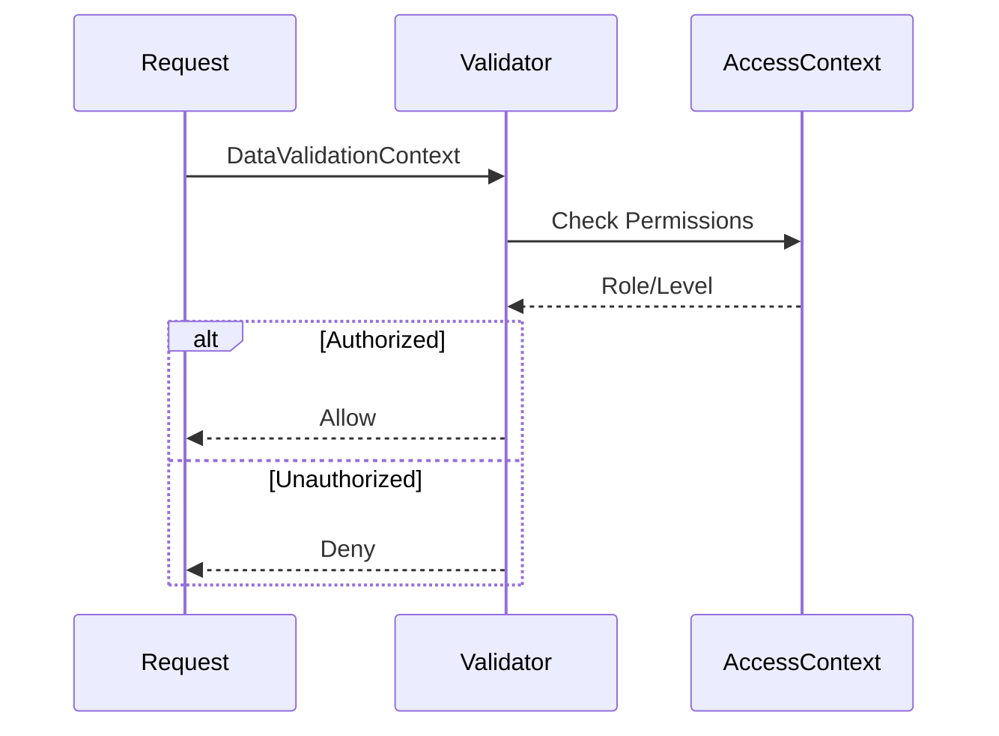
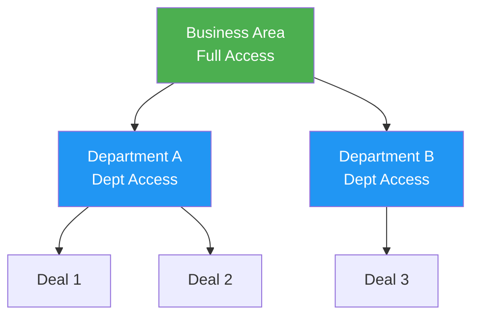
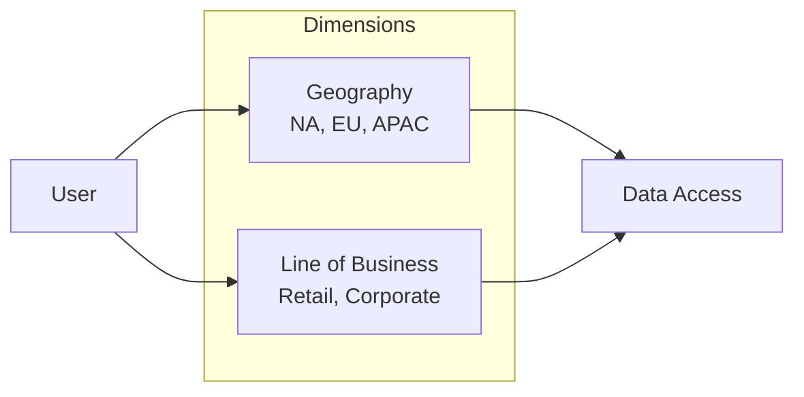

# Access Control Architecture

MeshWeaver provides flexible access control through the `IDataValidator` interface. This enables both hierarchical (organizational) and dimensional (reference data) access patterns.

## General Concept

Validators work against **strings**. Any string can be defined as an operation - this includes not just data manipulation but also domain-specific operations like sign-off, commenting, approval, escalation, or any custom workflow action.

```csharp
public interface IDataValidator
{
    Task<DataValidationResult> ValidateAsync(
        DataValidationContext context,
        CancellationToken ct = default);

    IReadOnlyCollection<string> SupportedOperations { get; }
}
```

### Custom Operations

Define any operation string relevant to your domain:

```csharp
// Domain-specific operation strings
public static class ClaimsOperations
{
    public const string SignOff = "signoff";
    public const string Comment = "comment";
    public const string Escalate = "escalate";
    public const string Approve = "approve";
    public const string Reject = "reject";
    public const string Reassign = "reassign";
}

// Validator supporting custom operations
public class ClaimsWorkflowValidator : IDataValidator
{
    public IReadOnlyCollection<string> SupportedOperations
        => new[] { ClaimsOperations.SignOff, ClaimsOperations.Approve };
}
```

### Data Operations Enum

For common data manipulation contexts, MeshWeaver provides a standard enum:

```csharp
public enum DataOperation
{
    Read,    // Reading data
    Create,  // Creating new entities
    Update,  // Modifying existing entities
    Delete   // Removing entities
}
```

These enum values convert to strings (`"Read"`, `"Create"`, etc.) and can be used alongside custom operation strings.

### Validation Context

Validators receive full context for decisions:

```csharp
public record DataValidationContext
{
    public required string Operation { get; init; }     // Any operation string
    public required object Entity { get; init; }
    public object? ExistingEntity { get; init; }        // For updates
    public required Type EntityType { get; init; }
    public AccessContext? AccessContext { get; init; }  // Current user
}
```

## Validation Flow



## Hierarchical Access Control

The recommended approach aligns access with the namespace hierarchy:



### Hierarchy Pattern

```
{BusinessArea}/{Department}/{Deal}
```

**Examples:**
- `CapitalMarkets/StructuredProducts/Deal-2024-001`
- `Insurance/Claims/Claim-12345`
- `Banking/Retail/Account-98765`

### Role Assignment

Roles are granted at each hierarchy level:

| Level | Access Scope |
|-------|-------------|
| Business Area | All departments and deals |
| Department | All deals in department |
| Deal | Single deal only |

### Implementation Example

```csharp
public class HierarchicalAccessValidator : IDataValidator
{
    public IReadOnlyCollection<DataOperation> SupportedOperations
        => new[] { DataOperation.Read, DataOperation.Update };

    public async Task<DataValidationResult> ValidateAsync(
        DataValidationContext context,
        CancellationToken ct)
    {
        var user = context.AccessContext;
        var entityPath = GetEntityPath(context.Entity);

        // Check if user has access at any level of the hierarchy
        foreach (var grantedPath in user.AccessiblePaths)
        {
            if (entityPath.StartsWith(grantedPath))
                return DataValidationResult.Success();
        }

        return DataValidationResult.Denied("No access to this path");
    }
}
```

### Benefits

1. **Intuitive**: Matches organizational structure
2. **Granular**: Access from entire business area to single deal
3. **Inherited**: Access at parent implies access to children
4. **Auditable**: Clear trail of who can access what

## Reference Data Access Control

Alternatively, control access via reference data dimensions:



### Dimension Pattern

Users are assigned values for each dimension:

```json
{
  "userId": "jsmith",
  "dimensions": {
    "geography": ["NA", "EU"],
    "lineOfBusiness": ["Retail"],
    "product": ["*"]  // Wildcard for all
  }
}
```

### Data Tagging

Entities are tagged with dimension values:

```json
{
  "id": "deal-123",
  "geography": "NA",
  "lineOfBusiness": "Retail",
  "product": "Mortgage"
}
```

### Validation Logic

```csharp
public class DimensionalAccessValidator : IDataValidator
{
    public async Task<DataValidationResult> ValidateAsync(
        DataValidationContext context,
        CancellationToken ct)
    {
        var user = context.AccessContext;
        var entity = context.Entity as IDimensioned;

        // Check each dimension
        if (!MatchesDimension(user.Geography, entity.Geography))
            return DataValidationResult.Denied("Geography mismatch");

        if (!MatchesDimension(user.LineOfBusiness, entity.LineOfBusiness))
            return DataValidationResult.Denied("LOB mismatch");

        return DataValidationResult.Success();
    }

    private bool MatchesDimension(IEnumerable<string> allowed, string value)
        => allowed.Contains("*") || allowed.Contains(value);
}
```

### Common Dimensions

| Dimension | Examples |
|-----------|----------|
| Geography | NA, EU, APAC, LATAM |
| Line of Business | Retail, Corporate, Investment |
| Product | Loans, Deposits, Insurance |
| Sensitivity | Public, Internal, Confidential |
| Client Segment | SMB, Enterprise, Government |

## Combining Approaches

Both patterns can be combined:

```csharp
public class CompositeValidator : IDataValidator
{
    private readonly IDataValidator _hierarchical;
    private readonly IDataValidator _dimensional;

    public async Task<DataValidationResult> ValidateAsync(
        DataValidationContext context,
        CancellationToken ct)
    {
        // Must pass both checks
        var hierarchical = await _hierarchical.ValidateAsync(context, ct);
        if (!hierarchical.IsValid)
            return hierarchical;

        return await _dimensional.ValidateAsync(context, ct);
    }
}
```

## Operation-Specific Validators

Limit validators to specific operations:

```csharp
public class WriteOnlyValidator : IDataValidator
{
    // Only validates Create, Update, Delete
    public IReadOnlyCollection<DataOperation> SupportedOperations
        => new[] {
            DataOperation.Create,
            DataOperation.Update,
            DataOperation.Delete
        };

    public async Task<DataValidationResult> ValidateAsync(
        DataValidationContext context,
        CancellationToken ct)
    {
        // Extra validation for write operations
        if (!context.AccessContext.CanWrite)
            return DataValidationResult.Denied("Write access required");

        return DataValidationResult.Success();
    }
}
```

## Best Practices

1. **Start with hierarchy** for organizational data
2. **Add dimensions** for cross-cutting concerns
3. **Separate read/write** validators when needed
4. **Audit all decisions** for compliance
5. **Cache access context** to avoid repeated lookups
6. **Fail closed**: Deny by default if uncertain
