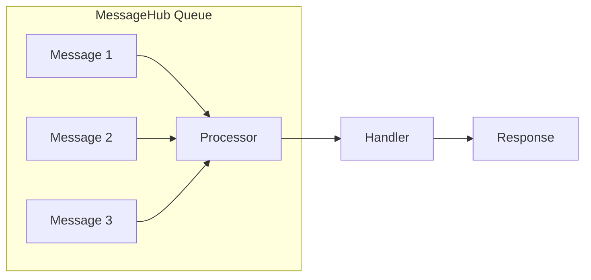
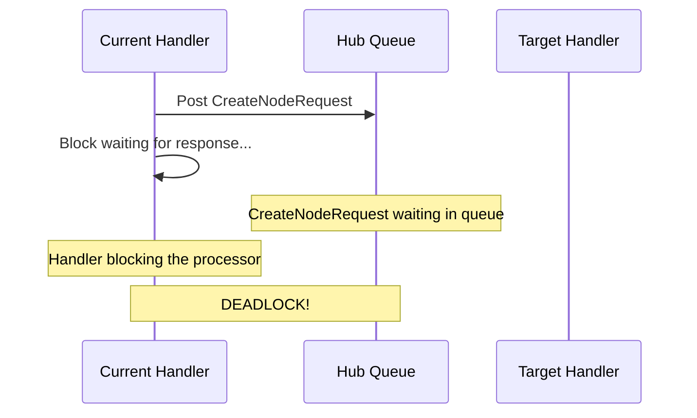

# Actor Model in MeshWeaver

MeshWeaver's MessageHub architecture follows the **Actor Model** pattern, where each hub processes messages single-threaded through a queue. This design provides important benefits but also requires understanding potential deadlock scenarios.

## Single-Threaded Processing

Each MessageHub processes messages **one at a time** through its internal queue:



**Benefits:**
- No race conditions within a hub
- Predictable execution order
- Simplified state management
- No need for locks on hub-local state

## The Deadlock Problem

### Understanding AwaitResponse

`AwaitResponse` is a convenient method that sends a request and waits for the response:

```csharp
var response = await hub.AwaitResponse(
    new CreateNodeRequest(node),
    o => o.WithTarget(hub.Address));
```

**What happens internally:**
1. Message is posted to the target hub's queue
2. Current thread blocks waiting for the response
3. When response arrives, the await completes

### When Deadlock Occurs

A deadlock occurs when a hub sends a message **to itself** using `AwaitResponse`:



**The problem:**
1. Handler A is processing a message (e.g., a click event)
2. Handler A calls `AwaitResponse` targeting the same hub
3. Handler A blocks the hub's single thread, waiting for the response
4. The CreateNodeRequest sits in the queue, waiting to be processed
5. But the processor is blocked by Handler A
6. **Deadlock**: Both are waiting for each other

### Real-World Example

Consider a Create button click handler that confirms a transient node:

```csharp
// BAD - This causes deadlock when targeting the same hub
.WithClickAction(async ctx =>
{
    var response = await host.Hub.AwaitResponse(
        new CreateNodeRequest(updatedNode),
        o => o.WithTarget(host.Hub.Address));  // Same hub!

    // This line is never reached - deadlock
    ctx.NavigateTo(overviewUrl);
});
```

## The Solution: Callbacks

Use `Post` + `RegisterCallback` instead of `AwaitResponse`:

```csharp
// GOOD - Non-blocking with callback
.WithClickAction(ctx =>
{
    // Post without blocking
    var delivery = host.Hub.Post(
        new CreateNodeRequest(updatedNode),
        o => o.WithTarget(host.Hub.Address));

    if (delivery != null)
    {
        // Register callback to handle response asynchronously
        host.Hub.RegisterCallback(delivery, d =>
        {
            if (d.Message is CreateNodeResponse response)
            {
                if (response.Success)
                    ctx.NavigateTo(overviewUrl);
                else
                    ShowErrorDialog(ctx, "Failed", response.Error);
            }
            return d;
        });
    }
});
```

**How it works:**
1. Click handler posts the message and returns immediately
2. Hub processes CreateNodeRequest when it reaches the front of the queue
3. Response is generated and delivered
4. Callback executes with the response

```mermaid
sequenceDiagram
    participant Handler as Click Handler
    participant Queue as Hub Queue
    participant Create as CreateNode Handler
    participant Callback as Response Callback

    Handler->>Queue: Post CreateNodeRequest
    Handler->>Handler: Register callback, return
    Queue->>Create: Process CreateNodeRequest
    Create->>Queue: Post CreateNodeResponse
    Queue->>Callback: Execute callback
    Callback->>Callback: Navigate or show error
```

## When to Use Each Approach

### Use `AwaitResponse` when:
- Targeting a **different** hub (different address)
- The target hub won't need to call back to the source
- During initialization (before the hub starts processing messages)
- In test code where simplicity is more important

### Use `Post` + `RegisterCallback` when:
- Targeting the **same** hub
- In UI event handlers (clicks, input changes)
- Any time you're unsure about potential circular dependencies
- Performance is critical (non-blocking is faster)

## Best Practices

### 1. Always Add Exception Logging in Callbacks

```csharp
host.Hub.RegisterCallback(delivery, d =>
{
    try
    {
        // Handle response
    }
    catch (Exception ex)
    {
        logger?.LogError(ex, "Error processing response for {Path}", nodePath);
        ShowErrorDialog(ctx, "Error", ex.Message);
    }
    return d;
});
```

### 2. Consider Using Reactive Streams

For data that will be updated through the workspace, use reactive queries instead:

```csharp
// Instead of AwaitResponse for data changes
workspace.RequestChange(DataChangeRequest.Update([node]), null, null);

// Wait for the change to be reflected in the stream
await workspace.GetStream<MeshNode>()
    .Where(nodes => nodes.Any(n => n.Path == path && n.State == MeshNodeState.Active))
    .Timeout(5.Seconds())
    .FirstAsync();
```

### 3. Use InvokeAsync for Exception Safety

For operations that need proper exception handling on the hub thread:

```csharp
hub.InvokeAsync(
    async ct => { /* async operation */ },
    ex => {
        logger.LogError(ex, "Operation failed");
        return Task.CompletedTask;
    });
```

## Debugging Deadlocks

### Symptoms
- Application hangs on a specific action
- No error messages (the code simply stops)
- Typically occurs on button clicks or form submissions

### Finding the Cause
1. Look for `AwaitResponse` calls in event handlers
2. Check if the target address is the same hub (`host.Hub.Address`)
3. Search for patterns like:
   ```csharp
   await hub.AwaitResponse(..., o => o.WithTarget(hub.Address))
   ```

### Prevention
- Code review for `AwaitResponse` targeting same hub
- Use static analysis to flag potential deadlock patterns
- Default to callbacks in UI handlers

## Summary

| Aspect | AwaitResponse | Post + RegisterCallback |
|--------|---------------|------------------------|
| Blocking | Yes | No |
| Same-hub safe | No (deadlock risk) | Yes |
| Code simplicity | Simpler | More verbose |
| Error handling | Try/catch | Callback try/catch |
| Use case | Cross-hub calls | Same-hub or UI handlers |

The Actor Model provides excellent guarantees about state consistency and execution order. Understanding the single-threaded nature and avoiding `AwaitResponse` on self-targeting requests ensures your application remains responsive and deadlock-free.
