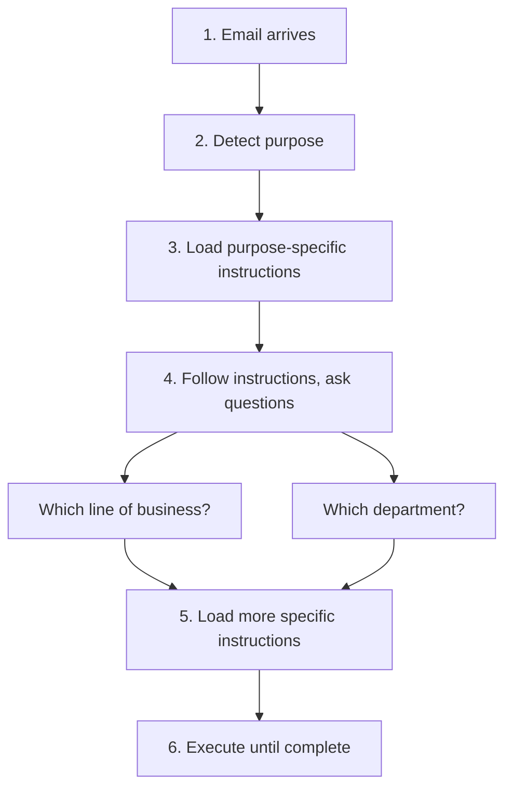
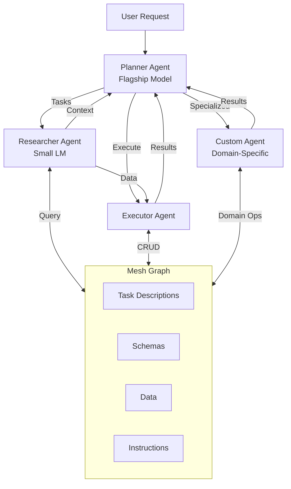
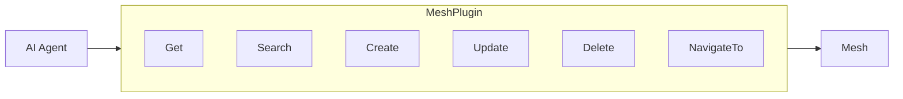
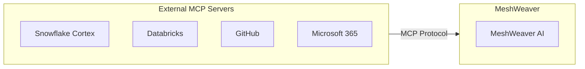
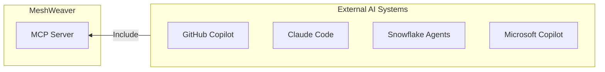

# Agentic AI Architecture

MeshWeaver integrates AI agents as first-class citizens in the mesh. Agents can query data, navigate structures, execute tasks, and collaborate with other agents - all through unified mesh references.

## Design Philosophy

### Self-Guided Discovery

Unlike traditional approaches with extensive system prompts, MeshWeaver agents **find documentation as they go**. Instead of encoding all knowledge upfront, agents dynamically discover context from the mesh itself.

#### Example: Email Processing Workflow



**How it works:**
1. An email arrives and triggers agent processing
2. The agent detects the email's purpose (inquiry, claim, request)
3. Based on purpose, it loads instructions from the mesh (e.g., `Insurance/Claims/Instructions`)
4. Instructions guide the agent to gather more context:
   - Which line of business is this?
   - Which department should handle it?
5. The agent loads department-specific instructions and schemas
6. Execution continues with full context until the task completes

This keeps agents adaptable and reduces prompt maintenance.

### Agents as Data Elements

Agents are stored as nodes in the mesh hierarchy:

```
Insurance/
  Claims/
    Agent/              <- Agents for this node
      Researcher
      Planner
      ClaimsProcessor   <- Custom agent for claims
    Submissions/
      ...
```

When a task is invoked, MeshWeaver selects the **lowest-most agent** in the hierarchy **marked as an entry agent**. This allows:
- Problem-specific agents at lower levels
- Generic fallback agents at higher levels
- Override behavior without changing code

## Multi-Agent Collaboration



### Agent Roles

| Agent | Model Size | Purpose |
|-------|------------|----------|
| **Planner** | Flagship (GPT-4, Claude) | Decomposes tasks, orchestrates workflow |
| **Researcher** | Small LM (GPT-3.5, Haiku) | Gathers context, searches data |
| **Executor** | Medium | Performs CRUD operations, runs workflows |
| **Custom** | Configurable | Domain-specific tasks (claims, underwriting, etc.) |

You can define **custom agents** for specific tasks by creating Agent nodes in the mesh. These agents inherit from base agents but add domain-specific instructions, tools, and behaviors.

## Custom Commands

Define custom `/commands` to provide detailed instructions for specific contexts:

```
Insurance/Claims/
  Command/
    import.md      <- /import command instructions
    validate.md    <- /validate command instructions
    assign.md      <- /assign command instructions
```

**Example `/import` command:**
```markdown
# Import Command

This command imports claims from external sources.

## Steps
1. Validate the source format (CSV, JSON, XML)
2. Map fields to Claims schema
3. Check for duplicates using claim reference number
4. Create new claim records
5. Trigger validation workflow

## Required Fields
- claimReference, policyNumber, lossDate, description
```

Commands serve as detailed, context-aware instructions that agents can discover and follow.

## MeshPlugin Tools

Agents interact with the mesh through `MeshPlugin`, which provides these operations:



### Read Operations

**Get** — Retrieve data by path:
```
Get("@Insurance/Claims/CLM-2024-001")     -> Returns claim JSON
Get("@Insurance/Claims/*")                -> Returns all claims (children)
```

**Get with Unified Path prefixes** — Access schemas and metadata:
```
Get("@ACME/Insurance/schema:")             -> JSON Schema for content type
Get("@ACME/Insurance/schema:Pricing")      -> Schema for a specific named type
Get("@ACME/Insurance/model:")              -> Full data model with all types
Get("@ACME/Insurance/metadata:")           -> MeshNode without content
```

**Search** — Query with GitHub-style syntax:
```
Search("nodeType:Claim status:Open")        -> All open claims
Search("name:*property*")                   -> Name contains 'property'
Search("lob:Commercial", "@Insurance")      -> Commercial LOB under Insurance
```

### Write Operations

**Create** — Create new nodes:
```
Create('{"id": "CLM-2024-002", "namespace": "Insurance/Claims",
  "name": "Property Damage Claim", "nodeType": "Claim",
  "content": {"status": "Open"}}')
```

**Update** — Modify existing nodes (Get → modify → Update):
```
// 1. Get existing: result = Get("@Insurance/Claims/CLM-2024-001")
// 2. Modify the JSON
// 3. Pass as array:
Update('[{"id": "CLM-2024-001", "namespace": "Insurance/Claims",
  "name": "Updated Claim", "nodeType": "Claim",
  "content": {"status": "Closed"}}]')
```

**Delete** — Remove nodes by path:
```
Delete('["Insurance/Claims/CLM-2024-002"]')
```

### Navigation

**NavigateTo** — Display a node's view in the UI:
```
NavigateTo("@Insurance/Claims/CLM-2024-001")  -> Shows claim detail view
```

## Path Shorthand & Unified Path

The `@` prefix provides convenient shorthand. Unified Path prefixes access specific resource types:

| Syntax | Returns |
|--------|---------|
| `@Insurance/Claims/CLM-001` | Full node JSON |
| `@Insurance/Claims/*` | Direct children |
| `@ACME/Insurance/schema:` | Content type JSON Schema |
| `@ACME/Insurance/schema:TypeName` | Schema for a specific named type |
| `@ACME/Insurance/model:` | Full data model |
| `@ACME/Insurance/metadata:` | Node without content |

## Include External MCP Servers

MeshWeaver supports the **Model Context Protocol (MCP)** to include external AI tools:



**Available Integrations:**
- **Snowflake Cortex**: AI/ML functions, document processing
- **Databricks**: Unity Catalog, ML models, notebooks
- **GitHub**: Repository access, code search, issue management
- **Microsoft 365**: Email, calendar, documents, Teams
- **Other MCP servers**: Any compatible tool provider

Tools from external MCP servers appear automatically in agent context.

## Exposing MeshWeaver as MCP Server

MeshWeaver provides an MCP server that external systems can include:



**Use Cases:**
- **GitHub/Claude Code**: Read task descriptions and prompts from MeshWeaver to execute using external agents
- **Microsoft Copilot**: Query business data when composing Word documents or emails
- **Snowflake Agents**: Access organizational context and workflows
- **Custom Integrations**: Any MCP-compatible AI system

### MCP Server Tools

The MCP server exposes the same mesh operations as the internal MeshPlugin, so external AI systems get full access:

| Tool | Description |
|------|-------------|
| **Get** | Retrieve nodes by path. Supports `@` shorthand, `/*` for children, and Unified Path prefixes (`schema:`, `model:`, `metadata:`) |
| **Search** | Query nodes using GitHub-style syntax with optional base path scoping |
| **Create** | Create new nodes from JSON MeshNode objects |
| **Update** | Update existing nodes (pass JSON array of complete MeshNode objects) |
| **Delete** | Delete nodes by path (pass JSON array of path strings) |
| **NavigateTo** | Returns a URL to view a node in the MeshWeaver UI |

**Key difference from internal MeshPlugin:** `NavigateTo` returns a browser URL (e.g., `https://app.example.com/node/Insurance%2FClaims`) rather than rendering inline, since external consumers operate outside the MeshWeaver UI.

**Example — Claude Code using MeshWeaver MCP:**
```
Get("@ACME/Insurance/Claims/*")           -> List all claims
Get("@ACME/Insurance/schema:")             -> Get content type schema
Search("nodeType:Claim status:Open")       -> Find open claims
Create('{"id": "CLM-NEW", ...}')           -> Create a claim
```

## Alternative AI APIs

Some platforms provide dedicated APIs beyond MCP for AI access:

| Platform | API Type | Use Case |
|----------|----------|----------|
| **Snowflake** | SQL (Cortex functions) | `SELECT SNOWFLAKE.CORTEX.SENTIMENT(text)` |
| **Azure OpenAI** | REST API | Direct model access |
| **Databricks** | REST/SDK | Model serving endpoints |
| **AWS Bedrock** | REST API | Foundation models |

These APIs are used when hubs need to communicate with AI from external systems directly:

```sql
-- Snowflake Cortex via SQL
SELECT
  claim_id,
  SNOWFLAKE.CORTEX.SUMMARIZE(description) as summary,
  SNOWFLAKE.CORTEX.SENTIMENT(customer_feedback) as sentiment
FROM claims
WHERE status = 'Open'
```

## Agent Context Discovery

Agents discover their context from the mesh:

1. **Task Descriptions**: Stored as markdown nodes
2. **Data Schemas**: NodeType definitions with field metadata
3. **Custom Commands**: `/command` instructions for specific operations
4. **Domain Knowledge**: Documentation throughout the hierarchy

## Benefits

1. **Adaptability**: Agents learn from mesh, not hardcoded prompts
2. **Hierarchy**: Override agents at any node level
3. **Collaboration**: Multiple agents with specialized roles
4. **Custom Agents**: Define domain-specific agents for specialized tasks
5. **Integration**: MCP connects any AI system bidirectionally
6. **Transparency**: All agent actions are mesh operations
