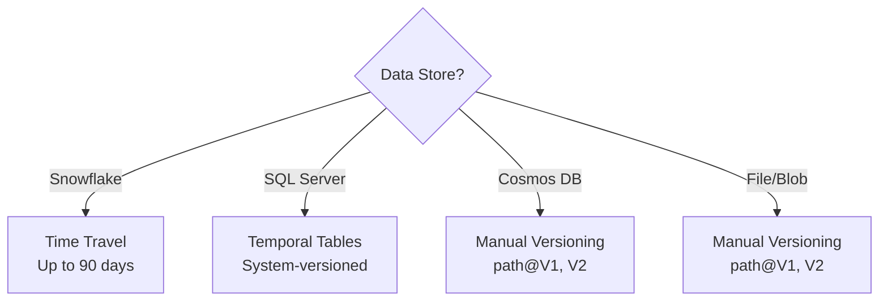

# Data Versioning Strategies

MeshWeaver supports data versioning through technology-specific mechanisms. The approach depends on the underlying data store, leveraging native capabilities where available.

## Strategy Selection



## Snowflake: Time Travel

Snowflake provides built-in temporal versioning through **Time Travel**:

### Capabilities

| Feature | Description |
|---------|-------------|
| **Time Travel** | Query data as it existed at any point (up to 90 days) |
| **Fail-safe** | 7-day recovery period after Time Travel expires |
| **Zero-Copy Cloning** | Instant snapshots without data duplication |
| **Retention** | Configurable 1-90 days per table |

### Query Historical Data

```sql
-- Query data from 1 hour ago
SELECT * FROM pricing
AT(OFFSET => -3600);

-- Query data at specific timestamp
SELECT * FROM pricing
AT(TIMESTAMP => '2024-01-15 10:00:00');

-- Query before a statement was executed
SELECT * FROM pricing
BEFORE(STATEMENT => '01234567-89ab-cdef-0123-456789abcdef');
```

### Clone for Snapshots

```sql
-- Create instant snapshot
CREATE TABLE pricing_q4_snapshot
CLONE pricing
AT(TIMESTAMP => '2024-12-31 23:59:59');
```

### MeshWeaver Integration

Access historical data through versioned entity references:

```csharp
// Query claim as of specific date
var historicalClaim = await hub.AwaitResponse(
    new GetDataRequest(
        new VersionedEntityReference(
            Collection: "Claim",
            Id: 12345,
            AsOf: new DateTime(2024, 6, 1)
        )
    ),
    o => o.WithTarget(new Address("Insurance/2024/Property"))
);
```

## SQL Server: Temporal Tables

SQL Server offers **system-versioned temporal tables** for automatic history tracking:

### Setup

```sql
CREATE TABLE Contracts
(
    Id INT PRIMARY KEY,
    Name NVARCHAR(100),
    Amount DECIMAL(18,2),
    ValidFrom DATETIME2 GENERATED ALWAYS AS ROW START,
    ValidTo DATETIME2 GENERATED ALWAYS AS ROW END,
    PERIOD FOR SYSTEM_TIME (ValidFrom, ValidTo)
)
WITH (SYSTEM_VERSIONING = ON (HISTORY_TABLE = dbo.ContractsHistory));
```

### Query Historical Data

```sql
-- Current data
SELECT * FROM Contracts;

-- Data at specific point in time
SELECT * FROM Contracts
FOR SYSTEM_TIME AS OF '2024-06-01 12:00:00';

-- All changes in a time range
SELECT * FROM Contracts
FOR SYSTEM_TIME BETWEEN '2024-01-01' AND '2024-12-31';

-- Complete history
SELECT * FROM Contracts
FOR SYSTEM_TIME ALL;
```

### Benefits

- Automatic history capture on UPDATE/DELETE
- No application code changes required
- Query optimizer aware of temporal predicates
- History table can be partitioned separately

## Manual Versioning: Path Pattern

For stores without built-in versioning (Cosmos DB, Blob Storage), use path-based versioning:

```mermaid
flowchart LR
    P[pricing/MS-2024] --> V1[pricing/MS-2024@V1]
    P --> V2[pricing/MS-2024@V2]
    P --> VN[pricing/MS-2024@V3]
    style P fill:#e1f5fe
    style V1 fill:#f5f5f5
    style V2 fill:#f5f5f5
    style VN fill:#c8e6c9
```

### Version Path Format

```
@{path}@V{version}
```

**Examples:**
- `@pricing/MS-2024` → Current version
- `@pricing/MS-2024@V1` → Version 1
- `@pricing/MS-2024@V2` → Version 2
- `@contracts/deal-123@V5` → Version 5

### Implementation Pattern

```csharp
// Save new version
public async Task SaveVersionAsync(string path, object data)
{
    // Get current version number
    var current = await GetCurrentVersionAsync(path);
    var newVersion = current + 1;

    // Save versioned copy
    await SaveAsync($"{path}@V{newVersion}", data);

    // Update current pointer
    await SaveAsync(path, data);
}

// Read specific version
public async Task<T> GetVersionAsync<T>(string path, int version)
{
    return await GetAsync<T>($"{path}@V{version}");
}
```

### Cosmos DB Implementation

In Cosmos DB, include version in the partition key or document:

```json
{
  "id": "MS-2024@V3",
  "partitionKey": "pricing",
  "version": 3,
  "createdAt": "2024-03-15T10:00:00Z",
  "data": { ... }
}
```

### Blob Storage Implementation

For file/blob storage, use folder structure:

```
pricing/
  MS-2024/
    current.json        <- Latest version
    v1.json
    v2.json
    v3.json
```

Or enable **blob versioning** in Azure Storage for automatic version tracking.

## Version Metadata

Regardless of storage technology, track version metadata:

```json
{
  "version": 3,
  "createdAt": "2024-03-15T10:00:00Z",
  "createdBy": "user@example.com",
  "comment": "Updated Q1 projections",
  "previousVersion": 2
}
```

## Comparison

| Technology | Method | Retention | Query Syntax |
|------------|--------|-----------|---------------|
| Snowflake | Time Travel | 1-90 days | `AT(TIMESTAMP => ...)` |
| SQL Server | Temporal Tables | Unlimited | `FOR SYSTEM_TIME AS OF` |
| Cosmos DB | Manual | Unlimited | `path@V{n}` |
| Blob Storage | Manual/Native | Configurable | Folder or blob versioning |

## Best Practices

1. **Use native features** when available (Snowflake, SQL Server)
2. **Consistent naming** for manual versioning (`@V{n}` suffix)
3. **Track metadata** (who, when, why)
4. **Retention policies** to manage storage costs
5. **Point-in-time queries** for audit and debugging
