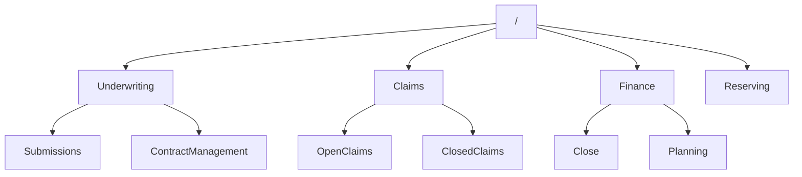
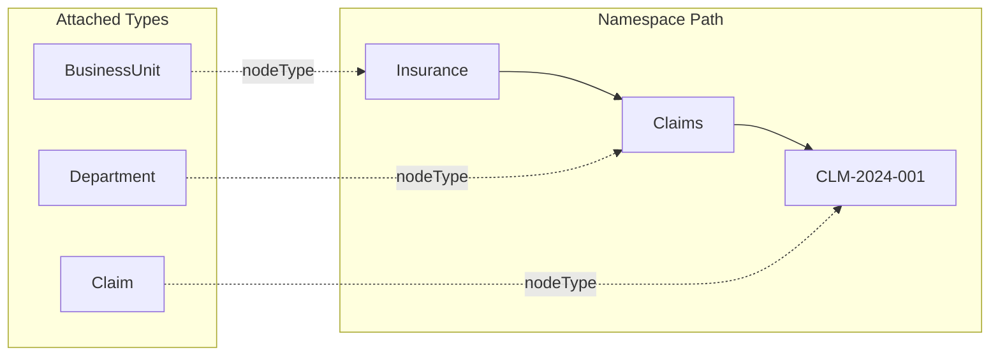

# Mesh Graph Architecture

The mesh graph is a hierarchical structure where **data types are data elements**. Types define hubs, namespaces organize content, and the hierarchy enables semantic versioning.

## Core Concepts

### MeshNode Structure

Every element in the mesh is a `MeshNode`:

```csharp
public record MeshNode(
    string Id,           // Local identifier
    string? Namespace    // Parent path
)
{
    public string Path => $"{Namespace}/{Id}";  // Full path
    public string? NodeType { get; init; }       // Type reference
    public object? Content { get; init; }        // Payload
}
```

**Examples:**
- `Id: "Submissions"`, `Namespace: "Insurance/Underwriting"` → Path: `Insurance/Underwriting/Submissions`
- `Id: "CLM-2024-001"`, `Namespace: "Insurance/Claims"` → Path: `Insurance/Claims/CLM-2024-001`

## Namespace Hierarchy

Namespaces follow a path pattern `a/b/c/d`, forming a tree. Here's an insurance company example:



### Path Navigation

| Path | Namespace | Id |
|------|-----------|---|
| `Underwriting` | `/` | `Underwriting` |
| `Underwriting/Submissions` | `Underwriting` | `Submissions` |
| `Claims/CLM-2024-001` | `Claims` | `CLM-2024-001` |
| `Finance/Close` | `Finance` | `Close` |

## Types Define Hubs

In MeshWeaver, **data types are themselves data elements** stored in the mesh. When you define a type like `Claim`, it becomes a node that configures how instances behave:



### NodeType Configuration

Each NodeType node contains:
- **Data Model**: Field definitions, validation rules
- **Views**: Layout configurations for different contexts
- **Handlers**: Custom message handlers
- **Hub Configuration**: How to build the MessageHub

```
Type/
  Claim/
    Code/
      dataModel.json    <- Field definitions (claimNumber, lossDate, status, etc.)
      views.json        <- UI layouts (ClaimDetail, ClaimSummary, ClaimEdit)
```

### Type Attachment

Any node can reference a type via `nodeType`:

```json
{
  "id": "CLM-2024-001",
  "namespace": "Insurance/Claims",
  "nodeType": "Type/Claim",
  "content": {
    "claimNumber": "CLM-2024-001",
    "policyNumber": "POL-12345",
    "lossDate": "2024-03-15",
    "status": "Open",
    "reserveAmount": 50000
  }
}
```

The type determines:
- Which fields are valid
- How the node renders
- What operations are available

## Semantic Versioning

The hierarchical namespace naturally supports semantic versioning:

```
Insurance/
  ClaimsProcessing/
    V1/                  <- Version 1 of the domain
      Claim
      Reserve
    V2/                  <- Version 2 with breaking changes
      Claim
      Reserve
      Subrogation        <- New in V2
```

### Version Benefits

1. **Parallel Serving**: Run V1 and V2 simultaneously
2. **Migration Path**: Gradually move clients to new version
3. **Type Evolution**: New fields, renamed entities
4. **API Stability**: Old references continue working

### Version Pattern

```
{Vendor}/{Domain}/V{Major}/
```

**Examples:**
- `Insurance/ClaimsProcessing/V1`
- `Insurance/Underwriting/V2`
- `MeshWeaver/Core/V3`

## Hub Instantiation

When accessing a path, MeshWeaver:

1. **Resolves the node** from the path
2. **Finds the NodeType** configuration
3. **Builds a MessageHub** with:
   - Data sources for the type
   - Registered handlers
   - View definitions
   - Child hub configuration

### Template Nodes

Nodes can act as templates for virtual instances:

```json
{
  "id": "claim",
  "addressSegments": 2,
  "nodeType": "Type/Claim"
}
```

This template matches paths like:
- `Insurance/Claims/CLM-2024-001`
- `Insurance/Claims/CLM-2024-002`

Virtual nodes inherit the template's configuration.

## Query Patterns

Navigate the hierarchy with queries. See [Unified Content References](MeshWeaver/Documentation/DataMesh/UnifiedContentReferences) for complete syntax.

```
// All children of Claims
namespace:Insurance/Claims

// All descendants recursively
path:Insurance scope:descendants

// Find by type
nodeType:Type/Claim

// Combined filters
namespace:Insurance/Claims nodeType:Type/Claim status:Open
```

See also: [Query Syntax Reference](MeshWeaver/Documentation/DataMesh/QuerySyntax)

## Benefits

1. **Self-Describing**: Types are data you can query
2. **Flexible Organization**: Any hierarchy depth
3. **Version Control**: Built-in semantic versioning
4. **Dynamic Configuration**: Change types without code
5. **Discoverability**: Browse types like data
