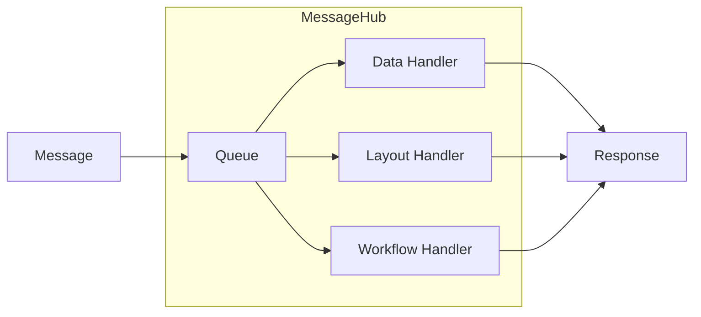
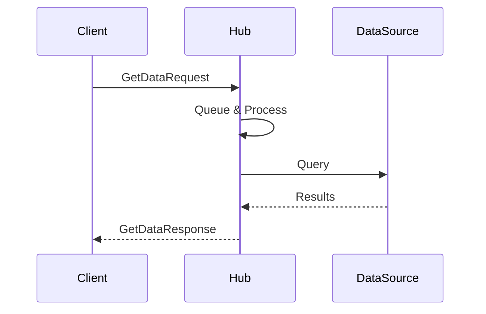

# Message-Based Communication

MeshWeaver's architecture is built on message-based communication through **MessageHubs**. This design enables distributed processing, scalability, and clean separation of concerns.

## Architecture Overview

MessageHubs can be allocated across multiple cloud environments (Azure, AWS, on-premise) and communicate via a central message bus. Each hub processes messages single-threaded through a queue, ensuring predictable execution order.

@@MeshWeaver/Documentation/Architecture/MessageBasedCommunication/content:message-flow.svg

## How It Works

### 1. Hub Allocation

MessageHubs are allocated within cloud environments. Each hub:
- Has a unique **Address** for routing
- Maintains its own **Queue** for message processing
- Registers **Handlers** for different message types
- Can host child hubs hierarchically

### 2. Message Processing Pipeline

Messages flow through a defined pipeline ensuring single-threaded execution:

**Handler Types:**
- **Data Handlers**: Retrieve and modify data from various sources
- **Layout Handlers**: Generate UI components
- **Workflow Handlers**: Orchestrate business processes

### 3. Request/Response Pattern

MeshWeaver uses typed request/response messaging:

## Key Concepts

### Single-Threaded Processing

Each hub processes messages one at a time through its queue. This:
- Eliminates race conditions within a hub
- Simplifies state management
- Makes execution order deterministic

### Hierarchical Routing

Hubs can host child hubs to offload tasks:
- Synchronization with other hubs or data sources (async)
- Execution of long-running jobs
- Other background work

### Data Source Integration

Handlers connect to various data platforms:
- **Data Platforms** (e.g., Snowflake, Databricks): Analytics and data warehousing
- **Transactional Data Stores** (e.g., SQL Server, Cosmos DB): Transactional and document data
- **Other Data Sources** (e.g., Blob Storage): Files and binary content

## Message Types

Common message patterns include:

| Message | Purpose |
|---------|----------|
| `GetDataRequest` | Retrieve data by reference |
| `DataChangeRequest` | Create, update, or delete entities |
| `SubscribeRequest` | Stream data changes |
| `ClickedEvent` | UI interaction |

## Benefits

1. **Scalability**: Distribute hubs across clouds
2. **Isolation**: Each hub manages its own state
3. **Flexibility**: Connect any data source
4. **Testability**: Mock message exchanges
5. **Observability**: Track message flow end-to-end
