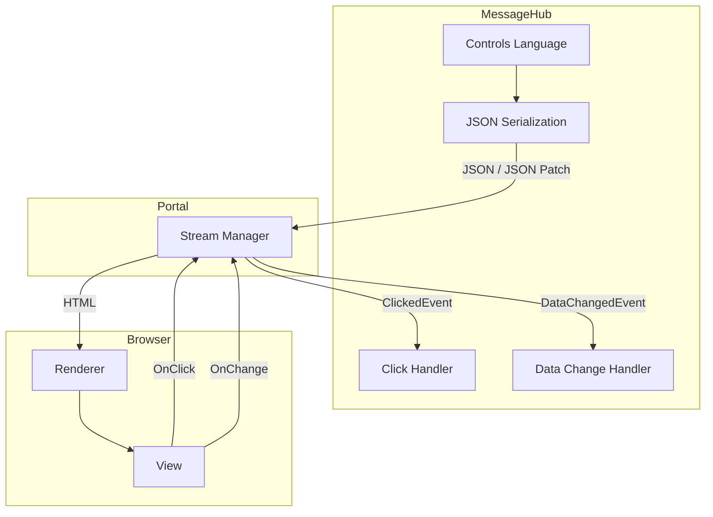
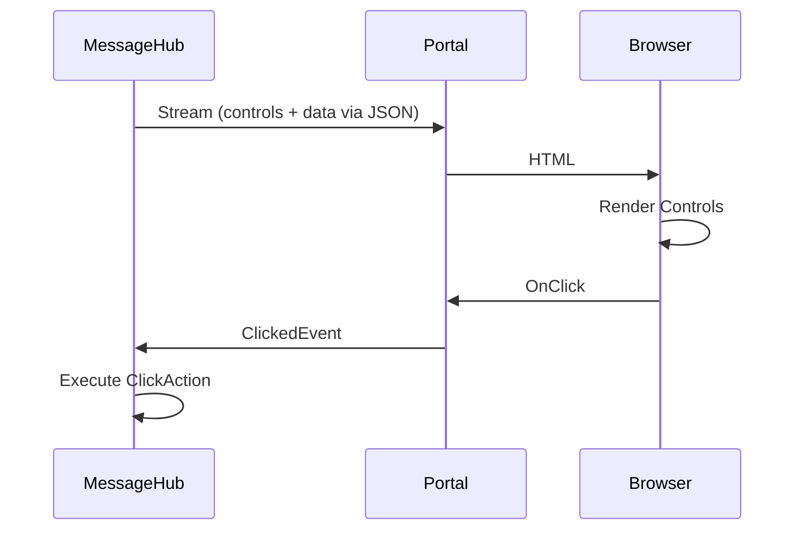

# User Interface Architecture

MeshWeaver generates UI where the data lives. Instead of transferring large datasets to clients, we compute visualizations server-side and stream only the rendered components. This dramatically reduces network traffic and enables real-time interactivity.

## The Data Compression Principle

Consider displaying a million-row dataset as a 10x10 summary table. Rather than transferring all rows to create a 10x10 grid, we want to transfer only 100 numbers:

@@MeshWeaver/Documentation/Architecture/UserInterface/content:data-compression.svg

## Controls Language

In MessageHubs, we define UI using a **Controls Language** - an immutable, declarative API that serializes to JSON:

```csharp
// Server-side control definition
Controls.Stack()
    .WithChildren(
        Controls.Text("Welcome!"),
        Controls.Button("Click Me").WithClickAction(OnClick),
        Controls.DataGrid(salesData)
    )
```

This serializes to JSON and streams to the browser for rendering.

## Two-Way Data Binding



**Key Features:**
- Controls defined server-side where data resides
- JSON serialization for transport to Portal
- HTML rendering in browser
- Two-way binding: UI changes stream back to hubs as events

## Control Lifecycle



### Incremental Updates

After initial load, only changes are transmitted using **JSON Patch** (RFC 6902):

```json
[{"op": "replace", "path": "/areas/counter/Data", "value": 42}]
```

This minimizes bandwidth for real-time updates.

## Available Controls

MeshWeaver provides a rich control library. See the [complete controls reference](MeshWeaver/Documentation/Architecture/UserInterface/AvailableControls) for details.

**Common Controls:**

| Control | Purpose |
|---------|----------|
| `TextFieldControl` | Text input with validation |
| `SelectControl` | Dropdown selection |
| `DataGridControl` | Tabular data display |
| `ButtonControl` | Clickable actions |
| `DialogControl` | Modal dialogs |
| `EditFormControl` | Form containers |
| `LayoutAreaControl` | Nested layout regions |

## Interaction Handling

User interactions become messages:

```csharp
// Define a button with click handler
Controls.Button("Save")
    .WithClickAction(async context =>
    {
        // context.Area - which control was clicked
        // context.Payload - custom data
        // context.Hub - for posting messages
        await context.Hub.Post(new SaveRequest(data));
    })
```

When clicked, the browser sends an `OnClick` to the Portal, which forwards a `ClickedEvent` message to the hub, invoking the registered action.

## Benefits

1. **Bandwidth Efficiency**: Transfer summaries, not raw data
2. **Real-time Updates**: JSON Patch for incremental changes
3. **Security**: Data never leaves the server unnecessarily
4. **Consistency**: Single source of truth on server
5. **Flexibility**: Any control can be data-bound
