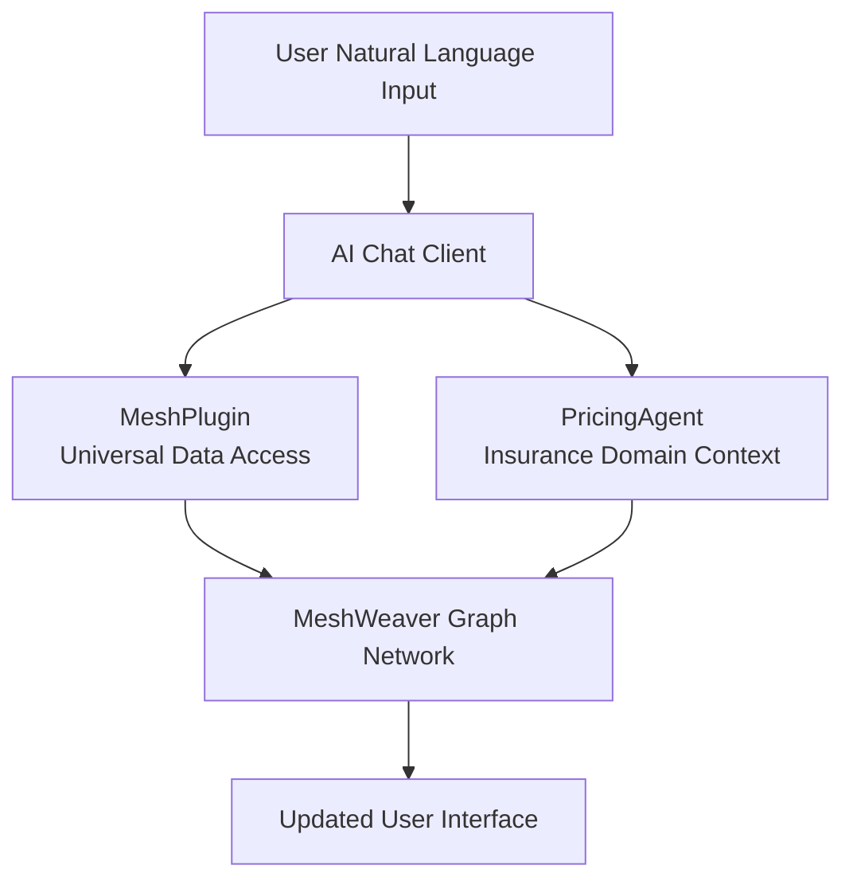

# AI Agent Integration in Cornerstone

One of the most powerful aspects of MeshWeaver's architecture is how naturally it supports AI agent integration. The Cornerstone sample demonstrates this through the PricingAgent, which provides natural language access to insurance pricing data.

## Remote Control Philosophy

AI agents **remote control** MeshWeaver applications rather than being embedded within them. This ensures clean separation of concerns and allows agents to interact through the same message-based interfaces as human users.

For the design philosophy and benefits of this approach, see [Agentic AI Architecture](MeshWeaver/Documentation/Architecture/AgenticAI).

## AI Tool Integration

MeshWeaver uses [Microsoft.Extensions.AI](https://learn.microsoft.com/en-us/dotnet/ai/ai-extensions) to integrate AI capabilities. This framework provides abstractions for chat clients and tool calling.



When a user types a natural language request, the AI agent analyzes intent, determines which tools to call, executes them with appropriate parameters, and returns results through the chat interface.

## MeshPlugin - Universal Data Access

The `MeshPlugin` provides AI agents with tools to interact with the mesh. For the complete API reference, see [MeshPlugin Tools](MeshWeaver/Documentation/AI/Tools/MeshPlugin).

| Tool | Purpose |
|------|---------|
| **Get** | Retrieve nodes by path (`@path` or `@path/*` for children) |
| **Search** | Query nodes using GitHub-style syntax |
| **NavigateTo** | Display a node's visual representation |
| **Update** | Create or modify nodes |

The MeshPlugin is completely generic - it works with Pricings, PropertyRisks, Insureds, or any other MeshNode type.

### Example MeshPlugin Usage

Here's how the AI agent might use the MeshPlugin to handle a user request:

**User Request**: "Show me all bound pricings"

**Agent Process**:
1. `Search("nodeType:Cornerstone/Pricing status:Bound")` → Finds bound pricings
2. `NavigateTo("@Cornerstone/Microsoft/PricingCatalog")` → Displays results in catalog view

## The PricingAgent

The PricingAgent is defined as a markdown MeshNode at `Cornerstone/Pricing/PricingAgent.md`:

```markdown
---
nodeType: Agent
name: Pricing Agent
description: Handles all questions and actions related to insurance pricing,
             property risks, and reinsurance for Cornerstone Insurance.
icon: Shield
category: Agents
groupName: Pricings
isDefault: true
exposedInNavigator: true
---

The agent is the Pricing Agent, specialized in managing reinsurance pricings:
- List, create, and update pricings
- Manage property risks and their geocoded locations
- View reinsurance structures and coverage layers

# Business Context
Cornerstone Insurance is a **reinsurance company** that provides coverage
to primary insurers...

# Reference Data
## Lines of Business
- PROP: Property
- CAS: Casualty
- MAR: Marine
...
```

### Contextual Awareness

The PricingAgent provides essential context that helps the AI understand the insurance domain:

- **Business Structure**: Knows the relationships between insured, primary insurer, broker, and reinsurer
- **Reference Data**: Understands lines of business, countries, currencies, and statuses
- **Layout Areas**: Knows which views are available (Overview, PropertyRisks, RiskMap, etc.)
- **Data Model**: Understands PropertyRisk, ReinsuranceAcceptance, and ReinsuranceSection entities

## Natural Language Processing Examples

The AI agent integration enables sophisticated natural language interactions for insurance tasks.

### Viewing Pricings

**Display Pricing Overview**:
```
User: "Show me the Microsoft 2026 pricing"
Agent: [Displays Overview layout area for Cornerstone/Microsoft/2026]
```

**View Property Risks**:
```
User: "What property risks are in the Microsoft pricing?"
Agent: [Displays PropertyRisks DataGrid showing locations and TSI values]
```

**Geographic Visualization**:
```
User: "Show me the risk map for Microsoft"
Agent: [Displays RiskMap with geocoded property markers on Google Maps]
```

### Querying Data

**Find Pricings by Status**:
```
User: "Show me all draft pricings"
Agent: [Searches for pricings with status:Draft and displays results]
```

**Find by Line of Business**:
```
User: "What property pricings do we have?"
Agent: [Searches for pricings with lineOfBusiness:PROP]
```

**Find by Insured**:
```
User: "Show me all pricings for Global Manufacturing"
Agent: [Navigates to Cornerstone/GlobalManufacturing/PricingCatalog]
```

### Creating Pricings

**New Pricing**:
```
User: "Create a new pricing for Microsoft, 2027 underwriting year"
Agent: "Created draft pricing 'Microsoft 2027' with:
        - Inception: 2027-01-01
        - Expiration: 2027-12-31
        - Line of Business: Property
        - Status: Draft"
```

**With Specific Details**:
```
User: "Create a marine pricing for European Logistics, starting April 2026"
Agent: "Created draft pricing with:
        - Insured: European Logistics Ltd
        - Line of Business: Marine
        - Inception: 2026-04-01
        - Currency: GBP"
```

### Understanding Insurance Terms

**Reference Data Queries**:
```
User: "What lines of business are available?"
Agent: "Available lines of business:
        - PROP: Property
        - CAS: Casualty
        - MARINE: Marine
        - AVIATION: Aviation
        - ENERGY: Energy"
```

**Status Workflow**:
```
User: "What pricing statuses can I use?"
Agent: "Pricing statuses (in order):
        1. Draft - Initial pricing draft
        2. Quoted - Quote issued to client
        3. Bound - Policy bound, coverage in effect
        4. Declined - Rejected by client or underwriter
        5. Expired - Quote or policy has expired"
```

### Reinsurance Structure

**View Structure Diagram**:
```
User: "Show me the reinsurance structure for Microsoft 2026"
Agent: [Displays Structure view with Mermaid diagram of coverage layers]
```

**Layer Details**:
```
User: "What are the coverage layers?"
Agent: "Reinsurance layers:
        - Layer 1: $10M xs $5M (Fire, NatCat, BI)
        - Layer 2: $25M xs $15M (Fire, NatCat)
        - Layer 3: $50M xs $40M (Fire)"
```

### File Management

**View Submissions**:
```
User: "Show me the submission files for Microsoft 2026"
Agent: [Displays Submission file browser]
```

**Import Data**:
```
User: "Import property risks from the uploaded Excel file"
Agent: [Processes Excel file and imports PropertyRisk entities]
```

## Layout Area Integration

Agents display results using appropriate layout areas rather than raw data:

```
CRITICAL: When users ask to view, show, list, or display pricings:
- First check available layout areas using GetLayoutAreas
- If an appropriate layout area exists:
  1. Call DisplayLayoutArea with the appropriate area name
  2. Provide a brief confirmation message
  3. DO NOT also output the raw data as text
```

Available views in Cornerstone:

| View | Use Case |
|------|----------|
| **Overview** | Pricing details and summary |
| **PropertyRisks** | Property location data |
| **RiskMap** | Geographic visualization |
| **Structure** | Reinsurance layers diagram |
| **Submission** | File browser |
| **ImportConfigs** | Import settings |
| **PricingCatalog** | Insured's pricings by status |

## Architecture Benefits

### Scalability

- **Independent Scaling**: AI agents scale separately from the core application
- **Multiple Agents**: Different agents can specialize in different domains
- **Load Distribution**: Agent processing distributes across multiple servers

### Maintainability

- **Clean Separation**: Agent logic is separate from business logic
- **Markdown Definition**: Agents are defined in simple markdown files
- **Easy Updates**: Agent context can be updated without code changes

### Security

- **Standard Access Controls**: Agents use the same authentication as human users
- **Audit Trail**: All agent actions are logged and traceable
- **Sandboxing**: Agents operate through well-defined interfaces

## Domain-Specific Intelligence

The PricingAgent demonstrates domain-specific capabilities:

| Capability | Description |
|------------|-------------|
| **TSI Understanding** | Knows Building, Content, and BI TSI values |
| **Coverage Limits** | Understands attachment points and layer limits |
| **Industry Terms** | Recognizes EPI, rates, commissions |
| **Geographic Context** | Handles property geocoding and mapping |
| **Workflow Status** | Manages Draft → Quoted → Bound progression |

## Conclusion

MeshWeaver's AI agent integration in Cornerstone demonstrates how thoughtful architectural design enables powerful AI capabilities for insurance applications. The PricingAgent provides:

- Natural language access to complex insurance data
- Domain-aware responses using insurance terminology
- Visual representations through layout areas
- File management and Excel import workflows
- Real-time updates as data changes

This approach positions insurance applications to take full advantage of advancing AI capabilities while maintaining clean architecture, security, and scalability.
