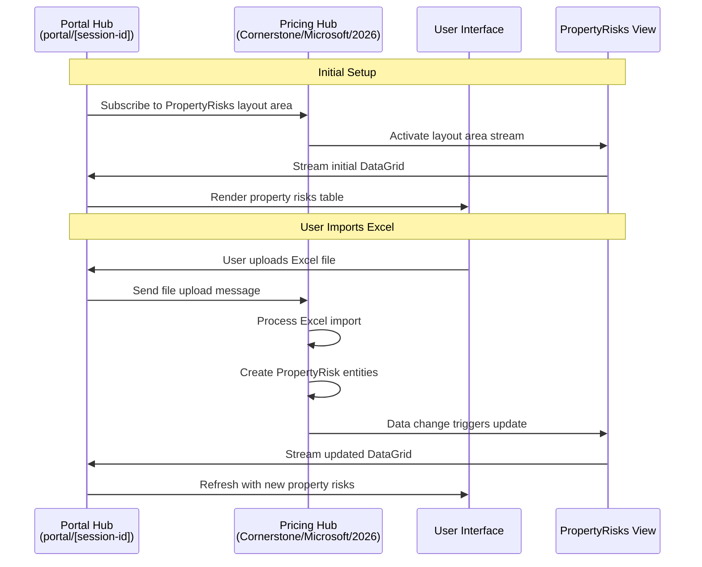

# Cornerstone Architecture

Understanding the architectural principles behind MeshWeaver applications through the lens of the Cornerstone Insurance sample. This document explores how reinsurance pricing, property risks, and file management are organized in a distributed, message-driven architecture.

## Core Architectural Principles

MeshWeaver applications are built with three fundamental principles in mind:

1. **Cloud-First Design**: Every component is designed to run efficiently in cloud environments, leveraging horizontal scaling and cloud services
2. **Distributed Systems**: The application architecture embraces distribution as a core concept, with components communicating through well-defined message protocols
3. **Asynchronous Interaction Patterns**: User interactions, especially those involving AI chat agents, are designed to handle long-running operations that may take hours or even days to complete

### Architecture Patterns

MeshWeaver applications can be organized using various architectural patterns:

- **[Clean Architecture](https://medium.com/multinetinventiv/clean-architecture-part-one-what-is-clean-architecture-3d9f16e831bf)**: Message-driven design supports clean architecture by enforcing clear boundaries between business logic and infrastructure
- **[Modular Monolith](https://medium.com/design-microservices-architecture-with-patterns/microservices-killer-modular-monolithic-architecture-ac83814f6862)**: Different modules are deployed together but maintain logical separation through message hubs
- **[Vertical Slice Architecture](https://en.wikipedia.org/wiki/Hexagonal_architecture_(software))**: Each feature is implemented as a complete vertical slice from UI to data

The Cornerstone sample demonstrates a modular approach where the Pricing functionality is encapsulated in a reusable NodeType with clear message-based interfaces.

## The MeshNode and Namespace Hierarchy

MeshWeaver organizes data using MeshNodes in a hierarchical namespace. For the complete architecture details, see [Mesh Graph Architecture](MeshWeaver/Documentation/Architecture/MeshGraph).

### Cornerstone Namespace Hierarchy

```
Cornerstone/                           # Reinsurance company namespace
├── Insured.json                       # Insured NodeType definition
├── Pricing.json                       # Pricing NodeType definition
├── Pricing/                           # Pricing-related assets
│   ├── Code/                          # Business logic and views
│   │   ├── Pricing.cs                 # Pricing entity
│   │   ├── PricingViews.cs            # Layout area views
│   │   ├── PricingStatus.cs           # Status dimension
│   │   ├── PropertyRisk.cs            # Risk entity
│   │   ├── ReinsuranceAcceptance.cs   # Layer entity
│   │   └── ReinsuranceSection.cs      # Section entity
│   └── PricingAgent.md                # AI agent definition
├── Code/                              # Shared reference data
│   ├── Country.cs                     # Country dimension
│   ├── Currency.cs                    # Currency dimension
│   ├── LineOfBusiness.cs              # LOB dimension
│   └── LegalEntity.cs                 # Legal entity dimension
├── Microsoft/                         # Insured instance
│   ├── Microsoft.json                 # Insured data
│   └── 2026/                          # Pricing instance
│       ├── 2026.json                  # Pricing data
│       └── Submissions/               # Content collection
└── GlobalManufacturing/               # Another insured
    └── 2024/                          # Pricing instance
```

### Path Examples

| Node | Full Path |
|------|-----------|
| Microsoft insured | `Cornerstone/Microsoft` |
| Microsoft 2026 pricing | `Cornerstone/Microsoft/2026` |
| Pricing NodeType | `Cornerstone/Pricing` |
| Insured NodeType | `Cornerstone/Insured` |

## NodeType Configuration

NodeTypes define the behavior for instances. The Cornerstone sample uses two primary NodeTypes.

### Insured NodeType

The Insured NodeType (`Cornerstone/Insured`) defines client organizations:

```json
{
  "id": "Insured",
  "namespace": "Cornerstone",
  "name": "Insured",
  "nodeType": "NodeType",
  "content": {
    "$type": "NodeTypeDefinition",
    "configuration": "config => config
        .WithContentType<Insured>()
        .AddData(data => data.AddSource(source => source
            .WithType<PricingStatus>(t => t.WithInitialData(PricingStatus.All))))
        .AddDefaultLayoutAreas()
        .AddLayout(layout => layout
            .WithDefaultArea(\"PricingCatalog\")
            .AddCornerstoneViews())"
  }
}
```

This configuration:
- Sets `Insured` as the content type
- Provides PricingStatus dimension data for filtering pricings
- Registers views for the pricing catalog

### Pricing NodeType

The Pricing NodeType (`Cornerstone/Pricing`) defines individual pricings:

```json
{
  "id": "Pricing",
  "namespace": "Cornerstone",
  "name": "Pricing",
  "nodeType": "NodeType",
  "content": {
    "$type": "NodeTypeDefinition",
    "configuration": "config => config
        .WithContentType<Pricing>()
        .AddContentCollection(sp => {
            var hub = sp.GetRequiredService<IMessageHub>();
            var pricingId = hub.Address.Id;
            var basePath = Path.Combine(\"...\", \"Submissions\");
            return new ContentCollectionConfig {
                SourceType = FileSystemStreamProvider.SourceType,
                Name = $\"Submissions@{pricingId}\",
                BasePath = basePath,
                DisplayName = \"Submission Files\"
            };
        })
        .AddData(data => data.AddSource(source => source
            .WithType<LineOfBusiness>(t => t.WithInitialData(LineOfBusiness.All))
            .WithType<Country>(t => t.WithInitialData(Country.All))
            .WithType<Currency>(t => t.WithInitialData(Currency.All))
            .WithType<LegalEntity>(t => t.WithInitialData(LegalEntity.All))
            .WithType<PricingStatus>(t => t.WithInitialData(PricingStatus.All))
            .WithType<PropertyRisk>()
            .WithType<ReinsuranceAcceptance>()
            .WithType<ReinsuranceSection>()
            .WithType<ExcelImportConfiguration>()))
        .AddDefaultLayoutAreas()
        .AddLayout(layout => layout
            .WithDefaultArea(\"Overview\")
            .AddPricingViews())"
  }
}
```

This configuration:
- Sets `Pricing` as the content type
- Configures a ContentCollection for file uploads (Submissions)
- Registers multiple dimension types (LineOfBusiness, Country, Currency, etc.)
- Registers business entities (PropertyRisk, ReinsuranceAcceptance, ReinsuranceSection)
- Sets Overview as the default layout area

## Data Model

### Dimensions

Dimensions provide reference data for filtering and classification:

| Dimension | Values | Purpose |
|-----------|--------|---------|
| **LineOfBusiness** | PROP, CAS, MARINE, AVIATION, ENERGY | Insurance classification |
| **Country** | US, GB, DE, FR, JP, CN, AU, CA, CH, SG | Geographic classification |
| **Currency** | USD, EUR, GBP, JPY, CHF, AUD, CAD | Monetary values |
| **PricingStatus** | Draft, Quoted, Bound, Declined, Expired | Workflow status |
| **LegalEntity** | CS-US, CS-UK, CS-EU, CS-ASIA | Cornerstone legal entities |

### Business Entities

Business entities store pricing-specific data:

| Entity | Description | Key Fields |
|--------|-------------|------------|
| **PropertyRisk** | Insured locations | Address, City, Country, TSI values, Coordinates |
| **ReinsuranceAcceptance** | Coverage layers | Layer name, Attachment point, Limit, EPI |
| **ReinsuranceSection** | Layer sections | Section name, Coverage type, Rate |
| **ExcelImportConfiguration** | Import settings | Column mappings, Sheet name |

## Message Hub Architecture

### Hub Addressing and Partitioning

Cornerstone uses namespace paths for hub partitioning:

- `Cornerstone/Microsoft` - Microsoft insured hub
- `Cornerstone/Microsoft/2026` - Microsoft 2026 pricing hub
- `Cornerstone/GlobalManufacturing` - GlobalManufacturing insured hub
- `Cornerstone/GlobalManufacturing/2024` - GlobalManufacturing 2024 pricing hub

Each pricing gets its own hub context, enabling:
- Independent scaling of busy pricings
- Data isolation between clients
- Separate file storage per pricing

### Portal Architecture

The `portal/[id]` address pattern creates individual hub instances for each browser session:

- **Session Isolation**: Each user gets their own portal instance
- **Personalized Experience**: User-specific state and preferences
- **Scalable Connections**: Portal instances distribute across servers

## Interaction Flow

The following diagram illustrates how components interact when a user views property risks:



### Step-by-Step Breakdown

1. **Subscription Phase**: The portal subscribes to layout areas in the pricing hub
2. **User Action**: User uploads an Excel file with property data
3. **Message Dispatch**: The portal sends the file to the pricing hub
4. **Data Processing**: The hub processes the Excel and creates PropertyRisk entities
5. **Layout Reaction**: Data changes trigger the PropertyRisks view to regenerate
6. **Stream Update**: The updated DataGrid is streamed to all subscribed portals
7. **UI Refresh**: The portal receives the update and refreshes the table

## Views and Layout Areas

MeshWeaver follows the MVVM pattern. Views are registered through NodeType configuration and executed reactively.

### Pricing Views

| View | Description | Content |
|------|-------------|---------|
| **Overview** | Pricing summary | Header, dates, parties, status |
| **PropertyRisks** | Risk data | DataGrid with location details and TSI |
| **RiskMap** | Geographic view | Google Maps with risk markers |
| **Structure** | Reinsurance layers | Mermaid diagram of coverage |
| **Submission** | File management | File browser for uploads |
| **ImportConfigs** | Import settings | Excel column mappings |

### View Registration

Views are defined in `PricingViews.cs` and registered via the NodeType:

```csharp
public static LayoutDefinition AddPricingViews(this LayoutDefinition layout) =>
    layout
        .WithView("Overview", Overview)
        .WithView("PropertyRisks", PropertyRisks)
        .WithView("RiskMap", RiskMap)
        .WithView("Structure", Structure)
        .WithView("Submission", Submission)
        .WithView("ImportConfigs", ImportConfigs);
```

### Reactive View Updates

Views return `IObservable<UiControl?>`, enabling reactive updates:

```csharp
public static IObservable<UiControl?> PropertyRisks(LayoutAreaHost host, RenderingContext _)
{
    var risks = host.Hub.GetDataContext()
        .ObserveCollection<PropertyRisk>();

    return risks.Select(riskList =>
    {
        // Build DataGrid with property risk rows
        return (UiControl?)new DataGridControl()
            .WithColumns(...)
            .WithData(riskList);
    });
}
```

When property risks change, the observable emits new values and the view automatically updates.

## Content Collections

Pricings use ContentCollections for file management:

```csharp
.AddContentCollection(sp => {
    var hub = sp.GetRequiredService<IMessageHub>();
    return new ContentCollectionConfig {
        SourceType = FileSystemStreamProvider.SourceType,
        Name = $"Submissions@{hub.Address.Id}",
        BasePath = "path/to/Submissions",
        DisplayName = "Submission Files"
    };
})
```

This enables:
- **File Uploads**: Upload slip documents, Excel data, PDFs
- **File Browsing**: View and download submitted files
- **Version Tracking**: Track file changes over time
- **Excel Import**: Import property risks from spreadsheets

## Conclusion

MeshWeaver's architecture provides a robust foundation for insurance applications. The Cornerstone sample demonstrates:

- **Hierarchical Organization**: Insured → Pricing hierarchy with natural data partitioning
- **Shared NodeTypes**: Pricing NodeType reused across all insureds
- **Rich Data Model**: Dimensions, business entities, and file collections
- **Reactive Views**: Real-time updates for property risks, maps, and diagrams
- **Message-Driven**: Clean separation through well-defined message contracts

This architecture enables scalable, maintainable, and testable insurance applications with excellent performance and real-time collaboration.
