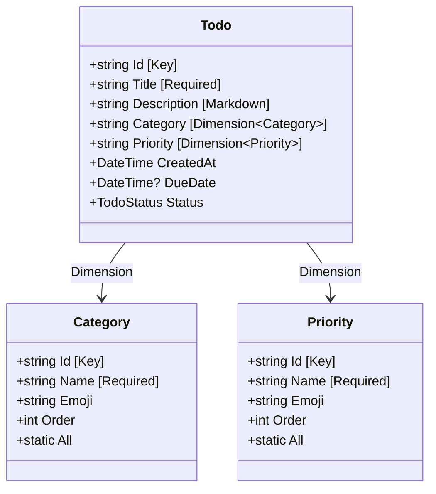
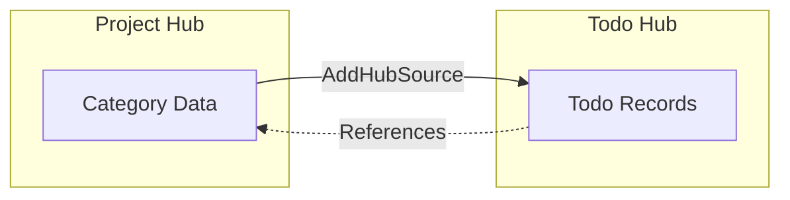

This guide explains how to define data models in MeshWeaver using C# records, attributes, and reference data patterns.

# Overview

MeshWeaver data models are defined as C# records that combine:
- **Properties** with standard CLR types (string, int, DateTime, etc.)
- **Attributes** that control persistence, validation, and UI behavior
- **Static instances** for reference data (lookups, categories, statuses)

# Key Concepts

## C# Records

Records are a C# language feature for defining data types. Unlike regular classes, records:
- Are **immutable by default** - properties can't be changed after creation
- Have **value-based equality** - two records with the same property values are considered equal
- Support **with expressions** - create modified copies without changing the original

```csharp
// Define a record
public record Person { public string Name { get; init; } }

// Create an instance
var alice = new Person { Name = "Alice" };

// Create a modified copy (original unchanged)
var bob = alice with { Name = "Bob" };
```

Records are ideal for data models because they prevent accidental mutations and simplify change tracking.

## Attributes

Attributes are metadata annotations applied to code elements using square brackets `[]`. They provide declarative information that MeshWeaver reads at runtime to determine how to handle properties.

```csharp
[Key]                    // Marks as primary key
[Required]               // Validates non-empty value
[DisplayName("Due Date")] // Sets UI label
public DateTime? DueDate { get; init; }
```

Attributes don't change what the code does - they add information that frameworks can use to generate UI, validate data, or control persistence.

## Standard CLR Types

CLR (Common Language Runtime) is .NET's execution engine. Standard CLR types are the built-in types available in any .NET application:

| Type | Description | Example Values |
|------|-------------|----------------|
| `string` | Text | `"Hello"`, `"ACME"` |
| `int` | Whole numbers | `1`, `42`, `-5` |
| `decimal` | Precise decimals | `19.99m`, `0.001m` |
| `bool` | True/false | `true`, `false` |
| `DateTime` | Date and time | `DateTime.UtcNow` |
| `Guid` | Unique identifiers | `Guid.NewGuid()` |

Nullable versions (e.g., `int?`, `DateTime?`) allow the value to be absent.

## Reference Data Pattern

Reference data (also called lookup data or master data) represents predefined values that rarely change - like statuses, categories, or priorities. Instead of using simple enums, MeshWeaver uses rich data objects:

```csharp
// Simple enum - limited metadata
public enum Priority { Low, Medium, High }

// Reference data - rich metadata
public record Priority
{
    public string Id { get; init; }
    public string Name { get; init; }
    public string Emoji { get; init; }  // Display icon
    public int Order { get; init; }      // Sort order

    public static readonly Priority High = new() { Id = "High", Name = "High Priority", Emoji = "🔥", Order = 0 };
    public static readonly Priority[] All = [High, Medium, Low];
}
```

This pattern provides display names, icons, descriptions, and ordering that enums cannot express.

# Anatomy of a Data Model



# Basic Record Structure

Data models are defined as C# records with properties and attributes.

## Example: Simple Entity

```csharp
public record Todo
{
    [Key]
    [Browsable(false)]
    public string Id { get; init; } = string.Empty;

    [Required]
    public string Title { get; init; } = string.Empty;

    [Markdown(EditorHeight = "200px", ShowPreview = false)]
    public string? Description { get; init; }

    [DisplayName("Due Date")]
    public DateTime? DueDate { get; init; }

    public TodoStatus Status { get; init; } = TodoStatus.Pending;
}
```

**Result in Editor UI:**

| Field | Rendered As |
|-------|-------------|
| Id | Hidden (Browsable=false) |
| Title | Required text input with validation |
| Description | Markdown editor, 200px height |
| Due Date | Date picker with "Due Date" label |
| Status | Dropdown with enum values |

# Key Attributes

## [Key]

Marks the primary key field. Required for all data models.

```csharp
[Key]
public string Id { get; init; } = string.Empty;
```

## [Required]

Validates that the field has a non-empty value before saving.

```csharp
[Required]
public string Title { get; init; } = string.Empty;
```

**Result:** Attempting to save without a Title shows validation error: "Title is required"

## [Browsable(false)]

Hides the field from editor forms and data grids.

```csharp
[Browsable(false)]
public string Id { get; init; } = string.Empty;
```

**Use cases:**
- Internal identifiers users shouldn't edit
- Computed fields
- System timestamps

## [DisplayName]

Sets a custom label in the UI instead of the property name.

```csharp
[DisplayName("Due Date")]
public DateTime? DueDate { get; init; }

[DisplayName("Created At")]
public DateTime CreatedAt { get; init; } = DateTime.UtcNow;
```

**Result:** Property `DueDate` displays as "Due Date" in forms and grids.

## [Markdown]

Renders a markdown editor for rich text content.

```csharp
[Markdown(EditorHeight = "200px", ShowPreview = false)]
public string? Description { get; init; }
```

**Parameters:**
- `EditorHeight`: Height of the editor area (default: auto)
- `ShowPreview`: Whether to show live preview pane (default: true)

## [Dimension<T>]

Links the field to a reference data type for dropdown selection.

```csharp
[Dimension<Category>]
public string Category { get; init; } = "General";

[Dimension<Priority>]
public string Priority { get; init; } = "Medium";
```

**Result:** The editor renders a dropdown populated with values from the `Category.All` and `Priority.All` arrays.

# Reference Data Pattern

Reference data (lookups, categories, statuses) follows a specific pattern with static instances.

## Structure

```csharp
public record Priority
{
    [Key]
    public string Id { get; init; } = string.Empty;

    [Required]
    public string Name { get; init; } = string.Empty;

    public string Emoji { get; init; } = string.Empty;

    public int Order { get; init; }

    public bool IsExpandedByDefault { get; init; } = true;

    // Static instances
    public static readonly Priority Critical = new()
    {
        Id = "Critical",
        Name = "Critical Priority",
        Emoji = "🚨",
        Order = 0,
        IsExpandedByDefault = true
    };

    public static readonly Priority High = new()
    {
        Id = "High",
        Name = "High Priority",
        Emoji = "🔥",
        Order = 1,
        IsExpandedByDefault = true
    };

    public static readonly Priority Medium = new()
    {
        Id = "Medium",
        Name = "Medium Priority",
        Emoji = "🟡",
        Order = 2,
        IsExpandedByDefault = false
    };

    public static readonly Priority Low = new()
    {
        Id = "Low",
        Name = "Low Priority",
        Emoji = "🟢",
        Order = 3,
        IsExpandedByDefault = false
    };

    public static readonly Priority Unset = new()
    {
        Id = "Unset",
        Name = "Unset Priority",
        Emoji = "❓",
        Order = 4,
        IsExpandedByDefault = false
    };

    // All instances array for initialization
    public static readonly Priority[] All = [Critical, High, Medium, Low, Unset];

    // Helper method for lookups
    public static Priority GetById(string? id) =>
        All.FirstOrDefault(p => p.Id == id) ?? Unset;
}
```

## Key Components

| Component | Purpose |
|-----------|---------|
| Static instances | Named constants for type-safe references |
| `All` array | Collection for data initialization |
| `Order` property | Controls sort order in dropdowns and groupings |
| `GetById` method | Safe lookup with fallback to default |

## Configuring Reference Data

Reference data is initialized when configuring the NodeType:

```csharp
config => config
    .WithContentType<Project>()
    .AddData(data => data
        .AddSource(source => source
            .WithType<Status>(t => t.WithInitialData(Status.All))
            .WithType<Category>(t => t.WithInitialData(Category.All))
            .WithType<Priority>(t => t.WithInitialData(Priority.All))))
```

**Result:** When a Project hub initializes, it populates its data store with all predefined Status, Category, and Priority values.

# Enums vs Reference Data

MeshWeaver supports both enums and reference data records. Choose based on your requirements.

## When to Use Enums

```csharp
public enum TodoStatus
{
    Pending,
    InProgress,
    InReview,
    Completed,
    Blocked
}
```

**Advantages:**
- Simple to define
- Type-safe in code
- No additional configuration needed

**Limitations:**
- No metadata (descriptions, icons, order)
- Requires recompilation to add values
- Display name is the enum member name

## When to Use Reference Data

```csharp
public record Status
{
    [Key]
    public string Id { get; init; } = string.Empty;

    [Required]
    public string Name { get; init; } = string.Empty;

    public string? Description { get; init; }

    public int Order { get; init; }

    public static readonly Status Planning = new()
    {
        Id = "Planning",
        Name = "Planning",
        Description = "Project is in planning phase",
        Order = 1
    };

    // ... additional instances

    public static IEnumerable<Status> All => new[] { Planning, Active, OnHold, Completed };
}
```

**Advantages:**
- Rich metadata (descriptions, icons, colors)
- Configurable display order
- Can be extended without recompilation (future)
- Supports hub-to-hub synchronization

**Use reference data when:**
- Values need descriptions or display metadata
- Grouping/ordering behavior varies by context
- Values are shared across hub boundaries
- UI customization per value is needed

# Content Initialization

Implement `IContentInitializable` to transform data when loaded from storage.

## Example: Computing Dates

```csharp
public record Todo : IContentInitializable
{
    [Key]
    [Browsable(false)]
    public string Id { get; init; } = string.Empty;

    [Required]
    public string Title { get; init; } = string.Empty;

    [DisplayName("Due Date")]
    public DateTime? DueDate { get; init; }

    [Browsable(false)]
    public int? DueDateOffsetDays { get; init; }

    public object Initialize()
    {
        if (DueDateOffsetDays.HasValue)
        {
            return this with { DueDate = DateTime.UtcNow.Date.AddDays(DueDateOffsetDays.Value) };
        }
        return this;
    }
}
```

**Use case:** Store relative offsets in JSON for demo data, compute actual dates at runtime.

**JSON input:**
```json
{
  "id": "ReviewDocs",
  "title": "Review documentation",
  "dueDateOffsetDays": 3
}
```

**Result after initialization (if today is 2026-01-29):**
```json
{
  "id": "ReviewDocs",
  "title": "Review documentation",
  "dueDate": "2026-02-01T00:00:00Z",
  "dueDateOffsetDays": 3
}
```

# Data Model Relationships

## One-to-Many via Dimension

The `[Dimension<T>]` attribute creates a foreign key relationship:

```csharp
public record Todo
{
    [Dimension<Category>]
    public string Category { get; init; } = "General";
}
```

**Data flow:**



## Parent-Child via Hub Hierarchy

Child hubs can access parent hub data using `AddHubSource`:

```csharp
// Todo NodeType configuration
config => config
    .WithContentType<Todo>()
    .AddData(data => data
        .AddHubSource(
            new Address(config.Address.Segments.Take(config.Address.Segments.Length - 2).ToArray()),
            source => source
                .WithType<Status>()
                .WithType<Category>()
                .WithType<Priority>()))
```

**Address calculation:**
- Todo at: `ACME/ProductLaunch/Todo/AnalystBriefings`
- Parent at: `ACME/ProductLaunch`
- Formula: Remove last 2 segments

# Complete Example

## Project Data Model

```csharp
public record Project
{
    [Key]
    [Browsable(false)]
    public string Id { get; init; } = string.Empty;

    [Required]
    public string Name { get; init; } = string.Empty;

    [Markdown(EditorHeight = "150px")]
    public string? Description { get; init; }

    [Dimension<Status>]
    public string Status { get; init; } = "Planning";

    [DisplayName("Target Date")]
    public DateTime? TargetDate { get; init; }
}
```

## Project NodeType Configuration

```json
{
  "id": "Project",
  "namespace": "ACME",
  "nodeType": "NodeType",
  "content": {
    "$type": "NodeTypeDefinition",
    "configuration": "config => config.WithContentType<Project>().AddData(data => data.AddSource(source => source.WithType<Status>(t => t.WithInitialData(Status.All)).WithType<Category>(t => t.WithInitialData(Category.All)).WithType<Priority>(t => t.WithInitialData(Priority.All)))).AddDefaultLayoutAreas()"
  }
}
```

## Todo Data Model

```csharp
public record Todo : IContentInitializable
{
    [Key]
    [Browsable(false)]
    public string Id { get; init; } = string.Empty;

    [Required]
    public string Title { get; init; } = string.Empty;

    [Markdown(EditorHeight = "200px", ShowPreview = false)]
    public string? Description { get; init; }

    [Dimension<Category>]
    public string Category { get; init; } = "General";

    [Dimension<Priority>]
    public string Priority { get; init; } = "Medium";

    public string? Assignee { get; init; }

    [DisplayName("Due Date")]
    public DateTime? DueDate { get; init; }

    [Browsable(false)]
    public int? DueDateOffsetDays { get; init; }

    public TodoStatus Status { get; init; } = TodoStatus.Pending;

    public object Initialize()
    {
        if (DueDateOffsetDays.HasValue)
        {
            return this with { DueDate = DateTime.UtcNow.Date.AddDays(DueDateOffsetDays.Value) };
        }
        return this;
    }
}
```

## Todo NodeType Configuration

```json
{
  "id": "Todo",
  "namespace": "ACME/Project",
  "nodeType": "NodeType",
  "content": {
    "$type": "NodeTypeDefinition",
    "configuration": "config => config.WithContentType<Todo>().AddData(data => data.AddHubSource(new Address(config.Address.Segments.Take(config.Address.Segments.Length - 2).ToArray()), source => source.WithType<Status>().WithType<Category>().WithType<Priority>())).AddDefaultLayoutAreas()"
  }
}
```

# Best Practices

1. **Use records, not classes**: Records provide immutability and value semantics ideal for data models

2. **Always provide defaults**: Initialize properties with sensible defaults to avoid null issues
   ```csharp
   public string Status { get; init; } = "Pending";
   ```

3. **Hide internal fields**: Use `[Browsable(false)]` for IDs, timestamps, and computed fields

4. **Prefer reference data over enums**: For values that need metadata, ordering, or UI customization

5. **Use `Order` for consistent sorting**: Define explicit order values in reference data

6. **Include fallback in GetById**: Always handle missing values gracefully
   ```csharp
   public static Priority GetById(string? id) =>
       All.FirstOrDefault(p => p.Id == id) ?? Unset;
   ```

7. **Document with XML comments**: Add summaries for complex fields
   ```csharp
   /// <summary>
   /// Offset in days from today for calculating DueDate.
   /// </summary>
   public int? DueDateOffsetDays { get; init; }
   ```

8. **Use meaningful property names**: Prefer `Category` over `CategoryId` when using `[Dimension<T>]`
