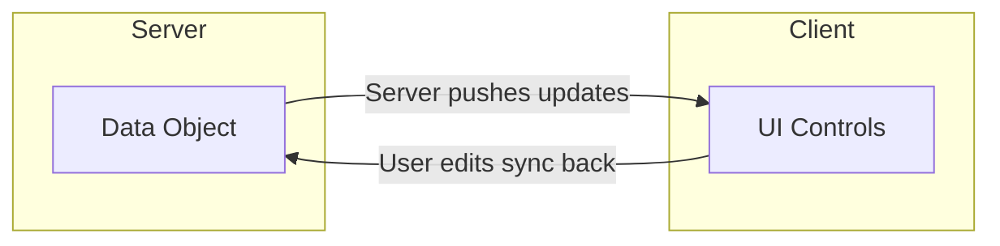
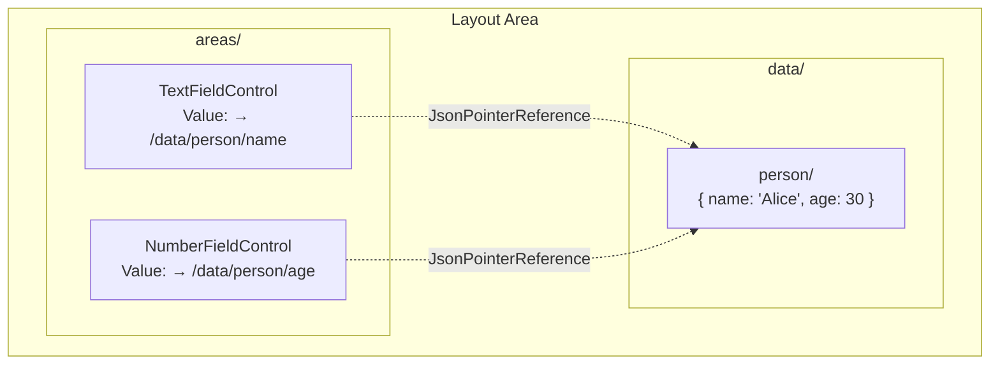
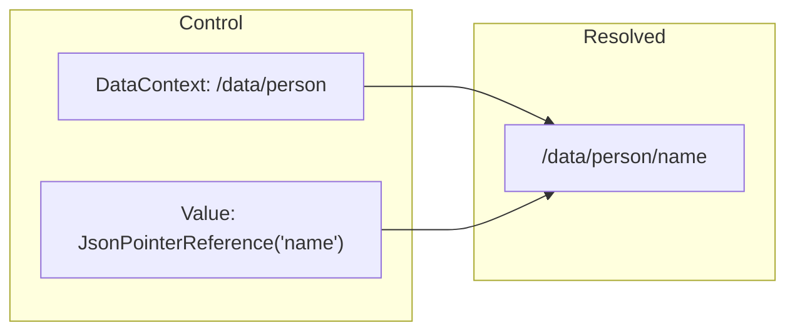
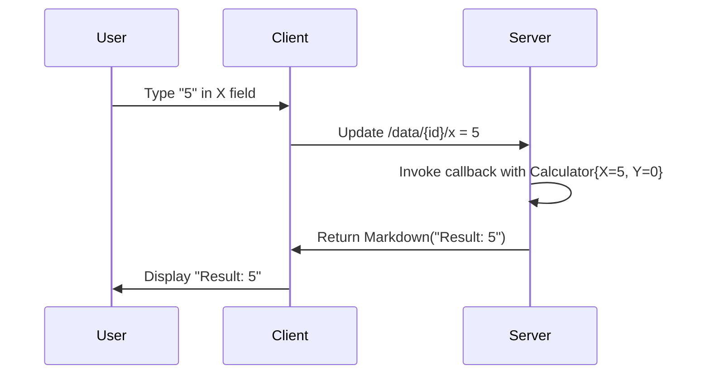

# Data Binding in MeshWeaver Layout

Data binding connects your data objects to UI controls. You bind an object to the UI, the user edits it, and changes sync back to the server. The binding is **two-way**: the server can push updates to the UI, and user input flows back to the server.



## Layout Area Structure

A layout area consists of two parts: **areas** (the UI controls) and **data** (the bound objects). Controls reference data locations using `JsonPointerReference`.



When the user types in the TextFieldControl, the value at `/data/person/name` updates. When server code updates the data, the TextFieldControl displays the new value.

## DataContext

The `DataContext` property sets the base path for data binding. All `JsonPointerReference` values are resolved relative to this path.

```csharp
// EditorControl with DataContext pointing to /data/person
new EditorControl { DataContext = "/data/person" }
```

When you call `Edit(instance, "person")`, the data is stored at `/data/person` and the generated controls have `DataContext = "/data/person"`.

## JsonPointerReference

`JsonPointerReference` points a control's value to a location in the data section. The pointer is **relative to DataContext**:

```csharp
// TextFieldControl bound to the "name" property
new TextFieldControl(new JsonPointerReference("name"))

// NumberFieldControl bound to the "age" property
new NumberFieldControl(new JsonPointerReference("age"))
```

With `DataContext = "/data/person"`:
- `JsonPointerReference("name")` → `/data/person/name`
- `JsonPointerReference("age")` → `/data/person/age`



## Updating Data

To update the bound data from server code, use `UpdateData`:

```csharp
// Push new data to the stream
host.UpdateData("person", new Person { Name = "Bob", Age = 25 });
```

This updates `/data/person` and all bound controls automatically reflect the change.

## The Edit Macro

The `Edit` method is the easiest way to create a data-bound editor. It generates controls for each property automatically:

```csharp
// Create an editor for a Calculator
host.Hub.Edit(new Calculator(), "calc");
```

### Property Type Mapping

| Property Type | Generated Control |
|---------------|-------------------|
| `double`, `int`, numeric | `NumberFieldControl` |
| `string` | `TextFieldControl` |
| `DateTime` | `DateTimeControl` |
| `bool` | `CheckBoxControl` |
| `[Dimension<T>]` | `SelectControl` |
| `[UiControl<T>]` | Custom control |

### Example

```csharp
public record Calculator
{
    [Description("The X value")]
    public double X { get; init; }

    [Description("The Y value")]
    public double Y { get; init; }
}

// Creates EditorControl with two NumberFieldControls
// bound to /data/calc/x and /data/calc/y
host.Hub.Edit(new Calculator(), "calc");
```

## Edit with Result Callback

Add a result callback to compute derived values from user input:

```csharp
// Editor that displays X + Y as the user types
host.Hub.Edit(new Calculator(), c => Controls.Markdown($"Result: {c.X + c.Y}"));
```

This creates:
1. Editor controls for X and Y
2. A result area that recalculates whenever either value changes



## Two-Way Sync Details

Changes are synchronized using JSON Patch (RFC 6902) for efficient delta updates:

```json
[{"op": "replace", "path": "/data/calc/x", "value": 5}]
```

- **Client → Server**: User edits create patches sent to the server
- **Server → Client**: Server updates create patches sent to clients

## Control-Specific Bindings

### Dimension Attribute

Properties with `[Dimension]` create select controls with options loaded from the workspace:

```csharp
public record MyForm
{
    [Dimension<Country>]
    public string CountryCode { get; init; }
}
```

### Custom Control Attribute

Use `[UiControl<T>]` to specify which control type to generate:

```csharp
public record MyForm
{
    [UiControl<RadioGroupControl>(Options = new[] { "chart", "table" })]
    public string DisplayMode { get; init; }

    [UiControl<TextAreaControl>]
    public string Notes { get; init; }
}
```

## Best Practices

1. **Use Records**: Immutable records with `init` properties work best for data binding
2. **Add Metadata**: Use `[Description]` and `[Display]` attributes for better generated UIs
3. **Use Edit for Forms**: Let Edit generate controls automatically for standard forms
4. **Callbacks for Computed Values**: Use the result callback pattern for derived values
