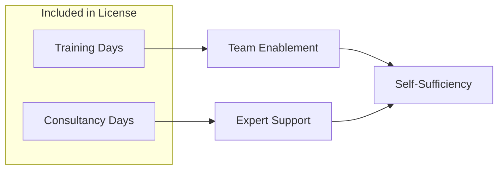
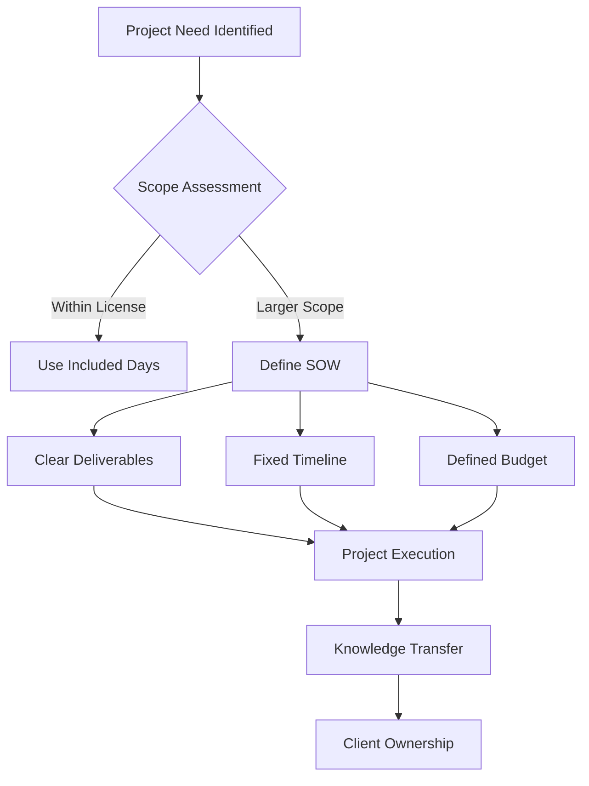

# Collaboration Model

At Systemorph, our mission is to **empower you**. We believe that you should own your MeshWeaver applications and data nodes - building, maintaining, and evolving them on your terms. Our collaboration model is designed to transfer knowledge and capability, not create dependency.

## The Driver/Passenger Journey

We've designed a partnership model that evolves with your capabilities:

@@Systemorph/Marketing/CollaborationModel/content:driver-passenger-transition.svg

### Phase 1: We Drive, You Learn

In the beginning, **Systemorph takes the driver's seat**:

- We lead the initial implementation
- We make architectural decisions with your input
- We establish patterns and best practices
- You observe, learn, and ask questions
- Together, we document everything for knowledge transfer

This ensures a strong foundation while you gain hands-on familiarity with MeshWeaver's approach.

### Phase 2: You Drive, We Navigate

As your team gains confidence, **you take the wheel**:

- Your team leads development and maintenance
- Systemorph moves to an advisory role
- We're available for guidance on complex decisions
- We help when you encounter challenging terrain
- You own the roadmap and execution

> *"Our goal is to make ourselves increasingly optional - not indispensable."*

## Training & Education

We offer comprehensive training programs to accelerate your journey to independence:

| Format | Description | Best For |
|--------|-------------|----------|
| **In-Person Training** | Intensive hands-on workshops at your location | Team kickoffs, complex topics |
| **Online Training** | Virtual sessions with live instruction | Distributed teams, ongoing learning |
| **Self-Paced Modules** | Recorded content with exercises | New team members, refreshers |
| **Pair Programming** | Work alongside our engineers | Learning by doing |

Our training covers:
- MeshWeaver fundamentals and architecture
- Data node design and implementation
- Application development patterns
- AI agent integration
- Operations and maintenance

## Commercial License Benefits

Your commercial license includes built-in support for your journey:

### What's Included

- **Training Days**: Dedicated sessions to upskill your team
- **Consultancy Days**: Expert time for guidance and problem-solving

These included days can be used flexibly:

| Need | How We Help |
|------|-------------|
| New project kickoff | Consultation on architecture and approach |
| Complex feature | We build the difficult parts with you |
| Knowledge gaps | Targeted training on specific topics |
| Code review | Expert review of your implementations |
| Troubleshooting | Help debugging challenging issues |

## Framework Contracts & SOWs

For larger engagements, we recommend a structured approach:

### Framework Contract

A **framework contract** establishes our ongoing partnership:

- Agreed terms and conditions
- Rate cards for different service types
- SLA commitments
- Intellectual property clarity
- Streamlined engagement process

### Statement of Work (SOW)

For projects exceeding your included consultancy days, we issue **Statements of Work**:

Each SOW includes:

| Element | Description |
|---------|-------------|
| **Scope** | Precisely defined deliverables |
| **Timeline** | Clear milestones and deadlines |
| **Resources** | Systemorph team allocation |
| **Budget** | Fixed or time & materials pricing |
| **Knowledge Transfer** | How we ensure you can maintain the result |

## Our Commitment

We succeed when you succeed independently:

- We **document** everything we build
- We **explain** our decisions and approaches
- We **train** your team alongside delivery
- We **support** your growing expertise
- We **celebrate** when you no longer need us

## Getting Started

Ready to begin your MeshWeaver journey? Here's how we typically engage:

1. **Discovery Call**: Understand your needs and goals
2. **Assessment**: Evaluate your current state and target architecture
3. **Proposal**: Define the engagement structure
4. **Phase 1**: We drive, you learn
5. **Phase 2**: You drive, we support
6. **Independence**: You own it, we're available when needed

---

*Contact us to discuss how we can partner on your data mesh journey.*