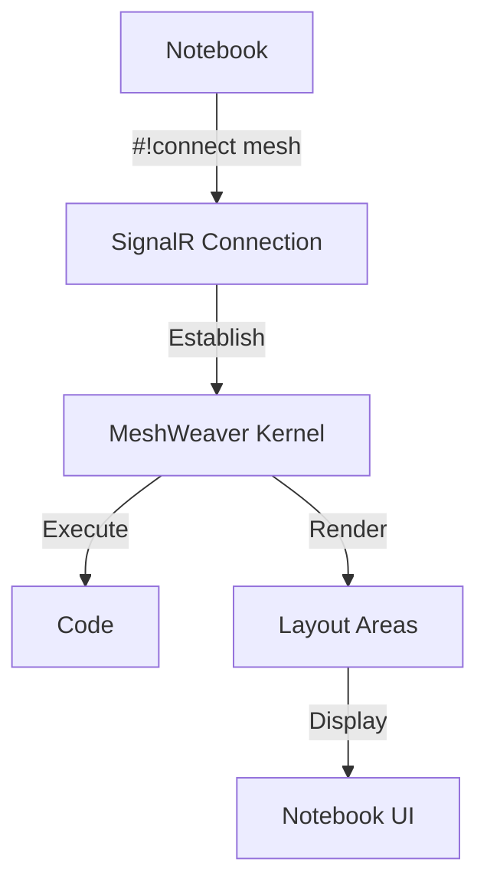

# MeshWeaver.Connection.Notebook

MeshWeaver.Connection.Notebook enables seamless integration between Polyglot Notebooks and MeshWeaver's kernel system through SignalR connections. This library allows notebooks to interact with MeshWeaver's distributed computation and visualization capabilities.

## Overview

The library provides:
- SignalR kernel connection for Polyglot Notebooks
- Interactive code execution
- Layout area rendering in notebooks
- Real-time data visualization

## Usage

### Basic Connection
To connect your notebook to a MeshWeaver kernel:

```csharp
// Connect to MeshWeaver kernel
#!connect mesh --url http://localhost/kernel --kernel-name mesh

// Test connection with hello world
#!mesh
Console.WriteLine("Hello World");
```

### Layout Integration
Create and display MeshWeaver layout controls in your notebook:

```csharp
#!mesh
// Create a markdown control
new MarkdownControl("Hello World")

// The output will be rendered as an iframe in the notebook
// <iframe id='...' src='http://localhost/area/kernel/{id}/{area}' ...></iframe>
```

### Interactive Data Visualization
Work with MeshWeaver's visualization components:

```csharp
#!mesh
// Create a data grid
var data = new[]
{
    new { Id = 1, Name = "Item 1" },
    new { Id = 2, Name = "Item 2" }
};

Controls.ToDataGrid(data, grid => grid
    .WithColumn(x => x.Id)
    .WithColumn(x => x.Name)
)
```

## Architecture

### Connection Flow


## Features

1. **Kernel Integration**
   - SignalR connection management
   - Code execution
   - Event handling
   - Result formatting

2. **Layout Support**
   - Interactive controls
   - IFrame rendering
   - Real-time updates
   - Area management

3. **Data Visualization**
   - Rich text display
   - Data grid support
   - Chart rendering
   - Interactive components

4. **Development Tools**
   - Code completion
   - Error handling
   - Debug output
   - Command history

## Configuration


### Custom Formatters
```csharp
Formatter.SetPreferredMimeTypesFor(
    typeof(TabularDataResource), 
    HtmlFormatter.MimeType, 
    CsvFormatter.MimeType
);
```

## Best Practices

1. **Connection Management**
   ```csharp
   // Always use the connect directive at the start
   #!connect mesh --url http://localhost/kernel --kernel-name mesh
   
   // Verify connection
   #!mesh
   Console.WriteLine("Connected successfully");
   ```

2. **Layout Handling**
   ```csharp
   #!mesh
   // Create reusable layout components
   public static class MyLayouts
   {
       public static UiControl CreateDashboard() =>
           Controls.Stack
               .WithView(new MarkdownControl("Dashboard"))
               .WithView(CreateDataGrid());
   }
   ```


## Related Projects

- MeshWeaver.Kernel.Hub - Core kernel functionality
- MeshWeaver.Layout - UI control system
- MeshWeaver.Connection.SignalR - SignalR connection handling
