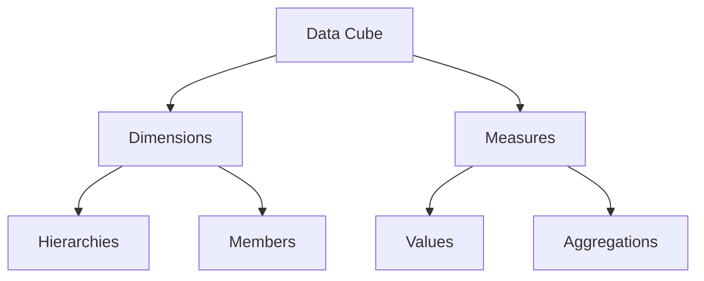

# MeshWeaver.DataCubes

MeshWeaver.DataCubes provides the foundational infrastructure for working with multidimensional data cubes in the MeshWeaver ecosystem. It serves as the base library for pivot table operations, data aggregation, and dimensional analysis.

## Overview

The library provides:
- Core data cube abstractions
- Dimension management
- Aggregation functions
- Cube operations (slice, dice, roll-up, drill-down)
- Pivot table support

## Architecture

### Data Cube Structure

## Features

1. **Cube Operations**
   - Slice and dice
   - Roll-up and drill-down
   - Pivot and unpivot
   - Cross-tabulation

2. **Aggregation Support**
   - Multiple aggregation types
   - Custom aggregation functions
   - Partial aggregations
   - Running totals

## Best Practices

1. **Dimension Design**
   - Keep hierarchies balanced
   - Use meaningful member IDs
   - Consider aggregation paths
   - Handle missing members

2. **Performance Optimization**
   - Pre-aggregate common views
   - Cache frequent queries
   - Use appropriate indexes
   - Optimize member hierarchies

3. **Memory Management**
   - Control cube size
   - Use sparse storage
   - Implement cleanup
   - Monitor memory usage

## Related Projects

- MeshWeaver.DataCubes.Pivot - Pivot table implementations
- MeshWeaver.Data - Core data framework
- MeshWeaver.Hierarchies - Hierarchical data support
