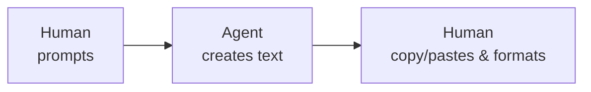
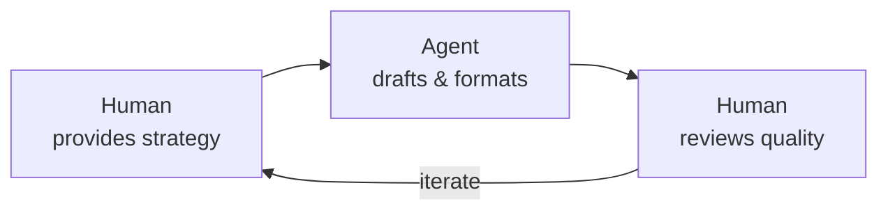
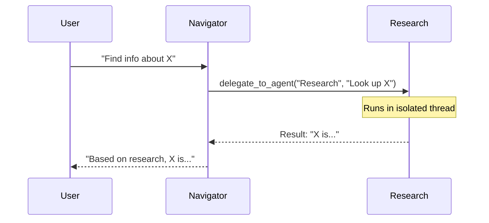
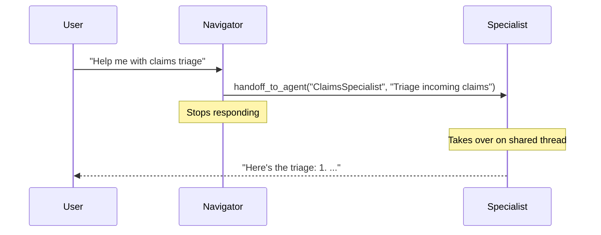

> **Scope:** this page is the *concepts and philosophy* of agentic AI — what it is, where it goes wrong, and the human-in-the-loop principles MeshWeaver builds on. For the *technical implementation* (agent definitions, MeshPlugin tools, orchestration, MCP integration), see [Agentic AI Architecture](/Doc/Architecture/AgenticAI).

## What is Agentic AI?

Agentic AI is the shift from AI that *responds* to AI that *acts*. Rather than waiting to answer a prompt, an agentic system pursues goals, makes decisions, and uses tools — all with varying degrees of autonomy.

Four capabilities define the category:

| Capability | What it means in practice |
|---|---|
| **Goal pursuit** | Formulates objectives and works toward them across multiple steps |
| **Independent decision-making** | Evaluates options and selects actions without constant human prompts |
| **Environmental adaptation** | Adjusts strategy based on feedback and new information |
| **Meaningful action** | Calls APIs, invokes tools, writes to data stores — not just text output |

---

## Common Misbeliefs

A handful of myths regularly derail agentic AI projects. Knowing them upfront saves a lot of pain.

> **"Agents don't require human input"**  
> Agents work *best* with humans in the loop. They need guidance, oversight, and intervention. Humans provide direction and validate outputs — the agent handles execution.

> **"We can prove the agent's work is correct"**  
> Agents generate outputs based on patterns, not genuine understanding. They cannot reason like humans. Correctness and quality judgments remain human responsibilities.

> **"Agents will replace human workers"**  
> Agents are augmentation tools. They lack contextual understanding and emotional intelligence. They excel at repetitive, high-volume tasks; humans handle creative problem-solving and judgment calls.

> **"More autonomous means better"**  
> Optimal autonomy is task- and stakes-dependent. High-stakes decisions need human oversight. The goal is balance, not maximum autonomy.

> **"Agents learn and improve on their own"**  
> Improvement requires intentional design and curated training data. Agents do not develop genuine understanding without human guidance.

---

## Who is the Human, Who is the Agent?

<div style="text-align: center; overflow: hidden; max-width: 800px; margin: 0 auto;">
  
</div>

Getting the division of labor right is the single most important design decision in any agentic system. When it is misaligned, the roles reverse: humans do the repetitive mechanical work while the agent handles the creative parts. That is the opposite of the intended value.

**The ideal split:**

- Humans own strategy, judgment, and quality assessment.
- Agents handle execution, formatting, and high-volume processing.

### Anti-pattern vs. better pattern

**Anti-pattern** — human ends up doing mechanical work:



*Problem: the agent does the creative work; the human does the drudge work.*

**Better pattern** — agent handles all repetitive steps:



*Solution: the human focuses entirely on strategy and quality judgment.*

---

## Agentic AI in Applications

### Data Ingestion

Automated data ingestion used to be extremely difficult because humans and agents have *opposite* strengths:

- **Human-readable formats are machine-hostile.** Documents designed for human comprehension — PDFs, spreadsheets with merged cells, narrative reports — are notoriously hard for machines to parse reliably.
- **Agents stumble on "easy" operations.** An agent that understands nuanced context can still fail at reliably summing a column or maintaining exact numeric precision.
- **A hybrid approach is required.** Combine AI capabilities (content discovery, semantic understanding) with traditional structured imports for data whose location and format you already know.

**What makes ingestion succeed:**

Many small, focused pieces of text that work together to map data accurately:

- *Data model descriptions* — clear documentation of your data structures.
- *Dimension value descriptions* — for categorical data (line of business, product category, etc.), provide a description for every possible value.
- *System prompt instructions* — explicit guidance on how to map and transform data.

For complex ingestion tasks, create **dedicated agents for each partial aspect** rather than one monolithic system. Each specialized agent becomes an expert in its narrow domain.

---

### Reporting

Traditional reporting has a structural limitation that AI can address.

**The dashboard paradox:** dashboards represent a well-intentioned but often futile attempt to compress business complexity onto a single screen. In practice, they rarely deliver the promised "single pane of glass," and report menus become unwieldy as counts grow.

**The information bottleneck:** C-suite executives historically could not retrieve information themselves. They relied on intermediary layers to produce PowerPoint slides — introducing delays and the risk of miscommunication at every handoff.

**LLM-enabled reporting changes the equation:**

- Chat interfaces accept natural language: *"Show me Q3 revenue by region."*
- Executives can explore data directly without technical barriers.
- Agents retrieve and present reports — they **do not execute business logic**.

> The agent is an **interface layer**, not a decision-making system.

---

### New Forms of User Interaction

Current business application UIs reflect historical constraints, not ideal design.

**Legacy of limitation:** traditional UIs were designed by humans, for humans, within tight constraints. Menu hierarchies and information architecture were necessary compromises. We built what was *possible*, not what was *ideal*.

**The chat revolution:** conversational interfaces let users express intent directly rather than navigating complex menu trees. Information is dynamically assembled based on context rather than pre-defined views.

**The hybrid future** is not pure chat or pure traditional UI — it is an intelligent blend:

| Mode | Best for |
|---|---|
| Chat | Discovery, open-ended queries, exploration |
| Traditional UI | Precision input, repeatable workflows, exact values |
| Context-aware presentation | Systems that choose the right interface for the task |
| Collaborative design | Applications that adapt to how users actually work |

This evolution represents not just new technology, but a fundamental rethinking of how humans and systems collaborate.

---

## Agent Communication Patterns

MeshWeaver supports two patterns for agent-to-agent communication: **delegation** and **handoff**. Choosing the right one makes the difference between a clean architecture and a tangled one.

### Delegation

Delegation runs a target agent in an **isolated context**. The delegating agent sends a task, waits for a result, and continues its own response.



**Use delegation when:**
- You need information back to continue your response.
- The target agent's work is a subtask within a larger response.
- You want to maintain control of the conversation.

**Configuration:**
```yaml
delegations:
  - agentPath: Agent/Research
    instructions: "Information lookup, web search"
```

---

### Handoff

Handoff **transfers control entirely** to the target agent. The source agent stops, and the target agent takes over the shared conversation thread with full history.



**Use handoff when:**
- The target agent should interact with the user directly.
- The task is better handled entirely by a specialist.
- You do not need to process the result yourself.

**Chained handoffs** are supported — A hands off to B, B hands off to C:

```yaml
# Navigator.md
handoffs:
  - agentPath: Agent/ClaimsSpecialist
    instructions: Claims triage and follow-up questions

# ClaimsSpecialist.md
handoffs:
  - agentPath: Agent/Worker
    instructions: Execute the resulting actions
```

---

<svg xmlns="http://www.w3.org/2000/svg" viewBox="0 0 760 320" style="width:100%;max-width:760px;height:auto;display:block;margin:20px auto;">
  <defs>
    <marker id="arr" markerWidth="8" markerHeight="6" refX="8" refY="3" orient="auto">
      <path d="M0,0 L8,3 L0,6 Z" fill="#90a4ae"/>
    </marker>
    <marker id="arr-blue" markerWidth="8" markerHeight="6" refX="8" refY="3" orient="auto">
      <path d="M0,0 L8,3 L0,6 Z" fill="#1e88e5"/>
    </marker>
    <marker id="arr-orange" markerWidth="8" markerHeight="6" refX="8" refY="3" orient="auto">
      <path d="M0,0 L8,3 L0,6 Z" fill="#f57c00"/>
    </marker>
  </defs>
  <rect x="0" y="0" width="760" height="320" rx="14" fill="currentColor" fill-opacity=".04"/>
  <text x="190" y="30" text-anchor="middle" fill="currentColor" fill-opacity=".9" font-family="sans-serif" font-size="15" font-weight="700">Delegation</text>
  <text x="570" y="30" text-anchor="middle" fill="currentColor" fill-opacity=".9" font-family="sans-serif" font-size="15" font-weight="700">Handoff</text>
  <line x1="380" y1="10" x2="380" y2="310" stroke="currentColor" stroke-opacity=".15" stroke-width="1" stroke-dasharray="5 3"/>
  <rect x="30" y="50" width="80" height="36" rx="10" fill="#5c6bc0"/>
  <text x="70" y="73" text-anchor="middle" fill="#fff" font-family="sans-serif" font-size="13" font-weight="600">User</text>
  <rect x="130" y="50" width="100" height="36" rx="10" fill="#1e88e5"/>
  <text x="180" y="68" text-anchor="middle" fill="#fff" font-family="sans-serif" font-size="12" font-weight="600">Navigator</text>
  <text x="180" y="81" text-anchor="middle" fill="#fff" font-family="sans-serif" font-size="10">(Agent A)</text>
  <rect x="255" y="50" width="100" height="36" rx="10" fill="#26a69a"/>
  <text x="305" y="68" text-anchor="middle" fill="#fff" font-family="sans-serif" font-size="12" font-weight="600">Research</text>
  <text x="305" y="81" text-anchor="middle" fill="#fff" font-family="sans-serif" font-size="10">(Agent B)</text>
  <line x1="110" y1="68" x2="128" y2="68" stroke="#90a4ae" stroke-width="1.5" marker-end="url(#arr)"/>
  <line x1="232" y1="61" x2="253" y2="61" stroke="#1e88e5" stroke-width="1.5" marker-end="url(#arr-blue)"/>
  <text x="242" y="57" text-anchor="middle" fill="currentColor" fill-opacity=".5" font-family="sans-serif" font-size="9">delegate</text>
  <line x1="253" y1="75" x2="232" y2="75" stroke="#26a69a" stroke-width="1.5" stroke-dasharray="4 2" marker-end="url(#arr-blue)"/>
  <text x="242" y="87" text-anchor="middle" fill="currentColor" fill-opacity=".5" font-family="sans-serif" font-size="9">result</text>
  <rect x="145" y="115" width="150" height="30" rx="8" fill="#1e88e5" fill-opacity=".15"/>
  <text x="220" y="135" text-anchor="middle" fill="currentColor" fill-opacity=".7" font-family="sans-serif" font-size="11">Agent B runs in isolation</text>
  <rect x="130" y="160" width="100" height="36" rx="10" fill="#1e88e5"/>
  <text x="180" y="178" text-anchor="middle" fill="#fff" font-family="sans-serif" font-size="12" font-weight="600">Navigator</text>
  <text x="180" y="191" text-anchor="middle" fill="#fff" font-family="sans-serif" font-size="10">composes reply</text>
  <line x1="180" y1="152" x2="180" y2="158" stroke="#90a4ae" stroke-width="1.5" stroke-dasharray="3 2"/>
  <line x1="128" y1="178" x2="110" y2="178" stroke="#90a4ae" stroke-width="1.5" marker-end="url(#arr)"/>
  <text x="119" y="172" text-anchor="middle" fill="currentColor" fill-opacity=".5" font-family="sans-serif" font-size="9">reply</text>
  <rect x="30" y="160" width="80" height="36" rx="10" fill="#5c6bc0"/>
  <text x="70" y="183" text-anchor="middle" fill="#fff" font-family="sans-serif" font-size="13" font-weight="600">User</text>
  <rect x="50" y="228" width="280" height="56" rx="10" fill="#1e88e5" fill-opacity=".08"/>
  <text x="190" y="250" text-anchor="middle" fill="currentColor" fill-opacity=".6" font-family="sans-serif" font-size="11" font-weight="600">A stays in control</text>
  <text x="190" y="266" text-anchor="middle" fill="currentColor" fill-opacity=".5" font-family="sans-serif" font-size="11">B returns result; A synthesises the final reply</text>
  <text x="190" y="282" text-anchor="middle" fill="currentColor" fill-opacity=".5" font-family="sans-serif" font-size="11">Shared thread history: No</text>
  <rect x="410" y="50" width="80" height="36" rx="10" fill="#5c6bc0"/>
  <text x="450" y="73" text-anchor="middle" fill="#fff" font-family="sans-serif" font-size="13" font-weight="600">User</text>
  <rect x="510" y="50" width="100" height="36" rx="10" fill="#f57c00"/>
  <text x="560" y="68" text-anchor="middle" fill="#fff" font-family="sans-serif" font-size="12" font-weight="600">Navigator</text>
  <text x="560" y="81" text-anchor="middle" fill="#fff" font-family="sans-serif" font-size="10">(Agent A)</text>
  <rect x="630" y="50" width="100" height="36" rx="10" fill="#e53935"/>
  <text x="680" y="68" text-anchor="middle" fill="#fff" font-family="sans-serif" font-size="12" font-weight="600">Specialist</text>
  <text x="680" y="81" text-anchor="middle" fill="#fff" font-family="sans-serif" font-size="10">(Agent B)</text>
  <line x1="490" y1="68" x2="508" y2="68" stroke="#90a4ae" stroke-width="1.5" marker-end="url(#arr)"/>
  <line x1="612" y1="61" x2="628" y2="61" stroke="#f57c00" stroke-width="1.5" marker-end="url(#arr-orange)"/>
  <text x="620" y="57" text-anchor="middle" fill="currentColor" fill-opacity=".5" font-family="sans-serif" font-size="9">handoff</text>
  <rect x="520" y="115" width="100" height="30" rx="8" fill="#f57c00" fill-opacity=".2"/>
  <text x="570" y="130" text-anchor="middle" fill="currentColor" fill-opacity=".6" font-family="sans-serif" font-size="11">A stops</text>
  <rect x="630" y="115" width="100" height="30" rx="8" fill="#e53935" fill-opacity=".2"/>
  <text x="680" y="130" text-anchor="middle" fill="currentColor" fill-opacity=".6" font-family="sans-serif" font-size="11">B takes over</text>
  <rect x="630" y="160" width="100" height="36" rx="10" fill="#e53935"/>
  <text x="680" y="178" text-anchor="middle" fill="#fff" font-family="sans-serif" font-size="12" font-weight="600">Specialist</text>
  <text x="680" y="191" text-anchor="middle" fill="#fff" font-family="sans-serif" font-size="10">owns thread</text>
  <line x1="628" y1="178" x2="492" y2="178" stroke="#e53935" stroke-width="1.5" stroke-dasharray="4 2" marker-end="url(#arr-orange)"/>
  <text x="560" y="173" text-anchor="middle" fill="currentColor" fill-opacity=".5" font-family="sans-serif" font-size="9">replies directly</text>
  <rect x="410" y="160" width="80" height="36" rx="10" fill="#5c6bc0"/>
  <text x="450" y="183" text-anchor="middle" fill="#fff" font-family="sans-serif" font-size="13" font-weight="600">User</text>
  <rect x="430" y="228" width="300" height="56" rx="10" fill="#e53935" fill-opacity=".08"/>
  <text x="580" y="250" text-anchor="middle" fill="currentColor" fill-opacity=".6" font-family="sans-serif" font-size="11" font-weight="600">B owns the conversation</text>
  <text x="580" y="266" text-anchor="middle" fill="currentColor" fill-opacity=".5" font-family="sans-serif" font-size="11">Full thread history passed to B; A is done</text>
  <text x="580" y="282" text-anchor="middle" fill="currentColor" fill-opacity=".5" font-family="sans-serif" font-size="11">Shared thread history: Yes</text>
</svg>

*Delegation keeps the calling agent in control and waits for a sub-result; Handoff transfers full ownership of the conversation to the target agent.*

---

### Choosing Between Delegation and Handoff

| Scenario | Pattern | Why |
|---|---|---|
| Need research results to formulate an answer | Delegation | Navigator needs the data back |
| Domain-specific long conversation | Handoff | The specialist should own the conversation |
| Quick data lookup | Delegation | Small subtask within a larger response |
| Execute a multi-step plan | Handoff | Worker should report progress directly |
| Domain-specific question | Delegation | Route and relay the answer |

---

## Looking Ahead

As agentic AI continues to evolve, systems will handle more complex tasks, collaborate more naturally with humans, and operate across broader domains. The key is developing these capabilities responsibly — maintaining human oversight and control as the foundation, not an afterthought.

Agentic AI augments human capabilities. The measure of a well-designed agentic system is not how autonomous it is, but how well it keeps humans focused on the work that genuinely requires human judgment.
