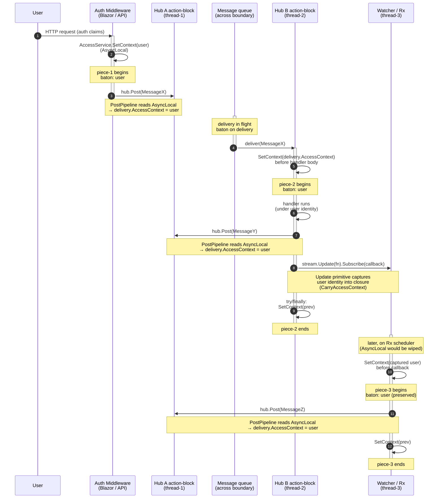

# AccessContext propagation — the identity baton

How a user's identity (`AccessContext`) flows from the authentication boundary through every async hop, every message hand-off, every handler, every downstream post — and how the framework makes this look like a **single-threaded execution under one principal**, even though it crosses thread pools, schedulers, hubs, and grain activations.

## Mental model — piecewise single-threaded flow

Think of the system as a chain of small, synchronous pieces of work. At any given moment, exactly one piece is running on one thread under one principal. The principal is the **identity baton**. The baton:

- Starts at the authentication boundary (Blazor circuit, Minimal API, ApiTokenAuthenticationHandler).
- Is **set on AsyncLocal** at the start of every piece — `AccessService.Context`.
- Is **read from AsyncLocal** every time the piece posts a new message — stamped on `delivery.AccessContext`.
- **Travels with the delivery** across the async boundary (thread pool, Rx scheduler, grain hop, network).
- Is **read from `delivery.AccessContext`** by the next piece's dispatch code and set back on AsyncLocal **before** the handler body runs.
- Is **restored** to whatever it was before, when the piece finishes (try/finally).

Inside any single piece, application code can ignore identity entirely — it's already correct. Outside the piece, the baton is on the delivery, in flight. The framework owns the hand-offs.



The baton is **never** absent during a piece's execution. Application code can trust `AccessService.Context` to reflect the originating user — that's the whole point.

## Security guarantees

The baton model exists to make a small set of strong security promises. Each is enforced by a specific framework primitive and verified by a specific test class — break one and the corresponding test fails loud.

| Guarantee | How it's enforced | Violation test |
|---|---|---|
| **User identity is never lost across an async hop.** Every write attributed to the originating user, even after Rx scheduler hops / hub-to-hub routing / grain reactivation. | `delivery.AccessContext` is part of the message payload; framework write primitives wrap return observables with `CarryAccessContext` so AsyncLocal is restored on every emission. | `test/MeshWeaver.Hosting.Monolith.Test/SubscribeRequestIdentityRoutingTest.cs` and the per-handler `ExecuteThreadMessageTest.SubmitMessage_PersistsMessageNodes_WithUserIdentity` — every `CreatedBy` must be a user, never `sync/`/`mesh/`/`node/`/`activity/`. |
| **No write is attributed to a hub address by accident.** Hub addresses are not user identities and never appear as `CreatedBy` on stored data. | `AccessService.SetContext` logs an `Error` with stack trace when a hub-shaped principal lands on AsyncLocal. PostPipeline reads AsyncLocal → the wrong principal can't be stamped on outgoing deliveries because there's nothing wrong on AsyncLocal to begin with. | The error log itself — CI parses for `[Error] [MeshWeaver.AccessContext] SetContext: hub-shaped principal` and fails the run if any appear outside the sanctioned-init phase. |
| **Sanctioned non-user identities have minimum-necessary permissions.** A read-only hydrator (cache) can't write; an onboarding creator can't read other users' data; a protocol-traffic identity can't post user-data writes. | Each sanctioned identity has a per-NodeType access rule granting ONLY its specific operations. No identity-shape wildcard ("all `sync/*` get protocol perms") — every grant is exact. | One test per sanctioned identity verifies misuse fails with `UnauthorizedAccessException` and a meaningful message. The test is the contract — without it the sanctioning is voodoo and a future code change can silently widen the grant. |
| **Cross-user reads are gated at every cache hit.** The MeshNodeStreamCache hydrates under a sanctioned read-only identity that bypasses RLS, but every `GetStream(path)` call re-validates the REQUESTING user's Read permission via `GetPermissionRequest` to the owning node hub. | `MeshNodeStreamCache.GetStream` always wraps the upstream in an access gate keyed on `(path, userId)`. The cache is the hydrator; the user is the reader; the boundary is between them. | `test/MeshWeaver.Security.Test/UserAccessTests.SecurePersistence_NodeInPrivateNamespace_HiddenWithoutGrant` and siblings — caches loaded under sanctioned identity must STILL return zero rows / `UnauthorizedAccessException` to unauthorized callers. |
| **Fail-closed under uncertainty.** No silent fallback. If no AccessContext can be resolved at post time, the message goes out with null `AccessContext` and downstream AccessControl denies. | `UserServicePostPipeline` removed the "stamp hub-self as principal when no context" fallback (2026-05-21 cleanup); now warns + leaves null. | Watch for the warning `PostPipeline: hub={Hub}, message={MessageType} posted with no AccessContext`. Every occurrence is either a real missing wrap (fix it) or a framework-lifecycle message (exempt via `[SystemMessage]`). |

The whole model rests on the failure modes being **loud and tested**, not silent. The error log + the violation tests + the fail-closed default together make a privilege-escalation regression visible at the moment it's introduced.

## Phase-by-phase contract

### Phase 1 — Entry: authentication middleware sets AsyncLocal

Authentication happens at the platform boundary. Exactly one place per platform sets the baton:

| Platform | Where AsyncLocal gets set |
|---|---|
| Blazor circuit | `CircuitAccessHandler` — `CreateInboundActivityHandler` wraps every inbound activity in `using accessService.SwitchAccessContext(userContext)` |
| Minimal API | `UserContextMiddleware` — wraps each request in a `SetContext` scope |
| API token | `ApiTokenAuthenticationHandler` after `ValidateTokenRequest` resolves the user |
| Background timer / cron | Explicit `accessService.ImpersonateAsSystem()` at the entry point — see Sanctioned exceptions |
| Test base | `TestUsers.DevLogin(Mesh)` calls `SetCircuitContext(Admin)` once at fixture init |

After this phase the **entire** AsyncLocal-respecting execution path runs under the user.

### Phase 2 — Posting: AsyncLocal → delivery.AccessContext

Any call to `hub.Post(...)` / `hub.Observe(...)` / `meshService.CreateNode/Update/Delete/CopyNode(...)` reaches the **PostPipeline** (`MessageHubConfiguration.UserServicePostPipeline`). Order of decision:

1. If `delivery.AccessContext` is **already set** (e.g. explicit `PostOptions.WithAccessContext(...)` or `ImpersonateAsHub` / `ImpersonateAsSystem` at the post site) → use it; do not overwrite.
2. Else read `accessService.Context ?? accessService.CircuitContext`; if non-null → stamp on the delivery.
3. Else → **fail closed** (leave `delivery.AccessContext` null; downstream AccessControl denies). Framework-lifecycle messages (`[SystemMessage]`-marked: heartbeats, hub lifecycle) are exempt from the "no AccessContext" warning because they carry no security-relevant payload.

The baton is now on the delivery, ready for hand-off.

### Phase 3 — Crossing the boundary: delivery carries the baton

`delivery.AccessContext` is part of the message payload. It survives:

- The action-block scheduler (`Dataflow.ActionBlock` → ThreadPool dispatch).
- Hub-to-hub routing (in-process via `MessageService.RouteMessageAsync`, cross-grain via `MessageHubGrain.DeliverMessage` reading Orleans `RequestContext`, remote via JSON serialisation).
- Rx schedulers (the framework primitives **capture into a closure** and re-set on emission — see Phase 6).
- Thread-pool re-scheduling generally.

If you find a place where identity is lost during phase 3, it's a framework bug — patch the carrier, not the application.

### Phase 4 — Receiver: delivery.AccessContext → AsyncLocal (begin the next piece)

Before the handler body runs, two cooperating pieces of code set AsyncLocal from `delivery.AccessContext`:

- `MessageService.NotifyAsync` → `UserServiceDeliveryPipeline` (`MessageHubConfiguration.cs:409-434`) sets AsyncLocal for the **delivery pipeline** body.
- `MessageHub.HandleMessageAsync` (`MessageHub.cs:434-476`) sets AsyncLocal for the **rule-chain / handler dispatch** body.

Both wrap the inner work in `try/finally` so the previous value is restored when this piece finishes — the action-block thread that dispatched message N is correctly re-entrant for message N+1.

After this phase, application code runs with `AccessService.Context = delivery.AccessContext`.

### Phase 5 — Handler runs under user identity

The handler body executes synchronously (or as a single observable chain — no `await`; see [AsynchronousCalls.md](AsynchronousCalls.md)). Every read of `AccessService.Context` returns the originating user. Every check (`securityService.HasPermission(...)`, `RlsNodeValidator.Validate(...)`) is evaluated under the right principal.

### Phase 6 — Handler posts → back to Phase 2 (chain continues)

The handler typically posts further messages or starts reactive chains. Two cases:

**Direct post within the synchronous body.** `hub.Post(...)` reads AsyncLocal → stamps the new delivery. Identity baton carries forward.

**Cold observable + Subscribe (the Rx case).** A framework write primitive returns a cold `IObservable<T>` whose side effect runs on Subscribe — but Subscribe may emit the callback on a **different thread** (an Rx scheduler) where AsyncLocal is wiped. The framework solves this internally:

```csharp
// AccessContextCaptureExtensions.CarryAccessContext (cross-cutting wrap)
public static IObservable<T> CarryAccessContext<T>(this IObservable<T> source, IServiceProvider sp)
{
    var accessSvc = sp.GetService<AccessService>();
    var captured = accessSvc?.Context ?? accessSvc?.CircuitContext;
    if (captured is null) return source;
    return source.Do(_ => accessSvc!.SetContext(captured));
}
```

Applied by every mesh write primitive (`MeshService.CreateNode/Update/Delete/CopyNode`, `MeshNodeStreamHandle.Update`, `IMeshNodeStreamCache.Update`) so callers keep writing the natural shape:

```csharp
meshService.CreateNode(node).Subscribe(_ => …);   // identity preserved across the Subscribe seam
```

Now Phase 2 happens again from the Subscribe callback's thread, under the right identity. The chain continues.

## Sanctioned exceptions — fine-grained, exact, controlled

There is one class of code where the **component itself** is the actor, not a user behind it (initialisation, cache hydration, redistributor hubs). These are sanctioned by giving the component a **named, dedicated identity** — never an accidental hub-address-derived shape — and **adding precise access rules** that grant ONLY the operations that component actually needs.

The three rules:

1. **Named, dedicated identity** — like `cache/mesh-node-cache`, not `mesh/xxx`. The address reflects the COMPONENT, not the hub it happens to live on. Hub addresses (`mesh/xxx`, `sync/xxx`, `node/xxx`) are *accidental* — they tell you where the code is running, not what role it's playing. A dedicated address tells you the role.
2. **Fine-grained permissions** — each identity is granted ONLY the specific operations it actually needs. Not "all protocol operations for `sync/*`"; rather "cache-read for `cache/mesh-node-cache` on these specific paths".
3. **Tested boundary** — every sanctioned identity has a test that verifies misuse fails. Posting a write under a read-only identity must yield `UnauthorizedAccessException` with a meaningful message. The test is the contract; without it the sanctioning is voodoo.

No "all sync hubs can do X" / "all node hubs can do Y". Each sanctioned identity is a single, controlled, named seat.

### Example 1 — `cache/mesh-node-cache` (read-only hydrator)

The MeshNodeStreamCache pre-loads MeshNodes from storage to serve cache hits to every user. It cannot run under a user identity (it services many). It is sanctioned via:

- **Identity**: `cache/mesh-node-cache` (single, reserved, internal-only constant).
- **Grants**: Read on the paths the cache hydrates. NOT Create, NOT Update, NOT Delete.
- **Compensating control**: every `GetStream(path)` call from the cache re-validates the *requesting user's* Read permission before returning data — the cache itself is just the hydrator, not the gate.
- **Test**: post a `CreateNodeRequest` under `cache/mesh-node-cache` → expect `UnauthorizedAccessException("Access denied: Create permission required …")`. Same for Update/Delete.

If anyone else tries to impersonate `cache/mesh-node-cache` (the constant is internal to the cache assembly; the test verifies it's not exposed), they fail at AccessControl because they're not the cache and the address grants only what the cache needs.

### Example 2 — `IsPortalIdentity` (User-node onboarding) — already correct

User onboarding is the canonical example of a hub-as-actor seat that is **already configured the right way**:

- **Identity**: any address matching `portal/*` (the running portal hub's own address).
- **Grant**: `UserNodeType.WithPortalCreate` → `AddAccessRule([Create, Update], (_, userId) => IsPortalIdentity(userId))`.
- **Why it's fine**: portal hubs literally do onboarding — they are the natural actor. The portal hub identity IS the role here. No narrower seat would add safety because exactly one component class (portal hubs) uses this code path and that class IS what `portal/*` matches.

Leave this pattern in place. The fine-grained refactor (Example 1 — dedicated component address) applies when the hub address is **accidental** (the code happens to live on the mesh hub or a sync hub but the role has nothing to do with mesh-routing or sync-streaming). When the hub IS the role, `IsXxxIdentity(hub-prefix)` is the right shape.

### Example 3 — sync stream protocol vs sync stream user-data

**This is the bug to be careful about.** Sync streams carry two completely different kinds of traffic:

| Traffic | Originator | Who should be on `AccessContext` |
|---|---|---|
| `SubscribeRequest`, `UnsubscribeRequest`, `HeartBeatEvent` (protocol meta) | the sync hub itself | a dedicated identity, e.g. `protocol/sync-stream`, granted only the protocol operations |
| `SetCurrentRequest` carrying a user's data binding update | the **user** behind the data binding | the user — never `sync/xxx`, never `protocol/sync-stream` |

A `SynchronizationStream.OnNext` that unconditionally stamps `ImpersonateAsHub(Hub.Address)` collapses both onto the same hub address. The receiving owner sees `sync/xxx` for a user's edit; `CreatedBy` on the resulting MeshNode is `sync/xxx`. That's the user-identity-disappears bug.

Correct shape: protocol messages stamp `protocol/sync-stream`; user-data messages carry the user via `CarryAccessContext` (no impersonation at the post site). Two messages, two paths, two identities — never collapsed.

### Example 4 — `system-security` (true infrastructure)

`accessService.ImpersonateAsSystem()` switches the baton to `"system-security"`, granted `Permission.All` unconditionally by `SecurityService`. Use **only** for genuine framework infrastructure with no user context AND no narrower sanctioned identity that fits — schema migration, framework-level bootstrap, internal recursive lookups inside `SecurityService` itself.

Every `ImpersonateAsSystem` callsite is a deliberate choice to bypass all access checks. Grep for them; review each. If a narrower identity (like `cache/mesh-node-cache`) would suffice, use that instead.

### Implementation: define + grant + test

For each sanctioned identity:

1. **Define** an `internal const string` for the identity's name inside the component's assembly. E.g.:
   ```csharp
   // MeshWeaver.Hosting/MeshNodeStreamCache.cs
   internal static class MeshNodeCacheIdentity
   {
       internal const string Address = "cache/mesh-node-cache";
   }
   ```
   Keeping it `internal` means only the assembly that defines it can stamp the identity — external code can't impersonate.

2. **Grant** precise permissions via per-NodeType access rules:
   ```csharp
   config.AddAccessRule(
       [NodeOperation.Read],
       (_, userId) => userId == MeshNodeCacheIdentity.Address);
   ```

3. **Test** the boundary:
   ```csharp
   [Fact]
   public async Task MeshNodeCache_Identity_CannotWrite()
   {
       using (accessService.SwitchAccessContext(new AccessContext { ObjectId = "cache/mesh-node-cache" }))
       {
           var act = () => meshService.CreateNode(someNode).ToTask();
           await act.Should().ThrowAsync<UnauthorizedAccessException>()
               .Where(ex => ex.Message.Contains("Access denied"));
       }
   }
   ```

The triple — define / grant / test — is the contract. Without all three, the sanctioning is voodoo and the system is one bug away from privilege escalation.

## Anti-patterns (the baton drops)

| Anti-pattern | Why it's wrong | Fix |
|---|---|---|
| `OnNext` on a sync stream stamps `ImpersonateAsHub(Hub.Address)` for a USER-DRIVEN update | User identity is replaced by the sync hub's. Receiving side sees `sync/xxx`. User's writes get attributed to a hub. | Carry the user's `AccessContext` through the Rx chain via `CarryAccessContext`; post `SetCurrentRequest` with the user's identity. |
| Watcher subscriptions in hub-init code capture the hub-init AsyncLocal | Every later emission runs under hub identity even if a user caused the trigger. | Read identity from the **event** (e.g. `delivery.AccessContext` of the trigger message), not from AsyncLocal captured at Subscribe time. |
| Setting `AccessService.Context` to a hub-shaped principal (`sync/`, `mesh/`, `node/`, `activity/`, `portal/`) | These are hub addresses, not user identities. They leak into downstream writes as fake `CreatedBy`. | Only set user-shaped or `system-security` on AsyncLocal. The error log in `AccessService.SetContext` flags violations. |
| Per-callsite `.PreserveAccessContext(...)` / `.Do(_ => SetContext(...))` litter | Framework primitives already do this. Adding it at the callsite is redundant and drifts. | Remove. |
| `meshService.CreateNode(node, ...)` followed by `o.WithAccessContext(captured)` | Implicit via the framework wrap. | Remove the explicit `WithAccessContext` (unless you have a non-AsyncLocal source for the context). |
| `accessService.ImpersonateAsHub(...)` in application code | The "writing as hub" anti-pattern. Application writes should ride the user's identity. | Either propagate the user's identity correctly (default path) or use `ImpersonateAsSystem` if it's truly infrastructure, or grant the hub via per-NodeType access rule if it's truly a redistributor. |
| Catching `UnauthorizedAccessException` from a write and falling through silently | Hides denials; the prod EventCalendar bug. | Surface the denial — empty-state the UI, navigate to AccessDenied, or rethrow. |
| Reading `MeshNode.Content` from a query row (stale) | Reads are not gated by the user's permission at the row level once the query has returned. | Use `workspace.GetMeshNodeStream(path)` or `IMeshNodeStreamCache.GetStream(path)` for content. |

## Debug aid: `AccessService` hub-shape error log

`AccessService.SetContext` / `SetCircuitContext` log an **ERROR** with stack trace if a hub-shaped principal (`sync/`, `mesh/`, `node/`, `activity/`, `portal/`) is ever set on AsyncLocal:

```
[Error] [MeshWeaver.AccessContext] SetContext: hub-shaped principal sync/xxx set as AccessContext — must never happen. Source stack: …
```

When this fires:

- **Sanctioned init / cache hydration / protocol traffic** → expected at startup; can be downgraded once the legitimate sites are audited and tagged.
- **Application code under user-driven flows** (layout-area renders, click actions, watcher emissions caused by user writes) → bug; trace the stack to find where the user's identity was lost upstream and apply `CarryAccessContext` at the seam.

The error is deliberately noisy during the 2026-05-22 cleanup. Once every hub-shaped propagation is either documented as sanctioned (with an access rule) or fixed (user identity carried), this log fires only on real regressions.

## `IMeshNodeStreamCache.GetStream` is access-checked

In addition to "writes preserve user identity", reads through the process-wide `IMeshNodeStreamCache` are gated by the caller's effective Read permission on the path. The cache asks the owning node hub via `GetPermissionRequest` (`src/MeshWeaver.Mesh.Contract/Security/GetPermissionRequest.cs`); the response is a `Permission` flags bag. Only when `Permissions.HasFlag(Permission.Read)` does the gated observable forward the upstream emissions; otherwise it terminates with `UnauthorizedAccessException`.

Per-`(path, userId)` validations are cached in-process for 30 s (the `AccessTtl` constant in `MeshNodeStreamCache.cs`). Revocation surfaces within at most that window; the cache is not invalidated reactively. The cached SHARED upstream is unchanged — only the returned subscriber-side observable is gated.

Why authoritative validation lives on the node hub: the hub already runs the validator chain when it answers `GetPermissionRequest` (see `AccessControlPipeline.HandleGetPermission`). Routing the check through that handler keeps the gate aligned with every other access decision in the system.

## `GetPermissionRequest` contract

```csharp
public record GetPermissionRequest : IRequest<GetPermissionResponse>;
public record GetPermissionResponse(Permission Permissions);
```

The request carries no path — the receiving hub answers for ITS OWN path. Callers route the request to the per-node hub at the path they care about; routing decides which hub responds. The handler (`AccessControlPipeline.HandleGetPermission`) resolves the per-hub-scoped `SecurityService` and evaluates against the caller's `delivery.AccessContext`.

## Worked example — Blazor data binding → SyncStream → owner update

1. **Phase 1.** User logs in. `CircuitAccessHandler` sets `accessService.CircuitContext = user` for the circuit's lifetime. Each inbound circuit activity wraps the dispatched callback in `using SwitchAccessContext(user)` so AsyncLocal is set per-render too.
2. **Phase 5** (inside a layout area render). The user edits a text field bound to `JsonPointerReference("$.title")`. The binding pushes the new value into a `SynchronizationStream<MyContent>`.
3. **Phase 6** (Rx hop). The stream's `OnNext` fires. The Rx scheduler's thread has wiped AsyncLocal — but the stream's Subscribe-time wrap captured `user` into a closure (via `CarryAccessContext` on the cold pipeline that fed `OnNext`). Before posting `SetCurrentRequest`, AsyncLocal is restored to `user`.
4. **Phase 2.** `Hub.Post(new SetCurrentRequest(value), o => …)` reaches PostPipeline → reads AsyncLocal → stamps `delivery.AccessContext = user`. No `ImpersonateAsHub`.
5. **Phase 3.** Delivery travels to the owner hub.
6. **Phase 4.** Owner hub's `MessageHub.HandleMessageAsync` reads `delivery.AccessContext` → SetContext(user) → runs `HandleSetCurrent`.
7. **Phase 5.** `HandleSetCurrent` writes through the owner-side data layer. AccessControlPipeline validates `user` has Update on the path. `CreatedBy` / `LastModifiedBy` on resulting MeshNode rows is `user`.

If step 3 stamped `ImpersonateAsHub(Hub.Address)` instead of carrying `user`, step 4 would set AsyncLocal to `sync/xxx` (caught by the error log), step 5 would validate `sync/xxx` (which has no grant) and either deny or — if a misconfigured rule grants it — attribute the write to the sync hub. That's the bug to hunt.

## Related docs

- `Doc/Architecture/AsynchronousCalls.md` — reactive end-to-end patterns; AccessContext rides for free through framework primitives.
- `Doc/Architecture/CqrsAndContentAccess.md` — `GetStream` is access-checked; details the TTL cache + `GetPermissionRequest` handshake.
- `Doc/Architecture/AccessControl.md` — `IsPortalIdentity` and the per-NodeType access-rule pattern used to sanction hub-shaped principals.
- `Doc/GUI/DataBinding.md` — Blazor views can receive `OnError(UnauthorizedAccessException)` from `IMeshNodeStreamCache.GetStream` if the user's access is revoked.
- `Doc/Architecture/ActivityControlPlane.md` — operations as scripts: `RequestedX` triggers, status-machine semantics; cross-references this doc for the security model.
