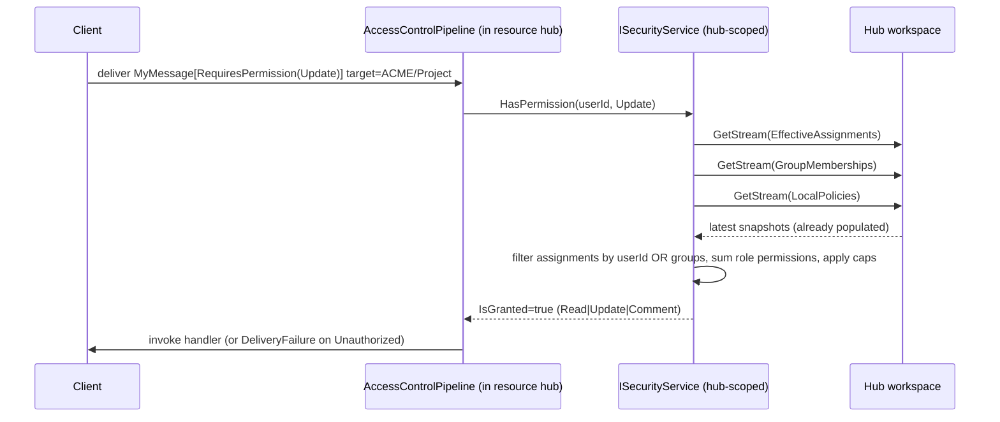
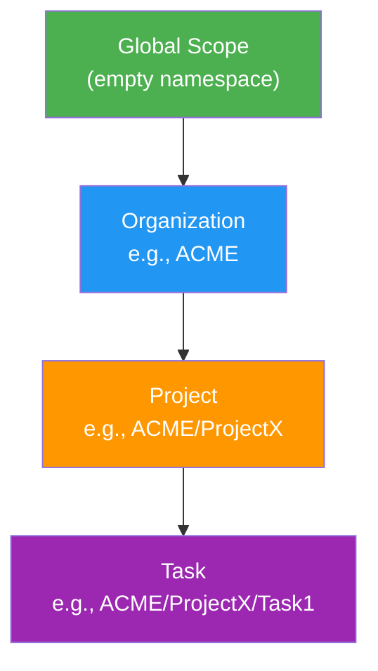
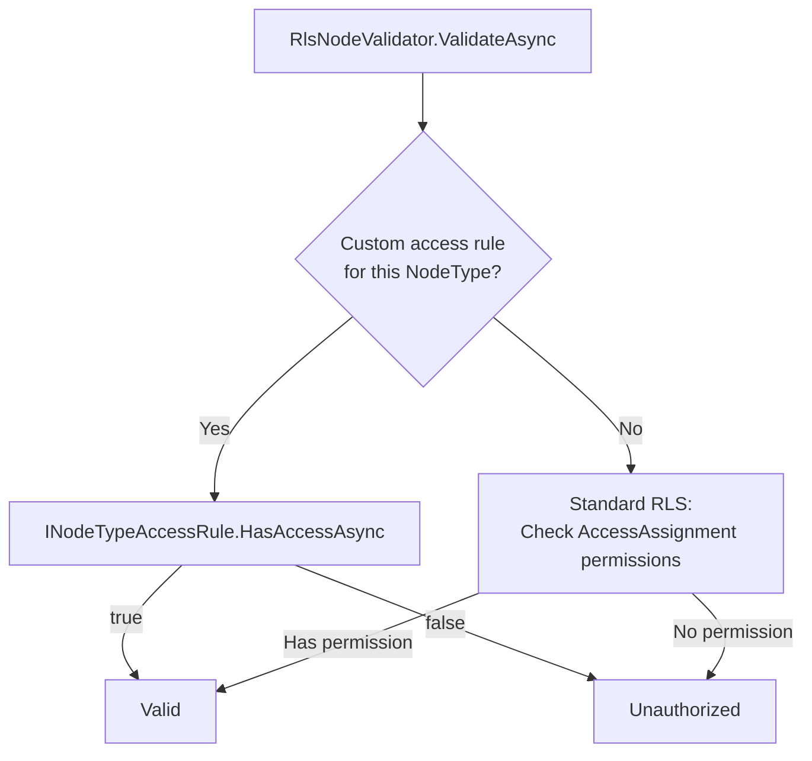
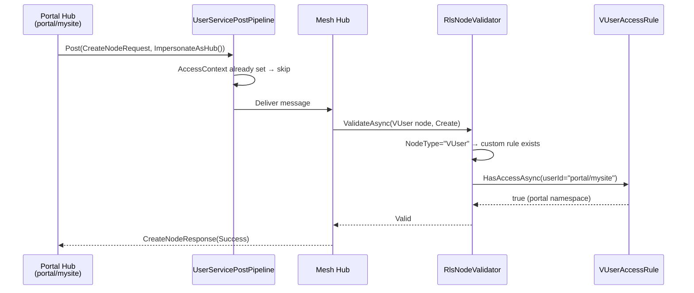

MeshWeaver provides row-level security through **AccessAssignment MeshNodes** stored directly in the mesh node hierarchy. Permissions are evaluated by walking the node tree from root to target path, applying closest-wins semantics.

# Core Concepts

## AccessAssignment MeshNodes

Access control is managed through AccessAssignment nodes — first-class MeshNodes with `nodeType: "AccessAssignment"`. Each assignment grants (or denies) a role to a subject at a specific scope.

AccessAssignment nodes are **satellite entities** stored in the `_Access` sub-namespace:

```
Node path: {scope}/_Access/{Subject}_Access
Node type: AccessAssignment
Content: {
  "accessObject": "Alice",
  "displayName": "Alice Chen",
  "roles": [
    { "role": "Editor" },
    { "role": "Viewer" }
  ]
}
```

On disk (file system persistence), access files live in `_Access/` sub-directories:
```
ACME/
  _Access/
    Public_Access.json     ← All authenticated users get Viewer
    Alice_Access.json      ← Alice gets Editor
  Projects/
    _Access/
      Bob_Access.json      ← Bob gets Viewer on ACME/Projects
```

In PostgreSQL, access nodes are routed to a dedicated `access` table (via `PartitionDefinition.StandardTableMappings`), separate from the main `mesh_nodes` table.

Each AccessAssignment node maps **one subject** (User or Group) to **multiple roles** at a given scope. This reduces the number of nodes and trigger invocations compared to one-node-per-role.

**Key properties:**

| Property | Description |
|----------|-------------|
| `AccessObject` | User or Group identifier |
| `DisplayName` | Optional display name for the subject |
| `Roles` | Array of `RoleAssignment` entries |
| `Roles[].Role` | Role to grant/deny (Admin, Editor, Viewer, Commenter, or custom) |
| `Roles[].Denied` | If true, denies the role instead of granting it |

## Built-in Roles

| Role | Permissions | Flag Value |
|------|------------|------------|
| Admin | Read, Create, Update, Delete, Comment | 31 (All) |
| Editor | Read, Create, Update, Comment | 23 |
| Viewer | Read | 1 |
| Commenter | Read, Comment | 17 |

## Permission Flags

```csharp
[Flags]
public enum Permission
{
    None    = 0,
    Read    = 1,
    Create  = 2,
    Update  = 4,
    Delete  = 8,
    Comment = 16,
    All     = Read | Create | Update | Delete | Comment
}
```

# Permission Evaluation

Permissions are evaluated **inside the per-node hub of the resource being
accessed**, against a locally-cached `EffectiveAssignments` collection.
The cache is populated by virtual data sources (see
[Virtual Data Sources](../DataMesh/VirtualDataSources)) that sync from
two places: the hub's own `_Access` subtree, and the parent hub's
`EffectiveAssignments` collection. The aggregate is exposed in turn for
*its* children to sync from. **No storage walk on the read path. No
cache TTL. Live updates via `IDataChangeNotifier`.**

## Scope Hierarchy as a sync tree

For a target path `ACME/Project/Task1`, the access-data sync tree is:

```
┌───────────────────────────────────┐
│  ROOT hub (path "")               │
│   LocalAccessAssignments          │ ←── own _Access subtree
│   LocalPolicies                   │ ←── own _Policy node
│   EffectiveAssignments  ═══ Local │  (no parent)
└──────────────┬────────────────────┘
               │ remote stream (RemoteStream<EffectiveAssignments>)
               ▼
┌───────────────────────────────────┐
│  ACME hub                         │
│   LocalAccessAssignments          │ ←── own _Access subtree
│   LocalPolicies                   │
│   InheritedFromParent             │ ←── ROOT.EffectiveAssignments
│   EffectiveAssignments            │ ═══ Inherited ∪ Local (Policy caps)
└──────────────┬────────────────────┘
               │ remote stream
               ▼
┌───────────────────────────────────┐
│  ACME/Project hub                 │
│   …                               │
└──────────────┬────────────────────┘
               │
               ▼
┌───────────────────────────────────┐
│  ACME/Project/Task1 hub           │
│   EffectiveAssignments            │ ←── used to answer access checks
└───────────────────────────────────┘
```

Each hub registers three virtual data sources via `AddMeshDataSource`:

- **`LocalAccessAssignments`** — `WithMeshQuery<AccessAssignment>("nodeType:AccessAssignment namespace:{thisPath}")`
- **`LocalPolicies`** — `WithMeshQuery<PartitionAccessPolicy>("nodeType:PartitionAccessPolicy namespace:{thisPath}")`
- **`InheritedEffectiveAssignments`** — cross-hub
  `WithVirtualType<AccessAssignment>(ws => ws.GetRemoteStream(parentAddr, new CollectionReference("EffectiveAssignments")))`

A computed `EffectiveAssignments` virtual collection then merges
`InheritedEffectiveAssignments ∪ LocalAccessAssignments`, applying
`LocalPolicies` caps and `BreaksInheritance`. That collection is what
*child* hubs subscribe to.

## Evaluation Flow — fully local, zero round-trips

The check happens **inside** the resource's per-node hub via a
**hub-scoped `ISecurityService`** that reads from the hub's own
workspace. No cross-hub request, no global singleton, no storage walk.

Every per-node hub registers an `ISecurityService` as scoped DI in its
own service container. The instance closes over the hub's `IWorkspace`
and answers from these synced virtual data sources:

- `LocalAccessAssignments` — own `_Access` subtree.
- `InheritedEffectiveAssignments` — parent hub's `EffectiveAssignments`
  via cross-hub remote stream.
- `EffectiveAssignments` — computed merge of the two above + local
  policy caps.
- `LocalPolicies` — own `_Policy` node.
- `GroupMemberships` — global `nodeType:GroupMembership` set, synced
  via `WithMeshQuery<GroupMembership>`.
- `Roles` — custom role catalogue, synced from the mesh hub's `Roles`
  virtual collection.



The user identity rides on the in-flight delivery's
`AccessContext.ObjectId` — no need to ask anyone where it is.

All inputs are **already in the hub's workspace** by the time the
check fires (synced reactively via `IDataChangeNotifier`). The check
itself is a couple of LINQ filters over in-memory collections —
microseconds, not the hundreds of ms a storage walk used to take.

## Reactive update semantics

When an `AccessAssignment` is created at scope `S`:

1. The hub at `S` sees the new node via its `LocalAccessAssignments`
   `WithMeshQuery` subscription (driven by `IDataChangeNotifier`).
2. The hub at `S` re-emits its `EffectiveAssignments` collection with
   the new entry merged in.
3. Every descendant hub subscribed to `S.EffectiveAssignments` via
   their `InheritedEffectiveAssignments` remote stream sees the update
   and re-emits their own `EffectiveAssignments`.
4. The next `CheckPermissionRequest` on any descendant hub reflects
   the new assignment.

When a user joins or leaves a group:

1. The `GroupMembership` MeshNode is created/deleted.
2. The user's hub picks up the change via its
   `WithMeshQuery<GroupMembership>` subscription.
3. The next `GetGroupMembershipsRequest` returns the new list.
4. Subsequent `CheckPermissionRequest`s see the updated group set.

End-to-end propagation is on the order of the change-notifier tick
(low milliseconds), not the 5-minute TTL the previous SecurityService
cache used.

## Closest-Wins Semantics

When the same role is assigned at multiple levels, the deepest (closest to target) assignment wins:

| Scope | Assignment | Effect |
|-------|-----------|--------|
| `""` (global) | Alice: Admin | Grants All permissions globally |
| `ACME` | Alice: Admin (Denied) | **Overrides** global grant — no Admin at ACME |
| `ACME/Project` | Alice: Editor | Grants Editor at ACME/Project |

At `ACME/Project`, Alice has Editor permissions (Read + Create + Update + Comment) but not Admin.

## Deny Override

A deny assignment blocks an inherited grant for a specific role, but does not affect other roles. Each node's `Roles[]` array can mix grants and denies:

```
Global:      Alice_Access → roles: [{ role: "Admin" }]
ACME:        Alice_Access → roles: [{ role: "Editor" }]
ACME/Secure: Alice_Access → roles: [{ role: "Admin", denied: true }]
```

At `ACME/Secure`, Alice has Editor permissions (from ACME, inherited) but not Admin (denied at ACME/Secure).

# Node Type Architecture

Access control uses these shipped node types:

## AccessAssignment
- **NodeType**: `"AccessAssignment"`
- **Content**: `AccessAssignment` record with `Id` and `Roles[]` array
- **Path pattern**: `{scope}/_Access/{Subject}_Access`
- **Name pattern**: `{Subject} Access`
- Created via `ISecurityService.AddUserRoleAsync()` or `IMeshCatalog.CreateNodeAsync()`
- One node per subject per scope — multiple roles are stored in the `Roles` array

## User
- **NodeType**: `"User"`
- **Content**: `AccessObject` record (Id, Name, Description, Icon)
- Used as subjects in AccessAssignment nodes

## Group
- **NodeType**: `"Group"`
- **Content**: `AccessObject` record
- Contains GroupMembership child nodes for members
- Groups can be nested (a group member can be another group)

## GroupMembership
- **NodeType**: `"GroupMembership"`
- **Content**: `GroupMembership` record (`Member`, `DisplayName`, `Groups[]`)
- **Path pattern**: `{Scope}/{Member}_Membership`
- Maps one member (User or Group) to one or more groups at a given scope
- Mirrors the AccessAssignment 1:1 pattern (one node per member per scope)
- `Groups[]` contains `MembershipEntry` records with a `Group` property

## Role
- **NodeType**: `"Role"`
- **Content**: `Role` record (Id, DisplayName, Permissions, IsInheritable)
- Custom roles extend the built-in set

# ISecurityService — hub-scoped, 100% IObservable

`ISecurityService` is registered **scoped per per-node hub**, never as
a singleton. Each instance closes over the hub's `IWorkspace` and
answers reads from the synced virtual collections listed above. Writes
post `CreateNodeRequest` / `UpdateNodeRequest` / `DeleteNodeRequest`
through the hub's `IMessageHub` and surface the response as an
observable.

**No `Task` returns anywhere on the surface** — every method returns
`IObservable<T>` (`Unit` for fire-and-forget writes). Bridging to
`Task` from hub-reachable code is the canonical deadlock pattern (see
[Asynchronous Calls](AsynchronousCalls)); the only sanctioned bridge
is at the test edge or grain-lifecycle boundary.

```csharp
public interface ISecurityService
{
    // Read — answers from the hub's own workspace synchronously.
    IObservable<bool>       HasPermission(string userId, Permission permission);
    IObservable<Permission> GetEffectivePermissions(string userId);

    // Write — POSTs CreateNodeRequest / UpdateNodeRequest / DeleteNodeRequest
    // via the hub's IMessageHub and surfaces the result.
    IObservable<Unit> AddUserRole(string userId, string roleId, string? targetNamespace, string? assignedBy);
    IObservable<Unit> RemoveUserRole(string userId, string roleId, string? targetNamespace);

    IObservable<Unit> SetPolicy(string targetNamespace, PartitionAccessPolicy policy);
    IObservable<Unit> RemovePolicy(string targetNamespace);
    IObservable<PartitionAccessPolicy?> GetPolicy(string targetNamespace);

    // Role catalogue (synced from a Roles virtual collection).
    IObservable<Role?> GetRole(string roleId);
    IObservable<Role>  GetRoles();           // emits per-role
    IObservable<Unit>  SaveRole(Role role);
}
```

Callers compose with `.Subscribe(onNext, onError)` — never `await`.
The previous singleton's storage walks, `_permissionCache`,
`_policyCache`, `_customRoleCache`, and `_staticAccessAssignments`
collection are all gone. **No per-process global state remains.**

## Writes drive the stream — persistence subscribes

Writes (`AddUserRole`, `SetPolicy`, …) **update the hub's local
workspace stream directly**. The stream is the source of truth. The
persistence layer (file system / PostgreSQL / Cosmos) is itself a
**subscriber** of the stream — it observes updates and writes to its
backing store. Child hubs subscribing to the parent's
`EffectiveAssignments` see the change via the same stream-sync
protocol used for `MeshNodeReference`.

```
┌──────────────────────────────────────┐
│  ISecurityService.AddUserRole(...)   │
└──────────────────┬───────────────────┘
                   │ workspace.UpdateMeshNode (or stream.Update for collections)
                   ▼
┌──────────────────────────────────────┐
│  Hub's local workspace stream         │
│    EffectiveAssignments emits new ▶   │ ← UI / SecurityService.HasPermission
│    LocalAccessAssignments emits new ▶ │   subscribers see it instantly
└──────────────────┬───────────────────┘
                   │ stream subscription
       ┌───────────┴────────────┐
       ▼                        ▼
┌────────────┐      ┌────────────────────────┐
│ Persister  │      │ Child hub remote stream │
│  (DB/disk) │      │  inherited assignments   │
└────────────┘      └────────────────────────┘
```

Implementation shape:

```csharp
public IObservable<Unit> AddUserRole(string userId, string roleId,
    string? targetNamespace, string? assignedBy)
{
    var node = BuildAccessAssignmentNode(...);
    // The stream update IS the write. Persistence + downstream hubs
    // observe it.
    return workspace.UpdateMeshNode(node).Select(_ => Unit.Default);
}
```

Why: callers (UI, scripts, tests) need read-after-write consistency.
The write observable completes when the workspace stream has surfaced
the change — a follow-up `HasPermission(...)` already reflects it. The
DB write happens off the critical path, with eventual consistency
guaranteed by the persister's stream subscription.

# Anonymous and Public Access

MeshWeaver distinguishes between two well-known user groups:

| User | Constant | Meaning |
|------|----------|---------|
| **Anonymous** | `WellKnownUsers.Anonymous` | Unauthenticated/virtual visitors (not logged in) |
| **Public** | `WellKnownUsers.Public` | Baseline permissions for all authenticated users |

When no user context is available (empty userId or virtual user), permissions are evaluated for the **Anonymous** user. Authenticated users automatically inherit **Public** permissions in addition to their own.

```csharp
// Grant Anonymous users read access to the Welcome page
await securityService.AddUserRoleAsync("Anonymous", "Viewer", "Welcome", "system", ct);

// Grant all logged-in users read access to MeshWeaver content
await securityService.AddUserRoleAsync("Public", "Viewer", "MeshWeaver", "system", ct);

// Anonymous users can read Welcome but not MeshWeaver
var anonCanRead = await securityService.HasPermissionAsync("MeshWeaver/Docs", "", Permission.Read, ct);
// anonCanRead == false

// Authenticated users inherit Public permissions
var authCanRead = await securityService.HasPermissionAsync("MeshWeaver/Docs", "Alice", Permission.Read, ct);
// authCanRead == true (Alice inherits Public's Viewer role)
```

# Hierarchical Access Pattern



**Examples:**
- Global Admin: `AddUserRoleAsync("Roland", "Admin", null, ...)` → full access everywhere
- Org Editor: `AddUserRoleAsync("Alice", "Editor", "ACME", ...)` → edit within ACME and descendants
- Project Viewer: `AddUserRoleAsync("Bob", "Viewer", "ACME/ProjectX", ...)` → read-only at ProjectX

# Access Control UI

The Access Control layout area (`AccessControlArea`) provides:

1. **Inherited Permissions** (read-only markdown table): Shows AccessAssignment nodes from ancestor scopes, displaying Subject, Role, Source path, and Allow/Deny status.

2. **Local Assignments** (editable): Shows AccessAssignment nodes that are direct children of the current node. Admins can toggle Allow/Deny and delete assignments.

3. **Add Assignment** (admin-only): Dialog with autocompleting comboboxes for Subject (User/Group search via IMeshService) and Role selection.

# Partition Access Control

In multi-tenant PostgreSQL deployments, each organization has its own schema (partition). Access to partitions is controlled by the `partition_access` table:

```sql
CREATE TABLE public.partition_access (
    user_id    TEXT NOT NULL,
    partition  TEXT NOT NULL,
    PRIMARY KEY (user_id, partition)
);
```

Populated automatically by `rebuild_user_effective_permissions()` in each partition's schema. When a user has any role in a partition, they get a `partition_access` entry.

## Partition Access in Search

Cross-schema search (`search_across_schemas`) enforces partition access at the SQL level. The access control clause requires:

1. **Partition access** — user must have `partition_access` entry for the schema (always required)
2. **Node-level permission** — user must have Read permission on the node's `main_node` path

`public_read` node types (e.g., User, Markdown) skip the node-level check but still require partition access. This prevents cross-partition data leakage — a user can't see another organization's nodes just because the node type is publicly readable.

```sql
-- Access control: partition_access is ALWAYS required.
-- public_read only skips node-level permission checks.
WHERE partition_access_exists AND (
    public_read_node_type OR node_level_permission
)
```

## AI Tool Call Identity

When AI agents execute tool calls (Get, Update, Create, etc.) during thread streaming, the user's `AsyncLocal` access context doesn't flow through the AI framework's async tool invocation chain. All tools are wrapped with `AccessContextAIFunction` (a `DelegatingAIFunction`) that restores the user's identity from `ThreadExecutionContext.UserAccessContext` before each invocation.

This ensures tool calls run with the correct user identity for permission checks.

## Satellite Node Permissions

Satellite node types (Thread, Comment, ApiToken) use `GetPermissionForNodeType` to map to their required permission:

| Node Type | Required Permission |
|-----------|-------------------|
| Thread, ThreadMessage | `Permission.Thread` |
| Comment | `Permission.Comment` |
| ApiToken | `Permission.Api` |
| All others | `Permission.Create` |

# PostgreSQL Integration

For PostgreSQL deployments, a denormalized `user_effective_permissions` table enables fast query-time permission checks. A trigger on `mesh_nodes` automatically rebuilds this table when AccessAssignment or GroupMembership nodes change.

```sql
-- Trigger fires on AccessAssignment/GroupMembership changes
CREATE TRIGGER mesh_node_access_changed
    AFTER INSERT OR UPDATE OR DELETE ON mesh_nodes
    FOR EACH ROW EXECUTE FUNCTION trg_mesh_node_access_changed();
```

The rebuild function:
1. Reads AccessAssignment MeshNodes from `mesh_nodes`, unnesting each node's `roles` JSON array via `jsonb_array_elements(content->'roles')`
2. Expands GroupMembership recursively (nested groups)
3. Joins with Role definitions (built-in + custom Role MeshNodes)
4. Produces per-user, per-permission rows in a shadow table
5. Atomically swaps the shadow table into the live table

# Node Validation (INodeValidator)

The `RlsNodeValidator` integrates with the mesh node CRUD pipeline to enforce permissions on Create, Update, and Delete operations:

```csharp
public class RlsNodeValidator : INodeValidator
{
    public IReadOnlyCollection<NodeOperation> SupportedOperations
        => [NodeOperation.Create, NodeOperation.Update, NodeOperation.Delete];

    public async Task<NodeValidationResult> ValidateAsync(
        NodeValidationContext context, CancellationToken ct)
    {
        var requiredPermission = context.Operation switch
        {
            NodeOperation.Create => Permission.Create,
            NodeOperation.Update => Permission.Update,
            NodeOperation.Delete => Permission.Delete,
            _ => Permission.None
        };

        var hasPermission = await securityService
            .HasPermissionAsync(context.Node.Path, requiredPermission, ct);

        return hasPermission
            ? NodeValidationResult.Valid()
            : NodeValidationResult.Invalid(NodeRejectionReason.Unauthorized);
    }
}
```

Read operations are not validated by the node validator — read filtering is handled by `SecurePersistenceServiceDecorator` which wraps `GetChildrenAsync` and `GetNodeAsync` with permission checks.

# Hub Identity and ImpersonateAsHub

## How Hubs Authenticate

Every message in MeshWeaver carries an `AccessContext` that identifies the sender. The `UserServicePostPipeline` automatically attaches this context to outgoing messages:

1. **User in scope** — if a user is authenticated (e.g., via Blazor circuit), their `AccessContext` is attached.
2. **ImpersonateAsHub()** — if the message was posted with `PostOptions.ImpersonateAsHub()`, the hub's own address becomes the identity.
3. **Hub-to-hub fallback** — if neither of the above applies, the hub's address is used as a fallback identity.

The identity is set **per-message on the delivery**, not globally on a service. This prevents spoofing — the hub's address comes from the hub itself and cannot be overridden by callers.

## Using ImpersonateAsHub()

When a hub needs to perform an operation as itself (not as the current user), use `ImpersonateAsHub()` on the post options:

```csharp
// Portal hub creates a VUser node as itself
var response = await portalHub.AwaitResponse(
    new CreateNodeRequest(vUserNode),
    o => o.WithTarget(meshHubAddress).ImpersonateAsHub(),
    ct);
```

The hub's address (e.g., `portal/mysite`) becomes the `AccessContext.ObjectId` on the message delivery. The receiving handler uses this identity for permission checks.

**Key properties:**

| Property | Value |
|----------|-------|
| `AccessContext.ObjectId` | Hub address as full string (e.g., `portal/mysite`) |
| `AccessContext.Name` | Hub address display name |
| Scope | Per-message (not per-service) |
| Spoofing | Not possible — address comes from the hub itself |

## Identity Resolution in Node Operations

When `HandleCreateNodeRequest` receives a message, it resolves the identity:

1. If `CreateNodeRequest.CreatedBy` is explicitly set, it is used as-is.
2. If `CreatedBy` is empty, the handler fills it from `AccessContext.ObjectId` on the message delivery.

The same pattern applies to `UpdateNodeRequest.UpdatedBy` and `DeleteNodeRequest.DeletedBy`.

## ImpersonateAsNode() on IMeshService

`IMeshService` automatically resolves identity from `AccessService.Context.ObjectId`. When `ImpersonateAsNode()` is called, it switches to the hub's own address:

```csharp
var factory = hub.ServiceProvider.GetRequiredService<IMeshService>();

// Normal: createdBy = AccessService.Context.ObjectId (current user)
await factory.CreateNodeAsync(node, ct: ct);

// Impersonated: createdBy = hub.Address, AccessContext = hub identity
var impersonated = factory.ImpersonateAsNode();
await impersonated.CreateNodeAsync(node, ct: ct);
```

Internally, `ImpersonateAsNode()` sets a flag on the same class — `createdBy`/`updatedBy`/`deletedBy` resolve to `hub.Address.ToFullString()` and `PostOptions.ImpersonateAsHub()` is added. The hub must have the required roles on the target namespace.

**When to use:**
- Background jobs or automated processes without a user session
- Hub-to-hub operations where the hub acts on its own behalf
- System-level node management (auto-generated content, cleanup tasks)

# Per-Node-Type Access Rules (INodeTypeAccessRule)

## Overview

Some node types require custom access logic that differs from the standard AccessAssignment-based RLS check. For example, VUser nodes should only be creatable by portal hubs, regardless of AccessAssignment configurations.

The `INodeTypeAccessRule` interface allows node types to replace the standard RLS check with custom logic:

```csharp
public interface INodeTypeAccessRule
{
    string NodeType { get; }
    IReadOnlyCollection<NodeOperation> SupportedOperations { get; }
    Task<bool> HasAccessAsync(
        NodeValidationContext context, string? userId, CancellationToken ct);
}
```

When `RlsNodeValidator` encounters a node whose type has a registered `INodeTypeAccessRule`, it delegates to the rule **instead of** checking AccessAssignment permissions. The rule returns `true` to allow or `false` to deny.

## How It Works



## Registering a Custom Access Rule

Register via DI in your node type's configuration method:

```csharp
public static TBuilder AddVUserType<TBuilder>(this TBuilder builder)
    where TBuilder : MeshBuilder
{
    builder.AddMeshNodes(CreateMeshNode());
    builder.ConfigureServices(services =>
    {
        services.AddSingleton<INodeTypeAccessRule, VUserAccessRule>();
        return services;
    });
    return builder;
}
```

## Example: VUser Access Rule

The VUser node type uses a custom access rule that allows portal namespace hubs to create, read, and update VUser nodes:

```csharp
private class VUserAccessRule : INodeTypeAccessRule
{
    public string NodeType => "VUser";

    public IReadOnlyCollection<NodeOperation> SupportedOperations =>
        [NodeOperation.Create, NodeOperation.Read, NodeOperation.Update];

    public Task<bool> HasAccessAsync(
        NodeValidationContext context, string? userId, CancellationToken ct)
    {
        // Allow if the identity is in the portal namespace
        if (!string.IsNullOrEmpty(userId) &&
            userId.StartsWith("portal/", StringComparison.OrdinalIgnoreCase))
            return Task.FromResult(true);

        // Deny all others
        return Task.FromResult(false);
    }
}
```

**Key behaviors:**
- Only identities starting with `portal/` can create, read, or update VUser nodes.
- Other identities are denied — the standard AccessAssignment check is **not** performed for VUser nodes.
- Delete operations are not covered by this rule and fall through to standard RLS.

## End-to-End: Portal Hub Creating a VUser



# Message-Level Permission Enforcement

## RequiresPermissionAttribute

Message types can declare the permission they require via `[RequiresPermission]`. When a message arrives at a node hub with the `AccessControlPipeline` enabled, the pipeline checks whether the sender has the required permission on the hub's path. If denied, a `DeliveryFailure` with `ErrorType.Unauthorized` is returned.

```csharp
// Simple: single permission on the hub path
[RequiresPermission(Permission.Read)]
public record SubscribeRequest(...);

[RequiresPermission(Permission.Create)]
public record CreateNodeRequest(...);

[RequiresPermission(Permission.Update)]
public record DataChangeRequest(...);
```

### Built-in Annotated Messages

| Message | Required Permission |
|---------|-------------------|
| `SubscribeRequest` | Read |
| `GetDataRequest` | Read |
| `CreateNodeRequest` | Create |
| `ImportNodesRequest` | Create |
| `ImportContentRequest` | Create |
| `UpdateNodeRequest` | Update |
| `DataChangeRequest` | Update |
| `UndoActivityRequest` | Update |
| `RollbackNodeRequest` | Update |
| `UpdateUnifiedReferenceRequest` | Update |
| `DeleteNodeRequest` | Delete |
| `DeleteContentRequest` | Delete |
| `DeleteUnifiedReferenceRequest` | Delete |
| `MoveNodeRequest` | Custom (see below) |

### Custom Permission Checks

For messages that need non-trivial authorization logic, inherit from `RequiresPermissionAttribute` and override `GetPermissionChecks`. The method receives the `IMessageDelivery` and the hub path, and returns multiple `(path, permission)` pairs — all must pass.

```csharp
// MoveNodeRequest needs Delete on source + Create on target
[MoveNodePermission]
public record MoveNodeRequest(string SourcePath, string TargetPath);

public class MoveNodePermissionAttribute() : RequiresPermissionAttribute(Permission.Update)
{
    public override IEnumerable<(string Path, Permission Permission)> GetPermissionChecks(
        IMessageDelivery delivery, string hubPath)
    {
        if (delivery.Message is MoveNodeRequest move)
        {
            yield return (GetNamespace(move.SourcePath), Permission.Delete);
            yield return (GetNamespace(move.TargetPath), Permission.Create);
        }
        else
        {
            yield return (hubPath, Permission.Update);
        }
    }

    private static string GetNamespace(string path)
    {
        var lastSlash = path.LastIndexOf('/');
        return lastSlash > 0 ? path[..lastSlash] : path;
    }
}
```

### Extending with Custom Permissions

The `Permission` enum uses `[Flags]` with bits 1–32 reserved for built-in permissions. Custom permissions use higher bits:

```csharp
const Permission Approve = (Permission)64;
const Permission Publish = (Permission)128;

// Custom message requiring Approve permission
[RequiresPermission((Permission)64)]
public record ApproveDocumentRequest(string Path);
```

## AccessControlPipeline

The `AccessControlPipeline` is a delivery pipeline step registered by `AddRowLevelSecurity()` on all default node hubs. It runs before the message handler and:

1. Reads the `RequiresPermissionAttribute` from the message type (cached per type)
2. Calls `GetPermissionChecks()` to get the list of `(path, permission)` pairs
3. Checks each pair against `ISecurityService.HasPermissionAsync()`
4. If any check fails → sends `DeliveryFailure(ErrorType.Unauthorized)` back to sender

Messages without `[RequiresPermission]` pass through unchecked. System messages (`PingRequest`, `InitializeHubRequest`, etc.) are not annotated and are always allowed.

# Configuration

Enable row-level security in your mesh configuration:

```csharp
var builder = new MeshBuilder()
    .UseMonolithMesh()
    .AddFileSystemPersistence(dataPath)
    .AddRowLevelSecurity();  // Registers ISecurityService, RlsNodeValidator, etc.
```

# Best Practices

1. **Start with hierarchy** — assign roles at the organizational level and let inheritance handle descendants
2. **Use deny sparingly** — deny overrides only the specific role, not all permissions
3. **Anonymous for unauthenticated access** — configure Anonymous user with Viewer role on namespaces that should be visible without login
3. **Public for authenticated baseline** — configure Public user with Viewer role on namespaces that all logged-in users should access
4. **Cache permissions** — SecurityService caches effective permissions with a 5-minute sliding expiration
5. **Fail closed** — no roles assigned means no permissions (Permission.None)
6. **Audit via MeshNodes** — AccessAssignment nodes provide a clear audit trail of who has access to what
7. **Use ImpersonateAsHub() for hub operations** — when a hub needs to perform operations as itself, use `PostOptions.ImpersonateAsHub()` instead of setting identity on `AccessService` directly
8. **Custom access rules for special node types** — use `INodeTypeAccessRule` when a node type needs access logic that differs from standard AccessAssignment-based RLS (e.g., namespace-based identity checks)
