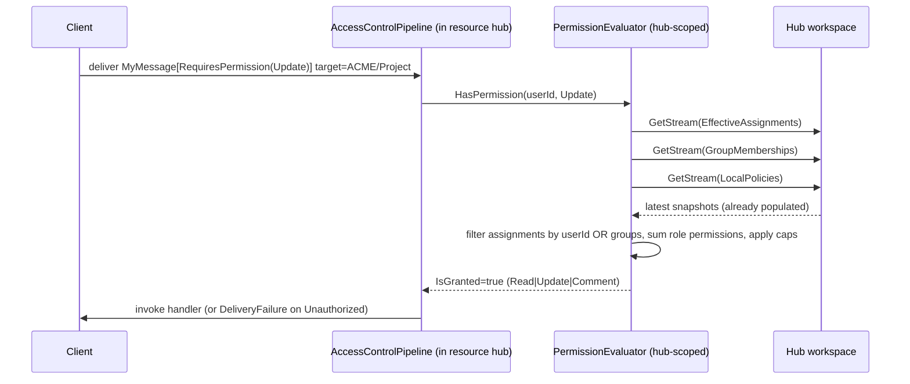
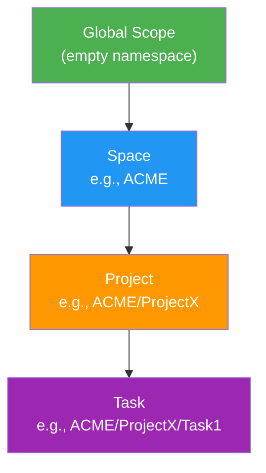
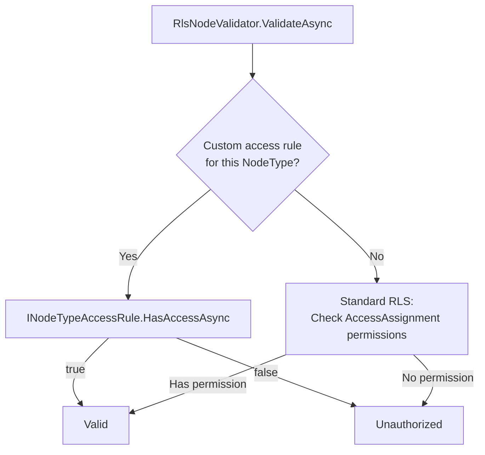
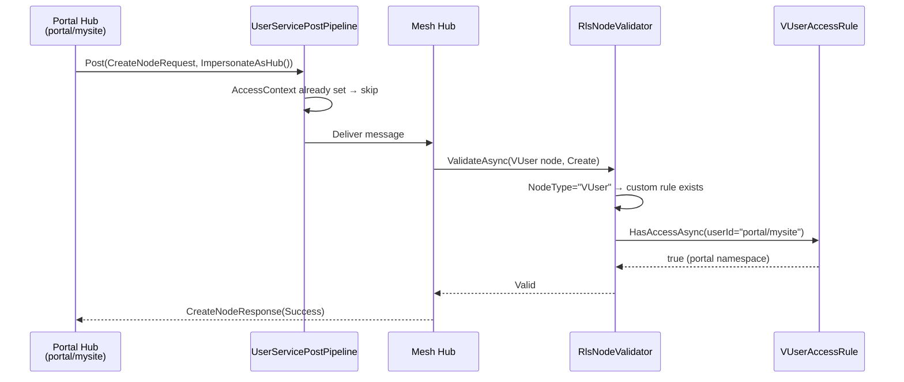

MeshWeaver implements row-level security through **AccessAssignment MeshNodes** stored directly in the mesh node hierarchy. Permissions propagate down the tree and are resolved from a live, fully reactive cache — no storage walks, no TTLs, no cache invalidation needed.

<svg viewBox="0 0 760 370" xmlns="http://www.w3.org/2000/svg" style="width:100%;max-width:760px;height:auto;display:block;margin:20px auto;" font-family="sans-serif" font-size="13">
  <defs>
    <marker id="arr" markerWidth="8" markerHeight="8" refX="7" refY="3" orient="auto">
      <path d="M0,0 L0,6 L8,3 z" fill="currentColor" fill-opacity=".55"/>
    </marker>
    <marker id="arrB" markerWidth="8" markerHeight="8" refX="7" refY="3" orient="auto">
      <path d="M0,0 L0,6 L8,3 z" fill="#26a69a"/>
    </marker>
  </defs>
  <rect x="1" y="1" width="758" height="368" rx="10" fill="none" stroke="currentColor" stroke-opacity=".12"/>
  <text x="380" y="24" text-anchor="middle" font-size="14" font-weight="bold" fill="currentColor" fill-opacity=".75">Access Control — Reactive Scope Inheritance</text>
  <rect x="260" y="38" width="240" height="68" rx="10" fill="#1e88e5"/>
  <text x="380" y="62" text-anchor="middle" fill="#fff" font-weight="bold">Root Hub (global scope)</text>
  <text x="380" y="80" text-anchor="middle" fill="#fff" fill-opacity=".85" font-size="11">LocalAssignments ∪ StaticBaselines</text>
  <text x="380" y="95" text-anchor="middle" fill="#fff" fill-opacity=".85" font-size="11">➜ EffectiveAssignments (broadcast)</text>
  <rect x="35" y="48" width="180" height="48" rx="8" fill="none" stroke="currentColor" stroke-opacity=".25"/>
  <text x="125" y="70" text-anchor="middle" fill="currentColor" fill-opacity=".65" font-size="11">_Access/Public_Access.json</text>
  <text x="125" y="87" text-anchor="middle" fill="currentColor" fill-opacity=".55" font-size="11">→ Viewer (all users)</text>
  <line x1="215" y1="72" x2="258" y2="72" stroke="currentColor" stroke-opacity=".3" stroke-dasharray="4 3" marker-end="url(#arr)"/>
  <rect x="545" y="48" width="180" height="48" rx="8" fill="none" stroke="currentColor" stroke-opacity=".25"/>
  <text x="635" y="70" text-anchor="middle" fill="currentColor" fill-opacity=".65" font-size="11">_Access/Alice_Access.json</text>
  <text x="635" y="87" text-anchor="middle" fill="currentColor" fill-opacity=".55" font-size="11">→ Admin (Alice)</text>
  <line x1="545" y1="72" x2="502" y2="72" stroke="currentColor" stroke-opacity=".3" stroke-dasharray="4 3" marker-end="url(#arr)"/>
  <line x1="380" y1="106" x2="380" y2="138" stroke="currentColor" stroke-opacity=".4" stroke-width="2" marker-end="url(#arr)"/>
  <text x="395" y="128" fill="currentColor" fill-opacity=".45" font-size="11">RemoteStream</text>
  <rect x="260" y="138" width="240" height="68" rx="10" fill="#43a047"/>
  <text x="380" y="162" text-anchor="middle" fill="#fff" font-weight="bold">ACME Hub</text>
  <text x="380" y="180" text-anchor="middle" fill="#fff" fill-opacity=".85" font-size="11">Inherited ∪ Local ∪ Policy caps</text>
  <text x="380" y="195" text-anchor="middle" fill="#fff" fill-opacity=".85" font-size="11">➜ EffectiveAssignments (broadcast)</text>
  <rect x="35" y="148" width="190" height="48" rx="8" fill="none" stroke="currentColor" stroke-opacity=".25"/>
  <text x="130" y="170" text-anchor="middle" fill="currentColor" fill-opacity=".65" font-size="11">ACME/_Access/Bob_Access.json</text>
  <text x="130" y="187" text-anchor="middle" fill="currentColor" fill-opacity=".55" font-size="11">→ Editor (Bob)</text>
  <line x1="225" y1="172" x2="258" y2="172" stroke="currentColor" stroke-opacity=".3" stroke-dasharray="4 3" marker-end="url(#arr)"/>
  <line x1="380" y1="206" x2="380" y2="238" stroke="currentColor" stroke-opacity=".4" stroke-width="2" marker-end="url(#arr)"/>
  <text x="395" y="228" fill="currentColor" fill-opacity=".45" font-size="11">RemoteStream</text>
  <rect x="260" y="238" width="240" height="68" rx="10" fill="#f57c00"/>
  <text x="380" y="262" text-anchor="middle" fill="#fff" font-weight="bold">ACME/Project Hub</text>
  <text x="380" y="280" text-anchor="middle" fill="#fff" fill-opacity=".85" font-size="11">Inherited ∪ Local (deny overrides)</text>
  <text x="380" y="295" text-anchor="middle" fill="#fff" fill-opacity=".85" font-size="11">➜ EffectiveAssignments (broadcast)</text>
  <line x1="380" y1="306" x2="380" y2="338" stroke="currentColor" stroke-opacity=".4" stroke-width="2" marker-end="url(#arr)"/>
  <text x="395" y="328" fill="currentColor" fill-opacity=".45" font-size="11">RemoteStream</text>
  <rect x="260" y="338" width="240" height="22" rx="6" fill="#8e24aa"/>
  <text x="380" y="353" text-anchor="middle" fill="#fff" font-size="11" font-weight="bold">ACME/Project/Task1 Hub — answers CheckPermission()</text>
  <line x1="500" y1="72" x2="600" y2="72" stroke="none"/>
  <rect x="545" y="148" width="180" height="48" rx="8" fill="none" stroke="#26a69a" stroke-opacity=".5"/>
  <text x="635" y="170" text-anchor="middle" fill="#26a69a" font-size="11">IDataChangeNotifier</text>
  <text x="635" y="187" text-anchor="middle" fill="currentColor" fill-opacity=".55" font-size="11">live push, no TTL</text>
  <line x1="545" y1="172" x2="502" y2="172" stroke="#26a69a" stroke-opacity=".5" stroke-dasharray="4 3" marker-end="url(#arrB)"/>
</svg>

*Permissions flow top-down via reactive `RemoteStream` subscriptions; each hub's `EffectiveAssignments` merges inherited and local `_Access` nodes and is immediately visible to every descendant hub.*

## 🛡️ The Admin partition — global / platform admin

**"Global admin" has exactly one meaning: an admin on the `Admin` partition.** `Admin` is a standard partition (schema `admin`, created by the migration) that holds platform-level data — version tracking, the role catalogue, and the platform-admin grants themselves. (The shipped catalogs are their own top-level partitions — agents under `Agent`, the AI model/provider catalog under `Provider` — not under `Admin`; see [NodeType Catalogs](/Doc/Architecture/NodeTypeCatalogs).)

A user is a **global (platform) admin** iff they hold `Permission.All` at scope `Admin` — i.e. there is an `AccessAssignment` granting them the `Admin` role in the **`Admin/_Access`** namespace:

```
Admin/_Access/{user}_Access   →   AccessObject = {user}, Roles = [ Admin ],  MainNode = ""
```

Such a user is a **platform admin — NOT a data superuser.** The `Admin/_Access` grant is scoped to the Admin partition (it covers `Admin/Invitation`, version tracking, the role catalogue, …) and **does not** confer access to **spaces** or **user partitions** — nor to the top-level catalog partitions (`Agent`, `Provider`), which carry their own grants (e.g. the `Provider/_Access` Admin grant seeded by `GlobalAdminSeed`). Standing access is platform management (send invites, delete things, platform config); emergency changes to space/user *data* require an explicit **elevation (break-glass)** — a separate, auditable step, never standing permission. `IsGlobalAdmin()` reports "is a platform admin" and gates the platform features; it is **not** a permission override (a root `_Access` grant — *that* is the data-superuser shape — is deliberately NOT how platform admins are provisioned).

### The one predicate: `hub.IsGlobalAdmin()`

Every "is this user a global/platform admin?" check goes through the single canonical extension — **never** an ad-hoc role-name (`Roles.Contains("PlatformAdmin")`) or root-scope (`GetEffectivePermissions("")`) check:

```csharp
hub.IsGlobalAdmin()          // current user (resolved from AccessContext)
hub.IsGlobalAdmin(userId)    // explicit user
// ≡ hub.GetEffectivePermissions("Admin", userId).Select(p => p.HasFlag(Permission.All))
```

Readers that gate on it: `AdminMenuGate` (Invitations / Inbox tabs), `UserNodeType.GetGlobalAdminTabAsync` (Global Administration tab), `UserProfile`.

### Where the grant comes from (db-init)

- **Config-driven** — `Auth:GlobalAdmins: [ "rbuergi", … ]` → `GlobalAdminSeed` seeds a static `Admin/_Access/{user}_Access` grant at boot. A fresh DB with the config set comes up with each listed user already a platform admin.
- **First user** — `UserOnboardingService.GrantPlatformAdmin` writes the same shape for the bootstrap user when the deployment has zero existing users.

> 🚨 **Platform-admin grants live in `Admin/_Access`, never root `_Access`.** A root `_Access` grant makes a user a **data superuser** (All on every partition via scope inheritance) — which platform admins must NOT be. An `Admin/_Access` grant scopes them to platform management only. Writers (`GlobalAdminSeed`, `GrantPlatformAdmin`) and readers (`hub.IsGlobalAdmin`) both use the Admin partition — they disagreed before 2026-06-08 (writers wrote root, readers checked Admin scope), which silently locked configured admins out of every admin tab.

> **Emergency / cross-partition data access** is out of scope for the standing grant — it will be a deliberate **elevation (break-glass)** flow (audited, time-boxed), not a permission a platform admin holds by default.

---

# Public API — start here

Application code calls two extension methods on `IMessageHub`. Both return `IObservable<T>` — compose them with `CombineLatest`/`Select`, never `await`. Full reference: [PermissionApi](/Doc/Architecture/PermissionApi).

```csharp
using MeshWeaver.Mesh;

// Check a single permission for the ambient user
hub.CheckPermission(nodePath, Permission.Update);

// Get the full effective Permission set
hub.GetEffectivePermissions(nodePath);

// Explicit user identity (admin tooling, server-to-server)
hub.CheckPermission(nodePath, "alice", Permission.Update);
```

The rest of this page covers the **internals** that back those extensions: the AccessAssignment node shape, the recursive scope walk, the per-scope synced subscriptions cached on `IMeshNodeStreamCache` under system identity, and the RLS validator wired into the storage adapter.

> Do not resolve `PermissionEvaluator` directly from application code — it is framework-internal infrastructure that the extension methods wrap.

---

# Core concepts

## AccessAssignment MeshNodes

Access control is managed through **AccessAssignment** nodes — first-class MeshNodes with `nodeType: "AccessAssignment"`. Each assignment grants (or denies) a role to a subject at a specific scope.

AccessAssignment nodes are **satellite entities** stored in the `_Access` sub-namespace:

```
Node path: {scope}/_Access/{Subject}_Access
Node type: AccessAssignment
Content: {
  "accessObject": "Alice",
  "displayName": "Alice Chen",
  "roles": [
    { "role": "Editor" },
    { "role": "Viewer" }
  ]
}
```

On disk (file system persistence), access files live under `_Access/` sub-directories:

```
ACME/
  _Access/
    Public_Access.json     ← All authenticated users get Viewer
    Alice_Access.json      ← Alice gets Editor
  Projects/
    _Access/
      Bob_Access.json      ← Bob gets Viewer on ACME/Projects
```

In PostgreSQL, access nodes are routed to a dedicated `access` table (via `PartitionDefinition.StandardTableMappings`), separate from the main `mesh_nodes` table.

Each AccessAssignment node maps **one subject** (User or Group) to **multiple roles** at a given scope. Storing all roles in one node reduces trigger invocations compared to a one-node-per-role approach.

**Key properties:**

| Property | Description |
|---|---|
| `AccessObject` | User or Group identifier |
| `DisplayName` | Optional display name for the subject |
| `Roles` | Array of `RoleAssignment` entries |
| `Roles[].Role` | Role to grant or deny (`Admin`, `Editor`, `Viewer`, `Commenter`, or custom) |
| `Roles[].Denied` | When `true`, denies the role instead of granting it |

## Built-in roles

| Role | Permissions | Flag value |
|---|---|---|
| Admin | Read, Create, Update, Delete, Comment | 31 (All) |
| Editor | Read, Create, Update, Comment | 23 |
| Viewer | Read | 1 |
| Commenter | Read, Comment | 17 |

## Permission flags

```csharp
[Flags]
public enum Permission
{
    None    = 0,
    Read    = 1,
    Create  = 2,
    Update  = 4,
    Delete  = 8,
    Comment = 16,
    All     = Read | Create | Update | Delete | Comment
}
```

---

# Permission evaluation

Permissions are evaluated **inside the per-node hub of the resource being accessed**, against a locally-cached `EffectiveAssignments` collection. The cache is populated by virtual data sources (see [Virtual Data Sources](/Doc/DataMesh/VirtualDataSources)) that sync from two places: the hub's own `_Access` subtree, and the parent hub's `EffectiveAssignments` collection. That aggregate is in turn exposed for *its* children to sync from.

**No storage walk on the read path. No cache TTL. Live updates via `IDataChangeNotifier`.**

## Scope hierarchy as a sync tree

For a target path `ACME/Project/Task1`, the access-data sync tree flows from root to leaf:

```
┌───────────────────────────────────┐
│  ROOT hub (path "")               │
│   LocalAccessAssignments          │ ←── own _Access subtree
│   LocalPolicies                   │ ←── own _Policy node
│   EffectiveAssignments  ═══ Local │  (no parent)
└──────────────┬────────────────────┘
               │ remote stream (RemoteStream<EffectiveAssignments>)
               ▼
┌───────────────────────────────────┐
│  ACME hub                         │
│   LocalAccessAssignments          │ ←── own _Access subtree
│   LocalPolicies                   │
│   InheritedFromParent             │ ←── ROOT.EffectiveAssignments
│   EffectiveAssignments            │ ═══ Inherited ∪ Local (Policy caps)
└──────────────┬────────────────────┘
               │ remote stream
               ▼
┌───────────────────────────────────┐
│  ACME/Project hub                 │
│   …                               │
└──────────────┬────────────────────┘
               │
               ▼
┌───────────────────────────────────┐
│  ACME/Project/Task1 hub           │
│   EffectiveAssignments            │ ←── used to answer access checks
└───────────────────────────────────┘
```

Each hub registers three virtual data sources via `AddMeshDataSource`:

- **`LocalAccessAssignments`** — `WithMeshQuery<AccessAssignment>("nodeType:AccessAssignment namespace:{thisPath}")`
- **`LocalPolicies`** — `WithMeshQuery<PartitionAccessPolicy>("nodeType:PartitionAccessPolicy namespace:{thisPath}")`
- **`InheritedEffectiveAssignments`** — cross-hub `WithVirtualType<AccessAssignment>(ws => ws.GetRemoteStream(parentAddr, new CollectionReference("EffectiveAssignments")))`

A computed `EffectiveAssignments` virtual collection then merges `InheritedEffectiveAssignments ∪ LocalAccessAssignments`, applying `LocalPolicies` caps and `BreaksInheritance`. That collection is what child hubs subscribe to.

## Evaluation flow — fully local, zero round-trips

The check happens **inside** the resource's per-node hub via a **hub-scoped `PermissionEvaluator`** that reads from the hub's own workspace. No cross-hub request, no global singleton, no storage walk.

Every per-node hub registers a `PermissionEvaluator` as scoped DI in its own service container. The instance closes over the hub's `IWorkspace` and answers from these synced virtual data sources:

- `LocalAccessAssignments` — own `_Access` subtree.
- `InheritedEffectiveAssignments` — parent hub's `EffectiveAssignments` via cross-hub remote stream.
- `EffectiveAssignments` — computed merge of the two above plus local policy caps.
- `LocalPolicies` — own `_Policy` node.
- `GroupMemberships` — global `nodeType:GroupMembership` set, synced via `WithMeshQuery<GroupMembership>`.
- `Roles` — custom role catalogue, synced from the mesh hub's `Roles` virtual collection.



The user identity rides on the in-flight delivery's `AccessContext.ObjectId` — no need to ask anyone where it is.

All inputs are **already in the hub's workspace** by the time the check fires (synced reactively via `IDataChangeNotifier`). The check itself is a couple of LINQ filters over in-memory collections — microseconds, not the hundreds of ms a storage walk used to take.

## Reactive update semantics

When an `AccessAssignment` is created at scope `S`:

1. The hub at `S` sees the new node via its `LocalAccessAssignments` `WithMeshQuery` subscription (driven by `IDataChangeNotifier`).
2. The hub at `S` re-emits its `EffectiveAssignments` collection with the new entry merged in.
3. Every descendant hub subscribed to `S.EffectiveAssignments` via their `InheritedEffectiveAssignments` remote stream sees the update and re-emits their own `EffectiveAssignments`.
4. The next `CheckPermissionRequest` on any descendant hub reflects the new assignment.

When a user joins or leaves a group:

1. The `GroupMembership` MeshNode is created or deleted.
2. The user's hub picks up the change via its `WithMeshQuery<GroupMembership>` subscription.
3. The next `GetGroupMembershipsRequest` returns the new list.
4. Subsequent `CheckPermissionRequest`s see the updated group set.

End-to-end propagation is on the order of the change-notifier tick (low milliseconds), not the 5-minute TTL the previous `PermissionEvaluator` cache used.

## Closest-wins semantics

When the same role is assigned at multiple levels, the **deepest assignment wins**:

| Scope | Assignment | Effect |
|---|---|---|
| `""` (global) | Alice: Admin | Grants All permissions globally |
| `ACME` | Alice: Admin (Denied) | **Overrides** global grant — no Admin at ACME |
| `ACME/Project` | Alice: Editor | Grants Editor at ACME/Project |

At `ACME/Project`, Alice has Editor permissions (Read + Create + Update + Comment) but not Admin.

## Deny override

A deny assignment blocks an inherited grant for a specific role, but does not affect other roles. Each node's `Roles[]` array can mix grants and denies:

```
Global:      Alice_Access → roles: [{ role: "Admin" }]
ACME:        Alice_Access → roles: [{ role: "Editor" }]
ACME/Secure: Alice_Access → roles: [{ role: "Admin", denied: true }]
```

At `ACME/Secure`, Alice has Editor permissions (inherited from ACME) but not Admin (denied at `ACME/Secure`).

---

# Node type architecture

Access control uses these shipped node types:

## AccessAssignment

- **NodeType**: `"AccessAssignment"`
- **Content**: `AccessAssignment` record with `Id` and `Roles[]` array
- **Path pattern**: `{scope}/_Access/{Subject}_Access`
- **Name pattern**: `{Subject} Access`
- Created via `PermissionEvaluator.AddUserRole(...)` (returns `IObservable<Unit>`; subscribe to drive) or directly via `IMeshService.CreateNode(...)` for advanced cases
- One node per subject per scope — multiple roles are stored in the `Roles` array

## User

- **NodeType**: `"User"`
- **Content**: `AccessObject` record (Id, Name, Description, Icon)
- Used as subjects in AccessAssignment nodes

## Group

- **NodeType**: `"Group"`
- **Content**: `AccessObject` record
- Contains GroupMembership child nodes for members
- Groups can be nested (a group member can be another group)

## GroupMembership

- **NodeType**: `"GroupMembership"`
- **Content**: `GroupMembership` record (`Member`, `DisplayName`, `Groups[]`)
- **Path pattern**: `{Scope}/{Member}_Membership`
- Maps one member (User or Group) to one or more groups at a given scope
- Mirrors the AccessAssignment 1:1 pattern (one node per member per scope)
- `Groups[]` contains `MembershipEntry` records with a `Group` property

## Role

- **NodeType**: `"Role"`
- **Content**: `Role` record (Id, DisplayName, Permissions, IsInheritable)
- Custom roles extend the built-in set

---

# PermissionEvaluator — hub-scoped, 100% IObservable

`PermissionEvaluator` is registered **scoped per per-node hub**, never as a singleton. Each instance closes over the hub's `IWorkspace` and answers reads from the synced virtual collections listed above. Content writes go through `workspace.GetMeshNodeStream(path).Update(...)` (the merge patch routes to the owning hub); node-lifecycle writes post `CreateNodeRequest` / `DeleteNodeRequest` through the hub's `IMessageHub`. Both surface the result as an observable.

Roles and baseline AccessAssignments follow the [Extensible Defaults](/Doc/Architecture/ExtensibleDefaults) pattern — built-ins ship via `IStaticNodeProvider` (read-only `_Policy` at the root namespace), mesh-level extensions live as user-created MeshNodes, and both layers project into the hub's local synced collection via the same three-query union that Agent and Model use. The evaluator reads from that collection — no per-process role cache, no `Timeout` fallback.

## Effective-assignments lookup: the 4-query union

For a permission check at scope `S` of a node whose NodeType is `T`, the effective AccessAssignment set is the **union** of four synced mesh-node queries, issued via a single `workspace.GetQuery(id, queries[])` call (the same primitive `AgentPickerProjection` uses for agents and models — the engine unions across queries by `Path`):

| # | Source | Query | Reactive empty? |
|---|---|---|---|
| 1 | Self | `namespace:{S}/_Access nodeType:AccessAssignment` | Yes — empty `Initial` is a valid value. |
| 2 | Parent chain | `namespace:{parent(S)}/_Access scope:selfAndAncestors nodeType:AccessAssignment` | Yes |
| 3 | NodeType chain | `namespace:{T}/_Access scope:selfAndAncestors nodeType:AccessAssignment` | Yes |
| 4 | Static baselines | `namespace:_Access nodeType:AccessAssignment` | Yes — empty when no `IStaticNodeProvider` ships baselines. |

The four sub-queries are independent synced subscriptions; the engine unions their result sets internally and emits one combined `IEnumerable<MeshNode>` snapshot. Each scope's combined observable is cached per `(S, T)` with a sliding 5-minute TTL via `Replay(1).RefCount`, so consecutive checks under the same scope hit the cached snapshot synchronously.

**Sparsity-friendly.** Every sub-query allows an empty result — a scope with no local `_Access` simply emits an empty Initial through `MeshQueryEngine` (no Postgres rows for that namespace prefix). The union still fires immediately; closest-wins merge proceeds with "local = nothing, parent provides everything, statics provide baselines". No `Timeout` fallback needed.

**Reactivity correct.** A future `CreateNode(AccessAssignment at acme/foo)` triggers an `Added` delta on sub-query (1); the union re-emits; the cached effective observable re-fires; descendants see the new effective assignment on the next tick.

**Why this beats the previous shape.** The old `PermissionEvaluator` kept a per-user `MemoryCache` over a single `scope:subtree` synced query and fell through a 2-second `Timeout()` whenever the upstream synced query's first emission lagged. In production that fallback fired hundreds of times per chat-thread render — every cold scope, every new user, every cache eviction. The 4-query union shifts the cache key from *user* to *scope* (one cache entry per scope, shared across all users) and lets each sub-query emit an empty Initial fast, removing the warm-up window the timeout was guarding against.

```csharp
// Inside the global PermissionEvaluator.
private IObservable<IEnumerable<MeshNode>> ObserveEffectiveAssignments(
    string scope, string? nodeTypePath)
{
    var key = (scope, nodeTypePath);
    return _scopeCache.GetOrCreate(key, entry =>
    {
        entry.SlidingExpiration = TimeSpan.FromMinutes(5);
        var parentScope = GetParent(scope);
        var queries = new List<string>
        {
            // 1. self
            $"namespace:{scope}/_Access nodeType:AccessAssignment",
            // 4. static baselines (root)
            "namespace:_Access nodeType:AccessAssignment",
        };
        // 2. parent chain
        if (parentScope is not null)
            queries.Add(
                $"namespace:{parentScope}/_Access scope:selfAndAncestors " +
                "nodeType:AccessAssignment");
        // 3. NodeType chain
        if (!string.IsNullOrEmpty(nodeTypePath))
            queries.Add(
                $"namespace:{nodeTypePath}/_Access scope:selfAndAncestors " +
                "nodeType:AccessAssignment");

        var observable = _workspace.GetQuery(
                $"$access:{scope}@{nodeTypePath ?? ""}",
                queries.ToArray())
            .Replay(1).RefCount();
        var keepAlive = observable.Subscribe(_ => { }, _ => { });
        entry.RegisterPostEvictionCallback((_, _, _, _) => keepAlive.Dispose());
        return observable;
    })!;
}
```

Closest-wins + deny + `BreaksInheritance` semantics still apply when the unioned MeshNode set is folded into per-user permissions — the fold walks the scope hierarchy in the projection, exactly as the existing `ComputeRoleState` does today; only the *source* changes.

**No `Task` returns anywhere on the surface** — every method returns `IObservable<T>` (`Unit` for fire-and-forget writes). Bridging to `Task` from hub-reachable code is the canonical deadlock pattern (see [Asynchronous Calls](/Doc/Architecture/AsynchronousCalls)); the only sanctioned bridge is at the test edge or grain-lifecycle boundary.

```csharp
public abstract class PermissionEvaluator
{
    // Read — answers from the hub's own workspace synchronously.
    IObservable<bool>       HasPermission(string userId, Permission permission);
    IObservable<Permission> GetEffectivePermissions(string userId);

    // Write — content via stream.Update (merge patch to owning hub);
    // lifecycle via CreateNodeRequest / DeleteNodeRequest. Surfaces the result.
    IObservable<Unit> AddUserRole(string userId, string roleId, string? targetNamespace, string? assignedBy);
    IObservable<Unit> RemoveUserRole(string userId, string roleId, string? targetNamespace);

    IObservable<Unit> SetPolicy(string targetNamespace, PartitionAccessPolicy policy);
    IObservable<Unit> RemovePolicy(string targetNamespace);
    IObservable<PartitionAccessPolicy?> GetPolicy(string targetNamespace);

    // Role catalogue (synced from a Roles virtual collection).
    IObservable<Role?> GetRole(string roleId);
    IObservable<Role>  GetRoles();           // emits per-role
    IObservable<Unit>  SaveRole(Role role);
}
```

Callers compose with `.Subscribe(onNext, onError)` — never `await`. The previous singleton's storage walks, `_permissionCache`, `_policyCache`, `_customRoleCache`, and `_staticAccessAssignments` collection are all gone. **No per-process global state remains.**

## Writes drive the stream — persistence subscribes

Writes (`AddUserRole`, `SetPolicy`, …) **update the hub's local workspace stream directly**. The stream is the source of truth. The persistence layer (file system / PostgreSQL / Cosmos) is itself a **subscriber** of the stream — it observes updates and writes to its backing store. Child hubs subscribing to the parent's `EffectiveAssignments` see the change via the same stream-sync protocol used for `MeshNodeReference`.

```
┌──────────────────────────────────────┐
│  PermissionEvaluator.AddUserRole(...)   │
└──────────────────┬───────────────────┘
                   │ workspace.GetMeshNodeStream(path).Update(...)
                   ▼
┌──────────────────────────────────────┐
│  Hub's local workspace stream         │
│    EffectiveAssignments emits new ▶   │ ← UI / PermissionEvaluator.HasPermission
│    LocalAccessAssignments emits new ▶ │   subscribers see it instantly
└──────────────────┬───────────────────┘
                   │ stream subscription
       ┌───────────┴────────────┐
       ▼                        ▼
┌────────────┐      ┌────────────────────────┐
│ Persister  │      │ Child hub remote stream │
│  (DB/disk) │      │  inherited assignments   │
└────────────┘      └────────────────────────┘
```

Implementation shape:

```csharp
public IObservable<Unit> AddUserRole(string userId, string roleId,
    string? targetNamespace, string? assignedBy)
{
    var node = BuildAccessAssignmentNode(...);
    // The stream update IS the write. Persistence + downstream hubs
    // observe it.
    return workspace.GetMeshNodeStream(node.Path)
        .Update(_ => node)
        .Select(_ => Unit.Default);   // caller subscribes — cold until then
}
```

Why: callers (UI, scripts, tests) need read-after-write consistency. The write observable completes when the workspace stream has surfaced the change — a follow-up `HasPermission(...)` already reflects it. The DB write happens off the critical path, with eventual consistency guaranteed by the persister's stream subscription.

---

# Anonymous and Public access

MeshWeaver distinguishes between two well-known user groups:

| User | Constant | Meaning |
|---|---|---|
| **Anonymous** | `WellKnownUsers.Anonymous` | Unauthenticated visitors (not logged in) |
| **Public** | `WellKnownUsers.Public` | Baseline permissions for all authenticated users |

When no user context is available (empty userId or virtual user), permissions are evaluated for the **Anonymous** user. Authenticated users automatically inherit **Public** permissions in addition to their own.

```csharp
// Grant Anonymous users read access to the Welcome page.
// AddUserRole posts the right CreateNode/UpdateNode through IMeshService;
// the assignment lands on the resource hub's synced AccessAssignments
// collection on the next tick — no cache to invalidate.
securityService.AddUserRole("Anonymous", "Viewer", "Welcome", "system")
    .Subscribe();

// Grant all logged-in users read access to MeshWeaver content.
securityService.AddUserRole("Public", "Viewer", "MeshWeaver", "system")
    .Subscribe();

// Read paths return IObservable<bool> from the resource hub's local
// workspace (no cross-hub round-trip, no TTL). Subscribe to react.
securityService.HasPermission("Anonymous", Permission.Read)
    .Subscribe(allowed => /* ... */);
```

---

# Hierarchical access pattern



**Examples:**
- Global Admin: `AddUserRoleAsync("Roland", "Admin", null, ...)` → full access everywhere
- Org Editor: `AddUserRoleAsync("Alice", "Editor", "ACME", ...)` → edit within ACME and descendants
- Project Viewer: `AddUserRoleAsync("Bob", "Viewer", "ACME/ProjectX", ...)` → read-only at ProjectX

---

# Access Control UI

The Access Control layout area (`AccessControlLayoutArea`, Settings → Access Control) provides:

1. **Parent scope** (read-only) — the AccessAssignment nodes inherited from the parent scope, rendered via the AccessAssignment Thumbnail area.
2. **Current scope** (editable, admin-only) — the assignments at this node; role dropdown + Deny toggle bind directly to each assignment's node stream.
3. **Add row / Add Assignment dialog** (admin-only) — subject picker + role select that creates the AccessAssignment node.
4. **Advanced** — the partition policy (`PartitionAccessPolicy`) capping permissions for everyone at this scope and below.

The subject picker binds the canonical queries from **`AccessSubjectQueries`** (`MeshWeaver.Mesh.Contract`): users at the root namespace (served by the `auth` lookup mirror via `UserNodeType`'s routing rule) plus groups in the scope's partition subtree. It loads the subject set once (capped at 500) and filters it in-memory, diacritic-insensitively (`SearchText`); beyond the cap, typed text falls back to the server-side search and the union is shown. Hand-rolled subject queries are forbidden — the legacy `namespace:User` / `namespace:Group` shapes target dropped schemas and silently return zero rows (issue #213). See [Granting Access](/Doc/Architecture/GrantingAccess) for the UI walkthrough and MCP recipes.

---

# Partition access control

In multi-tenant PostgreSQL deployments, each organisation has its own schema (partition). Access to partitions is controlled by the `partition_access` table:

```sql
CREATE TABLE public.partition_access (
    user_id    TEXT NOT NULL,
    partition  TEXT NOT NULL,
    PRIMARY KEY (user_id, partition)
);
```

Populated automatically by `rebuild_user_effective_permissions()` in each partition's schema. When a user has any role in a partition, they receive a `partition_access` entry.

## Partition access in search

Cross-schema search (`search_across_schemas`) enforces partition access at the SQL level. The access control clause requires:

1. **Partition access** — user must have a `partition_access` entry for the schema (always required)
2. **Node-level permission** — user must have Read permission on the node's `main_node` path

`public_read` node types (e.g., User, Markdown) skip the node-level check but still require partition access. This prevents cross-partition data leakage — a user cannot see another organisation's nodes just because the node type is publicly readable.

```sql
-- Access control: partition_access is ALWAYS required.
-- public_read only skips node-level permission checks.
WHERE partition_access_exists AND (
    public_read_node_type OR node_level_permission
)
```

## AI tool call identity

When AI agents execute tool calls (Get, Update, Create, etc.) during thread streaming, the user's `AsyncLocal` access context doesn't flow through the AI framework's async tool invocation chain. All tools are wrapped with `AccessContextAIFunction` (a `DelegatingAIFunction`) that restores the user's identity from `ThreadExecutionContext.UserAccessContext` before each invocation.

This ensures tool calls run with the correct user identity for permission checks.

## Satellite node permissions

### 🚨 Access is defined on the main node — satellites inherit it

**A satellite has no access rights of its own. Permissions are defined on its
`MainNode`, and whoever can Read the main node can Read every satellite under
it.** `MeshNode.MainNode` is a column on the node (the node *for which the
satellite exists*); a main node has `MainNode == Path`.

This falls out of the scope walk for free: `GetEffectivePermissions(path)`
(`PermissionEvaluator`) evaluates every scope from the root down through the
partition and every ancestor to the path itself. A satellite/sub path such as
`{user}/_Thread/{threadId}/{messageId}` therefore inherits the grants at
`{user}` (the partition / main node) — the partition owner gets Read on the
whole subtree without a per-satellite grant. **To answer "can I read this
thread / message?", you ask the security service for access on the path; you do
NOT probe the leaf node's own hub.**

Concretely:

- **Reads / subscriptions** — `MeshNodeStreamCache` gates each subscription by
  evaluating `hub.GetEffectivePermissions(path, user)` **locally** (the same
  evaluator every other decision uses), cached per `(path, user)` for the
  AccessControl TTL. It does **not** post a `GetPermissionRequest` to the leaf
  path's hub. A satellite / cell sub-path (e.g. a `{thread}/{messageId}` the GUI
  subscribed to that was never persisted, or a brand-new thread) has no hub of
  its own — routing returns NotFound — so a leaf-hub probe would block on a grain
  that never activates and the subscribe would spin forever. Local evaluation has
  no such dependency: the scope walk resolves the main node's access and emits
  immediately. (This was the side-panel "thread won't open" spinner.)
- **Writes / CRUD** — `SatelliteAccessRule` delegates the create/update/delete
  check to `context.Node.MainNode` (Create on a satellite = Update on the main
  node, except `Comment` → `Permission.Comment`). Same rule, write side.

For PostgreSQL the main node is reachable in a single query — the path itself
determines schema (first segment) and table (satellite suffix, e.g. `_Thread`
→ `threads`), and every row carries its `main_node` column — but the read gate
doesn't even need that: the scope walk over the path already covers it.

### Required permission by node type

Satellite node types map to their required permission via `GetPermissionForNodeType`:

| Node type | Required permission |
|---|---|
| Thread, ThreadMessage | `Permission.Thread` |
| Comment | `Permission.Comment` |
| ApiToken | `Permission.Api` |
| All others | `Permission.Create` |

---

# PostgreSQL integration

For PostgreSQL deployments, a denormalized `user_effective_permissions` table enables fast query-time permission checks. A trigger on `mesh_nodes` automatically rebuilds this table when AccessAssignment or GroupMembership nodes change.

```sql
-- Trigger fires on AccessAssignment/GroupMembership changes
CREATE TRIGGER mesh_node_access_changed
    AFTER INSERT OR UPDATE OR DELETE ON mesh_nodes
    FOR EACH ROW EXECUTE FUNCTION trg_mesh_node_access_changed();
```

The rebuild function:
1. Reads AccessAssignment MeshNodes from `mesh_nodes`, unnesting each node's `roles` JSON array via `jsonb_array_elements(content->'roles')`
2. Expands GroupMembership recursively (nested groups)
3. Joins with Role definitions (built-in + custom Role MeshNodes)
4. Produces per-user, per-permission rows in a shadow table
5. Atomically swaps the shadow table into the live table

---

# Node validation (INodeValidator)

The `RlsNodeValidator` integrates with the mesh node CRUD pipeline to enforce permissions on Create, Update, and Delete operations:

```csharp
public class RlsNodeValidator : INodeValidator
{
    public IReadOnlyCollection<NodeOperation> SupportedOperations
        => [NodeOperation.Create, NodeOperation.Update, NodeOperation.Delete];

    public IObservable<NodeValidationResult> Validate(NodeValidationContext context)
    {
        var requiredPermission = context.Operation switch
        {
            NodeOperation.Create => Permission.Create,
            NodeOperation.Update => Permission.Update,
            NodeOperation.Delete => Permission.Delete,
            _ => Permission.None
        };

        // PermissionEvaluator is hub-scoped and reads from the local workspace's
        // synced collections — no cross-hub round-trip, no TTL.
        return securityService
            .HasPermission(context.UserId, requiredPermission)
            .Select(allowed => allowed
                ? NodeValidationResult.Valid()
                : NodeValidationResult.Invalid(NodeRejectionReason.Unauthorized));
    }
}
```

Read operations are not validated by the node validator — read filtering is handled by `SecurePersistenceServiceDecorator`, which wraps `GetChildrenAsync` and `GetNodeAsync` with permission checks.

---

# Hub identity and sanctioned dedicated identities

## How messages authenticate

Every message in MeshWeaver carries an `AccessContext` that identifies the **principal** behind the operation. The `UserServicePostPipeline` decides the principal at post time:

1. **Explicit `PostOptions.WithAccessContext(...)`** — if the caller pre-set the context (e.g. via `accessService.ImpersonateAsSystem()` or a sanctioned dedicated identity), use it. Do not overwrite.
2. **User in scope** — if an authenticated user identity is set on `AccessService.Context` (or `CircuitContext` as fallback), attach it.
3. **Fail closed** — if neither applies, the message goes out with `null` `AccessContext`; downstream AccessControl denies. The "stamp hub-self as principal" fallback was removed 2026-05-21 because it silently masked the prod EventCalendar bug.

Per-message, per-delivery — the identity baton. The full propagation model is documented in [AccessContextPropagation.md](/Doc/Architecture/AccessContextPropagation); read it before adding any new impersonation callsite.

## Sanctioned dedicated identities — the only sanctioned override

When code legitimately runs as a component (cache hydrator, redistributor hub, onboarding writer) with no user behind it, **do not** stamp the running hub's accidental address as principal. Instead:

1. **Define** a named, dedicated identity (`cache/mesh-node-cache`, `portal/onboarding`, `protocol/sync-stream`). The identity reflects the COMPONENT, not the hub.
2. **Grant** that identity ONLY the specific operations it actually needs via per-NodeType access rules.
3. **Test** the boundary — every misuse must yield `UnauthorizedAccessException` with a meaningful message.

This is the `IsPortalIdentity` pattern (User-node onboarding) generalised: every sanctioned bypass is a single, named, controlled seat — never a wildcard like "all `sync/*` get protocol perms". See [AccessContextPropagation.md → Sanctioned exceptions](/Doc/Architecture/AccessContextPropagation#sanctioned-exceptions--fine-grained-exact-controlled) for the define / grant / test contract.

```csharp
// Pattern — define an internal constant
internal static class MeshNodeCacheIdentity
{
    internal const string Address = "cache/mesh-node-cache";
}

// Grant via per-NodeType access rule
config.AddAccessRule(
    [NodeOperation.Read],
    (_, userId) => userId == MeshNodeCacheIdentity.Address);

// Use at the point where the component acts
using (accessService.SwitchAccessContext(new AccessContext { ObjectId = MeshNodeCacheIdentity.Address }))
{
    // cache hydration runs here
}

// Test that misuse fails
[Fact]
public async Task MeshNodeCacheIdentity_CannotWrite()
{
    using (accessService.SwitchAccessContext(new AccessContext { ObjectId = "cache/mesh-node-cache" }))
    {
        var act = () => meshService.CreateNode(someNode).ToTask();
        await act.Should().ThrowAsync<UnauthorizedAccessException>();
    }
}
```

## Identity resolution in node operations

When `HandleCreateNodeRequest` (and its `Update/Delete/CopyNodeRequest` siblings) receives a message, it resolves the identity:

1. If the request's `CreatedBy` / `UpdatedBy` / `DeletedBy` is explicitly set, use it.
2. Otherwise fill from `delivery.AccessContext.ObjectId`.

So the principal that ran through the baton ends up on the stored row's `CreatedBy`. For user-driven writes this is the user's ObjectId; for sanctioned-identity-driven writes it is the dedicated address — auditable, visible in logs and queries.

## Choosing the acting identity

When an operation needs an identity other than the calling user, pick from these — in order of preference:

- **Sanctioned dedicated identity** if there's a defined role for the operation (`cache/mesh-node-cache`, `portal/onboarding`).
- **`accessService.ImpersonateAsSystem()`** if the operation is genuinely system infrastructure with no narrower seat.
- **`accessService.ImpersonateAsHub(hub)`** when the hub itself is the natural principal (its address gets the permissions).
- **Carry the user's identity** if the operation is user-initiated — losing it is a bug, not a reason to impersonate.

---

# Per-node-type access rules (INodeTypeAccessRule)

Some node types require custom access logic that differs from the standard AccessAssignment-based RLS check. For example, VUser nodes should only be creatable by portal hubs, regardless of AccessAssignment configuration.

The `INodeTypeAccessRule` interface lets node types replace the standard RLS check with custom logic:

```csharp
public interface INodeTypeAccessRule
{
    string NodeType { get; }
    IReadOnlyCollection<NodeOperation> SupportedOperations { get; }
    Task<bool> HasAccessAsync(
        NodeValidationContext context, string? userId, CancellationToken ct);
}
```

When `RlsNodeValidator` encounters a node whose type has a registered `INodeTypeAccessRule`, it delegates to the rule **instead of** checking AccessAssignment permissions. The rule returns `true` to allow or `false` to deny.

## How it works



## Registering a custom access rule

Register via DI in your node type's configuration method:

```csharp
public static TBuilder AddVUserType<TBuilder>(this TBuilder builder)
    where TBuilder : MeshBuilder
{
    builder.AddMeshNodes(CreateMeshNode());
    builder.ConfigureServices(services =>
    {
        services.AddSingleton<INodeTypeAccessRule, VUserAccessRule>();
        return services;
    });
    return builder;
}
```

## Example: VUser access rule

The VUser node type uses a custom access rule that allows portal namespace hubs to create, read, and update VUser nodes:

```csharp
private class VUserAccessRule : INodeTypeAccessRule
{
    public string NodeType => "VUser";

    public IReadOnlyCollection<NodeOperation> SupportedOperations =>
        [NodeOperation.Create, NodeOperation.Read, NodeOperation.Update];

    public Task<bool> HasAccessAsync(
        NodeValidationContext context, string? userId, CancellationToken ct)
    {
        // Allow if the identity is in the portal namespace
        if (!string.IsNullOrEmpty(userId) &&
            userId.StartsWith("portal/", StringComparison.OrdinalIgnoreCase))
            return Task.FromResult(true);

        // Deny all others
        return Task.FromResult(false);
    }
}
```

**Key behaviors:**
- Only identities starting with `portal/` can create, read, or update VUser nodes.
- Other identities are denied — the standard AccessAssignment check is **not** performed for VUser nodes.
- Delete operations are not covered by this rule and fall through to standard RLS.

## End-to-end: portal hub creating a VUser



---

# Message-level permission enforcement

## RequiresPermissionAttribute

Message types declare the permission they require via `[RequiresPermission]`. When a message arrives at a node hub with the `AccessControlPipeline` enabled, the pipeline checks whether the sender has the required permission on the hub's path. If denied, a `DeliveryFailure` with `ErrorType.Unauthorized` is returned.

```csharp
// Simple: single permission on the hub path
[RequiresPermission(Permission.Read)]
public record SubscribeRequest(...);

[RequiresPermission(Permission.Create)]
public record CreateNodeRequest(...);

[RequiresPermission(Permission.Update)]
public record DataChangeRequest(...);
```

### Built-in annotated messages

| Message | Required permission |
|---|---|
| `SubscribeRequest` | Read |
| `GetDataRequest` | Read |
| `CreateNodeRequest` | Create |
| `ImportNodesRequest` | Create |
| `ImportContentRequest` | Create |
| `stream.Update` (`PatchDataRequest`) | Update |
| `DataChangeRequest` | Update |
| `UndoActivityRequest` | Update |
| `RollbackNodeRequest` | Update |
| `UpdateUnifiedReferenceRequest` | Update |
| `DeleteNodeRequest` | Delete |
| `DeleteContentRequest` | Delete |
| `DeleteUnifiedReferenceRequest` | Delete |
| `MoveNodeRequest` | Custom (see below) |

### Custom permission checks

For messages that need non-trivial authorisation logic, inherit from `RequiresPermissionAttribute` and override `GetPermissionChecks`. The method receives the `IMessageDelivery` and the hub path, and returns multiple `(path, permission)` pairs — all must pass.

```csharp
// MoveNodeRequest needs Delete on source + Create on target
[MoveNodePermission]
public record MoveNodeRequest(string SourcePath, string TargetPath);

public class MoveNodePermissionAttribute() : RequiresPermissionAttribute(Permission.Update)
{
    public override IEnumerable<(string Path, Permission Permission)> GetPermissionChecks(
        IMessageDelivery delivery, string hubPath)
    {
        if (delivery.Message is MoveNodeRequest move)
        {
            yield return (GetNamespace(move.SourcePath), Permission.Delete);
            yield return (GetNamespace(move.TargetPath), Permission.Create);
        }
        else
        {
            yield return (hubPath, Permission.Update);
        }
    }

    private static string GetNamespace(string path)
    {
        var lastSlash = path.LastIndexOf('/');
        return lastSlash > 0 ? path[..lastSlash] : path;
    }
}
```

### Extending with custom permissions

The `Permission` enum uses `[Flags]` with bits 1–32 reserved for built-in permissions. Custom permissions use higher bits:

```csharp
const Permission Approve = (Permission)64;
const Permission Publish = (Permission)128;

// Custom message requiring Approve permission
[RequiresPermission((Permission)64)]
public record ApproveDocumentRequest(string Path);
```

## AccessControlPipeline

The `AccessControlPipeline` is a delivery pipeline step registered by `AddRowLevelSecurity()` on all default node hubs. It runs before the message handler and:

1. Reads the `RequiresPermissionAttribute` from the message type (cached per type)
2. Calls `GetPermissionChecks()` to get the list of `(path, permission)` pairs
3. Checks each pair against `PermissionEvaluator.HasPermission(...)` (returns `IObservable<bool>` — composed into the pipeline, never awaited)
4. If any check fails → sends `DeliveryFailure(ErrorType.Unauthorized)` back to sender

Messages without `[RequiresPermission]` pass through unchecked. System messages (`PingRequest`, `InitializeHubRequest`, etc.) are not annotated and are always allowed.

---

# Configuration

Enable row-level security in your mesh configuration:

```csharp
var builder = new MeshBuilder()
    .UseMonolithMesh()
    .AddFileSystemPersistence(dataPath)
    .AddRowLevelSecurity();  // Registers PermissionEvaluator, RlsNodeValidator, etc.
```

---

# Best practices

1. **Start with hierarchy** — assign roles at the organisational level and let inheritance handle descendants.
2. **Use deny sparingly** — deny overrides only the specific role, not all permissions.
3. **Anonymous for unauthenticated access** — configure the Anonymous user with Viewer role on namespaces that should be visible without login.
4. **Public for authenticated baseline** — configure the Public user with Viewer role on namespaces that all logged-in users should access.
5. **No manual caching** — `PermissionEvaluator` is hub-scoped and reads from the local workspace's synced `AccessAssignments` / `Policies` / `Roles` collections. Those collections are kept live by the synced query data source; there is no separate TTL cache to invalidate.
6. **Fail closed** — no roles assigned means no permissions (`Permission.None`).
7. **Audit via MeshNodes** — AccessAssignment nodes provide a clear audit trail of who has access to what.
8. **Use `ImpersonateAsHub()` for hub operations** — when a hub needs to perform operations as itself, use `PostOptions.ImpersonateAsHub()` instead of setting identity on `AccessService` directly.
9. **Custom access rules for special node types** — use `INodeTypeAccessRule` when a node type needs access logic that differs from standard AccessAssignment-based RLS (e.g., namespace-based identity checks).
