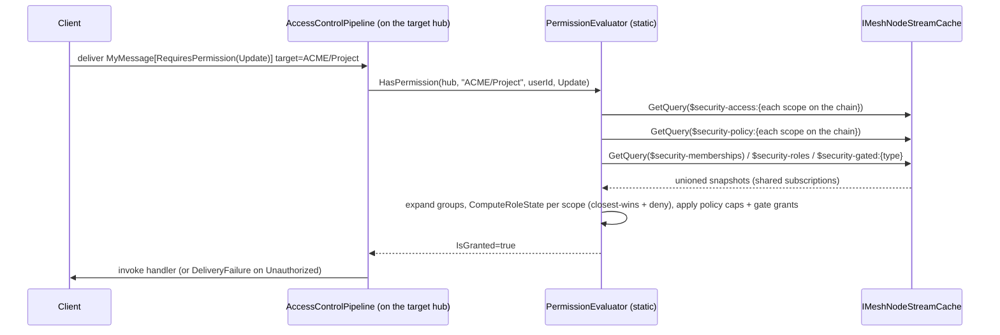
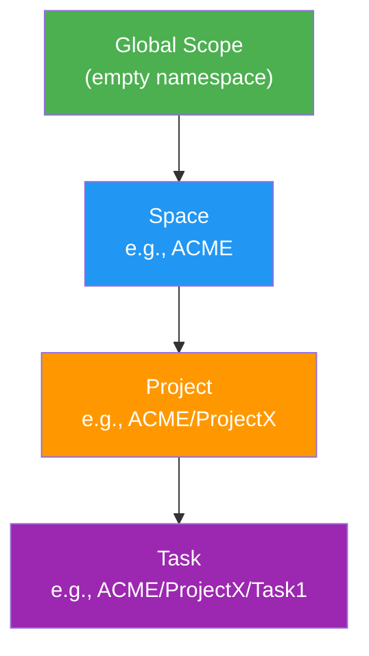
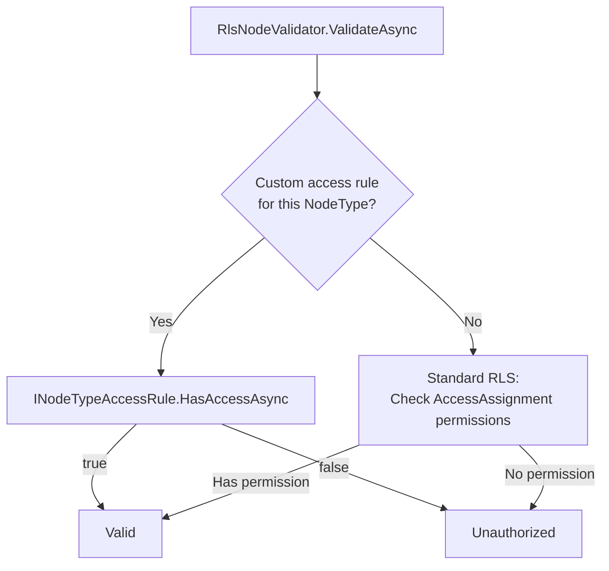
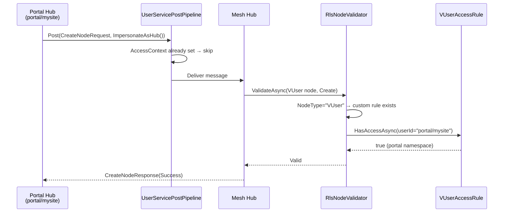

MeshWeaver implements row-level security through **AccessAssignment MeshNodes** stored directly in the mesh node hierarchy. Permissions propagate down the tree and are resolved from a live, fully reactive cache — no storage walks, no TTLs, no cache invalidation needed.

<svg viewBox="0 0 760 370" xmlns="http://www.w3.org/2000/svg" style="width:100%;max-width:760px;height:auto;display:block;margin:20px auto;" font-family="sans-serif" font-size="13">
  <defs>
    <marker id="arr" markerWidth="8" markerHeight="8" refX="7" refY="3" orient="auto">
      <path d="M0,0 L0,6 L8,3 z" fill="currentColor" fill-opacity=".55"/>
    </marker>
    <marker id="arrB" markerWidth="8" markerHeight="8" refX="7" refY="3" orient="auto">
      <path d="M0,0 L0,6 L8,3 z" fill="#26a69a"/>
    </marker>
  </defs>
  <rect x="1" y="1" width="758" height="368" rx="10" fill="none" stroke="currentColor" stroke-opacity=".12"/>
  <text x="380" y="24" text-anchor="middle" font-size="14" font-weight="bold" fill="currentColor" fill-opacity=".75">Access Control — Reactive Scope Inheritance</text>
  <rect x="260" y="38" width="240" height="68" rx="10" fill="#1e88e5"/>
  <text x="380" y="62" text-anchor="middle" fill="#fff" font-weight="bold">Root Hub (global scope)</text>
  <text x="380" y="80" text-anchor="middle" fill="#fff" fill-opacity=".85" font-size="11">LocalAssignments ∪ StaticBaselines</text>
  <text x="380" y="95" text-anchor="middle" fill="#fff" fill-opacity=".85" font-size="11">➜ scope grants, unioned downward</text>
  <rect x="35" y="48" width="180" height="48" rx="8" fill="none" stroke="currentColor" stroke-opacity=".25"/>
  <text x="125" y="70" text-anchor="middle" fill="currentColor" fill-opacity=".65" font-size="11">_Access/Public_Access.json</text>
  <text x="125" y="87" text-anchor="middle" fill="currentColor" fill-opacity=".55" font-size="11">→ Viewer (all users)</text>
  <line x1="215" y1="72" x2="258" y2="72" stroke="currentColor" stroke-opacity=".3" stroke-dasharray="4 3" marker-end="url(#arr)"/>
  <rect x="545" y="48" width="180" height="48" rx="8" fill="none" stroke="currentColor" stroke-opacity=".25"/>
  <text x="635" y="70" text-anchor="middle" fill="currentColor" fill-opacity=".65" font-size="11">_Access/Alice_Access.json</text>
  <text x="635" y="87" text-anchor="middle" fill="currentColor" fill-opacity=".55" font-size="11">→ Admin (Alice)</text>
  <line x1="545" y1="72" x2="502" y2="72" stroke="currentColor" stroke-opacity=".3" stroke-dasharray="4 3" marker-end="url(#arr)"/>
  <line x1="380" y1="106" x2="380" y2="138" stroke="currentColor" stroke-opacity=".4" stroke-width="2" marker-end="url(#arr)"/>
  <text x="395" y="128" fill="currentColor" fill-opacity=".45" font-size="11">parent-scope fold</text>
  <rect x="260" y="138" width="240" height="68" rx="10" fill="#43a047"/>
  <text x="380" y="162" text-anchor="middle" fill="#fff" font-weight="bold">ACME Hub</text>
  <text x="380" y="180" text-anchor="middle" fill="#fff" fill-opacity=".85" font-size="11">Inherited ∪ Local ∪ Policy caps</text>
  <text x="380" y="195" text-anchor="middle" fill="#fff" fill-opacity=".85" font-size="11">➜ scope grants, unioned downward</text>
  <rect x="35" y="148" width="190" height="48" rx="8" fill="none" stroke="currentColor" stroke-opacity=".25"/>
  <text x="130" y="170" text-anchor="middle" fill="currentColor" fill-opacity=".65" font-size="11">ACME/_Access/Bob_Access.json</text>
  <text x="130" y="187" text-anchor="middle" fill="currentColor" fill-opacity=".55" font-size="11">→ Editor (Bob)</text>
  <line x1="225" y1="172" x2="258" y2="172" stroke="currentColor" stroke-opacity=".3" stroke-dasharray="4 3" marker-end="url(#arr)"/>
  <line x1="380" y1="206" x2="380" y2="238" stroke="currentColor" stroke-opacity=".4" stroke-width="2" marker-end="url(#arr)"/>
  <text x="395" y="228" fill="currentColor" fill-opacity=".45" font-size="11">parent-scope fold</text>
  <rect x="260" y="238" width="240" height="68" rx="10" fill="#f57c00"/>
  <text x="380" y="262" text-anchor="middle" fill="#fff" font-weight="bold">ACME/Project Hub</text>
  <text x="380" y="280" text-anchor="middle" fill="#fff" fill-opacity=".85" font-size="11">Inherited ∪ Local (deny overrides)</text>
  <text x="380" y="295" text-anchor="middle" fill="#fff" fill-opacity=".85" font-size="11">➜ scope grants, unioned downward</text>
  <line x1="380" y1="306" x2="380" y2="338" stroke="currentColor" stroke-opacity=".4" stroke-width="2" marker-end="url(#arr)"/>
  <text x="395" y="328" fill="currentColor" fill-opacity=".45" font-size="11">parent-scope fold</text>
  <rect x="260" y="338" width="240" height="22" rx="6" fill="#8e24aa"/>
  <text x="380" y="353" text-anchor="middle" fill="#fff" font-size="11" font-weight="bold">hub.CheckPermission("ACME/Project/Task1", …)</text>
  <line x1="500" y1="72" x2="600" y2="72" stroke="none"/>
  <rect x="545" y="148" width="180" height="48" rx="8" fill="none" stroke="#26a69a" stroke-opacity=".5"/>
  <text x="635" y="170" text-anchor="middle" fill="#26a69a" font-size="11">IDataChangeNotifier</text>
  <text x="635" y="187" text-anchor="middle" fill="currentColor" fill-opacity=".55" font-size="11">live push, no TTL</text>
  <line x1="545" y1="172" x2="502" y2="172" stroke="#26a69a" stroke-opacity=".5" stroke-dasharray="4 3" marker-end="url(#arrB)"/>
</svg>

*Permissions flow top-down: evaluating a path folds each scope's `_Access` grants together with its parent scope's, so a grant made anywhere on the ancestor chain is visible to every descendant path on the next emission of that scope's shared query.*

## 🔒 The scope invariant — `MainNode` MUST name a partition, and is never empty

**A grant is scoped by `MainNode`, NOT by the folder it sits in.** This one sentence is the whole
model, and getting it wrong is the most dangerous mistake available in the system.

```
{scope}/_Access/{subject}_Access     MainNode = "{scope}"     ✅ scoped to that partition
Admin/_Access/{subject}_Access       MainNode = "Admin"       ✅ GLOBAL ADMIN (the Admin partition)
Admin/_Access/{subject}_Access       MainNode = ""            🔴 ROOT — superuser over EVERYTHING
```

An **empty `MainNode` is not "scoped to the folder"** — it is a **root** grant that merely happens to
be filed under it: All on every partition, every space, every plugin and every user's private home,
by scope inheritance. It looks harmless in the node tree.

> ### 🚨 The rule
> **`MainNode` must name the same scope its path encodes.** A grant filed at
> `{scope}/_Access/…` with any other `MainNode` — above all an empty one — is **rejected at every
> write path** (`AccessAssignmentGuard`, enforced in both `CreateNode` and the upsert handler, with
> the structural invariants — before the validators and before their System bypass).
>
> That mismatch is the whole danger, and it is what the mesh actually had: the offending rows sat in
> `admin.access` — i.e. `Admin/_Access/{user}_Access`, reading as ordinary platform-admin grants —
> with `MainNode = ""` scoping them to root instead.
>
> **Admin partition ⇒ global admin.** A grant with `MainNode = "Admin"` IS the platform-admin
> grant. There is no other shape, and it must be given deliberately to a named operator —
> essentially never. See the section below.

> ### What is *not* refused, and why
> A **self-consistent** root grant — path `_Access/{subject}_Access` **and** `MainNode = ""` — passes
> the write boundary. It is still the superuser shape, so it is worth being explicit that this is a
> decision rather than a gap:
>
> - it is not what produced the incident (those were mismatches, above);
> - it is how the test harness grants mesh-wide rights — `AssignmentNodeFactory.UserRole(user, role)`
>   with no scope, at ~200 call sites, plus `TestUsers.PublicAdminAccess()`'s root entry — so
>   refusing it leaves those tests unable to be granted anything at all;
> - a human cannot produce it: `AccessAssignmentGuard.CanGrantAt` gives the access UI **no grant
>   surface** in a root context.
>
> Closing this remaining path means rescoping the harness's call sites first — a mechanical change
> worth doing, and one that should land on its own rather than inside a boundary fix.

### What it actually confers (measured, memex 2026-07-28)

Identical permission sets; only the **scope** differs:

| `MainNode` | Materialised `node_path_prefix` | Effective reach |
|---|---|---|
| `"Admin"` | `Admin` | Api, Comment, Compile, Create, Delete, Execute, Export, Read, Thread, Update — **inside the Admin partition only** (invitations, version tracking, the role catalogue) |
| `""` | *(empty)* | **The same ten permissions at ROOT** — every space, every course, every plugin, every user's private home. Including `Delete`. |

On that date **34 accounts** held the root shape — 21 of them external course participants who had
merely redeemed a coupon — against **two** correctly-scoped platform admins. They accrued one per
user from 2026-07-06 onward; the two correct rows predate that (2026-05-11, 2026-06-15), which is
the tell that a writer regressed rather than the model being misunderstood.

### Verify from the materialised truth, not the node tree

```sql
-- 🔴 MUST return no rows — anyone here is a superuser over the entire mesh:
select user_id, permission from admin.user_effective_permissions
 where node_path_prefix = '' order by user_id;

-- the grant rows behind it:
select path, coalesce(nullif(main_node,''),'<EMPTY=ROOT>')
  from admin.access where node_type = 'AccessAssignment' and coalesce(main_node,'') = '';
```

## 🛡️ The Admin partition — global / platform admin

**"Global admin" has exactly one meaning: an admin on the `Admin` partition.** `Admin` is a standard partition (schema `admin`, created by the migration) that holds platform-level data — version tracking, the role catalogue, and the platform-admin grants themselves. (The shipped catalogs are their own top-level partitions — agents under `Agent`, the AI model/provider catalog under `Provider` — not under `Admin`; see [NodeType Catalogs](/Doc/Architecture/NodeTypeCatalogs).)

A user is a **global (platform) admin** iff they hold `Permission.All` at scope `Admin` — i.e. there is an `AccessAssignment` granting them the `Admin` role in the **`Admin/_Access`** namespace:

```
Admin/_Access/{user}_Access   →   AccessObject = {user}, Roles = [ Admin ],  MainNode = "Admin"
```

> ## 🚨🚨 NEVER MAKE ANYONE A GLOBAL ADMIN
>
> **Global admin is not a convenience, a default, or something onboarding hands out. It is the
> single most dangerous grant in the system and it must be granted to a named human, deliberately,
> and essentially never.** If you are about to add a row to `Admin/_Access`, stop: the answer is
> almost always a **partition admin** on the one partition they actually need.
>
> ### `MainNode` is the whole ballgame — `""` means ROOT, not "Admin"
>
> | `mainNode` | Scope it resolves to | What the user actually gets |
> |---|---|---|
> | `"Admin"` | `Admin` partition | ✅ platform management only — the intended shape |
> | `""` (empty) | **ROOT** | 🔴 **DATA SUPERUSER — All on every partition, every space, every user's private home, by scope inheritance** |
>
> An empty `mainNode` does **not** mean "scoped to the folder it sits in". The grant is scoped by
> `mainNode`, **not** by its path — so `Admin/_Access/{user}_Access` with `mainNode: ""` is a
> **root grant that happens to be filed under `Admin/`**. It reads as harmless and is catastrophic.
>
> **Verify in Postgres, never by eyeballing the folder** — the materialised truth is
> `admin.user_effective_permissions`, and an **empty `node_path_prefix` means root**:
>
> ```sql
> -- 🔴 Anyone listed here is a DATA SUPERUSER over the entire mesh:
> select user_id, permission from admin.user_effective_permissions
> where node_path_prefix = '' order by user_id;
>
> -- ✅ Correctly-scoped platform admins:
> select user_id, permission from admin.user_effective_permissions
> where node_path_prefix = 'Admin' order by user_id;
> ```
>
> This is not hypothetical. On 2026-07-28 memex had **43 accounts with an empty `node_path_prefix`**
> — holding `Delete`, `Update`, `Create`, `Compile`, `Execute` and `Export` on everything —
> against exactly **one** correctly-scoped platform admin. Most were created minutes after the
> holder first signed in, so **user onboarding was minting mesh-wide superusers**, including
> external course participants who had merely redeemed a coupon.

### Where to look — global vs. partition admins

| Question | Where to look | Correct shape |
|---|---|---|
| Who is a **global/platform admin**? | `Admin/_Access/*` | `mainNode: "Admin"`, role `Admin`. Predicate: `hub.IsGlobalAdmin()` |
| Who administers **one partition** (a space, a plugin, a course)? | `{partition}/_Access/*` | `mainNode: "{partition}"`, role `Admin` |
| Who administers **their own home**? | `{user}/_Access/{user}_Access` | `mainNode: "{user}"`, role `Admin` |
| Who is a **root superuser** (should be nobody)? | `admin.user_effective_permissions` where `node_path_prefix = ''` | 🔴 must be **empty** |

### Every user is admin of their own partition — and of nothing else

Each user's home partition (`{user}/…`) carries exactly one grant — **`{user}/_Access/{user}_Access`,
role `Admin`, `mainNode: "{user}"`**. That is what lets someone manage their own space: their
installed courses, their exercises, their notes. It is the *only* admin grant an ordinary user
should ever hold. Onboarding must create this and **must not** touch `Admin/_Access`.

A grant elsewhere is a deliberate act: partition admin on a space they own, or — very rarely, for a
named platform operator — `Admin/_Access` with `mainNode: "Admin"`.

Such a user is a **platform admin — NOT a data superuser.** The `Admin/_Access` grant is scoped to the Admin partition (it covers `Admin/Invitation`, version tracking, the role catalogue, …) and **does not** confer access to **spaces** or **user partitions** — nor to the top-level catalog partitions (`Agent`, `Provider`), which carry their own grants (e.g. the `Provider/_Access` Admin grant seeded by `GlobalAdminSeed`). Standing access is platform management (send invites, delete things, platform config); emergency changes to space/user *data* require an explicit **elevation (break-glass)** — a separate, auditable step, never standing permission. `IsGlobalAdmin()` reports "is a platform admin" and gates the platform features; it is **not** a permission override (a root `_Access` grant — *that* is the data-superuser shape — is deliberately NOT how platform admins are provisioned).

### The one predicate: `hub.IsGlobalAdmin()`

Every "is this user a global/platform admin?" check goes through the single canonical extension — **never** an ad-hoc role-name (`Roles.Contains("PlatformAdmin")`) or root-scope (`GetEffectivePermissions("")`) check:

```csharp
hub.IsGlobalAdmin()          // current user (resolved from AccessContext)
hub.IsGlobalAdmin(userId)    // explicit user
// ≡ hub.GetEffectivePermissions("Admin", userId).Select(p => p.HasFlag(Permission.All))
```

Readers that gate on it: `AdminMenuGate` (Invitations / Inbox tabs), `UserNodeType.GetGlobalAdminTabAsync` (Global Administration tab), `UserProfile`.

### Where the grant comes from (db-init)

- **Config-driven** — `Auth:GlobalAdmins: [ "rbuergi", … ]` → `GlobalAdminSeed` seeds a static `Admin/_Access/{user}_Access` grant at boot. A fresh DB with the config set comes up with each listed user already a platform admin.
- **First user** — `UserOnboardingService.GrantPlatformAdmin` writes the same shape for the bootstrap user when the deployment has **no platform-admin grant yet** (the onboarding page probes `path:Admin/_Access scope:children nodeType:AccessAssignment` — the same path-scoped shape the evaluator itself loads admin grants with; config-seeded admins count, so a seeded deployment never mints a second bootstrap admin). Both writers stamp `MainNode = "Admin"` — the scope the path encodes — which `AccessAssignmentGuard` enforces at the write boundary.

> 🚨 **Platform-admin grants live in `Admin/_Access`, never root `_Access`.** A root `_Access` grant makes a user a **data superuser** (All on every partition via scope inheritance) — which platform admins must NOT be. An `Admin/_Access` grant scopes them to platform management only. Writers (`GlobalAdminSeed`, `GrantPlatformAdmin`) and readers (`hub.IsGlobalAdmin`) both use the Admin partition — they disagreed before 2026-06-08 (writers wrote root, readers checked Admin scope), which silently locked configured admins out of every admin tab.

> **Emergency / cross-partition data access** is out of scope for the standing grant — it will be a deliberate **elevation (break-glass)** flow (audited, time-boxed), not a permission a platform admin holds by default.

---

# Public API — start here

Application code calls two extension methods on `IMessageHub`. Both return `IObservable<T>` — compose them with `CombineLatest`/`Select`, never `await`. Full reference: [PermissionApi](/Doc/Architecture/PermissionApi).

```csharp
using MeshWeaver.Mesh;

// Check a single permission for the ambient user
hub.CheckPermission(nodePath, Permission.Update);

// Get the full effective Permission set
hub.GetEffectivePermissions(nodePath);

// Explicit user identity (admin tooling, server-to-server)
hub.CheckPermission(nodePath, "alice", Permission.Update);
```

The rest of this page covers the **internals** that back those extensions: the AccessAssignment node shape, the recursive scope walk, the per-scope synced subscriptions cached on `IMeshNodeStreamCache` under system identity, and the RLS validator wired into the storage adapter.

> Do not resolve `PermissionEvaluator` directly from application code — it is framework-internal infrastructure that the extension methods wrap.

---

# Core concepts

## AccessAssignment MeshNodes

Access control is managed through **AccessAssignment** nodes — first-class MeshNodes with `nodeType: "AccessAssignment"`. Each assignment grants (or denies) a role to a subject at a specific scope.

AccessAssignment nodes are **satellite entities** stored in the `_Access` sub-namespace:

```
Node path: {scope}/_Access/{Subject}_Access
Node type: AccessAssignment
Content: {
  "accessObject": "Alice",
  "displayName": "Alice Chen",
  "roles": [
    { "role": "Editor" },
    { "role": "Viewer" }
  ]
}
```

On disk (file system persistence), access files live under `_Access/` sub-directories:

```
ACME/
  _Access/
    Public_Access.json     ← All authenticated users get Viewer
    Alice_Access.json      ← Alice gets Editor
  Projects/
    _Access/
      Bob_Access.json      ← Bob gets Viewer on ACME/Projects
```

In PostgreSQL, access nodes are routed to a dedicated `access` table — the `_Access` path segment maps to it through `PartitionDefinition.TableMappings`, seeded from `SatelliteTableMapping.Defaults` (`PartitionDefinition.DefaultSegmentTableMappings()`) — separate from the main `mesh_nodes` table.

Each AccessAssignment node maps **one subject** (User or Group) to **multiple roles** at a given scope. Storing all roles in one node reduces trigger invocations compared to a one-node-per-role approach.

**Key properties:**

| Property | Description |
|---|---|
| `AccessObject` | User or Group identifier |
| `DisplayName` | Optional display name for the subject |
| `Roles` | Array of `RoleAssignment` entries |
| `Roles[].Role` | Role to grant or deny (`Admin`, `Editor`, `Viewer`, `Commenter`, or custom) |
| `Roles[].Denied` | When `true`, denies the role instead of granting it |

## Built-in roles

Defined as static properties on `Role` (`src/MeshWeaver.Mesh.Contract/Security/Role.cs`):

| Role | Permissions |
|---|---|
| `Admin` | `All \| Compile` |
| `Editor` | Read, Create, Update, Comment, Execute, Thread, Api, Export, Compile |
| `Viewer` | Read, Execute, Api |
| `Commenter` | Read, Comment, Api |
| `PlatformAdmin` | `All \| Compile` |

## Permission flags

```csharp
[Flags]
public enum Permission          // src/MeshWeaver.Messaging.Contract/Security/Permission.cs
{
    None    = 0,
    Read    = 1,
    Create  = 2,
    Update  = 4,
    Delete  = 8,
    Comment = 16,
    Execute = 32,     // run code / launch kernels
    Thread  = 64,     // create + use chat threads
    Api     = 128,    // API-token (MCP / programmatic) access
    Export  = 256,    // download nodes as files
    Sync    = 512,    // static-repo import/export overwrite
    Compile = 1024,   // create a NodeType Release

    // Sync and Compile are DELIBERATELY excluded from All.
    All = Read | Create | Update | Delete | Comment | Execute | Thread | Api | Export
}
```

> 🚨 **`Sync` and `Compile` are not in `All` on purpose, and the exclusion is load-bearing.**
> `hub.IsGlobalAdmin()` is `HasFlag(All)`, and a read-only-capped Admin's effective set is folded
> against the role's integer value — folding a new bit into `All` would silently require the PG
> `user_effective_permissions` table to be re-materialised before any admin check passes again
> (that is the shape of the 2026-06-08 admin lock-out). The built-in roles grant `Compile`
> explicitly instead, so `All` — and every `HasFlag(All)` gate — stays byte-stable.
>
> The System identity is the one exception: `GetEffectivePermissions` short-circuits it to
> `All | Sync | Compile`, so an explicit `CheckPermission(System, Compile)` passes.

---

# Permission evaluation

Permissions are evaluated by **`PermissionEvaluator`** — an `internal static` class (`src/MeshWeaver.Mesh.Contract/Security/PermissionEvaluator.cs`) whose methods are **pure functions over `IMessageHub` + the process-wide `IMeshNodeStreamCache`**. There is no per-hub evaluator instance, no `IMemoryCache` layer, and no per-process mutable state: all per-scope state lives in the shared stream cache under well-known query keys.

**No storage walk on the read path. No TTL cache to invalidate. Live updates ride the cached queries' own change feeds.**

## Scope hierarchy as a recursive query fold

For a target path `ACME/Project/Task1`, `ObserveScopeAssignments` recurses **from the target path up to the root**, and each level `CombineLatest`-unions its own `_Access` grants with everything the parent scope resolved:

```
scope ""                → cache.GetQuery("$security-access:")            ∪ static baselines
   ▲ parent fold
scope "ACME"            → cache.GetQuery("$security-access:ACME")        ∪ (above)
   ▲ parent fold
scope "ACME/Project"    → cache.GetQuery("$security-access:ACME/Project")∪ (above)
   ▲ parent fold
scope "ACME/Project/Task1" → cache.GetQuery("$security-access:…/Task1")  ∪ (above)
                              └─ UnionByPath + DistinctUntilChanged
```

Each level's query is cached **process-wide** under its key, so every hub in the process shares ONE upstream subscription per scope, and a scope that appears on many paths is subscribed once. `_Policy` nodes fold the same way under `$security-policy:{scope}`.

The per-scope filter is normally namespace-shaped:

```
namespace:{scope}/_Access nodeType:AccessAssignment select:path,id,namespace,name,nodeType,content
```

with **one deliberate exception**: scopes rooted at `Admin` use a **path** query (`path:{scope}/_Access scope:children …`). The `admin` schema is excluded from cross-schema global search (`searchable_schemas`), so a namespace-only query never reaches `admin.access` — platform-admin grants would silently never load and every platform admin would read as unrecognised on Postgres. Routing by path resolves the schema from the first segment instead.

The other shared query keys, all on the same cache: `$security-roles` (the custom `Role` catalogue), `$security-memberships` (**every** `GroupMembership` node — group access is resolved globally, because a group defined in one partition can be granted in another), and `$security-gated:{type}` (one per `NodeTypeGate`).

## Evaluation flow

The check is a fold over those cached observables — no cross-hub permission request exists.


```mermaid
sequenceDiagram
    participant Client
    participant Pipeline as AccessControlPipeline (on the target hub)
    participant Eval as PermissionEvaluator (static)
    participant Cache as IMeshNodeStreamCache
    Client->>Pipeline: deliver MyMessage[RequiresPermission(Update)] target=ACME/Project
    Pipeline->>Eval: HasPermission(hub, "ACME/Project", userId, Update)
    Eval->>Cache: GetQuery($security-access:{each scope on the chain})
    Eval->>Cache: GetQuery($security-policy:{each scope on the chain})
    Eval->>Cache: GetQuery($security-memberships) / $security-roles / $security-gated:{type}
    Cache-->>Eval: unioned snapshots (shared subscriptions)
    Eval->>Eval: expand groups, ComputeRoleState per scope (closest-wins + deny), apply policy caps + gate grants
    Eval-->>Pipeline: IsGranted=true
    Pipeline->>Client: invoke handler (or DeliveryFailure on Unauthorized)
```

The user identity rides on the in-flight delivery's `AccessContext.ObjectId`; `ResolveUserId` falls back to `WellKnownUsers.Anonymous`.

Two — and only two — blanket short-circuits exist before the fold: `WellKnownUsers.System` (→ `All | Sync | Compile`) and the mesh-node cache's hydrator identity `cache/mesh-node-cache` (→ `Read` only). **There is deliberately no global-admin short-circuit** — see "The Admin partition" above.

### 🚨 The fold can produce NO answer, and that is a third outcome

`GetEffectivePermissions` is a `CombineLatest` over the grant and policy reads of the target's scope
and *every ancestor scope* — plus, through its `Zip` against the `Public` evaluation of the same
path, a second copy of that same fold. `CombineLatest` emits only once **every** leg has emitted.

A leg that **starves** never emits, never completes and never errors: `SyncedQueryMeshNodes` gates on
`SeenInitial` over a merge containing a `Subject` that is never completed, so it can only stall. The
fold therefore has **no terminal at all**, and a `.Take(1)` around it bounds the number of emissions
rather than the wait. This is not hypothetical — it is the ordinary cross-silo shape, where the
owning activation lives on a peer silo that is busy or has just gone away.

Not every leg is like that, and the difference is deliberate. `ObserveGatedNodes` starts with
`.StartWith(empty)` precisely so a slow leg cannot stall the fold — safe because a gate only ever
*adds* `Read`. The grant and policy legs **must not** be seeded: "no grants yet" reads as a denial,
which would be a silent wrong answer. So an unanswerable read cannot be projected onto the yes/no
axis at all. It needs a third outcome:

| Outcome | Means | Reported as |
|---|---|---|
| granted | the fold decided yes | operation proceeds |
| denied | the fold decided no | `Unauthorized` — a statement about the caller's entitlements |
| **could not be established** | the fold reached **no decision** | `NodeRejectionReason.Unavailable` → `Node{Creation,Deletion,Move}RejectionReason.Unavailable` |

The message gate has the same *vocabulary* but a narrower reach: `CheckPermissionOutcome` catches a
**faulted** fold as `Undetermined` → `ErrorType.Unavailable`. It deliberately carries **no** bound
(see its "No Timeout here" comment), so a **silent** starvation still parks a `[RequiresPermission]`
delivery there. Giving the gate a terminal for that case changes the behaviour of every gated
message and wants its own argument; the node-operation validator below is bounded today.

**Decision callers give the check a terminal; live subscribers do not.** `RlsNodeValidator` bounds
its whole chain with `MeshOperationOptions.PermissionEstablishmentBudget` (default 20 s —
comfortably above any healthy cold fold, strictly below the 60 s hub `RequestTimeout`) and answers
`Unavailable` past it. That is *not* a ceiling that turns a slow check into a denial: reporting a
stalled read as a refusal sends a correctly-entitled caller to request permissions they already
hold, and files an availability incident as a policy decision so nobody goes looking for the read
that starved. It is still fail-**closed** — the operation does not proceed; it simply stops claiming
to know why. Same vocabulary and the same reasoning as `CompilationStatus.Unavailable` for a starved
*source* read, and as `PermissionCheckOutcome.Undetermined`, which already gives the message gate
this distinction for a *faulted* fold.

A live UI subscription is the opposite case and keeps no bound: it is not owed an answer by a
deadline, and it must re-emit when the grants finally land.

Before this existed, `CreateNodeRequest` simply sat `Executing` — 33 s in the reported case — until
its *caller's* `RequestTimeout` ended it, which names the caller's impatience rather than the read
that starved (#1446).

### 🚨 The budget is DERIVED, never configured beside the bound it sits inside (#1198)

A bound that is nested inside another bound only earns its keep by firing **first** — it is the only
level that knows *which* read starved; the level above it can say no more than "the operation ran out
of time". That ordering was left to coincidence and duly failed: on the delete path the enclosing
`MeshOperationOptions.Timeout`, the descendant handler answering the pre-flight fan-out, and this
establishment budget were **three independently-configured constants all reading 30 s**. Equal is not
an ordering — the outer clock starts first — so the innermost bound could never win, and every
starved delete reported the caller's timeout instead of the read.

There is now exactly **one** configured value, `MeshOperationOptions.Timeout`, and every nested rung
is derived from it by `MeshOperationOptions.Nest`, which contracts strictly:

| rung | what it bounds | default |
|---|---|---|
| `Timeout` | the mesh operation, as its caller bounds it | 30 s |
| `NestedTimeout` | a handler running inside one of that operation's stages — a descendant answering `ValidateDeleteRequest`, a cascade leg re-entering the delete handler | 25 s |
| `PermissionEstablishmentBudget` | one authorization fold inside such a handler | 20 s |

`RowLevelSecurityOptions` is gone: an independently-settable inner budget is exactly what drifted.
The contraction parameters (`NestingReserve`, `MinNestingFraction`) refuse a non-contracting value,
so the collision is unrepresentable rather than merely absent. The reserve is deliberately generous
about the delay between the outer clock starting and the inner one starting (post, routing, warm
activation); when a genuinely cold hub exceeds even that, the outer bound firing is the *correct*
answer — "the hub never answered" is what went wrong. The inner bound exists to attribute a starved
**read**, not a slow **start**.

## Reactive update semantics

When an `AccessAssignment` is created at scope `S`:

1. The shared `$security-access:{S}` query emits an `Added` delta (driven by the storage change feed).
2. Every scope chain that includes `S` re-unions and re-emits — `DistinctUntilChanged` suppresses no-op re-emissions.
3. The next `hub.CheckPermission` / `hub.GetEffectivePermissions` on any descendant path reflects the new assignment.

When a user joins or leaves a group, the `GroupMembership` node change lands on the global `$security-memberships` query, the viewer's transitive group set is re-expanded in memory, and subsequent checks see the updated set.

> On PostgreSQL the *SQL listing* path is a separate materialisation — `user_effective_permissions`, rebuilt by trigger (see "PostgreSQL integration" below). The evaluator above answers exact reads and every UI gate; the SQL fold answers query listing. They must agree.

## Closest-wins semantics

When the same role is assigned at multiple levels, the **deepest assignment wins**:

| Scope | Assignment | Effect |
|---|---|---|
| `""` (global) | Alice: Admin | Grants All permissions globally |
| `ACME` | Alice: Admin (Denied) | **Overrides** global grant — no Admin at ACME |
| `ACME/Project` | Alice: Editor | Grants Editor at ACME/Project |

At `ACME/Project`, Alice has Editor permissions (Read + Create + Update + Comment) but not Admin.

## Deny override

A deny assignment blocks an inherited grant for a specific role, but does not affect other roles. Each node's `Roles[]` array can mix grants and denies:

```
Global:      Alice_Access → roles: [{ role: "Admin" }]
ACME:        Alice_Access → roles: [{ role: "Editor" }]
ACME/Secure: Alice_Access → roles: [{ role: "Admin", denied: true }]
```

At `ACME/Secure`, Alice has Editor permissions (inherited from ACME) but not Admin (denied at `ACME/Secure`).

---

# Node type architecture

Access control uses these shipped node types:

## AccessAssignment

- **NodeType**: `"AccessAssignment"`
- **Content**: `AccessAssignment` record with `Id` and `Roles[]` array
- **Path pattern**: `{scope}/_Access/{Subject}_Access`
- **Name pattern**: `{Subject} Access`
- Created like any other node — `meshService.CreateNode(...)` / `workspace.GetMeshNodeStream(path).Update(...)`, or through the Access Control UI. **There is no `AddUserRole` API**: the evaluator is read-only (see below)
- One node per subject per scope — multiple roles are stored in the `Roles` array

## User

- **NodeType**: `"User"`
- **Content**: `AccessObject` record (Id, Name, Description, Icon)
- Used as subjects in AccessAssignment nodes

## Group

- **NodeType**: `"Group"`
- **Content**: `AccessObject` record
- Contains GroupMembership child nodes for members
- Groups can be nested (a group member can be another group)

## GroupMembership

- **NodeType**: `"GroupMembership"`
- **Content**: `GroupMembership` record (`Member`, `DisplayName`, `Groups[]`)
- **Path pattern**: `{Scope}/{Member}_Membership`
- Maps one member (User or Group) to one or more groups at a given scope
- Mirrors the AccessAssignment 1:1 pattern (one node per member per scope)
- `Groups[]` contains `MembershipEntry` records with a `Group` property

## Role

- **NodeType**: `"Role"`
- **Content**: `Role` record (Id, DisplayName, Permissions, IsInheritable)
- Custom roles extend the built-in set

---

# PermissionEvaluator — internal, static, read-only, 100% IObservable

`PermissionEvaluator` is an **`internal static` class in `MeshWeaver.Mesh.Contract`** — a pure algorithm over `IMessageHub` + the process-wide `IMeshNodeStreamCache`. It is **not** a DI service, not per-hub, not a singleton object: there is nothing to resolve and nothing to mock. Application code never touches it directly; go through `hub.CheckPermission` / `hub.GetEffectivePermissions` (see [PermissionApi](/Doc/Architecture/PermissionApi)).

> There is no `SecurityService` class any more, and **no write surface on the evaluator**. `AddUserRole`, `RemoveUserRole`, `SetPolicy`, `RemovePolicy`, `SaveRole` do not exist. Grants are ordinary MeshNodes: create/update them with `meshService.CreateNode(...)` / `workspace.GetMeshNodeStream(path).Update(...)` like any other node, and the shared `$security-*` queries pick the change up.

Roles and baseline AccessAssignments follow the [Extensible Defaults](/Doc/Architecture/ExtensibleDefaults) pattern — built-ins ship via `IStaticNodeProvider` (including the read-only `_Policy` at the root namespace) and mesh-level extensions live as user-created MeshNodes. `CollectStaticAccessAssignments` / `CollectStaticPolicies` fold the static layer in **synchronously** at the root of the scope recursion, so a statically declared grant resolves on the first emission without waiting for storage.

## The read surface

```csharp
internal static class PermissionEvaluator      // src/MeshWeaver.Mesh.Contract/Security/PermissionEvaluator.cs
{
    // The path is always explicit — the evaluator is not bound to a hub's own address.
    IObservable<bool>       HasPermission(IMessageHub hub, string nodePath, Permission permission);
    IObservable<bool>       HasPermission(IMessageHub hub, string nodePath, string userId, Permission permission);
    IObservable<Permission> GetEffectivePermissions(IMessageHub hub, string nodePath);
    IObservable<Permission> GetEffectivePermissions(IMessageHub hub, string nodePath, string userId);

    // Catalogue / policy reads — all reactive, all from the same shared cache.
    IObservable<Role?>                   GetRole(IMessageHub hub, string roleId);
    IObservable<Role>                    GetRoles(IMessageHub hub);
    IObservable<PartitionAccessPolicy?>  GetPolicy(IMessageHub hub, string targetNamespace);
    IObservable<string?>                 GetRedirectOnDenied(IMessageHub hub, string targetNamespace);
}
```

`AddRowLevelSecurity()` wires `PermissionEvaluator.GetEffectivePermissions` into every hub's `MessageHubConfiguration` as the `EffectivePermissionsDelegate`. Without that registration the default delegate returns `Permission.All` (no gating), which is why `hub.CheckPermission` always emits `true` on a mesh that never called `AddRowLevelSecurity()` — call sites are identical either way.

**No `Task` returns anywhere on the surface** — every method returns `IObservable<T>`. Bridging to `Task` from hub-reachable code is the canonical deadlock pattern (see [Asynchronous Calls](/Doc/Architecture/AsynchronousCalls)); the only sanctioned bridge is at the test edge.

## Why per-scope caching, not per-user

The evaluator holds **no per-process mutable state**: no `_permissionCache`, no `_policyCache`, no `_customRoleCache`. Every cached observable lives in the process-wide `IMeshNodeStreamCache` keyed by *scope*, not by user — one upstream subscription per scope shared by every user and every hub. That is what removed the old per-user `MemoryCache` + 2-second `Timeout()` fallback, which fired hundreds of times per chat-thread render (every cold scope, every new user, every eviction) and is why a `Timeout` fallback is no longer needed: static baselines resolve synchronously and an empty scope simply emits an empty result.

## Writes are ordinary node writes

Creating or editing a grant is `workspace.GetMeshNodeStream(path).Update(...)` (or `CreateNodeRequest` / `DeleteNodeRequest` for lifecycle) — exactly like every other MeshNode; see [`GetMeshNodeStream().Update()` is the only mutation API](/Doc/Architecture/RequestViaStreamUpdate). The write goes through the usual validator chain (`RlsNodeValidator`, `AccessAssignmentGuard`) and the usual persistence path; the shared `$security-access:{scope}` query then re-emits and subsequent checks reflect it.

---

# Anonymous and Public access

MeshWeaver distinguishes between two well-known user groups:

| User | Constant | Meaning |
|---|---|---|
| **Anonymous** | `WellKnownUsers.Anonymous` | Unauthenticated visitors (not logged in) |
| **Public** | `WellKnownUsers.Public` | Baseline permissions for all authenticated users |

When no user context is available (empty userId or virtual user), permissions are evaluated for the **Anonymous** user. Authenticated users automatically inherit **Public** permissions in addition to their own.

A grant to either is an ordinary `AccessAssignment` node — there is no dedicated API:

```csharp
// Grant Anonymous users read access to the Welcome page.
// MainNode MUST equal the scope the path encodes (AccessAssignmentGuard enforces it).
meshService.CreateNode(new MeshNode("Anonymous_Access", "Welcome/_Access")
{
    Name = "Anonymous Access",
    NodeType = AccessAssignmentNodeType.NodeType,
    MainNode = "Welcome",
    Content = new AccessAssignment
    {
        AccessObject = WellKnownUsers.Anonymous,
        Roles = ImmutableList.Create(new RoleAssignment { Role = "Viewer" })
    }
}).Subscribe(_ => { }, ex => logger.LogWarning(ex, "grant failed"));

// Reading back is the same reactive check every other call site uses.
hub.CheckPermission("Welcome", WellKnownUsers.Anonymous, Permission.Read)
    .Subscribe(allowed => /* ... */);
```

## 🧩 Library-seeded nodes need a library-seeded grant — the `Templates` partition

**A partition whose nodes are seeded by library code must have its access grant seeded the same
way, in the same call.** Otherwise the nodes exist on every mesh and are usable on none of them
except where an admin happened to grant the right by hand.

The `Templates` partition is the worked example. It holds the built-in "operations as scripts"
Code nodes — `Templates/Export/{Pdf,Docx}` (seeded by `AddMarkdownExport()`) and
`Templates/Import/{NodeCopy,Mirror}` (seeded by `AddGraph()`). Running one posts an
`ExecuteScriptRequest` at the template, which is gated by
`[RequiresPermission(Permission.Execute)]` **on the template's own path**. The templates shipped
with no grant at all, so every non-admin's export died at the click with
`"Access denied: user 'x' lacks Execute permission on 'Templates/Export/Pdf'"` (issue #423). The
gate was correct — the missing grant was the bug.

`ScriptTemplates.PublicExecuteGrant()` is that grant, seeded via
`builder.AddMeshNodesIfAbsent(...)` from both call sites (either alone must land it; both together
must land it once). Three properties make it the *minimum*, not a widening:

| Choice | Why |
|---|---|
| `Public`, **not** `Anonymous` | A run writes its `Activity` into the caller's home (`ActivityParentPath = "{viewer}"`), which a signed-out visitor does not have. Granting Anonymous would buy nothing. |
| `Viewer` (Read + Execute + Api) | Execute is what the gate checks; Read resolves the node. Viewer is the narrowest built-in role carrying Execute and grants **no** Create/Update/Delete — a user may run a template, never change one. |
| `MainNode = "Templates"` | Scoped to the partition, per the scope invariant above. An empty `MainNode` here would be a **root** grant for every authenticated user. |

> ### 🚨 Why this is seeded alongside the nodes and NOT as a migration
> `Doc`'s equivalent Public/Anonymous grant is seeded **both** ways — statically in
> `AddDocumentation()` *and* as PG rows by `DocumentationBackfill`. That second half exists because
> doc pages are backfilled into the `doc` schema, so the SQL fold and `partition_access` need real
> rows.
>
> `Templates` has no such half. Its nodes are `AddMeshNodes` statics served in-memory by
> `StaticNodeQueryProvider`; **they never reach Postgres**, on a fresh mesh or a long-lived one. A
> migration therefore could not cover them — it would write grant rows into a `templates` schema
> that does not exist and that nothing reads. Seeding the grant where the nodes live is the only
> placement that covers a fresh mesh and an existing deployment identically: both get it from the
> next image, with no backfill.

---

# Type-declared subtree gates (`NodeTypeGate`)

A node type that owns an entitlement-gated subtree — a storefront plugin, a paid course —
declares its access shape **once, on the type**, instead of materialising it per instance:

```csharp
builder.ConfigureNodeTypeAccess(access => access.WithGate(new NodeTypeGate("Store/Plugin")
{
    PublicSurfaces = [NodeTypeGate.Self, "Overview", "Subscribe"],
    RedirectOnDenied = "Subscribe",
}));
```

Read as: *every* node of type `Store/Plugin` keeps its cover (`Self`), its marketing page and its
checkout surface readable by everyone — anonymous visitors included — and a reader denied anywhere
beneath it is sent to `{plugin}/Subscribe`. Nothing else is written. No `_Policy` node, no
per-child deny, no root grant.

**The rest of the model falls out of what the framework already does:**

| Requirement | Mechanism |
|---|---|
| Everything except the declared surfaces is closed | The framework's deny-by-default — no grant, no Read |
| Purchase / coupon opens the whole subtree | ONE `Viewer` `AccessAssignment` at the plugin root; grants inherit downward |
| Denied reader is redirected | `NodeTypeGate.RedirectOnDenied`, resolved relative to the gated node |

## Two properties worth relying on

**A gate only ever GRANTS.** It never denies, never caps, and never removes a permission a role or
an entitlement confers. A declaration that can only widen a short, explicitly listed set of paths
cannot lock anyone out and cannot regress an existing deployment — which is why an actual `_Policy`
node still wins over the type-declared redirect, and why the older allow-then-deny gate keeps
working unchanged next to it.

**`Self` opens the node and nothing beneath it.** That asymmetry is the reason the gate must live
on the type at all: an `AccessAssignment` at the plugin root inherits strictly downward, so opening
the cover that way opens the whole subtree — which is exactly why the materialised shape had to
write a deny for every non-public child to claw it back.

## Why not materialise it per instance

Measured on memex, 2026-07-28 (issue #701), the per-instance shape failed three separate ways:

- **Churn.** The reconcile pass rewrote `_Policy` until its version counter reached six figures
  (`AgenticEngineering` 254,760), every write by `system-security`, as pure bookkeeping.
- **Writer/reader drift.** The written policies carried only `redirectOnDenied`, while the reader
  additionally required `publicRead: false` — the gate read as *not gated* in production.
- **Silent non-application.** Gating keyed off a `price` field, so two plugins that shipped
  `price: null` were completely ungated: every page anonymously readable.

A declaration on the type has no version counter to churn, no second condition to drift from, and
cannot be "not run" for an instance. A plugin that declares no price is gated for the same reason
every other one is — its type.

## Cost, and the evaluators

`PermissionEvaluator` resolves a target path's **nearest gated ancestor-or-self** from one
process-wide cached query per gated node type (`$security-gated:{type}`) — bounded by the number of
gated *nodes*, not their children, and seeded with the static providers so a statically declared
plugin resolves on the first emission. A mesh that declares no gate subscribes nothing and runs the
exact fold it ran before.

> ⚠️ **The SQL fold does not yet know about gates.** Postgres RLS decides *query listing*; the
> evaluator above decides *exact reads and every UI gate*. Until the gate lands in the SQL
> predicate, a declared public surface is readable by path but will not appear in an anonymous
> `search`. The asymmetry is strictly in the safe direction — SQL is stricter, never looser, so it
> cannot become a bypass — but it is a real gap, not a design choice.

---

# Hierarchical access pattern


```mermaid
flowchart TB
    Global["Global Scope<br/>(empty namespace)"] --> Org["Space<br/>e.g., ACME"]
    Org --> Proj["Project<br/>e.g., ACME/ProjectX"]
    Proj --> Task["Task<br/>e.g., ACME/ProjectX/Task1"]

    style Global fill:#4caf50,color:#fff
    style Org fill:#2196f3,color:#fff
    style Proj fill:#ff9800,color:#fff
    style Task fill:#9c27b0,color:#fff
```

**Examples** — each is one `AccessAssignment` node whose `MainNode` equals the scope its path encodes:

| Intent | Node path | `MainNode` | Role |
|---|---|---|---|
| Space Editor: edit within ACME and its descendants | `ACME/_Access/Alice_Access` | `ACME` | `Editor` |
| Project Viewer: read-only at ProjectX and below | `ACME/ProjectX/_Access/Bob_Access` | `ACME/ProjectX` | `Viewer` |
| Platform admin (rare, named operator) | `Admin/_Access/Roland_Access` | `Admin` | `Admin` |

🚨 There is no "global admin ⇒ full access everywhere" shape. An `Admin/_Access` grant is scoped to the Admin partition; the root shape (`_Access/{subject}_Access` with an empty `MainNode`) is the data-superuser shape and must not be provisioned — see "The scope invariant" above. Copy-pasteable recipes: [Granting Access](/Doc/Architecture/GrantingAccess).

---

# Access Control UI

The Access Control layout area (`AccessControlLayoutArea`, Settings → Access Control) provides:

1. **Parent scope** (read-only) — the AccessAssignment nodes inherited from the parent scope, rendered via the AccessAssignment Thumbnail area.
2. **Current scope** (editable, admin-only) — the assignments at this node; role dropdown + Deny toggle bind directly to each assignment's node stream.
3. **Add row / Add Assignment dialog** (admin-only) — subject picker + role select that creates the AccessAssignment node.
4. **Advanced** — the partition policy (`PartitionAccessPolicy`) capping permissions for everyone at this scope and below.

The subject picker binds the canonical queries from **`AccessSubjectQueries`** (`MeshWeaver.Mesh.Contract`): users at the root namespace (served by the `auth` lookup mirror via `UserNodeType`'s routing rule) plus groups in the scope's partition subtree. It loads the subject set once (capped at 500) and filters it in-memory, diacritic-insensitively (`SearchText`); beyond the cap, typed text falls back to the server-side search and the union is shown. Hand-rolled subject queries are forbidden — the legacy `namespace:User` / `namespace:Group` shapes target dropped schemas and silently return zero rows (issue #213). See [Granting Access](/Doc/Architecture/GrantingAccess) for the UI walkthrough and MCP recipes.

---

# Partition access control

In multi-tenant PostgreSQL deployments, each organisation has its own schema (partition). Access to partitions is controlled by the `partition_access` table:

```sql
CREATE TABLE public.partition_access (
    user_id    TEXT NOT NULL,
    partition  TEXT NOT NULL,
    PRIMARY KEY (user_id, partition)
);
```

Populated automatically by `rebuild_user_effective_permissions()` in each partition's schema. When a user has any role in a partition, they receive a `partition_access` entry.

## Partition access in search

Cross-schema search (`search_across_schemas`) enforces partition access at the SQL level. The access control clause requires:

1. **Partition access** — user must have a `partition_access` entry for the schema (always required)
2. **Node-level permission** — user must have Read permission on the node's `main_node` path

```sql
-- Access control: partition_access is ALWAYS required, and the node-level
-- permission fold has no bypass.
WHERE partition_access_exists AND node_level_permission
```

## 🔒 There is no node-type public read (issue #953)

The predicate above used to carry a third term — `public_read_node_type OR …` — reading a per-schema `node_type_permissions` table. **It was deleted, not connected.** The short version:

- **It was inert.** Nothing in the product ever wrote a row (its only writer hung off a zero-caller extension method), so the term evaluated `false` in every deployment. Removing it changed no behaviour.
- **Connecting it would have been a breach.** ~24 node types declared public read, including `Thread`/`ThreadMessage` (private conversations), `Markdown`/`Code`/`Document` (most content), and `Course`/`Module`/`Exercise`/`ExerciseAttempt` (paid course content and learners' own submissions).
- **The shape was unsafe regardless of the type list.** Being an unconditional `OR` in front of the node fold, it short-circuited the longest-prefix resolution — i.e. it overrode DENY rows, which is precisely where store/course paywall gating lives. And `PermissionEvaluator` has no node-type-keyed term, so the SQL and evaluator paths would have diverged.

**Declare public read with a mechanism both read paths honour instead:** a `PartitionAccessPolicy` `_Policy` node with `PublicRead = true` (issue #603 — projected as allow-`Read` rows for `Public`/`Anonymous` that *participate in* the prefix fold, so a deeper deny still wins), or a [`NodeTypeGate`](#type-declared-subtree-gates-nodetypegate) (issue #701) for a type that opens a short, explicitly listed set of surfaces on its own subtree.

## AI tool call identity

When AI agents execute tool calls (Get, Update, Create, etc.) during thread streaming, the user's `AsyncLocal` access context doesn't flow through the AI framework's async tool invocation chain. All tools are wrapped with `AccessContextAIFunction` (a `DelegatingAIFunction`) that restores the user's identity from `ThreadExecutionContext.UserAccessContext` before each invocation.

This ensures tool calls run with the correct user identity for permission checks.

## Satellite node permissions

### 🚨 Access is defined on the main node — satellites inherit it

**A satellite has no access rights of its own. Permissions are defined on its
`MainNode`, and whoever can Read the main node can Read every satellite under
it.** `MeshNode.MainNode` is a column on the node (the node *for which the
satellite exists*); a main node has `MainNode == Path`.

This falls out of the scope walk for free: `GetEffectivePermissions(path)`
(`PermissionEvaluator`) evaluates every scope from the root down through the
partition and every ancestor to the path itself. A satellite/sub path such as
`{user}/_Thread/{threadId}/{messageId}` therefore inherits the grants at
`{user}` (the partition / main node) — the partition owner gets Read on the
whole subtree without a per-satellite grant. **To answer "can I read this
thread / message?", you ask the security service for access on the path; you do
NOT probe the leaf node's own hub.**

Concretely:

- **Reads / subscriptions** — `MeshNodeStreamCache` gates each subscription by
  evaluating `hub.GetEffectivePermissions(path, user)` **locally** (the same
  evaluator every other decision uses), cached per `(path, user)` for the
  AccessControl TTL. It does **not** post a `GetPermissionRequest` to the leaf
  path's hub. A satellite / cell sub-path (e.g. a `{thread}/{messageId}` the GUI
  subscribed to that was never persisted, or a brand-new thread) has no hub of
  its own — routing returns NotFound — so a leaf-hub probe would block on a grain
  that never activates and the subscribe would spin forever. Local evaluation has
  no such dependency: the scope walk resolves the main node's access and emits
  immediately. (This was the side-panel "thread won't open" spinner.)
- **Writes / CRUD** — `SatelliteAccessRule` delegates the create/update/delete
  check to `context.Node.MainNode` (Create on a satellite = Update on the main
  node, except `Comment` → `Permission.Comment`). Same rule, write side.

For PostgreSQL the main node is reachable in a single query — the path itself
determines schema (first segment) and table (satellite suffix, e.g. `_Thread`
→ `threads`), and every row carries its `main_node` column — but the read gate
doesn't even need that: the scope walk over the path already covers it.

### Required permission by node type

Satellite node types map to their required permission via `GetPermissionForNodeType`:

| Node type | Required permission |
|---|---|
| `Thread`, `ThreadMessage` | `Permission.Thread` |
| `Comment` | `Permission.Comment` |
| `ApiToken`, `ModelProvider`, `MeshWeaverInstance` | `Permission.Api` |
| All others | `Permission.Create` |

(`CreateNodePermissionAttribute.GetPermissionForNodeType`, `src/MeshWeaver.Mesh.Contract/CreateNodeRequest.cs` — it feeds the `CreateNodeRequest` permission check, not just satellites.)

---

# PostgreSQL integration

For PostgreSQL deployments, a denormalized `user_effective_permissions` table enables fast query-time permission checks. A trigger on `mesh_nodes` automatically rebuilds this table when AccessAssignment or GroupMembership nodes change.

```sql
-- Trigger fires on AccessAssignment/GroupMembership changes
CREATE TRIGGER mesh_node_access_changed
    AFTER INSERT OR UPDATE OR DELETE ON mesh_nodes
    FOR EACH ROW EXECUTE FUNCTION trg_mesh_node_access_changed();
```

The rebuild function:
1. Reads AccessAssignment MeshNodes from `mesh_nodes`, unnesting each node's `roles` JSON array via `jsonb_array_elements(content->'roles')`
2. Expands GroupMembership recursively (nested groups)
3. Joins with Role definitions (built-in + custom Role MeshNodes)
4. Produces per-user, per-permission rows in a shadow table
5. Atomically swaps the shadow table into the live table

---

# Node validation (INodeValidator)

The `RlsNodeValidator` (`src/MeshWeaver.Graph/Security/RlsNodeValidator.cs`) integrates with the mesh node CRUD pipeline. It declares **four** supported operations — Read as well as Create, Update and Delete:

```csharp
public class RlsNodeValidator : INodeValidator, IOwnerEnforcedNodeValidator
{
    public IReadOnlyCollection<NodeOperation> SupportedOperations =>
        [NodeOperation.Read, NodeOperation.Create, NodeOperation.Update, NodeOperation.Delete];

    public IObservable<NodeValidationResult> Validate(NodeValidationContext context) { … }
}
```

Before it consults any permission, `Validate` applies two synchronous short-circuits:

1. **System bypass** — `userId == WellKnownUsers.System` is always valid.
2. **Own-scope shortcut** — a node whose `MainNode` equals the caller, or whose path is `{userId}` / `{userId}/…`, is valid unconditionally. Every user owns the partition named after their userId, so their own home never walks the access-rule chain.

Otherwise it checks the hub rule, then any registered per-type `INodeTypeAccessRule`, then `hub.CheckPermission` for the operation's required permission. `RlsNodeValidator` is registered by `AddRowLevelSecurity()` alongside `PartitionWriteGuardValidator`, `OwnsPartitionProvisioningValidator` and `PartitionRootDeletionGuard` — validators **AND**-compose, so a rejection by any one of them wins even when RLS would grant.

Node *reads* are validated through `MeshCatalog.ValidateReadAsync`, which runs the same validators; query *listing* is filtered separately, in SQL, by `user_effective_permissions` (see "PostgreSQL integration").

---

# Hub identity and sanctioned dedicated identities

## How messages authenticate

Every message in MeshWeaver carries an `AccessContext` that identifies the **principal** behind the operation. The `UserServicePostPipeline` decides the principal at post time:

1. **Explicit `PostOptions.WithAccessContext(...)`** — if the caller pre-set the context (e.g. via `accessService.ImpersonateAsSystem()` or a sanctioned dedicated identity), use it. Do not overwrite.
2. **User in scope** — if an authenticated user identity is set on `AccessService.Context` (or `CircuitContext` as fallback), attach it.
3. **Hub declared `PostingIdentity.System`** (routing, persistence) — its own otherwise-unattributed posts are stamped `system-security`.
4. **Fail closed** — otherwise, for a non-exempt message, the pipeline **logs an Error and fails the delivery** (`d.Failed(...)`), so an awaiting `hub.Observe(...)` gets a clean `OnError`. It does *not* deliver a null-context message. Exempt traffic (`[SystemMessage]`, `[CanBeIgnored]`, `DeliveryFailure`) is delivered with a null context. The "stamp hub-self as principal" fallback was removed 2026-05-21 because it silently masked the prod EventCalendar bug.

Per-message, per-delivery — the identity baton. The full propagation model is documented in [AccessContextPropagation.md](/Doc/Architecture/AccessContextPropagation); read it before adding any new impersonation callsite.

## Sanctioned dedicated identities — the only sanctioned override

When code legitimately runs as a component (cache hydrator, redistributor hub, onboarding writer) with no user behind it, **do not** stamp the running hub's accidental address as principal. Instead:

1. **Define** a named, dedicated identity (`cache/mesh-node-cache`, `portal/onboarding`, `protocol/sync-stream`). The identity reflects the COMPONENT, not the hub.
2. **Grant** that identity ONLY the specific operations it actually needs via per-NodeType access rules.
3. **Test** the boundary — every misuse must yield `UnauthorizedAccessException` with a meaningful message.

This is the `IsPortalIdentity` pattern (User-node onboarding) generalised: every sanctioned bypass is a single, named, controlled seat — never a wildcard like "all `sync/*` get protocol perms". See [AccessContextPropagation.md → Sanctioned exceptions](/Doc/Architecture/AccessContextPropagation#sanctioned-exceptions--fine-grained-exact-controlled) for the define / grant / test contract.

```csharp
// Pattern — define an internal constant
internal static class MeshNodeCacheIdentity
{
    internal const string Address = "cache/mesh-node-cache";
}

// Grant via per-NodeType access rule
config.AddAccessRule(
    [NodeOperation.Read],
    (_, userId) => userId == MeshNodeCacheIdentity.Address);

// Use at the point where the component acts
using (accessService.SwitchAccessContext(new AccessContext { ObjectId = MeshNodeCacheIdentity.Address }))
{
    // cache hydration runs here
}

// Test that misuse fails
[Fact]
public async Task MeshNodeCacheIdentity_CannotWrite()
{
    using (accessService.SwitchAccessContext(new AccessContext { ObjectId = "cache/mesh-node-cache" }))
    {
        var act = () => meshService.CreateNode(someNode).ToTask();
        await act.Should().ThrowAsync<UnauthorizedAccessException>();
    }
}
```

## Identity resolution in node operations

When `HandleCreateNodeRequest` (and its `Update/Delete/CopyNodeRequest` siblings) receives a message, it resolves the identity:

1. If the request's `CreatedBy` / `UpdatedBy` / `DeletedBy` is explicitly set, use it.
2. Otherwise fill from `delivery.AccessContext.ObjectId`.

So the principal that ran through the baton ends up on the stored row's `CreatedBy`. For user-driven writes this is the user's ObjectId; for sanctioned-identity-driven writes it is the dedicated address — auditable, visible in logs and queries.

## Choosing the acting identity

When an operation needs an identity other than the calling user, pick from these — in order of preference:

- **Sanctioned dedicated identity** if there's a defined role for the operation (`cache/mesh-node-cache`, `portal/onboarding`).
- **`accessService.ImpersonateAsSystem()`** if the operation is genuinely system infrastructure with no narrower seat.
- **`accessService.ImpersonateAsHub(hub)`** when the hub itself is the natural principal (its address gets the permissions).
- **Carry the user's identity** if the operation is user-initiated — losing it is a bug, not a reason to impersonate.

---

# Per-node-type access rules (INodeTypeAccessRule)

Some node types require custom access logic that differs from the standard AccessAssignment-based RLS check. For example, VUser nodes should only be creatable by portal hubs, regardless of AccessAssignment configuration.

The `INodeTypeAccessRule` interface lets node types replace the standard RLS check with custom logic:

```csharp
public interface INodeTypeAccessRule      // src/MeshWeaver.Mesh.Contract/Services/INodeValidator.cs
{
    string NodeType { get; }
    IReadOnlyCollection<NodeOperation> SupportedOperations { get; }

    // Reactive — NOT Task<bool>. It composes into the data-layer chain without
    // awaiting a hub round-trip; a Task here would park the action block.
    IObservable<bool> HasAccess(NodeValidationContext context, string? userId);
}
```

When `RlsNodeValidator` encounters a node whose type has a registered `INodeTypeAccessRule`, it delegates to the rule **instead of** checking AccessAssignment permissions. The rule returns `true` to allow or `false` to deny.

## How it works


```mermaid
flowchart TD
    A[RlsNodeValidator.ValidateAsync] --> B{Custom access rule<br/>for this NodeType?}
    B -->|Yes| C[INodeTypeAccessRule.HasAccessAsync]
    B -->|No| D[Standard RLS:<br/>Check AccessAssignment permissions]
    C -->|true| E[Valid]
    C -->|false| F[Unauthorized]
    D -->|Has permission| E
    D -->|No permission| F
```

## Registering a custom access rule

Register via DI in your node type's configuration method:

```csharp
public static TBuilder AddVUserType<TBuilder>(this TBuilder builder)
    where TBuilder : MeshBuilder
{
    builder.AddMeshNodes(CreateMeshNode());
    builder.ConfigureServices(services =>
    {
        services.AddSingleton<INodeTypeAccessRule, VUserAccessRule>();
        return services;
    });
    return builder;
}
```

## Example: VUser access rule

The VUser node type uses a custom access rule that allows portal namespace hubs to create, read, and update VUser nodes:

```csharp
private class VUserAccessRule : INodeTypeAccessRule
{
    public string NodeType => "VUser";

    public IReadOnlyCollection<NodeOperation> SupportedOperations =>
        [NodeOperation.Create, NodeOperation.Read, NodeOperation.Update];

    public IObservable<bool> HasAccess(NodeValidationContext context, string? userId)
        // Allow if the identity is in the portal namespace; deny all others.
        => Observable.Return(
            !string.IsNullOrEmpty(userId)
            && userId.StartsWith("portal/", StringComparison.OrdinalIgnoreCase));
}
```

For the common "predicate over `(context, userId)`" case you don't write a class at all — `config.AddAccessRule(operations, (context, userId) => bool)` (`NodeAccessExtensions`) collects the predicates into a `NodeAccessRuleSet`, and `ToAccessRule(nodeType)` wraps them in a `FunctionalAccessRule` that returns the first `true`. `WithPublicRead()` and `WithSelfEdit()` are built on it.

**Key behaviors:**
- Only identities starting with `portal/` can create, read, or update VUser nodes.
- Other identities are denied — the standard AccessAssignment check is **not** performed for VUser nodes.
- Delete operations are not covered by this rule and fall through to standard RLS.

## End-to-end: portal hub creating a VUser


```mermaid
sequenceDiagram
    participant Portal as Portal Hub<br/>(portal/mysite)
    participant Pipeline as UserServicePostPipeline
    participant Mesh as Mesh Hub
    participant RLS as RlsNodeValidator
    participant Rule as VUserAccessRule

    Portal->>Pipeline: Post(CreateNodeRequest, ImpersonateAsHub())
    Pipeline->>Pipeline: AccessContext already set → skip
    Pipeline->>Mesh: Deliver message
    Mesh->>RLS: ValidateAsync(VUser node, Create)
    RLS->>RLS: NodeType="VUser" → custom rule exists
    RLS->>Rule: HasAccessAsync(userId="portal/mysite")
    Rule-->>RLS: true (portal namespace)
    RLS-->>Mesh: Valid
    Mesh-->>Portal: CreateNodeResponse(Success)
```

---

# Message-level permission enforcement

## RequiresPermissionAttribute

Message types declare the permission they require via `[RequiresPermission]`. When a message arrives at a node hub with the `AccessControlPipeline` enabled, the pipeline checks whether the sender has the required permission on the hub's path. If denied, a `DeliveryFailure` with `ErrorType.Unauthorized` is returned.

```csharp
// Simple: single permission on the hub path
[RequiresPermission(Permission.Read)]
public record SubscribeRequest(...);

[RequiresPermission(Permission.Create)]
public record CreateNodeRequest(...);

[RequiresPermission(Permission.Update)]
public record DataChangeRequest(...);
```

### Built-in annotated messages

| Message | Required permission |
|---|---|
| `SubscribeRequest` | Read |
| `GetDataRequest` | Read |
| `CreateNodeRequest` | Create |
| `ImportNodesRequest` | Create |
| `ImportContentRequest` | Create |
| `stream.Update` (`PatchDataRequest`) | Update |
| `DataChangeRequest` | Update |
| `UndoActivityRequest` | Update |
| `RollbackNodeRequest` | Update |
| `UpdateUnifiedReferenceRequest` | Update |
| `DeleteNodeRequest` | Delete |
| `DeleteContentRequest` | Delete |
| `DeleteUnifiedReferenceRequest` | Delete |
| `MoveNodeRequest` | Custom (see below) |

### Custom permission checks

For messages that need non-trivial authorisation logic, inherit from `RequiresPermissionAttribute` and override `GetPermissionChecks`. The method receives the `IMessageDelivery` and the hub path, and returns multiple `(path, permission)` pairs — all must pass.

```csharp
// MoveNodeRequest needs Delete on source + Create on target
[MoveNodePermission]
public record MoveNodeRequest(string SourcePath, string TargetPath);

public class MoveNodePermissionAttribute() : RequiresPermissionAttribute(Permission.Update)
{
    public override IEnumerable<(string Path, Permission Permission)> GetPermissionChecks(
        IMessageDelivery delivery, string hubPath)
    {
        if (delivery.Message is MoveNodeRequest move)
        {
            yield return (GetNamespace(move.SourcePath), Permission.Delete);
            yield return (GetNamespace(move.TargetPath), Permission.Create);
        }
        else
        {
            yield return (hubPath, Permission.Update);
        }
    }

    private static string GetNamespace(string path)
    {
        var lastSlash = path.LastIndexOf('/');
        return lastSlash > 0 ? path[..lastSlash] : path;
    }
}
```

### Extending with custom permissions

🚨 **Bits 1 through 1024 are ALL taken by built-in permissions** — `Read` 1, `Create` 2, `Update` 4, `Delete` 8, `Comment` 16, `Execute` 32, `Thread` 64, `Api` 128, `Export` 256, `Sync` 512, `Compile` 1024. A custom permission must start **above** those, and the value must be picked by reading the enum, not guessed:

```csharp
// ❌ WRONG — 64 is Permission.Thread and 128 is Permission.Api. A message
//    declared [RequiresPermission((Permission)64)] silently demands Thread.
const Permission Approve = (Permission)64;

// ✅ Next free bit above the built-ins.
const Permission Approve = (Permission)2048;

[RequiresPermission((Permission)2048)]
public record ApproveDocumentRequest(string Path);
```

Before adding one, check `src/MeshWeaver.Messaging.Contract/Security/Permission.cs` for the highest bit currently in use — and note that a new bit is **not** part of `Permission.All`, so no built-in role grants it until you add it to one explicitly.

## AccessControlPipeline

The `AccessControlPipeline` is a delivery pipeline step registered by `AddRowLevelSecurity()` on all default node hubs. It runs before the message handler and:

1. Reads the `RequiresPermissionAttribute` from the message type (cached per type)
2. Calls `GetPermissionChecks()` to get the list of `(path, permission)` pairs
3. Checks each pair against `PermissionEvaluator.HasPermission(...)` (returns `IObservable<bool>` — composed into the pipeline, never awaited)
4. If any check fails → sends `DeliveryFailure(ErrorType.Unauthorized)` back to sender

Messages without `[RequiresPermission]` pass through unchecked. System messages (`PingRequest`, `InitializeHubRequest`, etc.) are not annotated and are always allowed.

---

# Configuration

Enable row-level security in your mesh configuration:

```csharp
var builder = new MeshBuilder()
    .UseMonolithMesh()
    .AddFileSystemPersistence(dataPath)
    .AddRowLevelSecurity();
```

`AddRowLevelSecurity()` registers:

- the `EffectivePermissionsDelegate` → `PermissionEvaluator.GetEffectivePermissions`, on the mesh hub **and** every default node hub, so `hub.CheckPermission` resolves the real algorithm (without it the default delegate returns `Permission.All`);
- the scoped `INodeValidator`s — `RlsNodeValidator`, `PartitionWriteGuardValidator`, `OwnsPartitionProvisioningValidator`, `PartitionRootDeletionGuard`;
- `AccessControlPipeline` on every default node hub, for request-time `[RequiresPermission]` checks.

`PermissionEvaluator` itself is **not** a registered service — it is a static class.

---

# Best practices

1. **Start with hierarchy** — assign roles at the organisational level and let inheritance handle descendants.
2. **Use deny sparingly** — deny overrides only the specific role, not all permissions.
3. **Anonymous for unauthenticated access** — configure the Anonymous user with Viewer role on namespaces that should be visible without login.
4. **Public for authenticated baseline** — configure the Public user with Viewer role on namespaces that all logged-in users should access.
5. **No manual caching** — `PermissionEvaluator` is a static algorithm whose per-scope state lives in the process-wide `IMeshNodeStreamCache` under `$security-access:{scope}` / `$security-policy:{scope}` / `$security-roles` / `$security-memberships`. Those queries are kept live by their own change feeds; there is no separate TTL cache to invalidate.
6. **Fail closed** — no roles assigned means no permissions (`Permission.None`).
7. **Audit via MeshNodes** — AccessAssignment nodes provide a clear audit trail of who has access to what.
8. **Use `ImpersonateAsHub()` for hub operations** — when a hub needs to perform operations as itself, use `PostOptions.ImpersonateAsHub()` instead of setting identity on `AccessService` directly.
9. **Custom access rules for special node types** — use `INodeTypeAccessRule` when a node type needs access logic that differs from standard AccessAssignment-based RLS (e.g., namespace-based identity checks).
