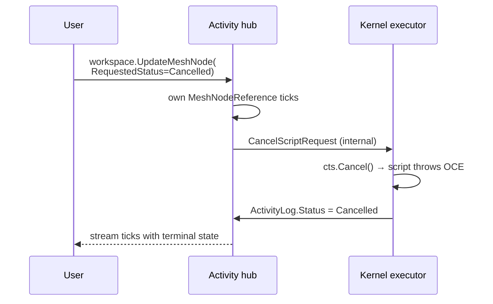
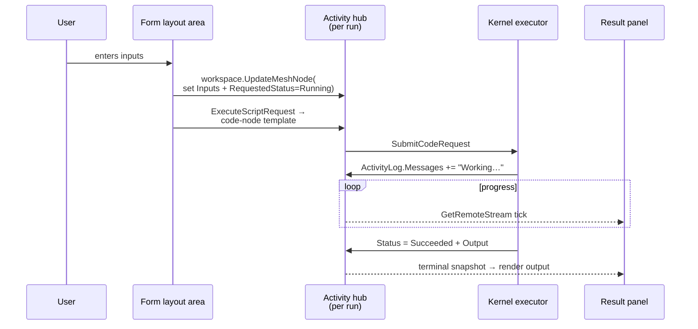

# Activity Control Plane

In MeshWeaver, **every operation on an activity is a patch on the activity's content** — not a separate message type. The owning hub watches its own `MeshNodeReference` stream and reacts to property changes. This is the canonical pattern for any node type that has state-machine semantics: `Activity`, and any custom `NodeType` you build.

If you find yourself reaching for `Cancel<X>Request`, `Pause<X>Request`, `Retry<X>Request`, or any verb-shaped message, **stop and use a property instead**.
<svg xmlns="http://www.w3.org/2000/svg" viewBox="0 0 760 260" style="width:100%;max-width:760px;height:auto;display:block;margin:20px auto;">
  <defs>
    <marker id="arr" markerWidth="8" markerHeight="8" refX="7" refY="3.5" orient="auto">
      <path d="M0,0 L8,3.5 L0,7 Z" fill="currentColor" fill-opacity=".55"/>
    </marker>
  </defs>
  <rect x="0" y="0" width="760" height="260" rx="14" fill="#111827" opacity=".0"/>
  <rect x="20" y="90" width="160" height="80" rx="10" fill="#1e3a5f" stroke="#1e88e5" stroke-width="1.5"/>
  <text x="100" y="124" font-family="sans-serif" font-size="13" font-weight="600" fill="#90caf9" text-anchor="middle">User / UI / Agent</text>
  <text x="100" y="143" font-family="sans-serif" font-size="11" fill="#90caf9" text-anchor="middle" opacity=".8">patches content</text>
  <rect x="300" y="30" width="160" height="80" rx="10" fill="#1b3a1f" stroke="#43a047" stroke-width="1.5"/>
  <text x="380" y="64" font-family="sans-serif" font-size="13" font-weight="600" fill="#a5d6a7" text-anchor="middle">Activity MeshNode</text>
  <text x="380" y="83" font-family="sans-serif" font-size="11" fill="#a5d6a7" text-anchor="middle" opacity=".8">RequestedStatus = Cancelled</text>
  <rect x="300" y="150" width="160" height="80" rx="10" fill="#3e2312" stroke="#f57c00" stroke-width="1.5"/>
  <text x="380" y="184" font-family="sans-serif" font-size="13" font-weight="600" fill="#ffcc80" text-anchor="middle">Owning Hub</text>
  <text x="380" y="203" font-family="sans-serif" font-size="11" fill="#ffcc80" text-anchor="middle" opacity=".8">WatchControlPlane reacts</text>
  <rect x="580" y="90" width="160" height="80" rx="10" fill="#1e1b3a" stroke="#7c4dff" stroke-width="1.5"/>
  <text x="660" y="124" font-family="sans-serif" font-size="13" font-weight="600" fill="#b39ddb" text-anchor="middle">Activity MeshNode</text>
  <text x="660" y="143" font-family="sans-serif" font-size="11" fill="#b39ddb" text-anchor="middle" opacity=".8">Status = Cancelled</text>
  <line x1="180" y1="130" x2="298" y2="80" stroke="#1e88e5" stroke-width="1.5" stroke-dasharray="5,3" marker-end="url(#arr)"/>
  <text x="232" y="93" font-family="sans-serif" font-size="10" fill="currentColor" fill-opacity=".55" text-anchor="middle">stream.Update</text>
  <line x1="380" y1="110" x2="380" y2="148" stroke="#f57c00" stroke-width="1.5" marker-end="url(#arr)"/>
  <text x="393" y="135" font-family="sans-serif" font-size="10" fill="currentColor" fill-opacity=".55">owns stream</text>
  <line x1="460" y1="190" x2="580" y2="145" stroke="#7c4dff" stroke-width="1.5" marker-end="url(#arr)"/>
  <text x="525" y="158" font-family="sans-serif" font-size="10" fill="currentColor" fill-opacity=".55" text-anchor="middle">writes Status</text>
  <line x1="660" y1="90" x2="200" y2="130" stroke="currentColor" stroke-opacity=".25" stroke-width="1" stroke-dasharray="4,4" marker-end="url(#arr)"/>
  <text x="440" y="103" font-family="sans-serif" font-size="10" fill="currentColor" fill-opacity=".40" text-anchor="middle">stream tick → observers</text>
</svg>
*Control plane flow: the caller patches `RequestedStatus`; the owning hub's `WatchControlPlane` reacts and writes `Status` back — no verb-shaped messages.*

> ## 🚨 Absolute rule — long-running work belongs on its own hub
>
> **Every long-running operation runs on an Activity hub.** Not on the mesh hub, not on the per-NodeType hub, not on a singleton service's captured `IMessageHub`.
>
> The mesh hub must stay responsive. If it spends seconds running Roslyn, scoring queries, or waiting for HTTP, it blocks routing for every other delivery in the silo.
>
> The activity hub is the **execution sandbox**: created by the owner when work starts, holding the work's state in its own `ActivityLog` MeshNode, and writing results back to the owner via the synchronization protocol when done. The owner stays responsive throughout — watching its own MeshNode for updates while serving all other traffic.

---

## Why this is the default

| Benefit | Explanation |
|---|---|
| **Single API surface** | Callers (UI, MCP agents, hub handlers) don't memorise message types — they patch content. The same code that renders an activity reads the same properties that drive it. |
| **Explicit, inspectable intent** | Anyone watching the stream can see "the user wants this cancelled" before cancellation has actually happened, and observe the gap if it's slow or stuck. |
| **Idempotent and replayable** | Patching `RequestedStatus = Cancelled` twice is a no-op. The owning hub watches `DistinctUntilChanged` and only reacts on real transitions. |
| **Race-free** | The owning hub is the sole writer for `Status` and the sole consumer of `RequestedStatus`. User-side and worker-side never collide. |
| **No type-registry sprawl** | Each new "verb" doesn't need a new `[Serializable]` record, handler registration, and type registration. |

---

## The `ActivityLog` content record

```csharp
public record ActivityLog(string Category)
{
    public ActivityStatus Status { get; init; }            // What's actually happening
    public ActivityStatus? RequestedStatus { get; init; }  // What the user wants
    public ImmutableList<LogMessage> Messages { get; init; } = [];
    // ... other fields
}
```

- `Status` is **read-only from the user's perspective**. Only the owning hub writes it, as the activity transitions through `Running → Succeeded / Failed / Cancelled`.
- `RequestedStatus` is the **control input**. Users, other hubs, and MCP agents patch this to drive the activity into a new state.

---

## Cancelling a script — the canonical example

When a user clicks "Cancel", the click handler does exactly one thing:

```csharp
ctx.Host.Hub.CancelActivity(ctx.Host.Hub.Address.ToString());
```

The activity hub's initialization subscribes to its own `MeshNodeReference` stream and watches `RequestedStatus`. On a transition to `Cancelled`, it triggers the underlying cancellation — in the kernel case, dispatching `CancelScriptRequest` to the executor child hub (an internal message, not part of the public API). The script's `CancellationToken` trips, `OperationCanceledException` flows through the executor's normal completion path, and `Status` flips to `Cancelled`.



Notice that **the user never posts a "cancel" message** — they just patch the content.

---

## Applying the pattern to your own NodeTypes

When you build a custom NodeType with state-machine semantics — a long-running job, a transitional resource, anything with start / pause / resume / retry / cancel — follow this shape:

1. **Define your content record with two paired fields**: `Status` (current actual state) and `RequestedStatus` (or `RequestedAction`, `RequestedTransition` — your control surface).
2. **In `WithInitialization`**, subscribe to the hub's own `MeshNodeReference` stream and react to changes in the requested field. Use `.DistinctUntilChanged()` so you only fire on real transitions.
3. **Your hub is the sole writer for `Status`**. Users never patch it directly — they patch `RequestedStatus`. The hub reads the request, does the work, and writes the resulting `Status`.
4. **No new request/response message types.** Don't add `Cancel<X>Request`, `Pause<X>Request`, etc. The control plane *is* the content.

```csharp
public record JobContent(string Category) : ActivityLog(Category)
{
    // ActivityLog already has Status + RequestedStatus + Messages.
    // Add your domain fields here.
    public string? InputPath { get; init; }
    public string? OutputPath { get; init; }
}

public static class JobNodeType
{
    public static MeshNode CreateMeshNode() => new("Job")
    {
        // ...
        HubConfiguration = config => config
            .AddMeshDataSource(s => s.WithContentType<JobContent>())
            .WithInitialization(hub =>
            {
                hub.RegisterForDisposal(hub.WatchControlPlane(requested =>
                {
                    if (requested == ActivityStatus.Cancelled) DoCancel(hub);
                    else if (requested == ActivityStatus.Running) DoStart(hub);
                }));
            })
    };
}
```

`hub.WatchControlPlane(...)` lives in `MeshWeaver.Mesh.Contract` (`ActivityControlPlaneExtensions.cs`). It projects the hub's own `MeshNodeReference` stream down to `ActivityLog.RequestedStatus`, applies `DistinctUntilChanged`, and forwards each transition to your handler. Faulted subscriptions log to the optional `ILogger` argument (or the `MeshWeaver.ActivityControlPlane` log category) so a broken control plane never disappears silently.

---

## `WatchSubmission` — for arbitrary "needs work" triggers

`WatchControlPlane` is right when the trigger is a single status field (`RequestedStatus`). Many orchestration cases need a broader predicate — for example, a thread hub that dispatches a new agent round whenever it has unprocessed user messages and isn't already executing:

```csharp
hub.WatchSubmission(
    fingerprint:   n => (t.IsExecuting, t.Messages.Count, t.IngestedMessageIds.Count, t.PendingUserMessages.Count),
    needsDispatch: n => !t.IsExecuting && t.PendingUserMessages.Count > 0,
    dispatch:      n => CreateUserCells(hub, n)
                          .Concat(CreateResponseCell(hub, n))
                          .SelectMany(_ => CommitRound(hub, n))
                          .SelectMany(_ => DispatchToExec(hub, n)));
```

`WatchSubmission` lives next to `WatchControlPlane` in `MeshWeaver.Mesh.Contract`. Internally it is:

```csharp
hub.GetWorkspace().GetMeshNodeStream()
    .DistinctUntilChanged(fingerprint)
    .Where(needsDispatch)
    .SelectMany(node => dispatch(node).Catch(...))
    .Subscribe(_ => { }, ex => logger?.LogError(...));
```

### What `WatchSubmission` replaces

If you find yourself writing any of these patterns inside a watcher, reach for `WatchSubmission` instead:

- An `Interlocked.CompareExchange` "dispatching" flag held across a reentrant emission.
- `.Throttle(50ms)` to coalesce rapid patches into one round.
- `AsyncLocal` / `CircuitContext` / hub-as-user fallbacks because the watcher fires on a throttle scheduler hop.
- Manual ordering of "create satellite cell then update the parent's collection" inside `Subscribe` callbacks.

`DistinctUntilChanged` on a fingerprint replaces the dispatching flag — the same state can't fire twice. The chain runs in the hub's natural scheduler so `AsyncLocal` flows. Multi-step orchestration is an `IObservable<Unit>` chain (`Concat` / `Zip` / `SelectMany`), with no mutable flags.

---

## Idempotent triggers — state lives on the node, never in memory

> ## 🚨 Absolute rule
>
> **Single-flight an action via a paired `Requested<X>` field on the owning node, never via an in-memory `Interlocked` gate.** Each hub owns its OWN state, on its OWN node. The watcher writes the request through `stream.Update`; the claim clears it in the same atomic update that transitions `Status`. No external state coordinates the dispatch.

Watchers that fire a one-shot trigger from an observable stream must single-flight. The wrong approach is an in-memory `Interlocked.CompareExchange(ref dispatching, 1, 0)` gate. That gate races on CI when the workspace stream's `ReplaySubject(1)` emits a stale snapshot after the gate has been released — a flicker `Idle → Executing → Idle` in the same hub tick can dispatch twice. The production failure mode this caused was `Submit_DuringExecution_QueuedUntilRoundCompletes`: u2 ingested twice into `IngestedMessageIds`, two response cells, six messages in `thread.Messages` instead of four.

**The correct approach:** the state-field check INSIDE the `stream.Update` lambda IS the single-flight gate. The hub's action block serialises the lambdas; the first lambda flips `Status`, every concurrent lambda re-reads `Status != Idle` and bails. No paired intent field is required when the state transition itself is atomic.

For **cross-process triggers** (a non-owner hub wanting to drive a mutation on the owner), use a paired intent field — single-field RFC-7396 patches are merge-safe under `UpdateRemote`. The watcher consumes the intent and clears it in the same atomic `Update`.

### Existing intent/state pairs in the codebase

| Owning node            | Intent field                     | Current-state field           | Cleared by                       |
|------------------------|----------------------------------|-------------------------------|----------------------------------|
| `MeshThread`           | (none — Status transition gates) | `Status` (Starting/Executing) | `InstallServerWatcher` claim     |
| `MeshThread`           | `RequestedStatus` (= `Cancelled`)| `Status` (→ `Cancelled`)      | Streaming-loop terminal write    |
| `NodeTypeDefinition`   | `RequestedReleasePath`           | `LatestReleasePath`           | `NodeTypeCompileActivityHandler` |
| `ActivityLog`          | `RequestedStatus`                | `Status`                      | Activity hub on transition       |

`MeshThread.RequestedStatus` is a `ThreadExecutionStatus?` — the request half of the same Status/RequestedStatus pair (today only `Cancelled` is ever requested). The GUI Stop button and a parent cancelling a sub-thread set it; the cancel watcher cancels the CTS, and the streaming loop's terminal write flips `Status → Cancelled` and clears `RequestedStatus`. `Cancelled` is a distinct, visible terminal status that re-dispatches like `Idle` when `PendingUserMessages` still holds input. (There is **no** transient `Completing` status — terminal writes are atomic.)

### Submission-watcher implementation pattern

This is the SOLE entry point for dispatching a new round on the thread hub:

```csharp
threadHub.GetWorkspace().GetMeshNodeStream()
    .Where(n => n.Content is MeshThread t
        // Idle OR Cancelled (a stopped round re-dispatches like Idle)
        && t.Status is ThreadExecutionStatus.Idle or ThreadExecutionStatus.Cancelled
        && t.PendingUserMessages.Count > 0)
    .Subscribe(_ =>
    {
        workspace.GetMeshNodeStream().Update(node =>
        {
            // 🚨 Re-check inside the lambda. The hub's action block serialises
            // concurrent emissions — the SECOND lambda sees a non-claimable
            // status and bails.
            var t = node.Content as MeshThread;
            if (t is null
                || t.Status is not (Idle or Cancelled)
                || t.PendingUserMessages.IsEmpty) return node;
            return node with { Content = t with {
                Status = StartingExecution,
                ExecutionStartedAt = DateTime.UtcNow
            }};
        }).Subscribe(_ => { /* _Exec round watcher picks up Status=StartingExecution */ });
    });
```

The `_Exec` hosted hub subscribes to the parent thread's stream via `IMeshNodeStreamCache.GetStream(threadPath)` and fires `DispatchAfterClaim` on each `Idle → StartingExecution` transition (`DistinctUntilChanged` on `ExecutionStartedAt`). No internal trigger event — the state transition IS the dispatch signal.

---

## Wake-up recovery — drive any non-terminal state to valid, exactly once

**Core invariant: a freshly-activated hub has no in-process work.** On activation, a hub must reconcile any persisted non-terminal state left by an interrupted previous activation. The rule is identical for threads and activities: **read the own node stream's FIRST emission** (the loaded persisted state, correctly ordered on the hub's action block vs subsequent writes) and drive the state to a valid one **exactly once**.

Never use a late `GetMeshNode` round-trip — its response can land *after* later writes and clobber them (that late-read race was the root of the `check_inbox` phantom-drain flake).

### Threads — `InitializeThreadLifecycle` (`ThreadExecution.cs`)

| Persisted state | Recovery action |
|---|---|
| `RequestedStatus == Cancelled` | Honor it: stamp the response cell `Cancelled`, write terminal `Status = Cancelled`, clear the request |
| `Executing` (with a response cell) | Resume the same cell by re-entering `StartingExecution`; `DispatchAfterClaim` reuses `ActiveMessageId` (resume mode) |
| `StartingExecution` | No write — the `_Exec` round watcher fires on its own first emission |
| `Idle` / `Cancelled` (+ pending) | No write — the submission watcher claims |
| `Done` | Terminal, untouched |

### Activities — recover from the owner's own state

Activities recover from the **owner's state**, where the owner hub is DISTINCT from the executor. NodeType compilation is the canonical case: the compile runs on a separate activity hub, so the NodeType hub coming up with `CompilationStatus == Compiling` on its first own-stream emission means the compile was interrupted. It re-requests by flipping `CompilationStatus = Compiling → Pending` so the compile watcher dispatches a fresh build.

Read the owner's OWN state — never probe the activity hub cross-hub. That read lags, and a false "still running" leaves the operation stranded (the `rbuergi/CatBond` "renders nothing" symptom).

> 🚨 **Do NOT add a "first emission: Running ⇒ Failed/interrupted" recovery to a hub that IS the executor.** Such a hub activates in order to run the work, so its own activity is legitimately `Running` the instant it comes up — a first-emission recovery would kill every freshly-started run. The kernel/script hub is exactly this case and deliberately has no such recovery. Restart-recovery for a hub-that-runs-its-own-work needs a separate supervisor, or the owner-state re-request pattern above.

### Claim-handler pattern (clears intent in the same atomic transition)

```csharp
hub.GetWorkspace().GetMeshNodeStream().Update(node =>
{
    var t = node.Content as MeshThread;
    if (t.Status != Idle) return node;              // already running
    if (t.PendingUserMessages.IsEmpty) return node; // nothing to do
    return node with { Content = t with {
        Status = StartingExecution,
        ExecutionStartedAt = DateTime.UtcNow
    }};
});
```

**Why "each hub owns its own state":** the intent field lives on the same node as the state field. The owning hub is the only writer; cross-hub coordination is impossible because no other hub knows about the field. Read-only views (UI, MCP) can show "request pending" by checking `Requested<X> is not null && Status == Idle`.

Ship the round-orchestration steps as small `IObservable<Unit>` builders (`CreateUserCells`, `CommitRound`, `DispatchToExec`). Each step is one `Hub.Observe(..., target)` or `workspace.UpdateMeshNode(...)` followed by `.Select(_ => Unit.Default)`.

---

## Anti-patterns to remove on sight

| Pattern | What to use instead |
|---|---|
| **A.** `int dispatching = 0` field + `Interlocked.CompareExchange` + `.Throttle(50ms)` + identity-fallback bookkeeping | `WatchSubmission` |
| **B.** Verb-shaped per-operation request types (`StartXRequest`, `RetryXRequest`, `CancelXRequest`) for things that already have content | A property patch + `WatchControlPlane` |
| **C.** Synchronization that lives in the caller (click handler creates the satellite cell, updates the parent collection, posts to `_Exec`) | Move to the owning hub's `WatchSubmission` so every chat / job / pipeline variant reuses the same orchestration |
| **D.** `async Task` init hooks on hubs whose body subscribes to streams | `WithInitialization` has a sync `Action<IMessageHub>` overload — `Subscribe` registers the callback synchronously, the observable does the work later. The async overload's `await` adds a deadlock surface for nothing. |

---

## Finishing an activity — `ActivityLog.Finish` on every terminal write

A fresh `ActivityLog` starts at `Status = Running` (the enum default). Until something calls `.Finish(version, status)` on it, *every* consumer that reads the log — the response carrying it, the activity MeshNode's content stream, the UI overlay — sees `Running`. Long after the work is done, the activity looks live.

> **Every code path that owns the activity's terminal write — success OR failure — MUST call `.Finish(version, status)` on the log before the log escapes its caller.** This includes:
> - the success branch: `.Finish(version, ActivityStatus.Succeeded)`
> - every catch / failure branch: `.Finish(version, ActivityStatus.Failed)`
> - every early-return short-circuit (cache hit, "no work to do", validation reject) — the log is still escaping, and still needs a terminal state

`Finish` reads `Messages` and computes `GetFinalStatus()`: an `Error` message → `Failed`, a `Warning` → `Warning`, otherwise → `Succeeded`. The `overrideStatus` argument is a floor — the function returns `MAX(overrideStatus, GetFinalStatus())`. So `Finish(v, Succeeded)` after an `AppendError` correctly returns `Failed`. **Pass the natural success status as the override; trust `GetFinalStatus()` to bump it on errors.**

### Anti-pattern: appending an error after `Finish`

```csharp
// ❌ WRONG — log says Succeeded, has an Error message
var log = freshLog.Finish(v, ActivityStatus.Succeeded);
log = AppendError(log, "actually it failed");          // doesn't flip Status

// ✅ RIGHT — re-Finish so GetFinalStatus() reads the new Error
log = AppendError(log, "actually it failed");
log = log.Finish(v, ActivityStatus.Succeeded);         // Status → Failed
```

### Anti-pattern: handing back a result whose log was never finished

```csharp
// ❌ WRONG — log stays Running forever. Repro:
// CompileActivityLogTest.SuccessfulCompile_ReportsActivityLogWithSourceQueries…
var log = new ActivityLog(ActivityCategory.Compilation) { HubPath = path };
return Observable.Return(new CompileResult(asm, configs, log));

// ✅ RIGHT — Finish on the way out, success or failure
var log = new ActivityLog(ActivityCategory.Compilation) { HubPath = path };
var result = BuildResult(asm, log);
return Observable.Return(result with
{
    Log = result.Log.Finish((int)hub.Version, ActivityStatus.Succeeded)
});
```

The same applies to every exception branch you can swallow. A `try { … } catch (Exception ex) { return Fail(ex.Message); }` that forgets to `Finish` leaves consumers polling forever.

### Writing the terminal state back through `GetMeshNodeStream`

When the activity is a MeshNode (the canonical shape — `_Activity/{id}` nodes), the terminal write must land via the activity hub's own `workspace.GetMeshNodeStream(activityPath).Update(...)`:

- It rides the data-sync protocol — every subscriber (UI overlay, agent, Activity Details panel) sees the transition as one tick of the stream.
- It debounces through `MeshNodeTypeSource.Sample(200ms)` like any other content edit — no extra `SaveMeshNodeRequest` hand-rolled.
- It cannot bypass the per-node hub's reducer, so there's no "wrote to persistence, hub still serving stale content" race.

```csharp
hub.GetWorkspace().GetMeshNodeStream(activityPath!)
    .Update(current =>
        current?.Content is ActivityLog log
            ? current with
            {
                Content = log with
                {
                    Status = ActivityStatus.Succeeded,
                    End = DateTime.UtcNow,
                }
            }
            : current!)
    .Subscribe(_ => { }, ex => logger.LogWarning(ex,
        "Activity terminal write failed for {Path}", activityPath));
```

> **Do NOT** write the activity's `Status`/`Content` from *outside* the activity hub (e.g. `workspace.GetMeshNodeStream(activityPath).Update(node with { Content = … })` from another hub) — that bypasses the activity hub's reducer and the `RequestedStatus` control plane, and races the per-node hub's own view of its content. The terminal write above is fine *because the activity hub issues it on its own stream*; external callers flip `RequestedStatus` instead and let the reducer react.
>
> **Do NOT** call `IStorageAdapter.Write` directly — same race, and worse because persistence is invisible to the per-node hub's `MeshNodeReference` cache. The next `GetDataRequest` returns the pre-patch content.

`NodeTypeCompilationActivity.MarkSucceeded` / `MarkFailed` in `MeshWeaver.Graph.Configuration` is the canonical implementation — copy its shape (`Update` through `GetMeshNodeStream`, with a best-effort `try/catch` that logs and swallows so observability never breaks the work).

### When the activity is just a response field

Some handlers return an `ActivityLog` inline on a response (e.g. `GetCompilationPathResponse.Log`) instead of, or alongside, a `_Activity` MeshNode. The same rule applies: **`Finish` before the response is posted**. If multiple compile paths produce the response (fresh compile, cached hydration, pinned release), each must `Finish` at the end of its own branch. A shortcut path that hands the log straight to `BuildResponse` without a `Finish` is a "Running forever" bug.

---

## Reporting status back to the UI

Status flows the other direction the same way — through the same content the user is patching. The owning hub writes `Status` (and `Messages`, and any other observable progress fields) on the activity's content, and every UI / agent / monitor subscribed to the node's `MeshNodeReference` stream gets the snapshot pushed within milliseconds.

The pattern inside scripts (and inside any worker hub doing long-running work):

- Use `Log.LogInformation(...)` at every coarse-grained step. Each call appends to `Messages` and ticks the workspace.
- For waits, **subscribe reactively** to whatever you're waiting on instead of looping or sleeping. The wait is naturally cancellable via the script's `Ct` global:

  ```csharp
  await Mesh.GetWorkspace()
      .GetMeshNodeStream("rbuergi/downstream-job")
      .Where(n => (n?.Content as JobContent)?.Status == JobStatus.Succeeded)
      .Take(1)
      .ToTask(Ct);                          // ← cancels via Activity Control Plane
  ```

- For compute-heavy steps with no natural log lines, an `Observable.Interval` heartbeat keeps the user informed:

  ```csharp
  using var heartbeat = System.Reactive.Linq.Observable
      .Interval(TimeSpan.FromSeconds(5))
      .Subscribe(t => Log.LogInformation($"Still working — {t * 5}s elapsed"));
  try { await DoLongWork(Ct); } finally { heartbeat.Dispose(); }
  ```

- **Never `Thread.Sleep` and never `Task.Delay(ms)` without `Ct`.** Both ignore cancellation and are indistinguishable from a hung script while they wait.

Subscribers (UI stripes, activity-details views, agents watching their job) read the same content via `workspace.GetRemoteStream<MeshNode, MeshNodeReference>(addr, new MeshNodeReference())` and project whatever field they care about (`Messages.Count`, `Status`, `RequestedStatus`, your own progress field). One source of truth, one observation pattern, no parallel "events" channel.

---

## Operations as scripts — the canonical shape for export, import, compile, …

Once you've internalised the property-driven control plane, the next step is: **don't write a bespoke handler at all** when the work is an *operation* with inputs, multiple steps, progress to report, or a meaningful output. Express the operation as a **Code MeshNode template** that the kernel runs as an Activity. This is how export, import, compilation, and any "user kicks off a job" surface should be modelled going forward.

### Why "operation = script"

| Benefit | Explanation |
|---|---|
| **One control plane** | Cancel = `RequestedStatus = Cancelled` on the activity. Same for retry / pause / resume. No new `Cancel<X>Request` per operation. |
| **Persisted progress for free** | Every run lands on `{partition}/_Activity/{guid}` — same place as every other run the user ever triggered. The activity log is the post-mortem, the progress feed, and the audit trail. |
| **One result-rendering surface** | A layout area subscribes to one Activity stream and projects `Messages` plus the terminal output (a download link, a content-collection path, a `UiControl`). Every operation reuses the same shape. |
| **Editable / templated / shareable** | The script *is* content. Power users clone, tweak, and pin custom variants. New flavours of an existing operation cost zero new C# code — they're new Code MeshNodes seeded next to the originals. |
| **No type-registry sprawl** | One `ExecuteScriptRequest` and one generic result control instead of `ExportDocumentRequest` / `ExportDocumentResponse` / `CancelExportRequest` / `ExportDocumentControl` × N formats. |

### The shape end-to-end



Five pieces, all of which already exist in the framework — no new infrastructure required:

1. **The script template** — a `Code` MeshNode, e.g. `Doc/Templates/Code/ExportPdf`.
2. **The form** — a layout area whose fields bind to inputs via `JsonPointerReference`; the form auto-saves to the activity content via `workspace.UpdateMeshNode` debounced (see *[Asynchronous Calls](AsynchronousCalls)* — "Reactive in click actions").
3. **The trigger** — a click handler that posts `ExecuteScriptRequest` against the Code template. Sync, fire-and-forget, no `await`.
4. **The activity** — created automatically by the script-execution path; see *[Script Execution](ScriptExecution)*.
5. **The result panel** — subscribes to the activity via `GetRemoteStream<MeshNode, MeshNodeReference>` and projects `Messages` plus the terminal output.

### Worked example: export-as-script

#### 1. The script template (a `Code` MeshNode seeded by the export module)

```csharp
// ExportPdf.csx (lives as the Code property of a seeded MeshNode at e.g.
// Doc/Templates/Code/ExportPdf — IsExecutable = true).
//
// Inputs arrive via the activity's content (Title, IncludeChildren, MaxDepth,
// BrandNodePath). The script reads them off Mesh.GetMeshNode of its own activity.
var activity = await Mesh.GetMeshNode(Mesh.NodePath);
var inputs   = activity!.Content as ExportInputs ?? new ExportInputs();

Log.LogInformation("Loading source markdown {Path}", inputs.SourcePath);
var src      = await Mesh.GetMeshNode(inputs.SourcePath);
var md       = (src?.Content as MarkdownContent)?.Content ?? "";

Log.LogInformation("Resolving branding");
var branding = await Mesh.GetWorkspace()
    .GetRemoteStream<MeshNode, MeshNodeReference>(
        new Address(inputs.BrandNodePath), new MeshNodeReference())
    .Take(1).Select(c => (c.Value?.Content as CorporateIdentity).ToOptions())
    .ToTask(Ct);

Log.LogInformation("Rendering");
var doc   = new DocumentBuilder().Build(src!.Name, [(src.Name, md)], inputs.Options, branding);
var bytes = new PdfDocumentRenderer().Render(doc);

Log.LogInformation("Writing {Bytes} bytes to content collection", bytes.Length);
var outputPath = $"{inputs.TargetCollection}/{Sanitize(src.Name)}.pdf";
// … write bytes via the content-collection service …

return new ExportOutput(outputPath, "application/pdf", bytes.Length);
```

The script uses the public renderer types directly (`PdfDocumentRenderer`, `DocumentBuilder`) — no service layer in the middle. The kernel exposes `Mesh`, `Log`, `Ct` globals; that plus the public types is enough.

#### 2. The form layout area — bind inputs via `JsonPointerReference`

```csharp
// Each form field is bound to a JsonPointer on the activity's content. The
// auto-save subscription writes form changes onto the MeshNode debounced.
SetupAutoSave(host, activityPath, formId, activityNode);

return Controls.Stack
    .WithView(Controls.TextBox()
        .WithDataContext(JsonPointerReference.Of(activityPath, "/title"))
        .WithLabel("Document title"))
    .WithView(Controls.CheckBox()
        .WithDataContext(JsonPointerReference.Of(activityPath, "/includeChildren"))
        .WithLabel("Include descendants"))
    .WithView(Controls.Button("Export")
        .WithClickAction(ctx => Trigger(ctx, activityPath)));
```

The form **never reads its own state inside the click action** — `JsonPointerReference` and auto-save handle that. The click is O(1) (see *[Asynchronous Calls](AsynchronousCalls)* — "Reactive in click actions: use `stream.Update`, not `Take(1) + Subscribe + UpdateMeshNode`").

#### 3. The click handler — patch `RequestedStatus = Running` and submit

```csharp
private static Task Trigger(ClickAction ctx, string activityPath)
{
    // Flip RequestedStatus → Running. The Activity hub's WatchControlPlane
    // subscription picks it up and submits the script to the kernel.
    ctx.Host.Hub.RequestActivityStatus(
        ctx.Host.Hub.Address.ToString(), ActivityStatus.Running);
    return Task.CompletedTask;
}
```

`WatchControlPlane(...)` wires the activity hub to react to `RequestedStatus = Running` by posting `SubmitCodeRequest` to its own kernel — exactly the same plumbing that powers Cancel, just for Start.

#### 4. The result panel — subscribe to the activity stream

```csharp
return host.Hub.GetWorkspace()
    .GetRemoteStream<MeshNode, MeshNodeReference>(
        new Address(activityPath), new MeshNodeReference())
    .Select(change => change.Value?.Content as ActivityLog)
    .Where(log => log is not null)
    .Select(log => Render(log!));
```

`Render` switches on `log.Status` — for `Running`, show the streaming message list; for `Succeeded`, render the output (a download link to the bytes / a `NodeReference` to the saved file); for `Failed` / `Cancelled`, show the terminal `Messages` and the reason. **One subscription, one switch, all states handled.**

### Cancel, retry, status — all free

Because the operation runs as an Activity, all standard control-plane operations are inherited with no extra code:

- **Cancel** = `workspace.UpdateMeshNode(... with RequestedStatus = Cancelled)` on the activity. The kernel-hosted run sees `Ct` flip and exits.
- **Retry** = create a new run by patching `RequestedStatus = Running` again on a fresh activity. The form panel does this by posting another `ExecuteScriptRequest`.
- **Status / live progress** = `Status` + `Messages` on the same content the form already binds to.

### When to keep a static request handler instead

"Operations as scripts" is the right shape whenever the work is observable. It's not the right shape for everything:

| Situation | Use script-as-Activity? |
|---|---|
| Multi-step operation with inputs, progress, output | **Yes** — export, import, compile, mirror, generate |
| Single one-shot lookup (`Get` / `QueryAsync`) | No — plain request/response |
| Internal hub-to-hub plumbing (e.g. kernel's `CancelScriptRequest`) | No — not a public surface |
| Tiny synchronous calculation, no progress to report | No — static handler |
| Event-style notification (one-way fan-out) | No — `hub.Post` fire-and-forget |

If the operation has any of these: form inputs to collect, multiple steps, progress users want to watch, a meaningful output worth keeping in the activity history, or a "what's the status?" question — script execution is the canonical shape. **Default to it.**

### Migration checklist — turning a request handler into a script-driven Activity

1. **Identify the inputs.** Whatever the request type carried becomes the activity's content record (`ExportInputs`, `ImportInputs`, …) — the same shape, at rest on a MeshNode instead of in flight on a message.
2. **Write the template script.** Move the handler body into a `.csx`-shaped string on a Code MeshNode; swap the request fields for `(Mesh.GetMeshNode(Mesh.NodePath).Content as XxxInputs)`; replace `hub.Post(response)` with `return result;`.
3. **Bind the form.** Every input the handler used to read off the request becomes a `JsonPointerReference` field on the form, written to the activity content via auto-save (debounced `UpdateMeshNode`).
4. **Click submits.** The click patches `RequestedStatus = Running` (or posts `ExecuteScriptRequest` against the template Code node). No `await`, no synchronous reads of form state.
5. **Result panel subscribes.** The bottom half of the layout area subscribes to the activity stream via `GetRemoteStream<MeshNode, MeshNodeReference>`, switches on `Status`, projects progress and terminal output.
6. **Delete the request type and handler.** Or keep it as a transitional shim marked `[Obsolete]` if external callers still depend on it — but the new path is the script.

If a step in the migration feels awkward, that's a sign the operation isn't a good fit — re-check the table above.

---

## Routing activities to a different partition

By default a script's activity lands at `{partitionRoot}/_Activity/{guid}` — the partition the Code node lives in. For shared or read-only partitions (the docs partition is the canonical example) you usually want each viewer's runs to land in the viewer's own home instead, so each user's activity feed shows their own history independent of who else is browsing.

Two layered hooks resolve this, in order:

1. **Per Code node:** set `CodeConfiguration.ActivityParentPath` on the Code node itself. The literal sentinel `"{viewer}"` expands to the calling user's home (their `AccessContext.ObjectId`); any other value is taken as-is.
2. **Per partition:** set `PartitionDefinition.DefaultActivityParentPath` on the partition's `Admin/Partition/{Name}` node. Applies to every Code node in that partition that doesn't override step 1. Same `"{viewer}"` sentinel rule.
3. **Default:** the partition root.

The partition lookup is reactive — `PartitionRegistry.GetPartition(namespace)` returns an `IObservable<PartitionDefinition?>` cached via `Replay(1).RefCount()`, composed into the create-activity chain. Updating a partition's `DefaultActivityParentPath` at runtime takes effect immediately for subsequent runs.

### Wiring example: docs partition routes to user

The built-in MeshWeaver documentation partition does this exactly:

```csharp
builder.AddMeshNodes(new MeshNode("Documentation", "Admin/Partition")
{
    NodeType = "Partition",
    Name = "MeshWeaver Documentation",
    State = MeshNodeState.Active,
    Content = new PartitionDefinition
    {
        Namespace = "Doc",
        DataSource = "EmbeddedResource",
        Versioned = false,
        DefaultActivityParentPath = "{viewer}"   // ← every script run lands in the caller's home
    }
});
```

After this, any executable Code node under `Doc/...` that a viewer triggers writes its activity to `{viewer}/_Activity/{guid}` — e.g. `rbuergi/_Activity/abc...` for the user `rbuergi`. The viewer sees the run in their own activity stripe; the originating Code node's `LastActivityPath` field still points back to the cross-partition activity for the Output pane.

Use this any time the partition is shared (docs, demos, reference data) and the runs are user-specific. Skip it for partitions where runs belong to the partition itself (a per-tenant data pipeline whose runs are tenant-scoped, not viewer-scoped).

---

## When to break the rule

A few situations legitimately call for something other than the property pattern:

- **Cross-hub one-shot triggers** that don't belong to a long-lived entity (e.g. "render this report once") may still be plain request/response — there's no living state to patch.
- **Internal hub-to-hub plumbing** (e.g. the kernel executor's `CancelScriptRequest`) is fine as a message type because it's an implementation detail hidden behind the public content-driven surface.

If you're not sure: **default to the property pattern**. It scales better as the number of operations grows, and it forces you to think clearly about the state your nodes actually live in.

## Recovery on activation — activities must self-heal too

The control-plane property pattern makes an activity *cancellable* and *retryable*,
but it does not by itself make it **crash-safe**. An activity hub can activate onto
a node a previous process left mid-run — `Status = Running` with no live worker
behind it (portal restart, Orleans grain deactivation, a seeded post-crash node).
If the watcher that drives `Running → Completed/Failed` only existed in the dead
process, the activity is stuck `Running` forever and every observer (`Take(1)` on
the activity stream, a parent waiting on it) parks.

Apply the **same resurrection contract as threads** (see
[ThreadOperations → resurrection on activation](ThreadOperations) and
[DebuggingMessageFlow → resurrection on init](DebuggingMessageFlow)) on the activity
hub's init:

- **Re-establish, never give up** on the loaded-state read — no
  `Take(1).Timeout(N)`-then-abandon. If the observation faults before it drives the
  node to terminal, re-subscribe.
- On activation, drive any non-terminal `Status` to a valid one: a `Running`
  activity with no resumable worker → `Failed`/`Cancelled` (so observers unblock and
  the user can retry); a `RequestedStatus` left pending → honor it.
- **Guarantee terminal** with a no-progress watchdog so a wedged `Running` activity
  can never hang an observer indefinitely.
- If any observer dies before the activity reaches a terminal `Status`
  (`Completed`/`Cancelled`/`Failed`), **restart the watcher**.

The trace signature is identical to the thread case: a burst of work then silence
(the worker finished or died and nothing reported the terminal status) is a *missed
observation*, not a lock — fix the observer, don't bump the timeout.
