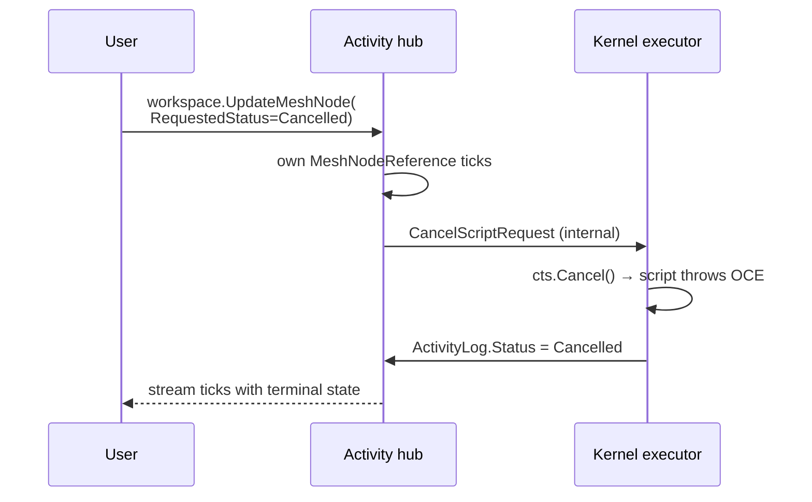

# The default pattern: drive activities through their content

In MeshWeaver, **every operation on an activity is a patch on the activity's content**, not a separate message type. The owning hub watches its own `MeshNodeReference` stream and reacts to property changes. This is the canonical pattern for any node type that has a state machine — Activity, but also any custom NodeType you build.

If you find yourself reaching for `Cancel<ThingHappening>Request`, `Pause<ThingHappening>Request`, `Retry<ThingHappening>Request`, or any verb-based message type, **stop and use a property instead**.

## Why this is the default

- **Single API surface.** Callers (UI, MCP agents, hub handlers) don't memorise message types — they patch content. The same code that renders the activity reads the same properties that drive it.
- **State and intent are explicit and inspectable.** Anyone watching the stream can see "the user wants this cancelled" before the cancellation has actually happened (and observe the gap if cancellation is slow or stuck).
- **Idempotent and replayable.** Patching `RequestedStatus = Cancelled` twice is a no-op. The owning hub watches `DistinctUntilChanged` and only reacts on transitions.
- **Race-free.** The owning hub is the only writer for `Status` and the only consumer of `RequestedStatus`. The user-side and the worker-side never collide.
- **No type-registry sprawl.** Each new "verb" doesn't need a new `[Serializable]` record + handler + type registration.

## Properties on `ActivityLog`

```csharp
public record ActivityLog(string Category)
{
    public ActivityStatus Status { get; init; }            // What's happening
    public ActivityStatus? RequestedStatus { get; init; }  // What the user wants
    public ImmutableList<LogMessage> Messages { get; init; } = [];
    // ... other fields
}
```

- `Status` is **read-only from the user's perspective**. The owning hub writes it as the activity's actual state changes (Running → Succeeded / Failed / Cancelled).
- `RequestedStatus` is the **control input**. The user (or another hub, or an MCP agent) patches this to drive the activity into a different state.

## Cancelling a script (the canonical example)

The kernel-hosted activity is the working example shipped today. The user clicks "Cancel" → the click handler does:

```csharp
ctx.Host.Workspace.UpdateMeshNode(curr =>
    curr.Content is ActivityLog log
        ? curr with { Content = log with { RequestedStatus = ActivityStatus.Cancelled } }
        : curr);
```

The activity hub's initialization subscribes to its own `MeshNodeReference` and watches `RequestedStatus`. On the transition to `Cancelled`, it triggers the underlying cancellation (in the kernel case: dispatches `CancelScriptRequest` to the executor child hub — an internal message, not part of the public API). The script's `CancellationToken` trips, `OperationCanceledException` flows back through the executor's normal completion path, and `Status` flips to `Cancelled`.



Notice that **the user never posts a "cancel" message**. They just patch the content.

## Apply this pattern to your own NodeTypes

When you build a custom NodeType that has any state-machine semantics (a long-running job, a transitional resource, anything with start / pause / resume / retry / cancel), follow the same shape:

1. **Define your content record with two paired fields**: `Status` (current actual state) and `RequestedStatus` (or `RequestedAction`, `RequestedTransition`, etc. — the control surface).
2. **In your hub configuration's `WithInitialization`**, subscribe to the hub's own `MeshNodeReference` stream and react to changes in the requested fields. Use `.DistinctUntilChanged()` so you only fire on real transitions.
3. **Your hub is the only writer for `Status`.** Users never patch it — they only patch `RequestedStatus`. The hub reads `RequestedStatus`, does the work, and writes the resulting `Status`.
4. **No new request/response message types.** Don't add `Cancel<X>Request`, `Pause<X>Request`, etc. The control plane is the content.

Skeleton:

```csharp
public record JobContent(string Category) : ActivityLog(Category)
{
    // ActivityLog already has Status + RequestedStatus + Messages.
    // Add domain fields here.
    public string? InputPath { get; init; }
    public string? OutputPath { get; init; }
}

public static class JobNodeType
{
    public static MeshNode CreateMeshNode() => new("Job")
    {
        // ...
        HubConfiguration = config => config
            .AddMeshDataSource(s => s.WithContentType<JobContent>())
            .WithInitialization((hub, _) =>
            {
                hub.RegisterForDisposal(hub.WatchControlPlane(requested =>
                {
                    if (requested == ActivityStatus.Cancelled) DoCancel(hub);
                    else if (requested == ActivityStatus.Running) DoStart(hub);
                }));
                return Task.CompletedTask;
            })
    };
}
```

The shared `IMessageHub.WatchControlPlane(...)` extension lives in
`MeshWeaver.Mesh.Contract` (`ActivityControlPlaneExtensions.cs`) — it
projects the hub's own `MeshNodeReference` stream down to the
`ActivityLog.RequestedStatus` field, applies `DistinctUntilChanged`,
and forwards each transition to your handler. Faulted subscriptions
log to the optional `ILogger` argument (or to the
`MeshWeaver.ActivityControlPlane` category resolved from the hub's
service provider) so a broken control plane doesn't disappear silently.

## Reporting status back to the UI

Status flows the other direction the same way: through the same content the user is patching. The owning hub writes `Status` (and `Messages`, and any other observable progress fields) on the activity's content, and every UI / agent / monitor subscribed to the node's `MeshNodeReference` stream gets the snapshot pushed within milliseconds.

The pattern inside scripts (and inside any worker hub doing long-running work):

- Use `Log.LogInformation(...)` (or your domain equivalent) at every coarse-grained step. Each call appends to `Messages` and ticks the workspace.
- For waits, **subscribe reactively** to whatever you're waiting on instead of looping or sleeping. The wait is naturally cancellable when paired with the script's `Ct` global:

  ```csharp
  await Mesh.GetWorkspace()
      .GetMeshNodeStream("rbuergi/downstream-job")
      .Where(n => (n?.Content as JobContent)?.Status == JobStatus.Succeeded)
      .Take(1)
      .ToTask(Ct);                          // ← cancels via Activity Control Plane
  ```

- For long compute-heavy steps with no natural log lines, an `Observable.Interval` heartbeat keeps the user in the loop:

  ```csharp
  using var heartbeat = System.Reactive.Linq.Observable
      .Interval(TimeSpan.FromSeconds(5))
      .Subscribe(t => Log.LogInformation($"Still working — {t * 5}s elapsed"));
  try { await DoLongWork(Ct); } finally { heartbeat.Dispose(); }
  ```

- **Never `Thread.Sleep` and never `Task.Delay(ms)` without `Ct`.** Both ignore cancellation and look identical to a hung script while they wait.

Subscribers (UI stripes, activity-details views, agents that watch their job) read the same content via `workspace.GetRemoteStream<MeshNode, MeshNodeReference>(addr, new MeshNodeReference())` and project whichever field they care about (`Messages.Count`, `Status`, `RequestedStatus`, your own progress field). One source of truth, one observation pattern, no parallel "events" channel.

## Routing activities to a different partition

By default a script's activity lands at `{partitionRoot}/_Activity/{guid}` — the partition the Code node lives in. For shared / read-only partitions (the docs partition is the canonical example) you usually want each viewer's runs to land in the viewer's own home instead, so each user's activity feed shows their own history independent of who else is browsing.

Two layered hooks resolve this, in order:

1. **Per Code node:** set `CodeConfiguration.ActivityParentPath` on the Code node itself. The literal sentinel `"{viewer}"` expands to the calling user's home (their `AccessContext.ObjectId`); any other value is taken as-is.
2. **Per partition:** set `PartitionDefinition.DefaultActivityParentPath` on the partition's `Admin/Partition/{Name}` node. Applies to every Code node in that partition that doesn't override #1. Same `"{viewer}"` sentinel rule.
3. **Default:** the partition root.

The partition lookup is reactive — `PartitionRegistry.GetPartition(namespace)` returns an `IObservable<PartitionDefinition?>` cached via `Replay(1).RefCount()`, composed into the create-activity chain. Updating a partition's `DefaultActivityParentPath` at runtime takes effect immediately for subsequent runs.

### Wiring example: docs partition routes to user

The built-in MeshWeaver documentation partition does this exactly:

```csharp
builder.AddMeshNodes(new MeshNode("Documentation", "Admin/Partition")
{
    NodeType = "Partition",
    Name = "MeshWeaver Documentation",
    State = MeshNodeState.Active,
    Content = new PartitionDefinition
    {
        Namespace = "Doc",
        DataSource = "EmbeddedResource",
        Versioned = false,
        DefaultActivityParentPath = "{viewer}"   // ← every script run lands in the caller's home
    }
});
```

After this, any executable Code node under `Doc/...` that a viewer triggers writes its activity to `{viewer}/_Activity/{guid}` — e.g. `rbuergi/_Activity/abc...` for the user `rbuergi`. The viewer sees the run in their own activity stripe, the originating Code node's `LastActivityPath` field still points back to the cross-partition activity for the Output pane.

Use this any time the partition is shared (docs, demos, reference data) and the runs are user-specific. Skip it for partitions where the runs themselves belong to the partition (a per-tenant data pipeline whose runs are tenant-scoped, not viewer-scoped).

## When to break the rule

- **Cross-hub one-shot triggers** that don't belong to a long-lived entity (e.g. "render this report once") may still be plain request/response — there's no living state to patch.
- **Internal hub-to-hub plumbing** (e.g. the kernel executor's `CancelScriptRequest`) is fine as a message type because it's an implementation detail behind the public content-driven surface.

If you're not sure: **default to the property pattern**. It scales better as the number of operations grows, and it forces you to think about the state your nodes actually live in.
